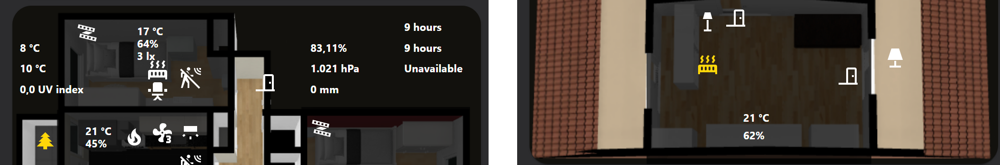
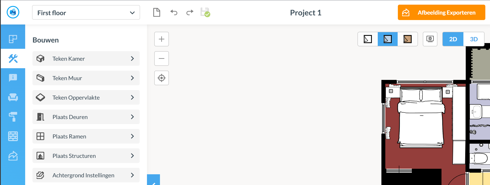
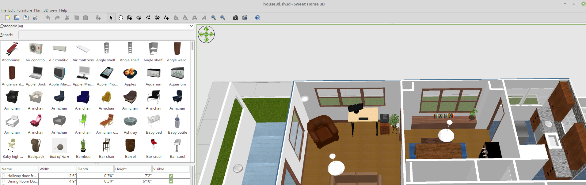
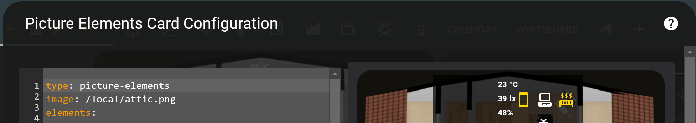
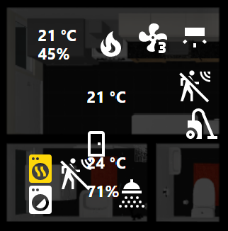
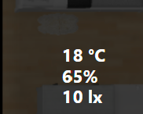
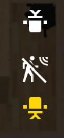

# Home Assistant dashboard: Floor plan




<a href="index"></a>

Here you can find examples about how you can create your own interactive floor plan.
<br>
<br>
<br>

---
## Table of Contents
<!-- TOC -->
* [Intro](#intro)
* [Get inspired](#get-inspired)
* [Applications](#applications)
  * [Floorplanner.com](#floorplannercom)
  * [Sweet Home 3D](#sweet-home-3d)
* [Creating your floor plan](#creating-your-floor-plan)
* [Make it interactive](#make-it-interactive)
  * [Floor plan images](#floor-plan-images)
  * [Overlays](#overlays)
  * [Entity icons](#entity-icons)
  * [Entity labels](#entity-labels)
  * [Click, Double-click and Long-press actions](#click-double-click-and-long-press-actions)
  * [Rotations](#rotations)
  * [Change icons](#change-icons)
  * [Change layer order](#change-layer-order)
<!-- TOC -->

---

## Intro

The possibility of creating an interactive floor plan was for me the reason to start with Home Assistant.\
Before this I used an app to control some lights and see the temperatures and running Node-RED to automate stuff.\
But after I added more and more sensors to my network it wasn't possible get a quick overview anymore.\
I was looking for a solution and I found some video's about the floor plan possibilities in Home Assistant. 
In a floor plan you can add a lot of information what's happening in each room with icons, colors and overlays. Which gives you a quick overview around the house.\
So I started creating my own.

> Before you start: be aware this take a lot of time to create it.\
> But it's worth it!

---
## Get inspired
Before you start take a look what other people made as floor plan and find the one which you like the most, so you can use that as example.

Here are some sites where you can find such examples:
* https://www.google.com/search?q=floorplan+home+assistant&source=lnms&tbm=isch
* https://gathering.tweakers.net/forum/list_messages/1929384/0
* https://github.com/theone11/HomeAssistantConfig

---
## Applications
There a two common used applications to create a floor plan.

### Floorplanner.com



[Floorplanner.com](https://www.floorplanner.com) is a free online tool to create a 3D model of your house.
It's easy to use and without any costs you have already a lot of furniture available.
This is also the tool I used for my floor plan.

* You can use it everywhere because it's online
* No installation required


### Sweet Home 3D



[Sweet Home 3D](https://www.sweethome3d.com/) is an application you need to install on your pc. It's available for all desktop platforms.

* You have your own data locally
* It has realistic light effects which you can use as overlay

---
## Creating your floor plan
When you've chosen an application you can start.\
The first step is to create a raw digital map of your house. This can be done by drawing the walls, doors and windows. You can already start using this in your interactive floor plan.

It's always possible to create a fancier floor plan with the actual wall colors, floor types and furniture in it.
But this takes a lot of time, but it's worth it. ones you did it your can be proud off yourself and love it every time you use it!

Steps to take:
* Get online inspiration how you want it to look like.  
* The best way to start is to get all the official sizes of each room.
* Then draw all the walls and place the doors and windows in it.
* Then add the furniture to each room.
* Then as addition you can add floors and wall colors.
* Now you can start adding the digital information
  * Start with the light icons
  * Add labels like room temperature

---
## Make it interactive

Your floor plan will be a layered model with the raw floor plan as base, then a layer with entities and on top of it overlays. 

---
### Floor plan images


```yaml

# Sourcecode by vdbrink.github.io
# Dashboard card code
type: picture-elements
image: /local/base.png
elements:
  ...

```
---
### Overlays

With overlays you can darken a room to indicate no one is there, or it's dark there.




If you use room in your floor plan and have all 90 degrees angles you can use a single small [black](images/black.png) square image to create the overlay. With the settings you can scale it to every size.
 
In this example I have a smartplug as entity for the overlay.
When the plug has the state `on` it's full transparant and `off` it's 75% transparant. Then you still see all the elements but with a dark layer over the room.

You create the right size of the overlay by changing the `style` and `aspect_ratio` values.

The `tap_action` is here disabled. You can also choose to control the switch by clicking on it.

Sometimes you need to create a binary helper sensor to indicate when the layer must be active. When the lux value is higher than value X.

<details>
  <summary><b>> Click here to see an example of a binary helper sensor >></b></summary>

```yaml

# Sourcecode by vdbrink.github.io
# configuration.yaml
binary_sensor:
  - platform: template
    sensors:
      overlay_x:
        friendly_name: "overlay x"
        value_template: >-
          
             on
          
             off
          

```
</details>

Overlay based on a smart plug status.
```yaml

# Sourcecode by vdbrink.github.io
# Dashboard card code
- type: image
  entity: binary_sensor.overlay_x
  title: overlay
  tap_action:
    action: none
  image: /local/black.png
  aspect_ratio: 10x8.1
  style:
    top: 54%
    left: 49%
    width: 48%
    height: 2%
  state_filter:
    'on': opacity(0%)
    'off': opacity(75%)

```

---

### Entity icons

Entity icons (state-icon) show the icon of an entity.


```yaml

# Dashboard card code
- type: state-icon
  title: motion
  entity: binary_sensor.motion_occupancy
  style:
    top: 34%
    left: 47%

```

---
### Entity labels

Entity labels (state-label) show the text value of an entity.

To format a temperature see [here](homeassistant_dashboard_formatting#rounded-temperature-sensors)



```yaml

# Dashboard card code
- type: state-label
  title: temp at room X
  entity: sensor.temp_temperature_rounded
  style:
    top: 6%
    left: 45%
    width: 10px
    text-align: left
    font-size: 0.8em
    font-weight: bold
    color: '#FFF'

```
---
### Click, Double-click and Long-press actions

With click actions (tap_action), Double-click (double_tap_action) and Long-press (hold_action) you can ignore it, toggle the status, navigate to another card, show a more info in a popup or call a script.

In the example here I used click action but this can also replace with one of the other tab actions.

#### Click: No action
```yaml

tap_action:
  action: none

```
#### Click: Toggle status (default)
```yaml

tap_action:
  action: toggle

```
  
#### Click: Navigate to another card
```yaml

tap_action:
  action: navigate
  navigation_path: /lovelace/weather
```
#### Click: More info
```yaml

tap_action:
  action: more-info

```
#### Click: Service call
```yaml

tap_action:
  action: call-service
  service: script.do_something

```
See also https://www.home-assistant.io/dashboards/actions/ for all info.

---
### Rotations


```yaml

style:
  top: 72%
  left: 90%
  rotate: degrees(90)

```

or with
```yaml

- type: state-icon
  entity: binary_sensor.chair_occupied
  style:
    top: 10%
    left: 20%
    transform: rotate(180deg)

```

---

### Change icons

```yaml

- type: state-icon
  icon: mdi:cctv

```

---

### Change layer order

When you can't click on an entity you need to change the order in the list.
The higher in your yaml file the higher in the layer.

---
[^^ Top](#table-of-contents)

[<< See also my other Home Assistant pages](index)