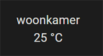

# Home Assistant dashboard: Formatting

<a href="index"></a>

Here you find Home Assistant (lovelace) dashboard examples which you can easily add to your own dashboards.
<br/><br/><br/>

---
## Table of Contents
<!-- TOC -->
* [Rounded temperature sensors](#rounded-temperature-sensors)
<!-- TOC -->

---

## Rounded temperature sensors

What is the added value of one decimal for a temperature? Especially when you show multiple temperatures close to each other, this is only distracting. To create a clean presentation, you can show the rounded value.

Create a new sensor only with the rounded temperature to an integer value.
Here we create a new sensor calls `sensor.temp1_temperature_rounded`

The value of 24.3 will round to 24 and 24.6 will round to 25.


```yaml

# Sourcecode by vdbrink.github.io
# configuration.yaml
- platform: template
  sensors:
    temp1_temperature_rounded:
      friendly_name: "woonkamer"
      unit_of_measurement: "°C"
      value_template: "{{ states('sensor.temp_woonkamer') | round(0) }}"

```

---
[^^ Top](#table-of-contents)

[<< See also my other Home Assistant tips and tricks](index)