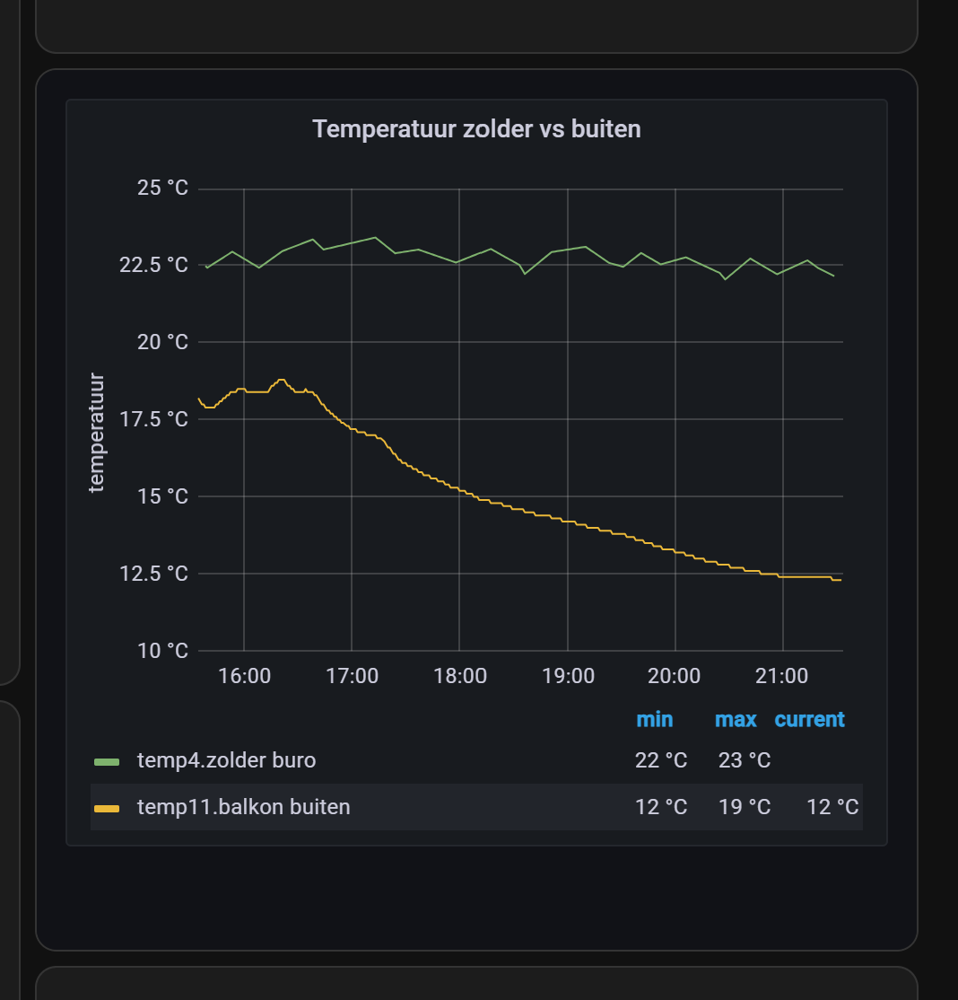

# Home Assistant dashboard: Grafana integration

<a href="index"></a>


Here you can find how you can integrate Grafana graphs into your Home Assistant dashboard.

InfluxDB can hold data for a much longer time than the internal Home Assistant database.
For that reason, you want to compare, for example, data from last year to current year.

Grafana and InfluxDB have seamless integration with each other.

It's also possible to include these graphs, via the Home Assistant iframe panel, in your own dashboard.



---
## Table of Contents
<!-- TOC -->
  * [Grafana](#grafana)
    * [Allow embedding](#allow-embedding)
    * [Create a graph link](#create-a-graph-link)
    * [Create a dashboard link](#create-a-dashboard-link)
    * [Link tips](#link-tips)
  * [Home Assistant](#home-assistant)
    * [Grafana addon installation](#grafana-addon-installation)
    * [Include Grafana graph](#include-grafana-graph)
    * [Conditional Grafana Graph](#conditional-grafana-graph)
    * [Grafana dashboard as full View dashboard](#grafana-dashboard-as-full-view-dashboard)
<!-- TOC -->

---

## Grafana

By default, it's not possible to directly include Grafana graphs in Home Assistant.

### Allow embedding

First, you need to add an extra environment variable or setting in grafana.ini to allow rendering in an iframe.

**Via HA Grafana addon configuration:**
```yaml

# Sourcecode by vdbrink.github.io
# Addon configuration
env_vars:
  - name: GF_SECURITY_ALLOW_EMBEDDING
  value: "true"

```

**Or via Docker environment settings:**
```yaml
 environment:
      - GF_SECURITY_ALLOW_EMBEDDING=true 
```

**Or via Grafana's own grafana.ini file:**
````yaml
allow_embedding = true
````

---

### Create a graph link

To include the graph in Home Assistant, you need the internal Grafana link.

Go to your graph, click on the title, and select `Share`.


Disable the `Lock time range` option, and choose a Theme.


Now, you have the graph URL to [include in HA](#include-grafana-graph)!

### Create a dashboard link

To get a full Grafana dashboard link, go to the dashboard and click on the share icon behind the dashboard title.

Disable the `Lock time range` option, and choose a Theme.


Now, you have the dashboard URL to [include in HA](#grafana-dashboard-as-full-view-dashboard)!

### Link tips

You can add extra parameters to the url to change the way the data is presented.

| Parameter           | Description                    |
|---------------------|--------------------------------|
| kiosk               | Hide the option buttons        |
| from=now-1h&to=now  | Show last hour data            |
| from=now-24h&to=now | Show last 24 hour data         |
| refresh=10s         | Refresh graph every 10 seconds |
---

## Home Assistant

### Grafana addon installation

Use this button to install Grafana as addon if you use the Home Assistant OS or Supervised. 
Otherwise, you need to install it manually.
This is possible via [Docker](/docker/index#grafana)

<a href="https://my.home-assistant.io/redirect/supervisor_addon/?addon=a0d7b954_grafana&amp;repository_url=https%3A%2F%2Fgithub.com%2Fhassio-addons%2Frepository" rel="nofollow"></a>

### Include Grafana graph

Add a `Webpage Card` (a.k.a. `iframe`) to your dashboard with the next settings:
* Without a title
* Set the URL to http://{grafana-host}:3000/{path}orgId=1&kiosk=tv
* Set the Aspect ratio to 100%

```yaml

# Sourcecode by vdbrink.github.io
# dashboard element code
type: iframe
aspect_ratio: 100%
url: >-
  http://{grafana-host}:3000/{path}?orgId=1&kiosk=tv

```


Now you see the Grafana graph integrated in your Home Assistant dashboard!

---

### Conditional Grafana Graph

If you only want to show the graph when it reaches a threshold, you can use the conditional card.\
First, set the matching condition which has to match and then what to show. In this case `sensor.value_correct`must have value `0`.\
Then it will show the Grafana graph.

```yaml
# Dashboard card code
- type: conditional
  conditions:
    - entity: sensor.value_correct
      state: '0'
  card:
      type: iframe
      url: >-
      http://{grafana-host}:3000/{path}?orgId=1&refresh=1m&kiosk&viewPanel=11
      aspect_ratio: '4:3'
```

---

### Grafana dashboard as full View dashboard

When you're already happy with your Grafana dashboard, it's also possible to include this whole page in Home Assistant.\
To load this, take the next steps:
* Create a new View in Home Assistant, and set these settings:
  * Give it a title
  * Add an icon, for example: `mdi:chart-bell-curve-cumulative`
  * Set a preferred URL
  * Set View type: `Panel (1 card)`
* Add a `Webpage Card` (a.k.a. `iframe`) on the view with the next settings:
  * Without a title
  * Set the URL to [the Grafana dashboard](#create-a-dashboard-link)
  * Set the Aspect ratio to 100%

---

Once in a while, I need to login in Grafana from the Home Assistant dashboard.


<br>

Good luck!

Any questions or still unclear? Please let me know where I can improve it.

---
[^^ Top](#table-of-contents)

[<< See also my other Home Assistant tips and tricks](index)