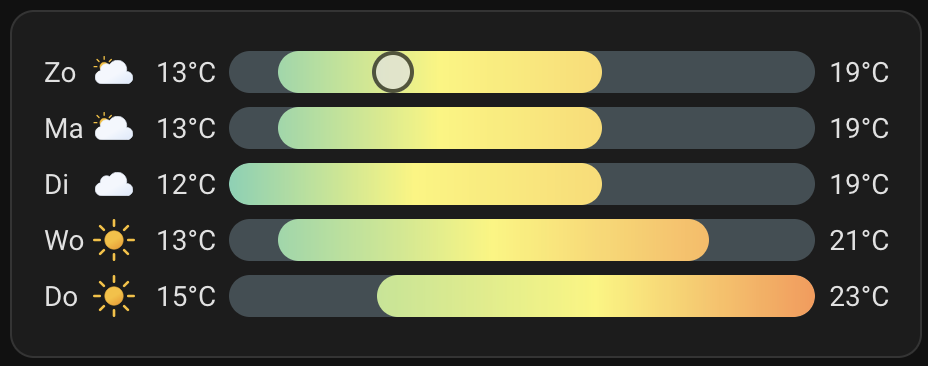

# Home Assistant dashboard: Useful HACS custom elements

<a href="index"></a>

Here you find Home Assistant (lovelace) dashboard custom elements which are default not available in Home Assistant, but which you can add to your dashboard.
<br/><br/>

---

## Table of Contents
<!-- TOC -->
  * [Swipe Navigation](#swipe-navigation)
  * [auto-entities](#auto-entities)
  * [Mushroom](#mushroom)
  * [card-mod 3 (lovelace-card-mod)](#card-mod-3-lovelace-card-mod)
  * [slider-entity-row](#slider-entity-row)
  * [multiple-entity-row](#multiple-entity-row)
  * [template-entity-row](#template-entity-row)
  * [Atomic Calendar Revive](#atomic-calendar-revive)
  * [birthday-reminder-card](#birthday-reminder-card)
  * [Clock Weather Card](#clock-weather-card)
  * [Lovelace animated weather card](#lovelace-animated-weather-card)
  * [Neerslag App](#neerslag-app)
<!-- TOC -->

---

## Swipe Navigation

Swipe to left/right to switch to the side lovelace dashboard on your mobile device.

Repo: https://github.com/zanna-37/hass-swipe-navigation

Install it via this button
[](https://my.home-assistant.io/redirect/hacs_repository/?owner=zanna-37&repository=hass-swipe-navigation&category=integration)

---

## auto-entities

Dynamically show entities based on a variance of sorting and filtering.

Example: Show all temperature entities, sorted on temperature, round on no decimals and colored based on the temperature.


Repo: https://github.com/thomasloven/lovelace-auto-entities

Install it via this button
[](https://my.home-assistant.io/redirect/hacs_repository/?owner=thomasloven&repository=lovelace-auto-entities&category=integration)

I have a [dedicate page](homeassistant_dashboard_card_auto-entities) with examples and a dashboard with [chores](homeassistant_dashboard_chores) based on this custom element.

```yaml

# Sourcecode by vdbrink.github.io
# Dashboard card code
type: custom:auto-entities
card:
  type: entities
  show_header_toggle: false
  state_color: false
  title: Temperature
filter:
  include:
    - entity_id: sensor.temp*.temperature
      options:
        type: custom:template-entity-row
        state: |
          {{ states(config.entity)|round(0)}} °C
        style: |
          :host {
            --paper-item-icon-color:
             
              firebrick
              orange
              blue
              var(--primary-text-color)
              
             ;
           }
show_empty: false
sort:
  method: state
  reverse: true
  numeric: true

```

---
## Mushroom

With the mushroom element, you can add small elements on top of your dashboard.\
Only a colored icon or also with a state value.\
You can also show them only for a specific state. 
Like rain expected, CO2 level is incorrect, temperature not right, nice weather to sit outside etc.

Examples:

 
 
 

Repo: https://github.com/piitaya/lovelace-mushroom

Install it via this button
[](https://my.home-assistant.io/redirect/hacs_repository/?owner=piitaya&repository=lovelace-mushroom&category=integration)


[My dedicated page about the Mushroom element >>](homeassistant_dashboard_card_mushroom)

---

## card-mod 3 (lovelace-card-mod)

Add custom CSS styling to your dashboard.

Example: Colored icon based on entity state.


I have a [styling page](homeassistant_dashboard_styling) with multiple examples based on this custom element.

Repo: https://github.com/thomasloven/lovelace-card-mod

Install it via this button
[](https://my.home-assistant.io/redirect/hacs_repository/?owner=thomasloven&repository=lovelace-card-mod&category=integration)

```yaml

# Sourcecode by vdbrink.github.io
# Dashboard card code
type: entities
entities:
  - entity: sensor.knmi_weercode
    tap_action:
      action: url
      url_path: https://www.knmi.nl/nederland-nu/weer/waarschuwingen/
    card_mod:
      style: |
        :host {
          --card-mod-icon-color:
          
           #008000;
          
           #ff4500;
          
           #ffd700;
          
           #ffa500;
          
           #44739e
          
         }

```

---
## slider-entity-row

Add a slider for brightness, volume, cover position, speed, number, etc.


Repo: https://github.com/thomasloven/lovelace-slider-entity-row

Install it via this button
[](https://my.home-assistant.io/redirect/hacs_repository/?owner=thomasloven&repository=lovelace-slider-entity-row&category=integration)

```yaml

# Sourcecode by vdbrink.github.io
# Dashboard card code
type: custom:slider-entity-row
entity: light.group_light1
toggle: true

```

---
## multiple-entity-row

Place multiple entities compact together on a single row.


Repo: https://github.com/benct/lovelace-multiple-entity-row

Install it via this button
[](https://my.home-assistant.io/redirect/hacs_repository/?owner=benct&repository=lovelace-multiple-entity-row&category=integration)

---
## template-entity-row

Customize a single row for an entities.

In this example, a rounded temperature with a colored, based on the temperature, icon.


Repo: https://github.com/thomasloven/lovelace-template-entity-row

Install it via this button
[](https://my.home-assistant.io/redirect/hacs_repository/?owner=thomasloven&repository=lovelace-template-entity-row&category=integration)

```yaml

# Sourcecode by vdbrink.github.io
# Dashboard card code
type: entities
entities:
  - entity: sensor.temp1_temperature
    type: custom:template-entity-row
    state: |
      {{ states(config.entity)|round(0)}} °C
    style: |
      :host {
        --paper-item-icon-color:
         
          firebrick
          orange
          blue
          var(--primary-text-color)
          
         ;
       }
       .state {
         color: 
         
          firebrick
          orange
          blue
          var(--primary-text-color)
          
       }

```

---
## Atomic Calendar Revive
A Google calendar overview.


Repo: https://github.com/totaldebug/atomic-calendar-revive#about-the-project

Install it via this button
[](https://my.home-assistant.io/redirect/hacs_repository/?owner=totaldebug&repository=atomic-calendar-revive&category=integration)

---
## birthday-reminder-card

A birthday and wedding day overview.


Repo: https://github.com/erlsta/homeassistant-lovelace-birthday-reminder-card

Install it via this button
[](https://my.home-assistant.io/redirect/hacs_repository/?owner=erlsta&repository=homeassistant-lovelace-birthday-reminder-card&category=integration)

To add your own dates, you need to dive into your installation files to edit the `birthday-reminder-card.js` file. 
You can find the file in the `www` folder of your Home Assistant installation.

```yaml

# Sourcecode by vdbrink.github.io
# Dashboard card code
type: custom:birthday-card
title: "Birthdays"
numberofdays: 30

```

---
## Clock Weather Card

A clock and weather forecast in one card.


Repo: https://github.com/pkissling/clock-weather-card

Install it via this button
[](https://my.home-assistant.io/redirect/hacs_repository/?owner=pkissling&repository=clock-weather-card&category=integration)

You can also minimize the card to only show the weather forecast.


```yaml

# Sourcecode by vdbrink.github.io
# Dashboard card code
type: custom:clock-weather-card
entity: weather.forecast_home
forecast_days: 5
locale: nl
time_format: 24
hide_clock: true
date_pattern: ''
hide_today_section: true
hide_forecast_section: false

```

BeardedTinker also made a YouTube video about this card.
[](http://www.youtube.com/watch?v=jHgnO3JryCM "Clock Weather Card HA installation")

---
## Lovelace animated weather card

Current weather conditions and the predictions for the coming days.


Repo: https://github.com/bramkragten/weather-card

Install it via this button
[](https://my.home-assistant.io/redirect/hacs_repository/?owner=bramkragten&repository=weather-card&category=integration)

```yaml

# Sourcecode by vdbrink.github.io
# Dashboard card code
type: custom:weather-card
entity: weather.yourweatherentity
current: true
details: false
forecast: true
hourly_forecast: false
number_of_forecasts: 5

```

---
## Neerslag App

Show expected rain from the possible Dutch sources Buienalarm and Buienradar.


Repo: https://github.com/aex351/home-assistant-neerslag-app

Install it via this button
[](https://my.home-assistant.io/redirect/hacs_repository/?owner=aex351&repository=home-assistant-neerslag-app&category=integration)

```yaml

# Sourcecode by vdbrink.github.io
# Dashboard card code
type: custom:neerslag-card
title: Neerslag
entities:
- sensor.neerslag_buienalarm_regen_data
- sensor.neerslag_buienradar_regen_data

```

---
[^^ Top](#table-of-contents)

[<< See also my other Home Assistant tips and tricks](index)

[Custom element: Auto-entities >>](homeassistant_dashboard_card_auto-entities)

[Dashboard card: Mushroom >>](homeassistant_dashboard_card_mushroom)