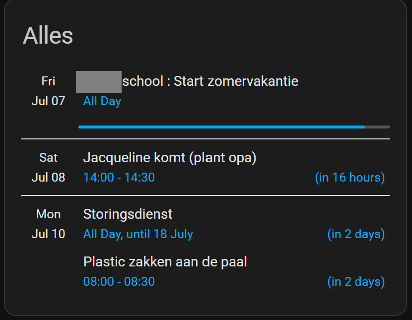
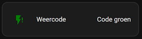
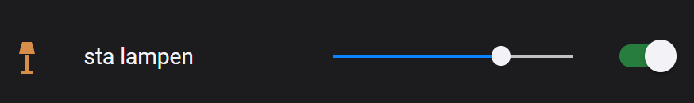
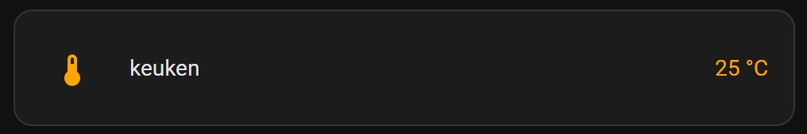

# Home Assistant dashboard: Useful HACS custom elements


<a href="index"></a>

Here you find Home Assistant (lovelace) dashboard custom elements which are default not available in Home Assistant but which you can add to your dashboard.
<br/><br/><br/>

---

## Table of Contents
<!-- TOC --> 
* [Atomic Calendar Revive](#atomic-calendar-revive)
* [auto-entities](#auto-entities)
* [card-mod 3 (lovelace-card-mod)](#card-mod-3-lovelace-card-mod)
* [slider-entity-row](#slider-entity-row)
* [Lovelace animated weather card](#lovelace-animated-weather-card)
* [multiple-entity-row](#multiple-entity-row)
* [Neerslag App](#neerslag-app)
* [Swipe Navigation](#swipe-navigation)
* [template-entity-row](#template-entity-row)
* [example: slider-entity-row](#example-slider-entity-row)
<!-- TOC -->

---
## Atomic Calendar Revive
A Google calendar overview.



Repo: https://github.com/totaldebug/atomic-calendar-revive#about-the-project

---

## auto-entities

Dynamic show entities base on a variance of sorting and filtering.

Example: Sorted on temperature


Repo: https://github.com/thomasloven/lovelace-auto-entities

I have a [dedicate page](homeassistant_dashboard_card_auto-entities) with examples and a dashboard with [chores](homeassistant_dashboard_chores) based on this custom element.

---

## card-mod 3 (lovelace-card-mod)

Add custom CSS styling to your dashboard.

Example: Colored icon



I have a [styling page](homeassistant_dashboard_styling) with multiple examples based on this custom element.

Repo: https://github.com/thomasloven/lovelace-card-mod

---

## slider-entity-row

Add a slider for brightness, volume, cover position, speed, number, etc.


Repo: https://github.com/thomasloven/lovelace-slider-entity-row
```yaml

# Sourcecode by vdbrink.github.io
# Dashboard card code
type: custom:slider-entity-row
entity: light.group_light1
toggle: true

```

---

## Lovelace animated weather card

Current weather and predictions for the coming days.


Repo: https://github.com/bramkragten/weather-card

---

## multiple-entity-row

Place multiple entities compact together on a single row.


Repo: https://github.com/benct/lovelace-multiple-entity-row

---

## Neerslag App

Show expected rain from the possible sources Buienalarm and Buienradar.


Repo: https://github.com/aex351/home-assistant-neerslag-app

---

## Swipe Navigation

Swipe to left/right to switch to the side lovelace dashboard on your mobile device.

Repo: https://github.com/zanna-37/hass-swipe-navigation

---

## template-entity-row

Customize a single row for an entities.



Repo: https://github.com/thomasloven/lovelace-template-entity-row
```yaml

# Sourcecode by vdbrink.github.io
# Dashboard card code
type: entities
entities:
  - entity: sensor.temp1_temperature
    type: custom:template-entity-row
    state: |
      {{ states(config.entity)|round(0)}} °C
    style: |
      :host {
        --paper-item-icon-color:
         
          firebrick
          orange
          blue
          var(--primary-text-color)
          
         ;
       }
       .state {
         color: 
         
          firebrick
          orange
          blue
          var(--primary-text-color)
          
       }


```

---
[^^ Top](#table-of-contents)

[<< See also my other Home Assistant pages](index)