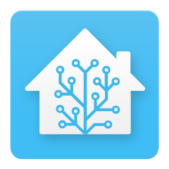
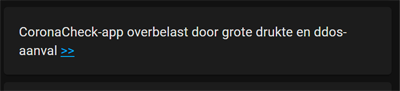

# Home Assistant dashboard: Latest news

<a href="index"></a>

Here you find an Home Assistant dashboard example how you can scrape and show the latest news on your dashboard.
<br>
<br>

---

## News headline (nu.nl)
Show the most important news headline.<br>
With clickable arrows to open the news site.



Get every 15 minutes the latest news headline from the new site nu.nl.\
For other sites, check my [Web Scraper](homeassistant_web_scraper) page how to show website content (like news) inside your dashboard.

Add the news site scraper with the [internal Home Assistant Scrape](https://www.home-assistant.io/integrations/scrape/) integration 
[](https://my.home-assistant.io/redirect/config_flow_start/?domain=scrape)

Most fields can be skipped, only these are required.\
The default scrape interval time is 600 seconds (5 minutes). I couldn't find an override in the UI config.

| Field    | Value                        | Tab |
|:---------|:-----------------------------|-----|
| Resource | https://www.nu.nl            | 1   |
| Name     | nu.nl headline               | 2   |
| Select   | `.title.fluid:first-of-type` | 2   | 

<br>

Or add it manually via the `configuration.yaml`.\
Here you can override the scan interval time.
```yaml

# Sourcecode by vdbrink.github.io
# configuration.yaml
- platform: scrape
  resource: https://www.nu.nl
  select: ".title.fluid:first-of-type"
  name: "nu.nl headline"
  scan_interval: 900

```

<br>

Use a Markdown card to present the news on the dashboard.
```yaml

# Sourcecode by vdbrink.github.io
# Dashboard card code
 - type: markdown
        content: |
          {{ states('sensor.nu_nl_headline') }} [>>](http://nu.nl)

```

Now every 15 minutes you see the latest news refreshing on your dashboard!

---

[<< See also my other Home Assistant tips and tricks](index)