# Home Assistant dashboard: Layout

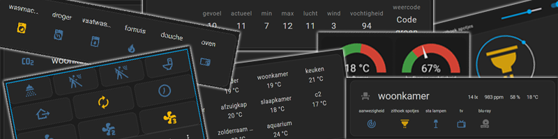

<a href="index"></a>

Here you find Home Assistant dashboard layout tips.

I like compact layouts.\
Over the years I found different ways to group a lot of entity state information together in a nice and compact way.\
And I only show entities which are relevant for the time of day, year or what else...

I hope you can use my examples for your dashboard!

> **_NOTE:_** For some of the examples here, you need to install first an extra HACS integration.

---
## Table of Contents
<!-- TOC -->
  * [Horizontal stack](#horizontal-stack)
  * [Vertical stack](#vertical-stack)
  * [Data in a row](#data-in-a-row)
  * [Grid](#grid)
  * [Six in a row](#six-in-a-row)
  * [With a slider](#with-a-slider)
  * [Only the sensor state](#only-the-sensor-state)
  * [Conditional visible](#conditional-visible)
  * [Entities sorted by state](#entities-sorted-by-state)
  * [Card per room](#card-per-room)
  * [Embed Grafana graph](#embed-grafana-graph)
<!-- TOC -->

---

## Horizontal stack

With a horizontal-stack you can place multiple entities next to each other in one row.

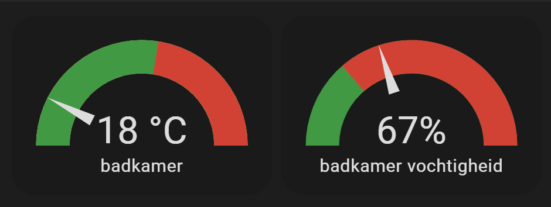

You see here two gauges next to each other instead of the "normal" double sized cards under each other.

```yaml

# Sourcecode by vdbrink.github.io
type: horizontal-stack
cards:
  - type: gauge
    entity: sensor.temp1_temperature_rounded
    theme: ios-dark-mode
    needle: true
    min: 15
    max: 35
    severity:
      green: 10
      yellow: 0
      red: 26
  - type: gauge
    entity: sensor.temp1_humidity_rounded
    theme: ios-dark-mode
    needle: true
    severity:
      green: 45
      red: 60
    min: 45
    max: 100

```

---

## Vertical stack

With a vertical-stack card you can group cards together underneath each other. Reordering of the cards will have no effect on them.

In this example, you see a button panel build with a vertical stack with 3 rows.\
And each row has a horizontal stack. This way all buttons keeps always in the same size and position.

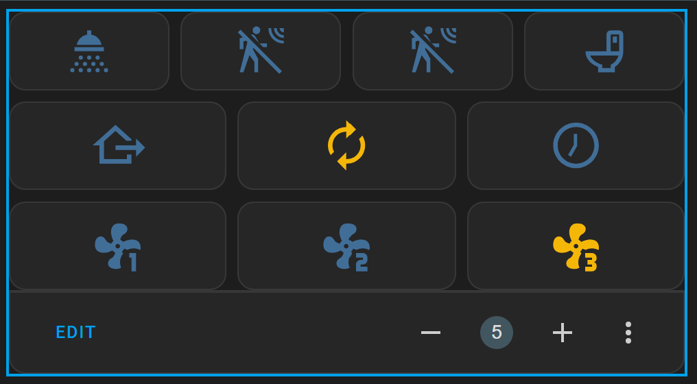

In this YAML, the content of the button entities is removed, it shows the idea and format of the corresponding code.
```yaml

# Sourcecode by vdbrink.github.io
type: vertical-stack
cards:
  - type: horizontal-stack
    cards:
      - show_name: false
        show_icon: true
        type: button
        entity: binary_sensor.shower
      - type: button
        entity: binary_sensor.motion1
        show_name: false
      - type: button
        entity: binary_sensor.motion2
        show_name: false
      - type: button
        entity: binary_sensor.toilet
        show_name: false
  - type: horizontal-stack
    cards:
      - type: button
        ...
      - type: button
        ...
      - type: button
        ...
  - type: horizontal-stack
    cards:
      - type: button
        ...
      - type: button
        ...
      - type: button
        ...

```

---

## Data in a row

Different types of (weather) data, with [rounded](homeassistant_dashboard_formatting#rounded-temperature-sensors) states, next to each other in a single row. This saves a lot of space compared to normal entity states in a list!

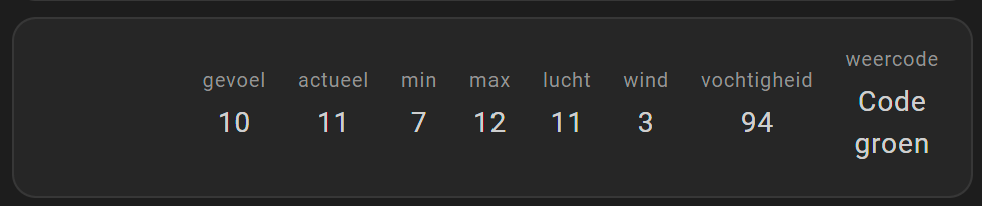

The custom HACS integration [multiple-entity-row](homeassistant_dashboard_hacs#multiple-entity-row) is used here.


```yaml

# Sourcecode by vdbrink.github.io
- type: entities
  entities:
    - entity: sensor.temperature_feels_like_rounded
      type: custom:multiple-entity-row
      name: ' '
      icon: mdi:blank
      show_state: false
      style: |
        .entity div {
          white-space: nowrap
        }
        .entities-row {
          margin-left: -50px
        }
        .image {
          width: 100%;
          height: 200px;
          background-size: cover;
          object-fit: cover;
        }
      entities:
        - entity: sensor.temperature_feels_like_rounded
          unit: false
        - entity: sensor.temperature_actual_rounded
          name: actueel
          unit: false
        - entity: sensor.temperature_min_rounded
          name: min
          unit: false
        - entity: sensor.temperature_max_rounded
          name: max
          unit: false
        - entity: sensor.temperature_airtemp_rounded
          name: lucht
          unit: false
        - entity: sensor.temperature_wind
          unit: false
        - entity: sensor.temperature_humidity_rounded
          unit: false
          name: vochtigheid
        - entity: sensor.knmi_weercode
          name: weercode

```
---

## Grid

Present [rounded temperatures](homeassistant_dashboard_formatting#rounded-temperature-sensors) in a 4 x 3 grid. 

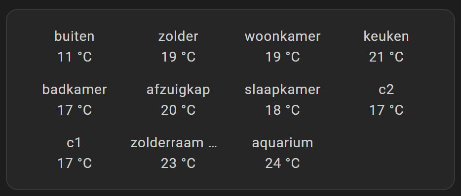

```yaml

# Sourcecode by vdbrink.github.io
  - type: glance
    entities:
      - entity: sensor.temp1_temperature_rounded
      - entity: sensor.temp2_temperature_rounded
      - entity: sensor.temp3_temperature_rounded
      - entity: sensor.temp4_temperature_rounded
      - entity: sensor.temp5_temperature_rounded
      - entity: sensor.temp6_temperature_rounded
      - entity: sensor.temp7_temperature_rounded
      - entity: sensor.temp8_temperature_rounded
      - entity: sensor.temp9_temperature_rounded
      - entity: sensor.temp10_temperature_rounded
      - entity: sensor.temp11_temperature_rounded
    show_state: true
    columns: 4
    show_icon: false  

```

---
## Six in a row

Show (machine) status next to each other.\
The color indicates the state. No textual state text is needed this way.

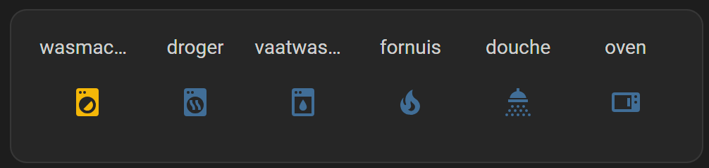

```yaml

# Sourcecode by vdbrink.github.io
  - type: glance
    show_name: true
    show_icon: true
    show_state: false
    entities:
      - entity: binary_sensor.washingmachine
      - entity: binary_sensor.dryer
      - entity: binary_sensor.dishwasher
      - entity: binary_sensor.stove
      - entity: binary_sensor.shower
      - entity: binary_sensor.oven
    state_color: true
    columns: 6

```

---
## With a slider

Show a light entity with a slider in a row or around the icon.\
Use the slider to dim the light.

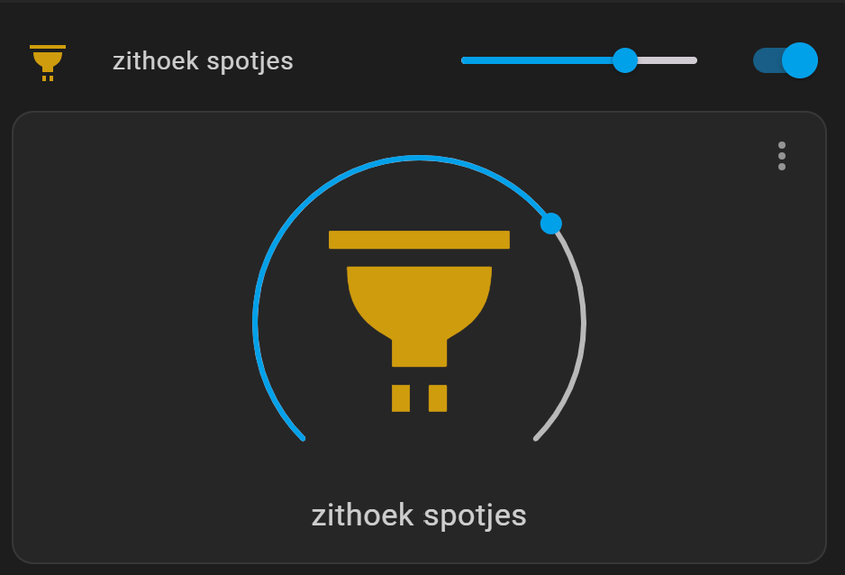

The custom HACS integration [slider-entity-row](homeassistant_dashboard_hacs#slider-entity-row) is also used here.

```yaml

# Sourcecode by vdbrink.github.io
type: vertical-stack
cards:
  - type: custom:slider-entity-row
    entity: light.dimmer
    toggle: true
  - type: light
    entity: light.dimmer
  
```

---

## Only the sensor state

Show only the sensor state and use the whole width of the card for the text.
There is also a link added here for more information.


```yaml

# Sourcecode by vdbrink.github.io
- type: markdown
  content: |
  {{ states('sensor.web_scrape') }} [>>](https://nu.nl)

```

See the [webscraper](homeassistant_web_scraper) page how to add this text as sensor.

---

## Conditional visible

Sometimes you only want to show an entity if it has a specific state.\
Like when there is no rain expected, I don't need this graph to be visible on my dashboard. Especially in periods with no rain expected, it's useless space consuming.\
This functionality makes your dashboard more dynamic, compact and shows only actual useful information.

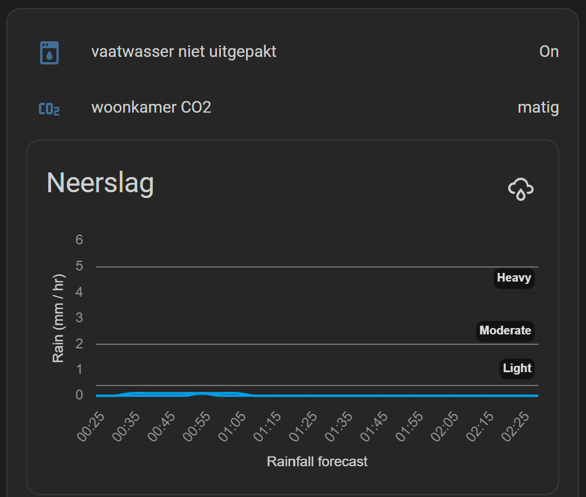

```yaml

# Sourcecode by vdbrink.github.io
- type: entities
  entities:

    # dishwasher still full, state is on
    - type: conditional
      conditions:
        - entity: binary_sensor.dishwasher_packed
          state: 'on'
      row:
        entity: binary_sensor.dishwasher_packed

      # weather alarm code is NOT green
      # show current code and this row is clickable  
      - type: conditional
        conditions:
          - entity: sensor.knmi_weercode
            state_not: Code groen
        row:
          entity: sensor.knmi_weercode
          tap_action:
            action: url
            url_path: https://www.knmi.nl/nederland-nu/weer/waarschuwingen/zuid-holland
    
      # show the rain prediction graph only when rain is expected
      - type: conditional
        conditions:
          - entity: binary_sensor.rain_expected
            state: 'on'
        row:
          type: custom:neerslag-card
          title: Neerslag
          entities:
            - sensor.neerslag_buienalarm_regen_data
            - sensor.neerslag_buienradar_regen_data

```

> **_NOTE:_** The `rain_expected` sensor here is a personal custom sensor, provided by a Node-RED script which checks the data from `sensor.neerslag_buienalarm_regen_data` and `sensor.neerslag_buienradar_regen_data` if any rain is expected. 

---
## Entities sorted by state

Show all entities with match with a wildcard `*` selection. In this case `sensor.*waste_pickup_countdown` and sort it on the `state` by its `numeric` state. The value behind the number is defined as attribute `unit_of_measurement` and not part of the state otherwise the sort won't work.

See the [afvalbeheer](homeassistant_hacs_afvalbeheer#days-count-down) page how to create these countdown custom sensor days instead of showing a date.

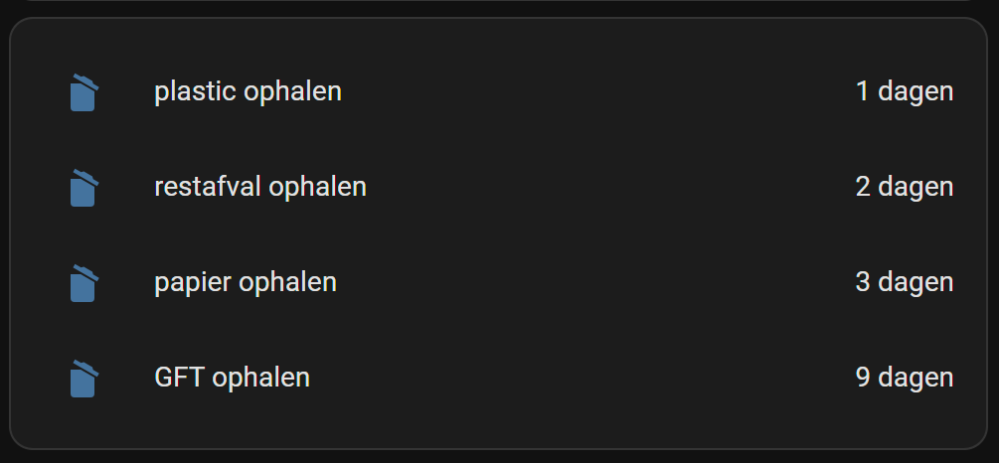

The custom HACS integration [auto-entities](homeassistant_dashboard_card_auto-entities) is used here.

```yaml

# Sourcecode by vdbrink.github.io
- type: custom:auto-entities
  card:
    type: entities
    show_header_toggle: false
    state_color: false
  filter:
    include:
      - entity_id: sensor.*waste_pickup_countdown
    exclude: null
  show_empty: false
  sort:
    method: state
    numeric: true

```

---

## Card per room

There are different ways to group entities per subject together. One way is, for example, to create for each room a separated card. Here is one example:

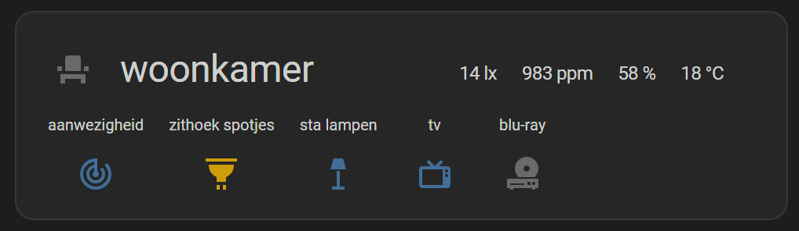

This card is not by default available, but as custom HACS integration [room-card](https://github.com/marcokreeft87/room-card?tab=readme-ov-file#room-card).

Check here all the possible options for this card https://github.com/marcokreeft87/room-card/wiki/Configuration

This is the corresponding YAML for the screenshot.

```yaml

# Sourcecode by vdbrink.github.io
entity: sensor.living_tv_room_presence
type: custom:room-card
title: woonkamer
icon: mdi:seat
show_icon: true
tap_action:
  action: toggle
info_entities:
  - entity: sensor.living_lux_illuminance_lux
  - entity: sensor.living_co2_value
  - entity: sensor.living_temp_humidity_rounded
  - entity: sensor.living_temp_temperature_rounded
entities:
  - entity: binary_sensor.living_presence_presence
  - entity: light.living_dimmer
  - entity: light.living_group_light
    state_color: true
    tap_action:
      action: more-info
  - entity: binary_sensor.living_tv
    state_color: true
  - entity: binary_sensor.living_blu_ray
    icon: mdi:disc-player
    state_color: true
    show_icon: true

```

---

## Embed Grafana graph

Use the `iframe` element to include a Grafana graph in your Home Assistant dashboard. Use in Grafana the share functionality to generate the correct url.

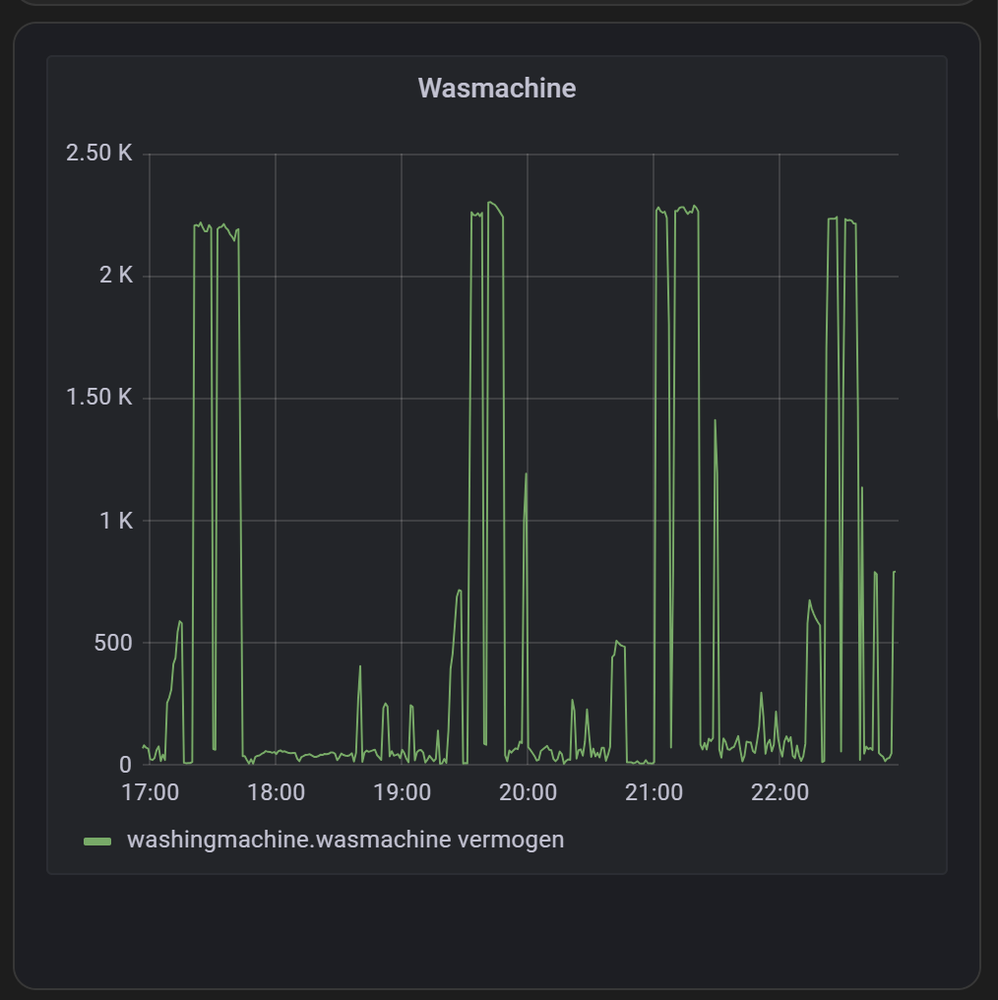

```yaml

# Sourcecode by vdbrink.github.io
- type: iframe
  aspect_ratio: 100%
  url: >-
    http://<host>/d/7nsprokRk/overzicht?orgId=1&refresh=1m&theme=dark&kiosk&viewPanel=8

```

To use this iframing, you need to set in `grafana.env` this value
`GF_SECURITY_ALLOW_EMBEDDING=true`.

---

I hope these examples will give you some ideas how you can compactly organize your data in various ways.\
In the last few years I gathered these different possibilities.\
If you like my blog posts, please make a [donation](#donate) to support my work, thank you very much! I appreciate it.

---
[^^ Top](#table-of-contents)

[<< See also my other Home Assistant pages](index)