# Home Assistant dashboard: Mealie Recipe Manager

<a href="index"></a>


Here you find how I seamlessly integrate the recipe manager **Mealie** into my HA dashboard to organize my **recipes** and show a meal **day-** and **weekplanning**.

This documentation is based on Mealie version `2.0.0`

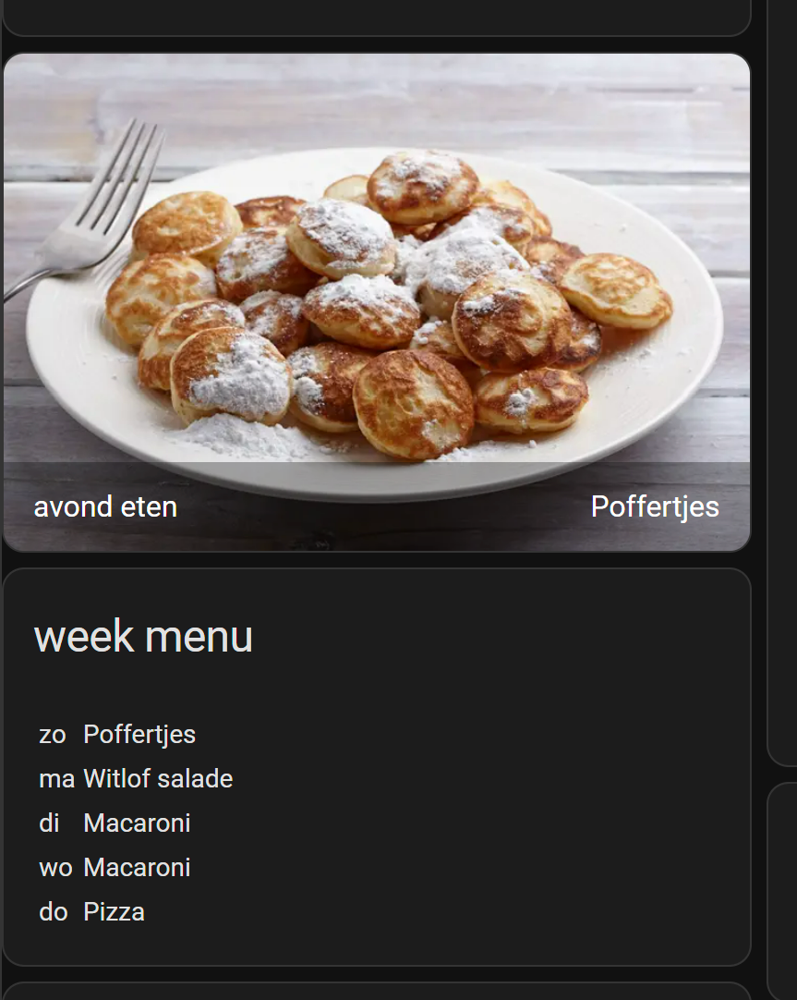

> **_UPDATE:_** There is now also a [Mealie integration](https://www.home-assistant.io/integrations/mealie/) in Home Assistant.\
> This page was already created before this exists, here I describe also other functionalities than you get with this integration.

> **_UPDATE 22-10-2024:_** Mealie version `2.0.0` is released and has breaking API changes compare to the previous `1.12.0` version. 
> See this PR for the changed paths https://github.com/mealie-recipes/mealie/pull/3970 \
> For example `/groups/mealplans` -> `/households/mealplans`

---
## Table of Contents
<!-- TOC -->
  * [Intro](#introduction)
  * [Functionalities](#functionalities)
  * [Installation](#installation)
    * [Docker](#docker)
    * [Hass.io Add-on](#hassio-add-on)
  * [Add recipes](#add-recipes)
  * [Dashboard integration](#dashboard-integration)
    * [As Panel](#as-panel)
    * [As sidebar link](#as-sidebar-link)
  * [Integrate Mealie data into your dashboard](#integrate-mealie-data-into-your-dashboard)
    * [Today's meal](#todays-meal)
      * [Store today meal data as a sensor](#store-today-meal-data-as-a-sensor)
      * [Create today meal image](#create-today-meal-image)
      * [Card element](#card-element)
    * [Meal planning for this week as a list](#meal-planning-for-this-week-as-a-list)
      * [Store meal planning data as a sensors](#store-meal-planning-data-as-a-sensors)
      * [Markdown element](#markdown-element)
  * [Out of the freezer the evening before](#out-of-the-freezer-the-evening-before)
  * [FAQ](#faq)
<!-- TOC -->

---

## Introduction

How do you manage your recipes? Via bookmarks in your browser? And end up with dead links to great recipes? Or as printed version with notes with your own improvements?

As a Home Assistant enthusiast, I wanted to store my recipes locally on my home server to use it while preparing the meals.
Also show my day- and week meal planning on the HA kitchen dashboard.\
I searched for a self-hosting solution and found Mealie most suitable for this purpose.

With Mealie, it's possible to add recipes manually, but also import them via an online url direct into the Mealie structure. If you have a YouTube video, you can add this in the description as a reference to your current online recipe. This way I have all my recipes now centralized at one place!

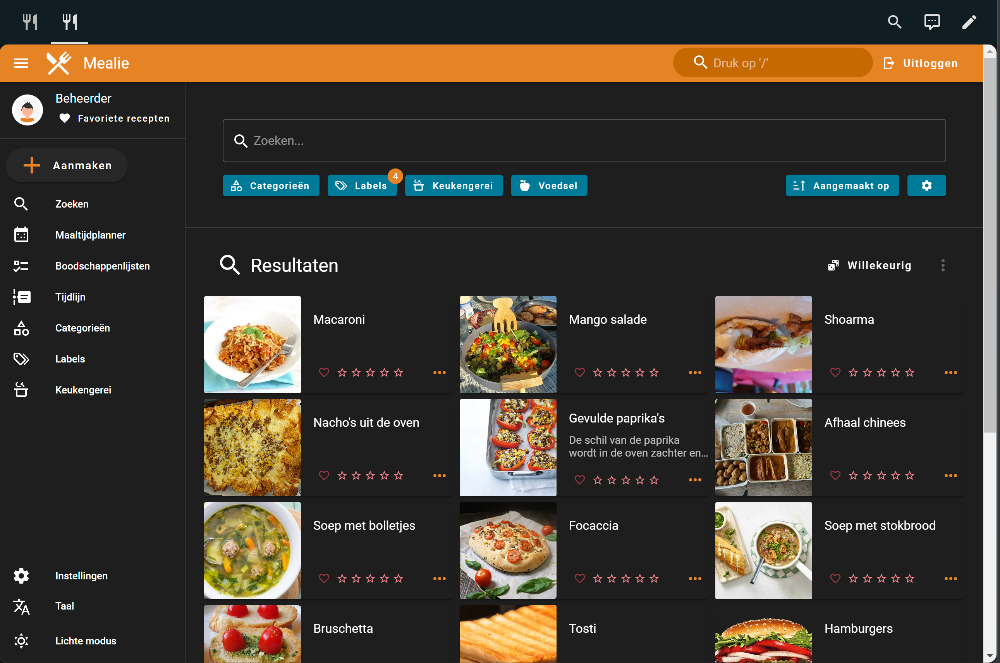

For more project information, check their website: https://docs.mealie.io/

---

## Functionalities

The program I was looking for must contain the next functionality:
* Organize my recipes
* Create a meal week planning
* Show a photo of today's meal
* Self-hosting
* API to show my weekplanning in a Home Assistant dashboard

<br>
Mealie is the open source tool that provides all these functionalities and is active in development.

---

## Installation

### Docker

Mealie can run as a single Docker container.

The website and API (available under /docs) will be available on the server via the url http://< ip-adress >:9925

```yaml

# Sourcecode by vdbrink.github.io
# docker-compose.yaml
version: '2'
services:
 
  mealie-recipes:
    container_name: mealie-recipes
    # This documetation is based on version 2.0.0 (october 2024)
    image: ghcr.io/mealie-recipes/mealie:latest 
    restart: always
    volumes:
      - ./volumes/mealie-recipes:/app/data/
    ports:
      - "9925:9000"
    environment:
      PUID: 1000
      PGID: 1000
      TZ: Europe/Amsterdam
  
      # Default Recipe Settings
      RECIPE_PUBLIC: 'true'
      RECIPE_SHOW_NUTRITION: 'false'
      RECIPE_SHOW_ASSETS: 'true'
      RECIPE_LANDSCAPE_VIEW: 'true'
      RECIPE_DISABLE_COMMENTS: 'true'
      RECIPE_DISABLE_AMOUNT: 'false'
      ALLOW_SIGNUP: 'true'
      MAX_WORKERS: 1
      WEB_CONCURRENCY: 1
      TOKEN_TIME: 99999

```

### Hass.io Add-on

It can also be installed as Hass.io Add-on direct in Home Assistant.

Check this page for the installation details https://github.com/alexbelgium/hassio-addons/tree/master/mealie#installation

Smart Home Junkie created a step-by-step video about the installation in HA.

[](http://www.youtube.com/watch?v=dd5t3vBOZUM "Mealie HA installation")

---
## Add recipes

When you access your local Mealie website, you're in read-only modus. 
Click in the right top corner to login with the default credentials changeme@email.com / MyPassword

Click on the left menu on the plus button to add meals manually or import them from a website. 
Not all recipe websites provide their data in a correct way so Mealie can import the complete online recipe in the Mealie template style, then you need to copy-paste it yourself.

---
## Dashboard integration

### As Panel

To integrate Mealie as view in Home Assistant, create a new dashboard and use these settings:


<br/>

<br/>

On the dashboard, add only an iframe card and use these settings:

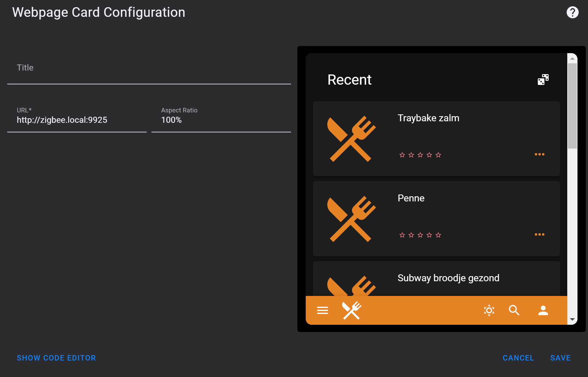

<br>

This is how it will look like, integrated in Home Assistant.


### As sidebar link

[update] This can be removed in newer HA versions.

Another option is to add a link to Mealie in the sidebar.

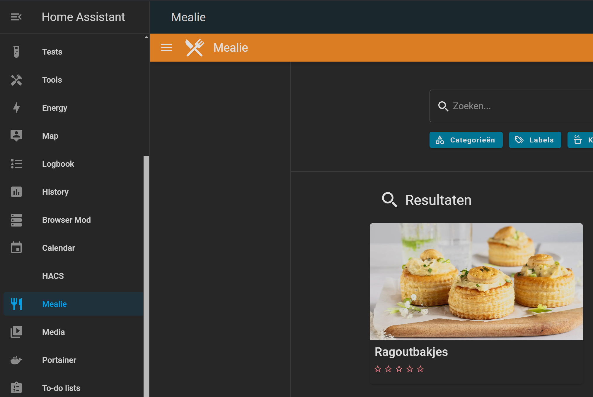

You only need to add this code to your `configuration.yaml` file.
```yaml

# Sourcecode by vdbrink.github.io
# configuration.yaml
panel_iframe:
  mealie:
    title: Mealie
    url: "http://<ip-address>:9926"
    icon: mdi:silverware-fork-knife

```

---
## Integrate Mealie data into your dashboard

To use the functionality to show a day- and week planning, integrated in HA, you need to create first a meal plan.

In the side menu choose for the Meal planner option, use the top Edit menu item to start editing the planning.
Use the + icon to select a meal for each day.

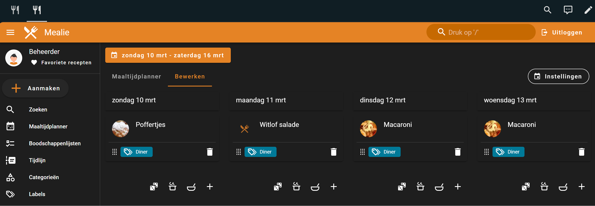

---
### Today's meal

Now a week planning is made we can use this data.

All data inside Mealie is also accessible through API calls.\
Go to http://< ip-adress >:9925/docs to see all the available API's.

To show it like this, the data must be stored in HA and then presented in a nice way. 

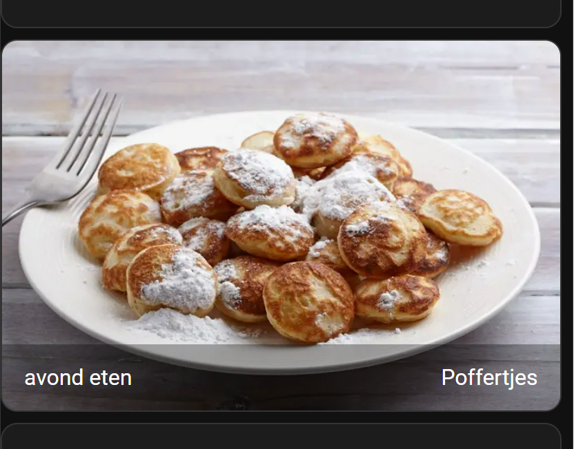

#### Store today meal data as a sensor

First, a scraper is needed to get the data from the Mealie API and store it as a sensor in Home Assistant.
This code creates a sensor `mealie_todays_meal` with the state like `Poffertjes`. This meal id is needed to grab the corresponding photo.

To call the API, you need a secret Bearer token. Check the [FAQ](#faq) how to create one.
If you don't want to use the `secrets.yaml` method, you can also place the token in this config itself.
```yaml

  Authorization: Bearer ey....

```

```yaml

# Sourcecode by vdbrink.github.io
# configuration.yaml
rest:
 - scan_interval: 3600
   resource: "http://< mealie-url >:9925/api/households/mealplans/today"
   headers:
     Authorization: !secret mealie_bearer
   sensor:
     - name: "Mealie todays meal ID"
       value_template: "{{ value_json[0].recipe.id }}"
       force_update: true
     - name: "Mealie todays meal"
       value_template: "{{ value_json[0].recipe.name }}"
       force_update: true

```

#### Create today meal image

To get the image for today, you need to add a `Generic Camera` via Settings, Devices & Services, Add Integration, and search for the generic camera entity.

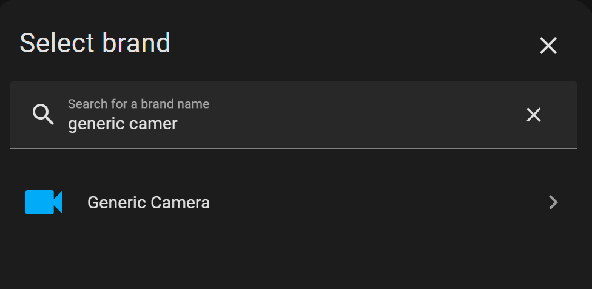

The only field you need to fill in is the `Still Image URL`.

You can use the internal docker link:
```yaml

http://mealie-recipes:9000/api/media/recipes/{{states('sensor.mealie_todays_meal_id')}}/images/min-original.webp

```

or the outside host url (replace `< ip-address >` with your own server ip-address or the internal docker name, in my case `mealie-recipes`):
```yaml

http://< ip-address >:9925/api/media/recipes/{{states('sensor.mealie_todays_meal_id')}}/images/min-original.webp

```

#### Card element
Now we have stored the name of the meal for today and the corresponding image we can use it to add it to our HA as card, like this:

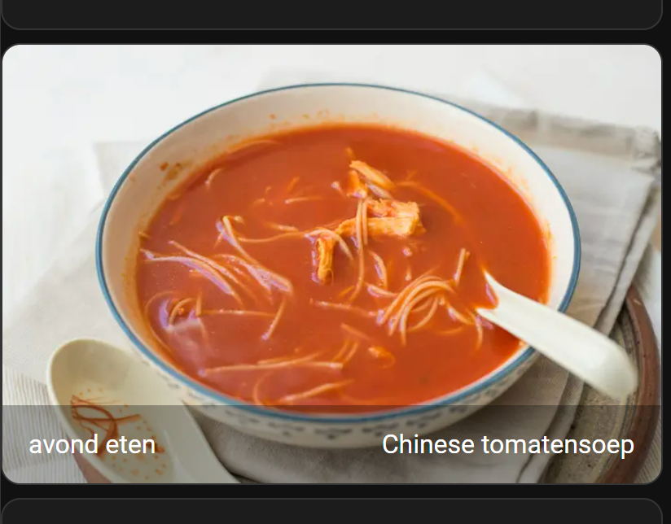

Add a Picture element to the dashboard with this code:

```yaml

# Sourcecode by vdbrink.github.io
# Dashboard card code
- type: picture-entity
  entity: sensor.mealie_todays_meal
  camera_image: camera.mealie_recipes
  name: avond eten
  show_state: true
  show_name: true
  tap_action:
    action: navigate
    navigation_path: /lovelace-dashboard/mealie

```

I use the `tap_action` also here, when you click on the card you navigate direct to the Mealie integration iframe.

---
### Meal planning for this week as a list

It's possible to show the complete meal planning for the rest of the week as a list on your dashboard!

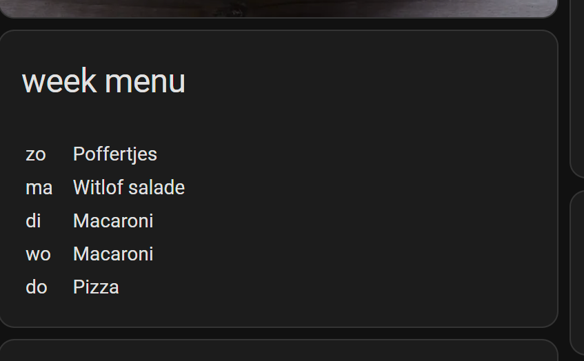

#### Store meal planning data as a sensors

First create a scraper sensor in `configuration.yaml`.

It will get the meal planning ordered by date and start with the meal for today.\
Then it creates for the upcoming 7 days, for each day two sensors, one with the name of the meal and the other one with the corresponding date (in the format YYYY-MM-DD).

Every day each meal moves one place up. At the end of the week, only the first sensor contains a value.

The update interval is set here to one hour, if you reorder the meals in Mealie it will reflect within this hour on your dashboard also.

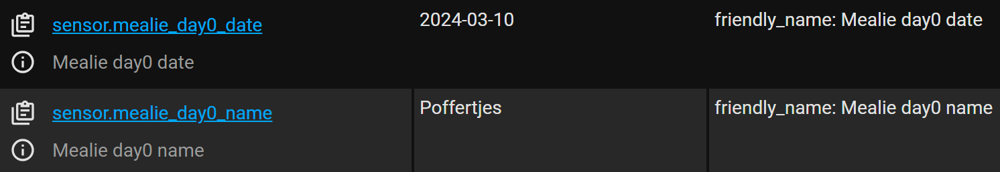

```yaml

# Sourcecode by vdbrink.github.io
# configuration.yaml
rest:
 - scan_interval: 3600
   resource: "http://< ip-address >:9925/api/households/mealplans?orderBy=date&orderDirection=asc"
   headers:
     Authorization: !secret mealie_bearer
   params:
     start_date: >
      {{ now().strftime('%Y-%m-%d') }}
   sensor:
     - name: "Mealie day0 name"
       value_template: "{{ value_json['items'][0].recipe.name }}"
       force_update: true
     - name: "Mealie day0 date"
       value_template: "{{ value_json['items'][0].date }}"
       force_update: true
     - name: "Mealie day1 name"
       value_template: "{{ value_json['items'][1].recipe.name }}"
       force_update: true
     - name: "Mealie day1 date"
       value_template: "{{ value_json['items'][1].date }}"
       force_update: true
     - name: "Mealie day2 name"
       value_template: "{{ value_json['items'][2].recipe.name }}"
       force_update: true
     - name: "Mealie day2 date"
       value_template: "{{ value_json['items'][2].date }}"
       force_update: true
     - name: "Mealie day3 name"
       value_template: "{{ value_json['items'][3].recipe.name }}"
       force_update: true
     - name: "Mealie day3 date"
       value_template: "{{ value_json['items'][3].date }}"
       force_update: true
     - name: "Mealie day4 name"
       value_template: "{{ value_json['items'][4].recipe.name }}"
       force_update: true
     - name: "Mealie day4 date"
       value_template: "{{ value_json['items'][4].date }}"
       force_update: true
     - name: "Mealie day5 name"
       value_template: "{{ value_json['items'][5].recipe.name }}"
       force_update: true
     - name: "Mealie day5 date"
       value_template: "{{ value_json['items'][5].date }}"
       force_update: true
     - name: "Mealie day6 name"
       value_template: "{{ value_json['items'][6].recipe.name }}"
       force_update: true
     - name: "Mealie day6 date"
       value_template: "{{ value_json['items'][6].date }}"
       force_update: true

```

#### Markdown element

Now we have stored the names of all the meals for the upcoming days we can use it to add it to our HA as card, like this. During the week, the list will be shorter until you plan new meals for the next upcoming days.


In your dashboard, add a Markdown card with this code.\
Make sure you're in the cards `Code Editor` mode (toggle mode with the blue text in the bottom of the dialog) when you paste this code.\
The date will be formatted to the short notation for the day of the week.

```yaml

# Sourcecode by vdbrink.github.io
# Dashboard card code
type: markdown
title: week menu
content: >-
   <table> 
  
    
    
    
     
    <tr>
      <td>
        {{ ['ma','di','wo','do','vr','za','zo'][strptime(meal_date, "%Y-%m-%d").weekday()] }} 
       <td>&nbsp; &nbsp;</td>
      <td>{{ meal_name }}</td>
    </tr>
    
  
  </table>

```

<details>
  <summary><b>> Click here to open the extended Markdown version with clickable text to go to your Mealie page >></b></summary>
<br>
This extended version makes it possible to click on the menu text and go to the Mealie page.
Without the card_mod extension, which add some CSS, you see all the text in blue underlined.
Here is another HACS integration needed, `card-mod`, see <a href="https://github.com/thomasloven/lovelace-card-mod" target="_blank">https://github.com/thomasloven/lovelace-card-mod</a>
Install this integration via this button in your own HA instance
[](https://my.home-assistant.io/redirect/hacs_repository/?owner=thomasloven&repository=lovelace-card-mod&category=integration)

```yaml

# Sourcecode by vdbrink.github.io
# Dashboard card code
type: markdown
title: week menu
content: >-
  <a href="/lovelace-dashboard/mealie">
   <table> 
  
    
    
    
     
    <tr>
      <td>
        {{ ['ma','di','wo','do','vr','za','zo'][strptime(meal_date, "%Y-%m-%d").weekday()] }}
       <td>&nbsp; &nbsp;</td>
       <td>{{ meal_name }}</td>
    </tr>
    
  
   </table>
  </a>
card_mod:
  style:
    ha-markdown:
      $: |
        a { 
          all:unset; 
          color:white ! important;
          cursor: pointer ! important;
        }

```
</details>

---

## Out of the freezer the evening before

I created a Node-RED automation which reminds me in the evening if I need to get meat/fish/anything else out of the freezer and move it to the refrigerator to let it slowly defrost it already for the dinner of tomorrow.
This is based on the ingredient list, for the meal of tomorrow, if there is one of the ingredients which has the text `[freezer]` in it, I show the names of these ingredients in the notification.

### Notification

This is an example of how such notification could look like:

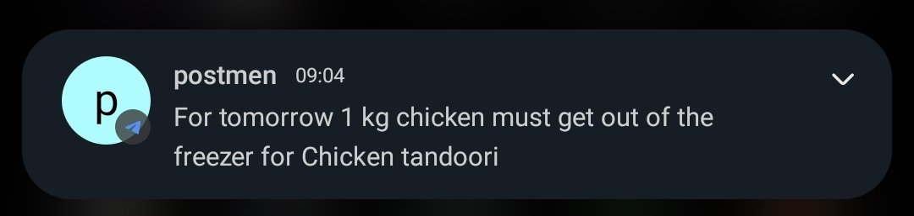

Other possible messages are:
* "For tomorrow no recipe found"
* "For tomorrow nothing need out of the freezer for {recipe_name}"

### Tag an ingredient

Only ingredients with the text `[freezer]` are used in the notification.

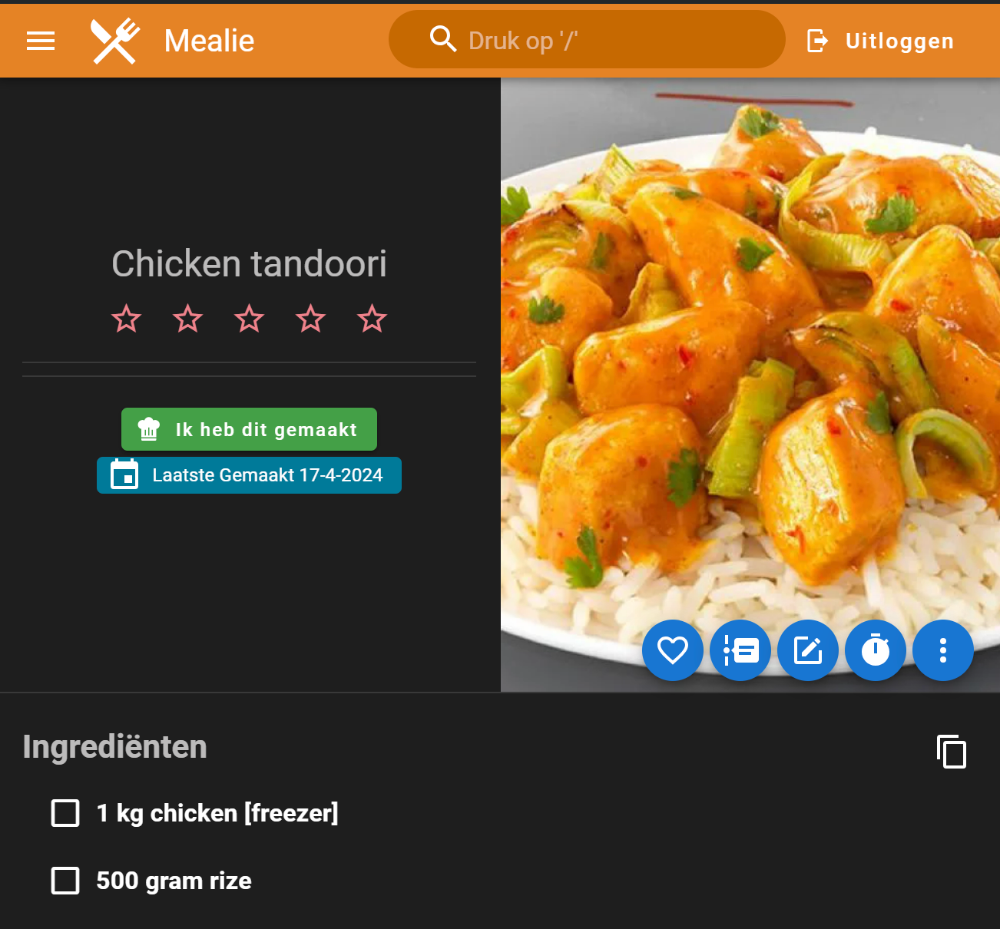

### Node-RED flow

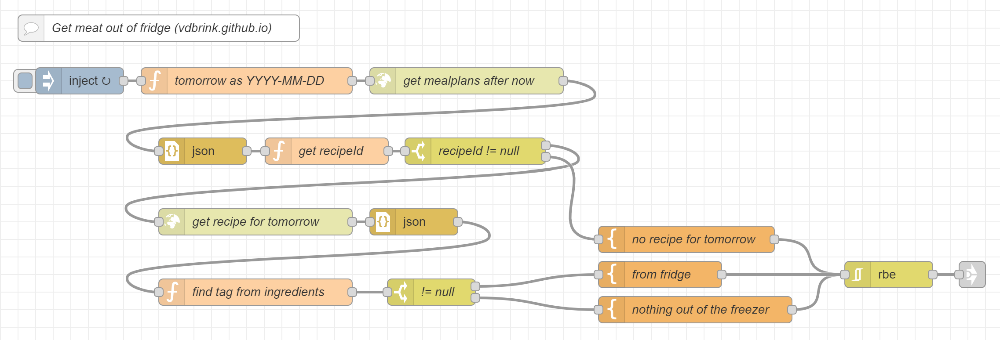

```yaml

[{"id":"bd0839aee9138ce9","type":"tab","label":"Mealie test","disabled":false,"info":"","env":[]},{"id":"74e61f540d6cfdff","type":"inject","z":"bd0839aee9138ce9","name":"","props":[{"p":"topic","vt":"str"}],"repeat":"","crontab":"00 22 * * *","once":false,"onceDelay":0.1,"topic":"","x":110,"y":100,"wires":[["d0a80ee27f0fa9ac"]]},{"id":"403b6a3cd68b67c4","type":"http request","z":"bd0839aee9138ce9","name":"get mealplans after now","method":"GET","ret":"txt","paytoqs":"ignore","url":"http://mealie-recipes:9000/api/households/mealplans?orderBy=date&orderDirection=asc&perPage=1&start_date={{{start_date}}}","tls":"","persist":false,"proxy":"","insecureHTTPParser":false,"authType":"bearer","senderr":false,"headers":[],"x":550,"y":100,"wires":[["1d7bcc9aea364223"]]},{"id":"d0a80ee27f0fa9ac","type":"function","z":"bd0839aee9138ce9","name":"tomorrow as YYYY-MM-DD","func":"let currentDate = new Date();\ncurrentDate.setDate(currentDate.getDate() + 1);\n\n// Format the date to YYYY-MM-DD\nlet year = currentDate.getFullYear();\nlet month = ('0' + (currentDate.getMonth() + 1)).slice(-2); // Adding 1 because months are zero-based\nlet day = ('0' + currentDate.getDate()).slice(-2);\nlet formattedDate = year + '-' + month + '-' + day;\n\nmsg.start_date = formattedDate;\nreturn msg;","outputs":1,"timeout":0,"noerr":0,"initialize":"","finalize":"","libs":[],"x":300,"y":100,"wires":[["403b6a3cd68b67c4"]]},{"id":"dc16d1889207dc1c","type":"http request","z":"bd0839aee9138ce9","name":"get recipe for tomorrow","method":"GET","ret":"txt","paytoqs":"ignore","url":"http://mealie-recipes:9000/api/recipes/{{{recipeId}}}","tls":"","persist":false,"proxy":"","insecureHTTPParser":false,"authType":"bearer","senderr":false,"headers":[],"x":310,"y":260,"wires":[["d2048ea8d9e3ba36"]]},{"id":"f95f8b3686b07a9b","type":"function","z":"bd0839aee9138ce9","name":"get recipeId","func":"if (msg.payload.items.length>0) {\n    msg.recipeId = msg.payload.items[0].recipeId;\n}\nreturn msg;","outputs":1,"timeout":0,"noerr":0,"initialize":"","finalize":"","libs":[],"x":391,"y":180,"wires":[["c30cf32f3fb9dcb0"]]},{"id":"1d7bcc9aea364223","type":"json","z":"bd0839aee9138ce9","name":"","property":"payload","action":"","pretty":false,"x":250,"y":180,"wires":[["f95f8b3686b07a9b"]]},{"id":"d2048ea8d9e3ba36","type":"json","z":"bd0839aee9138ce9","name":"","property":"payload","action":"","pretty":false,"x":490,"y":260,"wires":[["18553b8d68008d00"]]},{"id":"18553b8d68008d00","type":"function","z":"bd0839aee9138ce9","name":"find tag from ingredients","func":"var recipe = msg.payload;\n\nmsg.payload = {};\nmsg.payload.recipe_name = recipe.name;\nmsg.payload.fridge = null;\n\nvar keyword = \"freezer\";\nvar tag = \"[\" + keyword +\"]\";\nvar freezerIngredients = Array();\nfor (let i = 0; i < recipe.recipeIngredient.length; i++) {\n    var ingredient = recipe.recipeIngredient[i];\n    if (ingredient.display.includes(tag)) {\n        // remove tag and add to the array\n         freezerIngredients.push(ingredient.display.replace(' '+ tag, ''));\n    }\n}\nif (freezerIngredients.length > 0) {\n    msg.payload.fridge = freezerIngredients.join(\" and \");\n}\nreturn msg;","outputs":1,"timeout":0,"noerr":0,"initialize":"","finalize":"","libs":[],"x":310,"y":340,"wires":[["6600274d3fc3c995"]]},{"id":"ab1563c57ccf9d26","type":"template","z":"bd0839aee9138ce9","name":"from fridge","field":"payload","fieldType":"msg","format":"handlebars","syntax":"mustache","template":"For tomorrow {{payload.fridge}} must get out of the freezer for {{payload.recipe_name}}","output":"str","x":770,"y":320,"wires":[["dd9bfa2ced5eb6ff"]]},{"id":"6600274d3fc3c995","type":"switch","z":"bd0839aee9138ce9","name":"!= null","property":"payload.fridge","propertyType":"msg","rules":[{"t":"nnull"},{"t":"else"}],"checkall":"true","repair":false,"outputs":2,"x":510,"y":340,"wires":[["ab1563c57ccf9d26"],["cb9246ee0de6055b"]]},{"id":"2c49779e764870f5","type":"link out","z":"bd0839aee9138ce9","name":"send message","mode":"link","links":[],"x":1125,"y":320,"wires":[]},{"id":"cb9246ee0de6055b","type":"template","z":"bd0839aee9138ce9","name":"nothing out of the freezer","field":"payload","fieldType":"msg","format":"handlebars","syntax":"mustache","template":"For tomorrow nothing need out of the freezer for {{payload.recipe_name}}","output":"str","x":810,"y":360,"wires":[["dd9bfa2ced5eb6ff"]]},{"id":"c30cf32f3fb9dcb0","type":"switch","z":"bd0839aee9138ce9","name":"recipeId != null","property":"recipeId","propertyType":"msg","rules":[{"t":"nnull"},{"t":"else"}],"checkall":"true","repair":false,"outputs":2,"x":560,"y":180,"wires":[["dc16d1889207dc1c"],["6b12146002663662"]]},{"id":"6b12146002663662","type":"template","z":"bd0839aee9138ce9","name":"no recipe for tomorrow","field":"payload","fieldType":"msg","format":"handlebars","syntax":"mustache","template":"For tomorrow no recipe found","output":"str","x":800,"y":280,"wires":[["dd9bfa2ced5eb6ff"]]},{"id":"9f7205ae535d4aea","type":"comment","z":"bd0839aee9138ce9","name":"Get meat out of fridge (vdbrink.github.io)","info":"","x":200,"y":40,"wires":[]},{"id":"dd9bfa2ced5eb6ff","type":"rbe","z":"bd0839aee9138ce9","name":"","func":"rbe","gap":"","start":"","inout":"out","septopics":true,"property":"payload","topi":"topic","x":1030,"y":320,"wires":[["2c49779e764870f5"]]}]

```

> **_NOTE:_** If have/can convert it into a Home Assistant automation let me know, then I can add it here also.

#### The flow explanation
* Call the Mealie API to get all the recipes after today 
  * Endpoint `http://mealie-recipes:9000/api/households/mealplans?orderBy=date&orderDirection=asc&perPage=1&start_date={{{start_date}}}`
* Get the first recipe ID
* If there is no recipe found:
  * Send a message `For tomorrow no recipe found`
* Otherwise, call the Mealie API to get the recipe data with the ingredients
  * * Endpoint `http://mealie-recipes:9000/api/recipes/{{{recipeId}}}`
* Filter all ingredients and find in one of them contains the text `[freezer]`
* If this isn't found:
  * Send a message `For tomorrow nothing need out of the freezer for {recipe_name}`
* Otherwise, send a message `For tomorrow {ingredient_from_fridge} must get out of the freezer for {recipe_name}`
* If the same message was sent before, no new message is sent (in case you have the same meal for 2 days after each other)

#### Setup
* Define your own host and port number in the endpoints.
* This flow required a [Bearer token](#FAQ) to call the Mealie API. Add the token to the two `get ..` API nodes.
* Link the last node to your own notification flow. I explained [here](../node-red/node-red_home-assistant_notifications) how to use the Companion App to send messages to.

#### Possible additions
* Trigger the flow also earlier and send the message to a Home Assistant sensor to show it on your dashboard.

<hr>

<br>

I hope you also enjoy using Mealie!

---
## FAQ

**Q: What are the default user credentials?**\
A: Username: changeme@email.com\
Password: MyPassword

**Q: How to set a different locale?**\
A: In the side menu go to settings, here you can change the locale.

**Q: How can to create a Bearer token?**\
A: Go to your local Meal website url `/user/profile/api-tokens`\
Create a new token and 
save this private value in the [secrets.yaml](https://www.home-assistant.io/docs/configuration/secrets/) file.
````yaml
# Sourcecode by vdbrink.github.io
# secrets.yaml
mealie_bearer: "Bearer ey....."
````

**Q: Can I add a YouTube recipe instruction movie to my recipe?**\
A: Yes, you can with this code block in the description.
```yaml

<iframe width="560" height="315" src="https://www.youtube.com/embed/dQw4w9WgXcQ" frameborder="0" allow="accelerometer; autoplay; clipboard-write; encrypted-media; gyroscope; picture-in-picture" allowfullscreen></iframe>

```

**Q: Can I disable the required login?**\
A: No, but you can increase the hours your login token is valid. The default value is `48` hours. Use the environment variable `TOKEN_TIME` to increase this time to something like `999999`.

**Q: Where can I find more info about Mealie**\
A: Checkout the [website](https://hay-kot.github.io/mealie/) or via [Discord](https://discord.gg/QuStdQGSGK)

---

[<< See also my other Home Assistant tips and tricks](index)