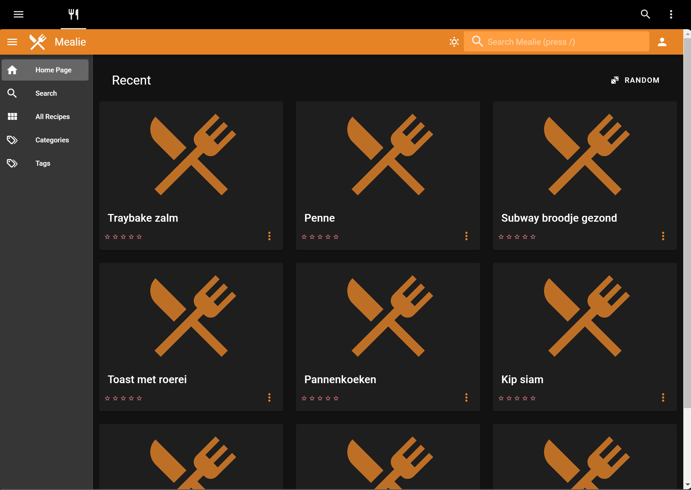

# Home Assistant dashboard: Mealie Recipe manager
<a href="index"></a>

Here you can find how you can create a dashboard to manage recipes with Mealie. 

Website: https://hay-kot.github.io/mealie/
<br>
<br>
<br>

---
## Table of Contents
<!-- TOC -->
* [Docker](#docker)
* [Dashboard](#dashboard)
* [FAQ](#faq)
* [Remarks or suggestions?](#remarks-or-suggestions)
<!-- TOC -->

---
## Docker

You can run Mealie as Docker container.

It will be available on the server on < ip-adress >:9925
```yaml

# Sourcecode by vdbrink.github.io
# docker-compose.yaml
version: '2'
services:
    mealie:
      container_name: mealie
      image: hkotel/mealie:latest
      restart: always
      volumes:
        - ./volumes/mealie:/app/data/
      ports:
        - "9925:80"
      environment:
        PUID: 1000
        PGID: 1000
        TZ: Europe/Amsterdam
    
        # Default Recipe Settings
        RECIPE_PUBLIC: 'true'
        RECIPE_SHOW_NUTRITION: 'false'
        RECIPE_SHOW_ASSETS: 'true'
        RECIPE_LANDSCAPE_VIEW: 'true'
        RECIPE_DISABLE_COMMENTS: 'true'
        RECIPE_DISABLE_AMOUNT: 'false'


```
---
## Dashboard

In Home Assistant create a new dashboard and use these settings.


<br/>

<br/>

Add on the dashboard an iframe element and use these settings:


The final result:



---
## FAQ

Q: What are the default user credentials?\
A: Username: changeme@email.com\
Password: MyPassword

Q: How to set a different locale?\
A: ?

---

## Remarks or suggestions?
Do you have any remarks or suggestions please let me know via github issues.

[Create an issue](https://github.com/vdbrink/vdbrink.github.io/issues)

Or via a [private message](https://gathering.tweakers.net/forum/send_privatemessage/172381) on the Tweakers.net forum.

---
[<< See also my other Home Assistant pages](index)