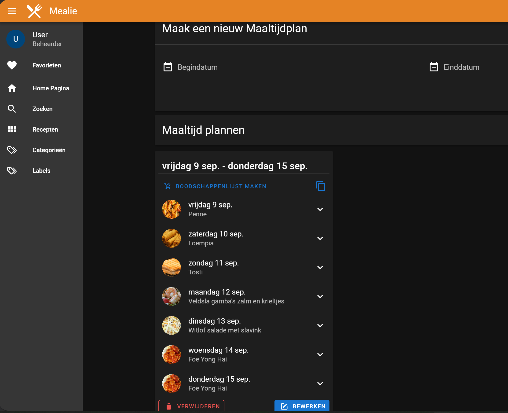
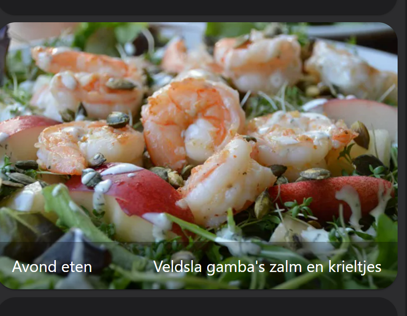
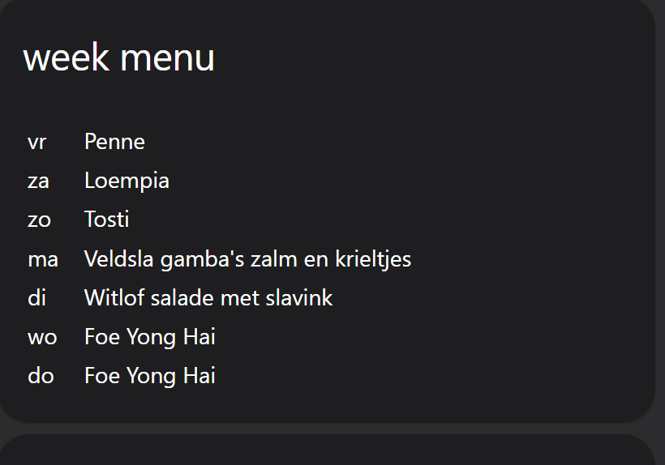

# Home Assistant dashboard: Mealie Recipe manager


<a href="index"></a>

Here you can find how you can create a dashboard to manage your **recipes** and create a **meal weekplanner** with **Mealie**. 

I also show you how data from Mealie can be integrated, via the REST integration seamless, in Home Assistant cards to show the meal planner data.


For more information check also the website: https://hay-kot.github.io/mealie/

> The version I use here is the fixed version 0.5.6, the newer 1.x.x version is not compatible with the card scripts you find here.

---
## Table of Contents
<!-- TOC -->
* [Docker](#docker)
* [Add recipes](#add-recipes)
* [Dashboard integration](#dashboard-integration)
* [Create a week meal planner](#create-a-week-meal-planner)
  * [Meal for tonight](#meal-for-tonight)
    * [Store in a sensor](#store-in-a-sensor)
    * [Square card](#square-card-element)
    * [Small card](#small-card-element)
  * [Meal planning for this week as list](#meal-planning-for-this-week-as-list)
* [FAQ](#faq)
<!-- TOC -->

---
## Docker

You can run Mealie as Docker container.

The website and API will be available on the server on < ip-adress >:9925
```yaml

# Sourcecode by vdbrink.github.io
# docker-compose.yaml
version: '2'
services:
    mealie:
      container_name: mealie
      image: hkotel/mealie:v0.5.6
      restart: always
      volumes:
        - ./volumes/mealie:/app/data/
      ports:
        - "9925:80"
      environment:
        PUID: 1000
        PGID: 1000
        TZ: Europe/Amsterdam
    
        # Default Recipe Settings
        RECIPE_PUBLIC: 'true'
        RECIPE_SHOW_NUTRITION: 'false'
        RECIPE_SHOW_ASSETS: 'true'
        RECIPE_LANDSCAPE_VIEW: 'true'
        RECIPE_DISABLE_COMMENTS: 'true'
        RECIPE_DISABLE_AMOUNT: 'false'

```

---
## Add recipes

When you access your local Mealie website you're in read modus. Click in the right top corner to login with the default credentials changeme@email.com / MyPassword

Now you can click on the bottom right plus icon to add all your meals one by one by hand or import them from a website. 

---
## Dashboard integration

To integrate Mealie in Home Assistant you have to create a new dashboard and use these settings:


<br/>

<br/>

On the dashboard add only an iframe card and use these settings:


This is how it will look like, integrated in Home Assistant.


---
## Create a week meal planner

To use the functionality to show a week planner you need to create a meal plan.

First you have to go to the user profile page and create and select a category for meals. Add this category also to each meal. This is needed so recipes like desserts will not show up in the meal planner.

Go to the top right login icon and choose for Planner, give a start and end date and choose for each day what you're planned to eat. It doesn't matter on which day of the week you start or end.



> If you start a new week you have to remove the previous week otherwise you still get the first planned week from the API call.

---
### Meal for tonight

Now a week planner is made we can use this data.

All data inside Mealie is also accessible through API calls.
We can use this to get the meal for today and present that on a dashboard in a card.


#### Store in a sensor
First a scraper is needed to get the data from the Mealie API and store it as sensor in Home Assistant.
This code creates a sensor `maaltijd_voor_vandaag` with the state `Gevulde paprika's`. Another API call returns the corresponding photo. 

To call the API you need a secret Bearer token. Check the [FAQ](#faq) how to create one.

```yaml

# Sourcecode by vdbrink.github.io
# configuration.yaml
sensor:
    - platform: rest
      resource: 'http://< ip-address >:9925/api/meal-plans/today'
      method: GET
      name: Maaltijd voor vandaag
      headers:
      Authorization: Bearer < your bearer token >
      value_template: "{{ value_json.name }}"

```

#### Square card element
Now we have the name of the meal for today and the corresponding image we can use it to show it on a card.

The first card is a square picture-element.



You can set the `tap_action`, when you click on the card you navigate to the Mealie integration.

```yaml

# Sourcecode by vdbrink.github.io
# Dashboard card code
type: picture-entity
entity: sensor.maaltijd_voor_vandaag
name: Avond eten
show_state: true
show_name: true
image: http://< ip-address >:9925/api/meal-plans/today/image?group_name=Home
tap_action:
  action: navigate
  navigation_path: /lovelace-dashboard/mealie
style: |
  ha-card {
  max-height: 300px !important;
  overflow: hidden;
  display: flex;
  align-items: center;
  justify-content: center;
  }

```

#### Small card element

Because the square image take a lot of space it's also possible to only use the center part of the photo to get the same impression but which use less space.


```yaml

# Sourcecode by vdbrink.github.io
# Dashboard card code
type: picture-entity
entity: sensor.maaltijd_voor_vandaag
name: Avond eten
show_state: true
show_name: true
image: http://< ip-address >:9925/api/meal-plans/today/image?group_name=Home
tap_action:
  action: navigate
  navigation_path: /lovelace-dashboard/mealie
style: |
  ha-card {
  height: 100px !important;
  overflow: hidden;
  display: flex;
  align-items: center;
  justify-content: center;
  }

```

---
### Meal planning for this week as list

It's also possible to show the complete meal planning for the whole week as list with a Markdown card element.



First create a scraper sensor in configuration.yaml.
```yaml

# Sourcecode by vdbrink.github.io
# configuration.yaml
sensor:
    - platform: rest
      resource: 'http://< ip-address >:9925/api/meal-plans/this-week'
      method: GET
      name: "meal this week"
      headers:
        content-type: "application/json"
        Authorization: Bearer <your bearer token>
      value_template: "{{ value_json.name }}"
      json_attributes:
        - planDays

```
In your dashboard add a Markdown card with this code.
The day of the week will be automatic set correct in the list. (Translate it if you're not Dutch)
```yaml

# Sourcecode by vdbrink.github.io
# Dashboard card code
- type: markdown
  title: week menu
  content: >-
    <table> 
     
    <tr>
      <td>{{ ['ma','di','wo','do','vr','za','zo'][strptime( task.date,"%Y-%m-%d").weekday()] }} &nbsp;&nbsp;</td>
      <td>{{ task.meals[0].name }}</td>
    </tr> 
     
    </table>

```
Enjoy using Mealie!

---
## FAQ

**Q: What are the default user credentials?**\
A: Username: changeme@email.com\
Password: MyPassword

**Q: How to set a different locale?**\
A: In the side menu go to settings, here you can change the locale.

**Q: How can to create a Bearer token?**\
A: See [API Key Generation](https://hay-kot.github.io/mealie/documentation/users-groups/user-settings/#api-key-generation)

**Q: Can I add a Youtube recipe instruction movie to my recipe?**\
A: Yes you can with this code block in the description.
```yaml

<iframe width="560" height="315" src="https://www.youtube.com/embed/tDxoRylP194" frameborder="0" allow="accelerometer; autoplay; clipboard-write; encrypted-media; gyroscope; picture-in-picture" allowfullscreen></iframe>

```

**Q: Where can I find more info about Mealie**\
A: See their [website](https://hay-kot.github.io/mealie/)

---
[^^ Top](#table-of-contents)

[<< See also my other Home Assistant pages](index)