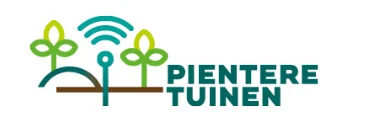
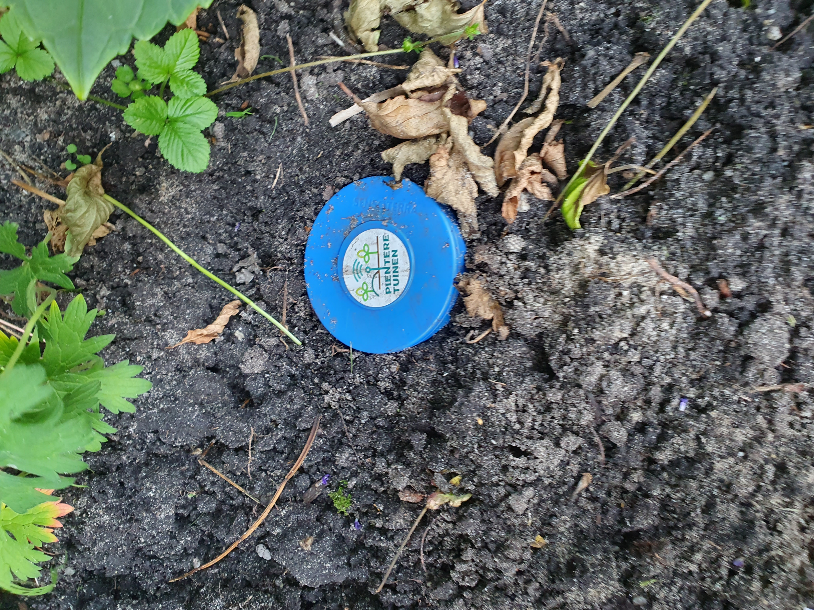
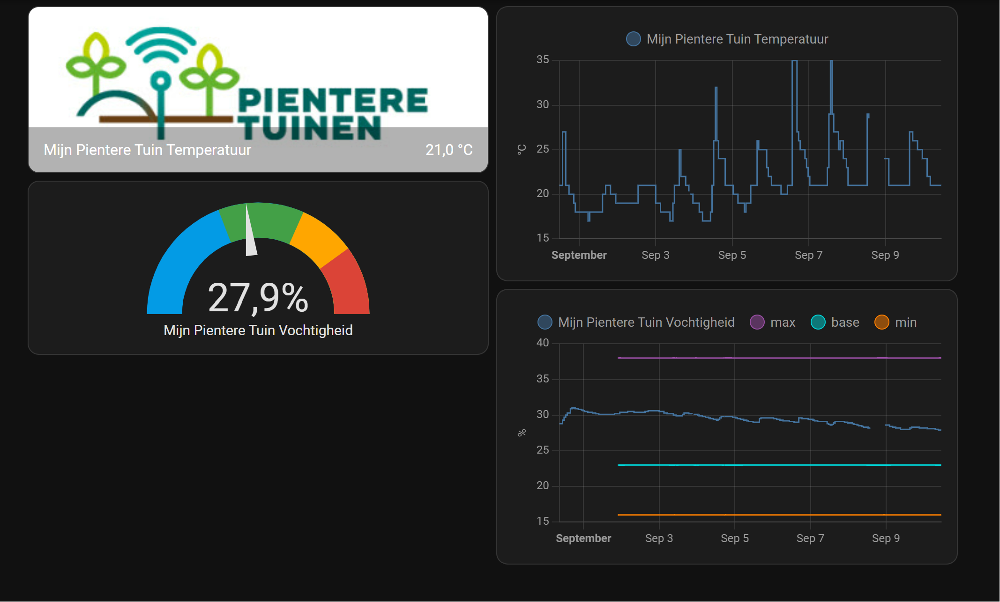
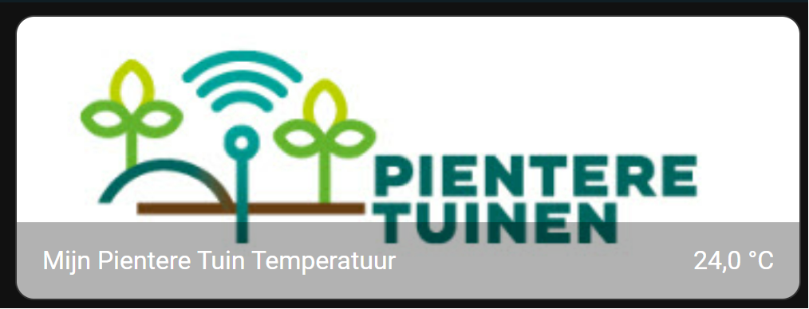
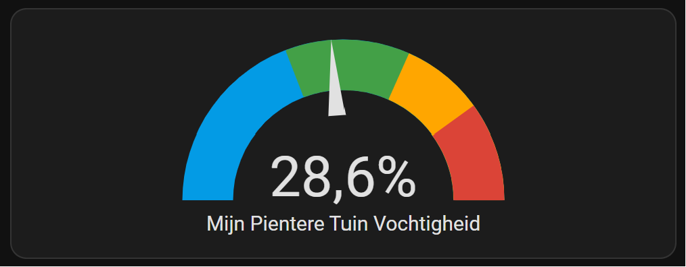
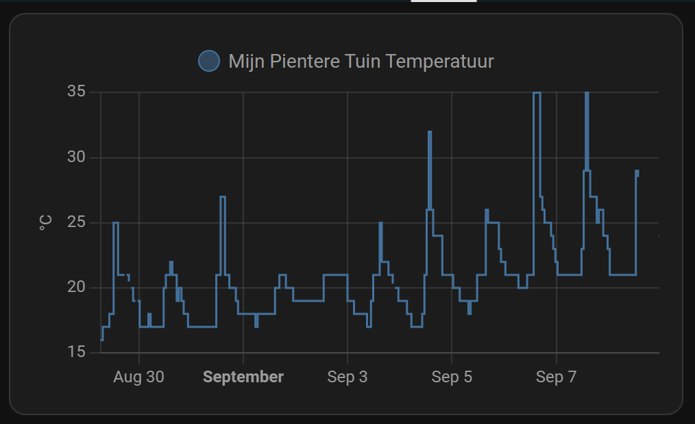
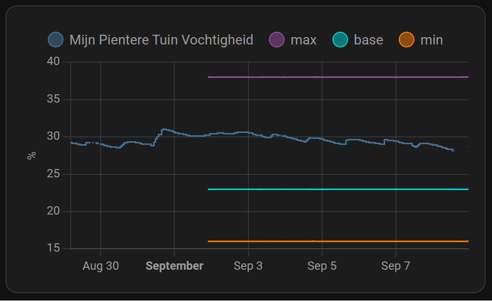
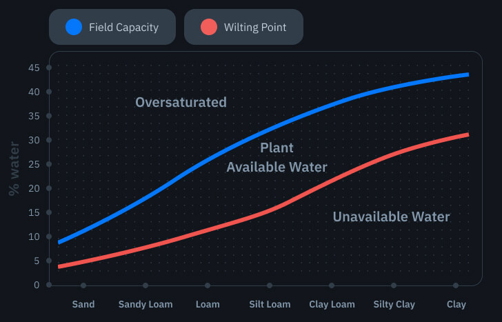

# Home Assistant dashboard: Pientere tuinen


<a href="index"></a>



Here you can find my dashboard elements for the Dutch project "[Pientere tuinen](https://pienteretuinen.nl/)".
A project to monitor the diversity in gardens around the country and make people aware of changes they can make to improve your garden for a better water management, temperature and bio-diversity. 

All this data will be used by different parties to see what the current status in each corner of the country and how to act on the current climate changes.



Garden owners who live in a municipality who work together with the project can subscribe and if they fit in the project they can join and get a soil sensor. The first part of the project is to first track the soil humidity and temperature in the gardens and to see what they can do with this data. 

During the project more and more environmental data will be added for each garden to get a better overview what has impact on your garden experience.

The sensor works with on a lora network. There is no need for a local setup. You get an account for an online dashboard to see your data.

For advanced users, like us, they also provide an api which you can use to integrate it in your own dashboard.



Read more about the project also on their [LinkedIn page](https://nl.linkedin.com/company/pientere-tuinen).

Subscribe [here](https://pienteretuinen.nl/deelnemers/) and hear if you also can join the project.

---
## Table of Contents
<!-- TOC -->
* [Scrape the data](#scrape-the-data)
* [Dashboard](#dashboard)
  * [Used dashboard elements](#used-dashboard-elements)
  * [Project logo with the soil temperature](#project-logo-with-the-soil-temperature)
  * [Gauge with the humidity](#gauge-with-the-humidity)
  * [Soil temperature in a graph](#soil-temperature-in-a-graph)
  * [Soil humidity in a graph](#soil-humidity-in-a-graph)
    * [Static value sensors](#static-value-sensors)
* [Soil type and water levels](#soil-type-and-water-levels)
<!-- TOC -->

---
## Scrape the data

To get the data you need to scrape the api endpoint.

When you joined the project you can read [more details](https://help.wecity.nl/data-api-van-pientere-tuinen) in your own account.

```yaml

# Sourcecode by vdbrink.github.io
# configuration.yaml
rest:
  - scan_interval: 3600
    resource: https://services.platform.wecity.nl/mijn-pientere-tuin/measurements
    headers:
      wecity-api-key: !secret wecity_api_key
    sensor:
      - name: "Mijn Pientere Tuin Temperatuur"
        value_template: "{{ value_json.content[0].temperatureCelsius }}"
        unit_of_measurement: "°C"
        state_class: measurement
      - name: "Mijn Pientere Tuin Vochtigheid"
        value_template: "{{ (value_json.content[0].moisturePercentage | float * 100)|round(2) }}"
        unit_of_measurement: "%"
        state_class: measurement

```

---
## Dashboard

With this data in Home Assistant I created my own dashboard.

---
### Used dashboard elements

These three basic Home Assistant elements did I use.

| name                | link                                                     |
|---------------------|----------------------------------------------------------|
| Picture Entity Card | https://www.home-assistant.io/dashboards/picture-entity/ |
| History Graph Card  | https://www.home-assistant.io/dashboards/history-graph/  |
| Gauge Card          | https://www.home-assistant.io/dashboards/gauge/          |

---

### Project logo with the soil temperature



A Picture Entity Card with the actual soil temperature.

```yaml

# Sourcecode by vdbrink.github.io
# Picture Entity Card Configuration
show_state: true
show_name: true
camera_view: auto
type: picture-entity
image: https://help.wecity.nl/hubfs/pt-logo.jpg
entity: sensor.mijn_pientere_tuin_temperatuur

```

---
### Gauge with the humidity



A Gauge to show if the soil humidity is in a correct range.\
The values depends on your type of soil.

```yaml

# Sourcecode by vdbrink.github.io
# Gauge Card Configuration
type: gauge
entity: sensor.mijn_pientere_tuin_vochtigheid
needle: true
severity:
  green: 23
  yellow: 38
  red: 48
max: 60
unit: '%'

```

---

### Soil temperature in a graph



Show the soil temperature in a graph. 

```yaml

# Sourcecode by vdbrink.github.io
# History Graph Card Configuration
type: history-graph
entities:
- entity: sensor.mijn_pientere_tuin_temperatuur
  hours_to_show: 720

```

---

### Soil humidity in a graph



Show the humidity in a graph. Also with static edge values.

```yaml

# Sourcecode by vdbrink.github.io
# History Graph Card Configuration
type: history-graph
entities:
- entity: sensor.mijn_pientere_tuin_vochtigheid
- entity: sensor.mijn_pientere_tuin_vochtigheid_max
- entity: sensor.mijn_pientere_tuin_vochtigheid_base
- entity: sensor.mijn_pientere_tuin_vochtigheid_min
  hours_to_show: 720

```

#### Static value sensors

Create a sensors with a static values to show a min/max/base line in the graphics. These values are based on clay ground.

See this [private project link](https://help.wecity.nl/bodemvocht-en-grondsoort) which exact values are for your soil.

```yaml

# Sourcecode by vdbrink.github.io
# configuration.yaml or the file pientere_tuinen.yaml in the sensor directory
- sensor:
  - platform: template
    sensors:
      mijn_pientere_tuin_vochtigheid_max:
        friendly_name: "max / too wet"
        value_template: 38
        device_class: 'moisture'
        unit_of_measurement: '%'
      mijn_pientere_tuin_vochtigheid_base:
        friendly_name: "base / stress"
        value_template: 23
        device_class: 'moisture'
        unit_of_measurement: '%'
      mijn_pientere_tuin_vochtigheid_min:
        friendly_name: "min / too dry"
        value_template: 16
        device_class: 'moisture'
        unit_of_measurement: '%'

```

## Soil type and water levels

In this graph you can see that each type of soil has his own levels when it's good for plants to live on.



---
[^^ Top](#table-of-contents)

[<< See also my other Home Assistant pages](index)