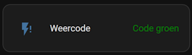
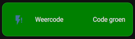

# Home Assistant dashboard: Styling


<a href="index"></a>

Here you find Home Assistant (lovelace) dashboard styling examples which you can easily add to your own dashboards.
<br/><br/><br/>

---
## Table of Contents
<!-- TOC -->
* [Changing icon color](#changing-icon-color)
* [Changing status color](#changing-status-color)
* [Changing background color](#changing-background-color)
<!-- TOC -->

---
## Changing icon color

You can change the color of an icon based on its value.

You need the extra HACS module [lovelace-card-mod](https://github.com/thomasloven/lovelace-card-mod).
Install it via this button
[](https://my.home-assistant.io/redirect/hacs_repository/?owner=thomasloven&repository=lovelace-card-mod&category=integration)


```yaml

# Sourcecode by vdbrink.github.io
# Dashboard card code
type: entities
entities:
  - entity: sensor.knmi_weercode
    tap_action:
      action: url
      url_path: https://www.knmi.nl/nederland-nu/weer/waarschuwingen/overijssel
    card_mod:
      style: |
        :host {
          --card-mod-icon-color:
          
           #008000;
          
           #ff4500;
          
           #ffd700;
          
           #ffa500;
          
           #44739e
          
         }
  
```

---
## Changing status color

You can change the color of the sensor status based on its value.

**Option 1**: Use the extra HACS module [lovelace-card-mod](https://github.com/thomasloven/lovelace-card-mod) Install it via this button
[](https://my.home-assistant.io/redirect/hacs_repository/?owner=thomasloven&repository=lovelace-card-mod&category=integration)



```yaml

# Sourcecode by vdbrink.github.io
# Dashboard card code
type: entities
entities:
  - entity: sensor.knmi_weercode
    tap_action:
      action: url
      url_path: https://www.knmi.nl/nederland-nu/weer/waarschuwingen/overijssel
    card_mod:
      style: |
        .text-content {
         color:
            
             #008000;
            
             #ff4500;
            
             #ffd700;
            
             #ffa500;
            
             #44739e
            
        }
  
```

**Option 2**: Use the HACS module [template-entity-row](homeassistant_dashboard_hacs#template-entity-row)


Repo: https://github.com/thomasloven/lovelace-template-entity-row

Install it via this button
[](https://my.home-assistant.io/redirect/hacs_repository/?owner=thomasloven&repository=lovelace-template-entity-row&category=integration)

```yaml

# Sourcecode by vdbrink.github.io
# Dashboard card code
type: entities
entities:
  - entity: sensor.temp1_temperature
    type: custom:template-entity-row
    state: |
      {{ states(config.entity)|round(0)}} °C
    style: |
      :host {
        --paper-item-icon-color:
         
          firebrick
          orange
          blue
          var(--primary-text-color)
          
         ;
       }
       .state {
         color: 
         
          firebrick
          orange
          blue
          var(--primary-text-color)
          
       }


```

---
## Changing background color

You can change the color of the background based on its value.

You need the extra HACS module [lovelace-card-mod](https://github.com/thomasloven/lovelace-card-mod). Install it via this button
[](https://my.home-assistant.io/redirect/hacs_repository/?owner=thomasloven&repository=lovelace-card-mod&category=integration)



```yaml

# Sourcecode by vdbrink.github.io
# Dashboard card code
type: entities
entities:
  - entity: sensor.knmi_weercode
    tap_action:
      action: url
      url_path: https://www.knmi.nl/nederland-nu/weer/waarschuwingen/overijssel
    card_mod:
      style: |
        .text-content {
         color:
            
             #008000;
            
             #ff4500;
            
             #ffd700;
            
             #ffa500;
            
             #44739e;
            
        }
  
```

---
[^^ Top](#table-of-contents)

[<< See also my other Home Assistant pages](index)