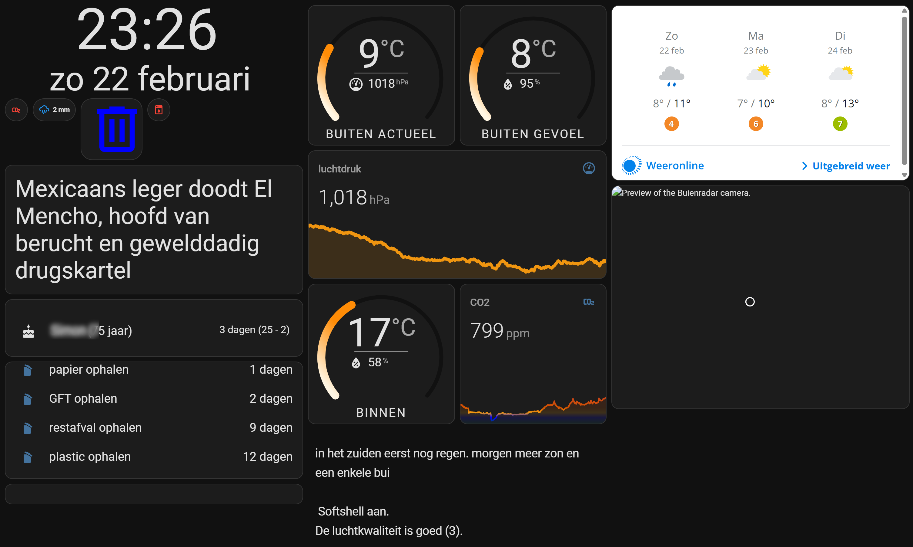

# Home Assistant dashboard:<br>on a tablet in Kiosk mode
*With Fully Kiosk Browser*

<a href="index"></a>
Home Assistant has multiple ways to show you the dashboard.
It has an Android native app which can be used on an Android tablet or phone, or you can browse to the frontend on any device with a browser.
In all these scenarios, you see all Home Assistant side and top menu items, you can edit all screens and see the browser with its url.

If you want to show only the content of a single dashboard, then you need to define this page in [Kiosk mode](#what-is-kiosk-mode).

<a href="images_tablet_in_kiosk_mode/ha_on_tablet_in_kiosk_mode.png">

</a>

---
## Table of Contents
<!-- TOC -->
  * [What is Kiosk mode?](#what-is-kiosk-mode)
  * [Set Home Assistant in Kiosk mode](#set-home-assistant-in-kiosk-mode)
    * [Hide side toolbar](#hide-side-toolbar)
    * [Hide top toolbar](#hide-top-toolbar)
      * [Swipe to other dashboard view](#swipe-to-other-dashboard-view)
<!-- TOC -->

---
## What is Kiosk mode?


A kiosk is a standalone computer with a touchscreen (also like a tablet) which runs a single website.
An example for this purpose is to order a meal in a fast-food restaurant.
When it's in a public place it's also restricted to access to the rest of the computer or browser.

---
## Set Home Assistant in Kiosk mode

By default, you only want to show a single page on the tablet.
Without the default toolbars to navigate to other dashboards.

### Hide side toolbar

It's a setting for the user to hide the side menu by default. 
Select in the side toolbar the last item, the current logged-in user.
The best way is to create a custom user for your tablet and enable the feature to hide the sidebar.


### Hide top toolbar

We want to hide this top menu by default.


<br>

Install the **kiosk-mode** integration via this button\
[](https://my.home-assistant.io/redirect/hacs_repository/?owner=NemesisRE&repository=kiosk-mode&category=integration)

To set these properties, select the three dots in the top right and select `Raw configuration editor`.

 


See all possible configuration parameters at https://github.com/NemesisRE/kiosk-mode

To hide the top bar, only define `hide_header: true` is enough.

```yaml

# Sourcecode by vdbrink.github.io
# Raw configuration editor
kiosk_mode:
  hide_header: true
views:
  ...

```

<br>

To show the top toolbar again to go to the edit mode, add `?disable_km=` to the url.

#### Swipe to other dashboard view

With the HACS integration `Swipe Navigation` you can swipe left/right to still switch to other defined views on the same dashboard without using the extra top toolbar.

Repo: https://github.com/zanna-37/hass-swipe-navigation

Install this integration via this button in your own HA instance
[](https://my.home-assistant.io/redirect/hacs_repository/?owner=zanna-37&repository=hass-swipe-navigation&category=integration)


---

[<< See also my other Home Assistant tips and tricks](index)