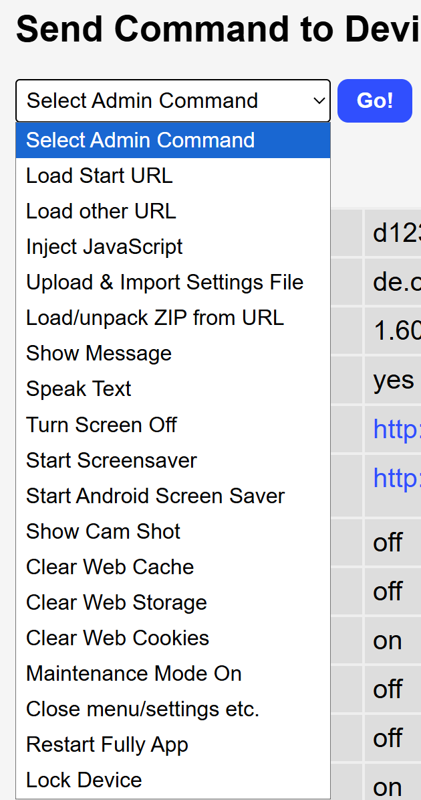
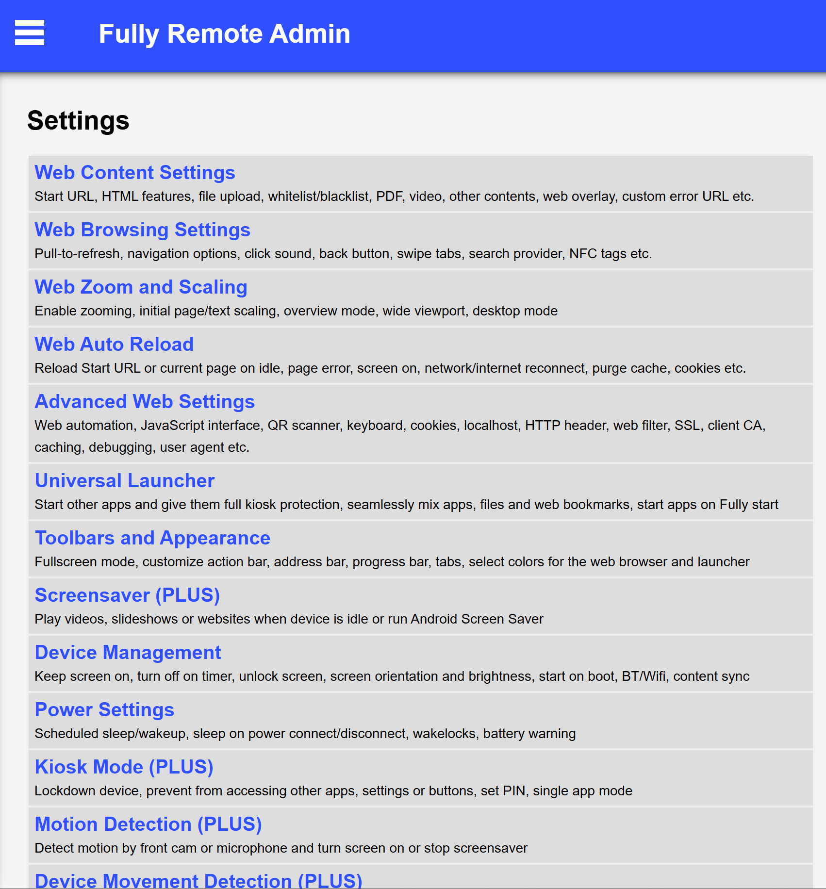
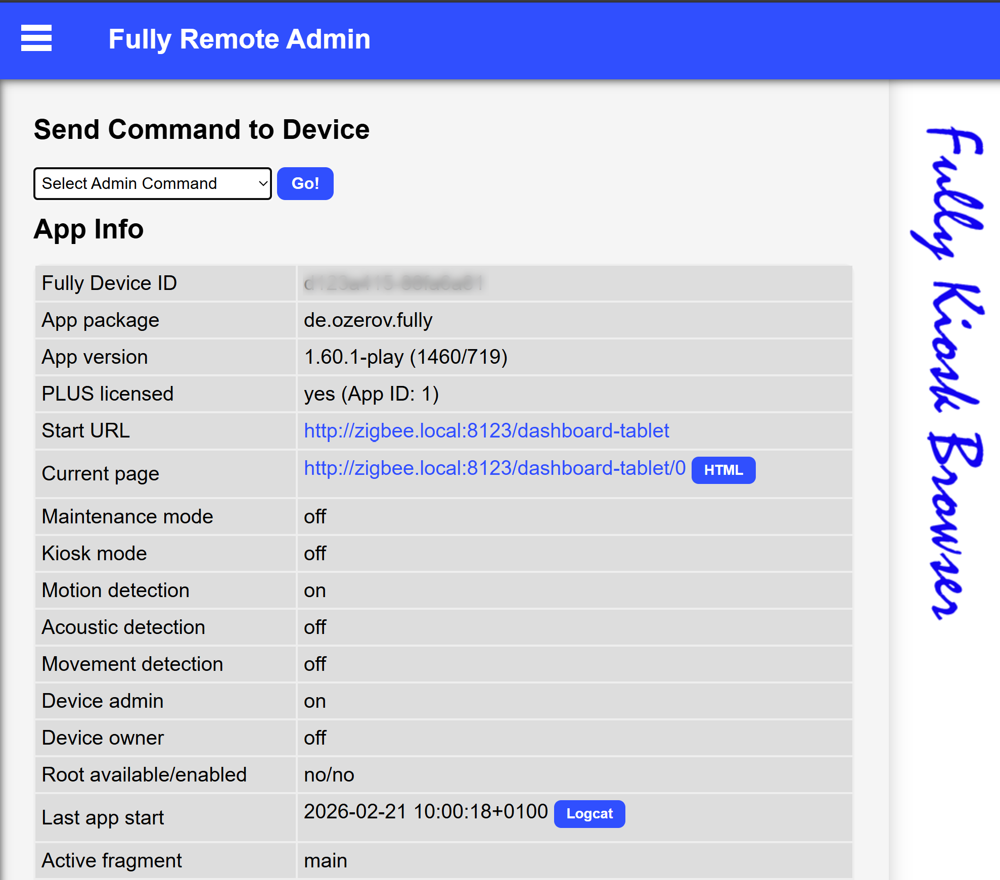
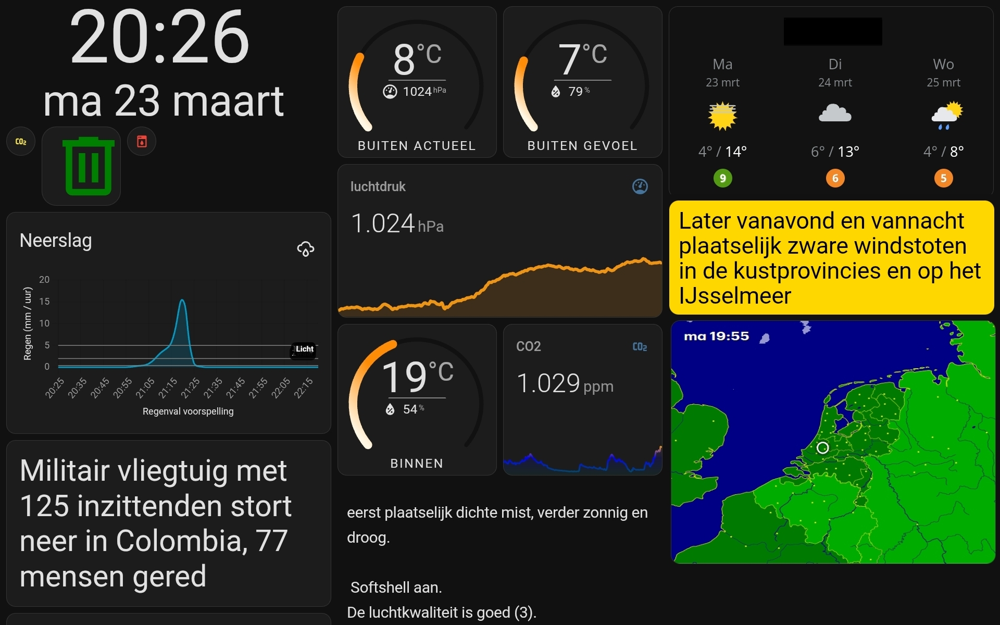

# Home Assistant dashboard:<br>on a tablet in Kiosk mode
*With Fully Kiosk Browser*

<a href="index"></a>
Home Assistant has multiple ways to show you the dashboard.
It has an Android native app which can be used on an Android tablet or phone, or you can browse to the frontend on any device with a browser.
In all these scenarios, you see all Home Assistant side and top menu items, you can edit all screens and see the browser with its url.

If you want to show only the content of a single dashboard, then you need to define this page in [Kiosk mode](#what-is-kiosk-mode).

<a href="images_tablet_in_kiosk_mode/ha_on_tablet_in_kiosk_mode1.png">

</a>
<em>Example of a Home Assistant dashboard on a tablet.</em>

---
## Table of Contents
<!-- TOC -->
  * [What is Kiosk mode?](#what-is-kiosk-mode)
  * [Set Home Assistant in Kiosk mode](#set-home-assistant-in-kiosk-mode)
    * [Hide side toolbar](#hide-side-toolbar)
    * [Hide top toolbar](#hide-top-toolbar)
      * [Swipe to other dashboard view](#swipe-to-other-dashboard-view)
  * [Set a tablet in Kiosk mode](#set-a-tablet-in-kiosk-mode)
    * [Fullscreen browser](#fullscreen-browser)
    * [Android tablet](#android-tablet)
    * [iOS iPad tablet](#ios-ipad-tablet)
  * [Configure Fully Kiosk Browser](#configure-fully-kiosk-browser)
    * [Enable remote admin](#enable-remote-admin)
    * [Auto screen on](#auto-screen-on)
    * [Auto screen off](#auto-screen-off)
    * [Only charge when needed](#only-charge-when-needed)
  * [Create a tablet dashboard](#create-a-tablet-dashboard)
    * [What's on my dashboard](#whats-on-my-dashboard)
      * [Basic elements](#basic-elements)
      * [Optional elements](#optional-elements)
        * [YAML how to make elements conditional](#yaml-how-to-make-elements-conditional)
<!-- TOC -->

---
## What is Kiosk mode?


A kiosk is a standalone computer with a touchscreen (also like a tablet) which runs a single website.
It has only limited functionality.

An example of a kiosk is to order a meal in a fast-food restaurant.\
This is in the background just a website or application with payment functionality attached to it.
When it's in a public place, it's also restricted, without access to the rest of the computer or browser.

In the scope of Home Assistant, we want to have access to a single overview dashboard without menu items.

---
## Set Home Assistant in Kiosk mode

By default, you only want to show a single page on the tablet without the default toolbars to navigate to other dashboards.

### Hide side toolbar

It's a setting for the user to hide the side menu by default.
Select in the side toolbar the last item, the current logged-in user.
This shows a list of settings and one of them is `Always hide the sidebar`.

The best way is to create a custom user for your tablet and enable the feature to hide the sidebar.
Use on your desktop and phone a different user to still show here all the default menu items.


### Hide top toolbar

We want to hide this top menu by default.


<br>

Install the **kiosk-mode** integration via this button\
[](https://my.home-assistant.io/redirect/hacs_repository/?owner=NemesisRE&repository=kiosk-mode&category=integration)

To set these properties, select the three dots in the top right and select `Raw configuration editor`.


See all possible configuration parameters at https://github.com/NemesisRE/kiosk-mode

To hide the top bar, only define `hide_header: true` is enough.

```yaml

# Sourcecode by vdbrink.github.io
# Raw configuration editor
kiosk_mode:
  hide_header: true
views:
  ...

```

<br>

To show the top toolbar again to go to the edit mode, add `?disable_km=` to the url.

#### Swipe to other dashboard view

It's possible if you still want to swipe left/right to go to other defined views on the same dashboard without using the extra top toolbar.

With the HACS integration `Swipe Navigation`

Repo: https://github.com/zanna-37/hass-swipe-navigation

Install this integration via this button in your own HA instance
[](https://my.home-assistant.io/redirect/hacs_repository/?owner=zanna-37&repository=hass-swipe-navigation&category=integration)

---
## Set a tablet in Kiosk mode

You can just open a browser and go to the Home Assistant dashboard url and have this as dashboard.
The downside is that you lose a lot of space on your screen to the OS- and browser controls.
Better is to show only the content of the page in fullscreen.

### Fullscreen browser

Browser does also support kiosk mode by them self.
From a single website, you can create a (Progressive Web) App from every website which hides the browser menus and url.

In Chrome, open the page you want to convert to a single app.
Go to the menu, select `Cast, save and share`, then select `Install page as app...`.

<a href="images_tablet_in_kiosk_mode/chrome_create_app_from_url.png">

</a>

<em>How to create in Chrome an app from a single page.</em>

Now, you only have a small topbar.
And even this can be removed by choosing the `Full screen` option.

<a href="images_tablet_in_kiosk_mode/chrome_run_url_as_app.png">

</a>

<em>Page as app in fullscreen</em>

This app can also be cast to a TV!

### Android tablet

For an Android tablet,
the android app for this purpose which popup everywhere is [Fully Kiosk Browser](#configure-fully-kiosk-browser).

There is a free version with a watermark and has limited functionality.
For [&euro; 7,90 + VAT](https://www.fully-kiosk.com/en/#license) you can buy an unlimited lifetime single pc license.

It's full of features, I use these:
* Define a url to load on startup:
  * Automatically load the latest state of the page on start up.
* Light detection via the camera:
  * Disable the screen if the room is completely dark.
* Nearby detection:
  * Enable the screen when someone is nearby.
* Remote screen on/off via an API call:
  * Enable the screen when someone enters the room.
  * Disable the screen at a certain time or without presence.
* Monitor the battery level:
  * Control a smart socket to load only the battery from 20 to 80%.

[See here the full list of features.](https://www.fully-kiosk.com/en/#configuration)

### iOS iPad tablet

For the iPad, the app [Kiosker: Fullscreen Web Kiosk](https://apps.apple.com/nl/app/kiosker-fullscreen-web-kiosk/id1481691530)
can be used to define a page as a single page to run in kiosk mode.

Do you have better ways for iOS? Please let me know!

---
## Configure Fully Kiosk Browser

The Android app [Fully Kiosk Browser](https://www.fully-kiosk.com/en/#main) can be used to control the tablet from remote.


<a href="images_tablet_in_kiosk_mode/fully_remote_admin_commands.png">

</a>

<a href="images_tablet_in_kiosk_mode/fully_remote_admin_settings.png">

</a>

### Enable remote admin

<a href="images_tablet_in_kiosk_mode/fully_remote_admin.png">

</a>

http://192.168.1.168:2323/home

### Auto screen on


### Auto screen off

### Only charge when needed

---
## Create a tablet dashboard


* Horizontal or vertical?
* Two or three columns?
* Which data do you want to show?
 * Date and time
 * Weather: current, forecast, alarms, temperatures, air pressure
 * Important house states: open doors, windows, CO2 levels, temperatures
 * Camera views
 * Calendar: Trash, birthdays, appointments
 * Latest news

Check [here](/homeassistant/homeassistant_dashboard_stretch_layout#dashboard-elements) or
[here](/homeassistant/homeassistant_dashboard_examples_overview)
for copy-paste examples in these categories.

---
### What's on my dashboard

#### Basic elements

This screenshot is an interactive, clickable image of my dashboard.
You can select a dashboard element and you get redirected to the card details.

<script src="https://code.jquery.com/jquery-3.5.1.min.js" integrity="sha256-9/aliU8dGd2tb6OSsuzixeV4y/faTqgFtohetphbbj0=" crossorigin="anonymous"></script>
<script type="text/javascript" src="https://cdnjs.cloudflare.com/ajax/libs/maphilight/1.4.0/jquery.maphilight.min.js"></script>
<script>
$(function() {
    $('.maparea').maphilight();
});
</script>

<map name="my-dashboard">
  <area
    shape="rect"
    coords="40,0,200,40"
    href="/homeassistant/homeassistant_dashboard_date_time#time-and-date"
    alt="time" />
  <area
    shape="rect"
    coords="30,45,200,75"
    href="/homeassistant/homeassistant_dashboard_date_time#time-and-date"
    alt="date" />
 <area
    shape="rect"
    coords="0,75,230,95"
    href="/homeassistant/homeassistant_dashboard_card_mushroom"
    alt="mushrooms" />
<area
    shape="rect"
    coords="0,95,230,200"
    href="/homeassistant/homeassistant_dashboard_latest_news#news-headline-nunl"
    alt="news headline" />
<area
    shape="rect"
    coords="0,200,230,240"
    href="/homeassistant/homeassistant_dashboard_hacs#birthday-reminder-card"
    alt="upcoming birthdays" />
<area
    shape="rect"
    coords="0,240,230,310"
    href="/homeassistant/homeassistant_hacs_afvalbeheer"
    alt="bin days countdown" />
<!-- second column -->
<area
    shape="rect"
    coords="230,0,460,110"
    href="/homeassistant/homeassistant_dashboard_stretch_layout#flexible-horseshoe-card"
    alt="outside temperature" />
<area
    shape="rect"
    coords="230,110,460,210"
    href="/homeassistant/homeassistant_dashboard_stretch_layout#room-temperature"
    alt="air pressure" />
<area
    shape="rect"
    coords="230,210,350,320"
     href="/homeassistant/homeassistant_dashboard_stretch_layout#flexible-horseshoe-card"
    alt="temp inside" />
<area
    shape="rect"
    coords="350,210,460,320"
    href="/homeassistant/homeassistant_dashboard_stretch_layout#room-temperature"
    alt="CO2" />
<area
    shape="rect"
    coords="230,320,460,400"
    href="/homeassistant/homeassistant_dashboard_card_mushroom#welcome-text-and-weather-forecast-for-today-dutch"
    alt="textual weather" />
<!-- third column -->
<area
    shape="rect"
    coords="460,0,700,140"
    href="/homeassistant/homeassistant_dashboard_weather_nl#weeronline"
    alt="weather forecast" />
<area
    shape="rect"
    coords="460,140,700,310"
    href="/homeassistant/homeassistant_dashboard_weather_nl#rain-radar-animated"
    alt="buienradar" />
</map>

<em>Clickable dashboard: each element is linked to the corresponding code</em>

#### Optional elements

On my dashboard I also have elements which are by default hidden and only visible when it's relevant.

Optional elements are:
* [Rain prediction graph](/homeassistant/homeassistant_dashboard_weather_nl#neerslag-app), only if [rain is expected](/homeassistant/homeassistant_templates#any-rain-expected) the upcoming hours
* [Weather alert text](/homeassistant/homeassistant_dashboard_weather_nl#conditional-weather-alarm-1), only if [there is a weather alarm](/homeassistant/homeassistant_dashboard_weather_nl#conditional-weather-alarm-1)
* [Camera stream](/homeassistant/homeassistant_dashboard_frigate#show-live-rtsp-streams), only if [someone is detected](/homeassistant/homeassistant_dashboard_frigate#front-door-detection-mode) at the front door
* Mushrooms:
    * [Bigger trash can icon](/homeassistant/homeassistant_dashboard_card_mushroom#bigger-icon), if [tomorrow is bin day](/homeassistant/homeassistant_templates#is-tomorrow-a-trash-bin-day)
    * CO2 incorrect
    * Rain amount fallen
    * Nice to sit outside

<br>

<map name="my-dashboard-conditional">
  <area
    shape="rect"
    coords="40,0,200,55"
    href="/homeassistant/homeassistant_dashboard_date_time#time-and-date"
    alt="time" />
  <area
    shape="rect"
    coords="30,50,200,90"
    href="/homeassistant/homeassistant_dashboard_date_time#time-and-date"
    alt="date" />
 <area
    shape="rect"
    coords="35,85,85,145"
    href="/homeassistant/homeassistant_dashboard_card_mushroom#bigger-icon"
    alt="mushrooms" />
<area
    shape="rect"
    coords="0,145,230,300"
    href="/homeassistant/"
    alt="rain expected" />
<area
    shape="rect"
    coords="0,300,230,460"
    href="/homeassistant/homeassistant_dashboard_latest_news#news-headline-nunl"
    alt="news headline" />
<!-- second column -->
<area
    shape="rect"
    coords="230,5,460,115"
    href="/homeassistant/homeassistant_dashboard_stretch_layout#flexible-horseshoe-card"
    alt="outside temperature" />
<area
    shape="rect"
    coords="230,115,460,220"
    href="/homeassistant/homeassistant_dashboard_stretch_layout#room-temperature"
    alt="air pressure" />
<area
    shape="rect"
    coords="230,220,350,330"
     href="/homeassistant/homeassistant_dashboard_stretch_layout#flexible-horseshoe-card"
    alt="temp inside" />
<area
    shape="rect"
    coords="350,220,460,330"
    href="/homeassistant/homeassistant_dashboard_stretch_layout#room-temperature"
    alt="CO2" />
<area
    shape="rect"
    coords="230,330,460,410"
    href="/homeassistant/homeassistant_dashboard_card_mushroom#welcome-text-and-weather-forecast-for-today-dutch"
    alt="textual weather" />
<!-- third column -->
<area
    shape="rect"
    coords="460,0,700,135"
    href="/homeassistant/homeassistant_dashboard_weather_nl#weeronline"
    alt="weather forecast" />
<area
    shape="rect"
    coords="460,135,700,220"
    href="/homeassistant/homeassistant_dashboard_weather_nl#conditional-weather-alarm-2"
    alt="weather alarm" />
<area
    shape="rect"
    coords="460,220,700,400"
    href="/homeassistant/homeassistant_dashboard_weather_nl#rain-radar-animated"
    alt="buienradar" />
</map>

<em>Clickable dashboard: each element is linked to the corresponding code</em>

##### YAML how to make elements conditional

For each condition you need a sensor with a boolean state, which is `true` when the element should be visible and `false` when it should be hidden. If this doesn't exist yet, you can create this with a template binary sensor. I have a page with many examples of how to create these sensors: [Home Assistant templates](/homeassistant/homeassistant_templates).

This is how you can define a conditional **Mushroom** element.

You need the boolean sensor [waste_tomorrow](/homeassistant/homeassistant_templates#is-tomorrow-a-trash-bin-day) for this condition.

```yaml

# Sourcecode by vdbrink.github.io
# Dashboard card code
- type: custom:mushroom-chips-card
  chips:
    - type: conditional
      conditions:
        - entity: sensor.waste_tomorrow
          state: "true"
      chip:
        type: template
        entity: sensor.cyclus_gft
        icon: mdi:trash-can-outline
        content: ""

```

This is how you can define a conditional **camera stream** element.

You need the boolean sensor [frontdoor_detection_mode](/homeassistant/homeassistant_dashboard_frigate#front-door-detection-mode) for this condition.

```yaml

# Sourcecode by vdbrink.github.io
# Dashboard card code
- type: conditional
  conditions:
      - condition: state
        entity: input_boolean.frontdoor_detection_mode
        state: "on"
  card:
    type: custom:webrtc-camera
    url: rtsp://....

```

---

See also my [other examples of dashboard elements](/homeassistant/homeassistant_dashboard_examples_overview).
