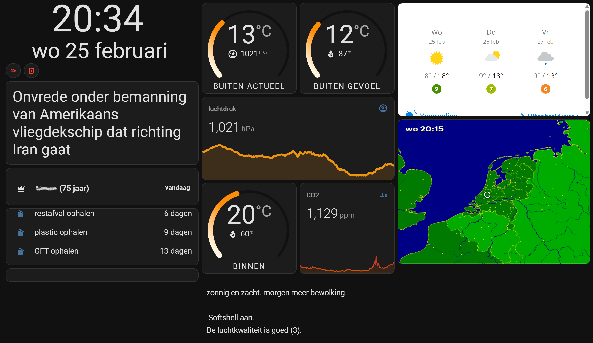
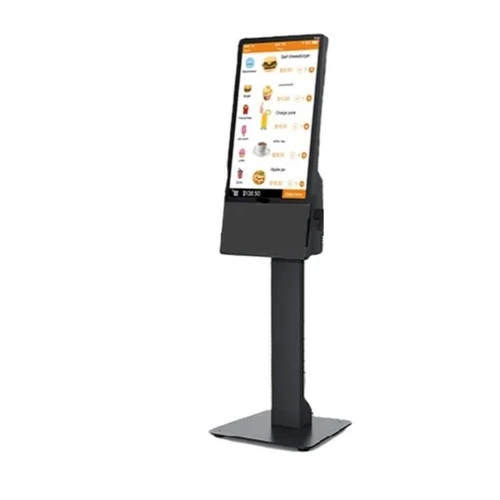
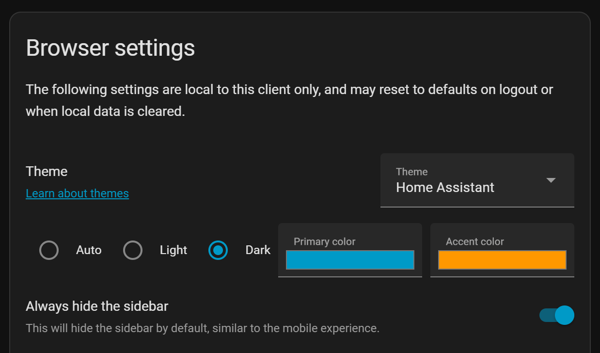
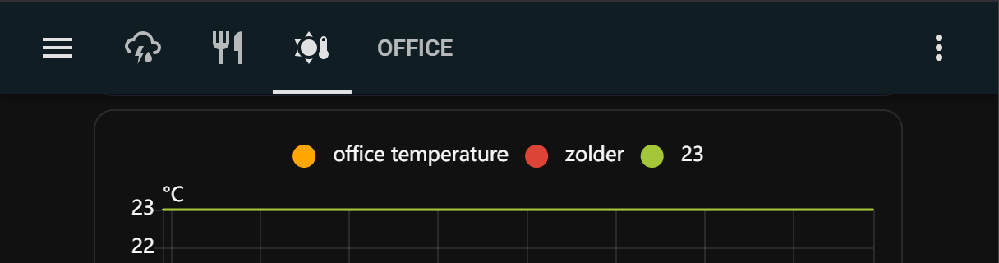
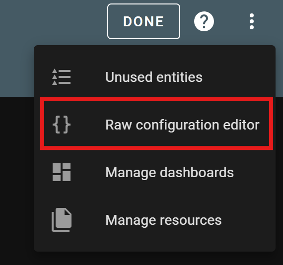
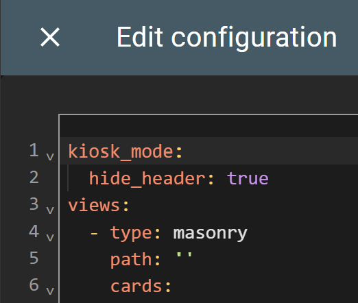
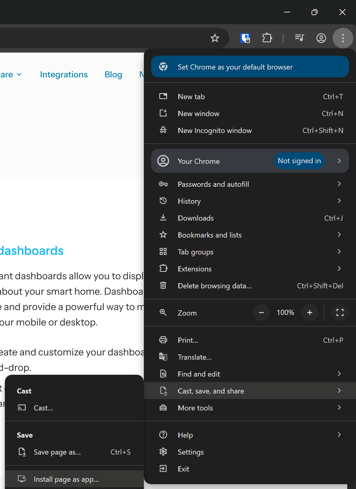
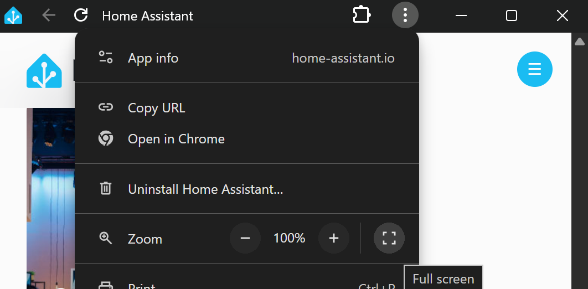

# Home Assistant dashboard:<br>on a tablet in Kiosk mode
*With Fully Kiosk Browser*

<a href="index"></a>
Home Assistant has multiple ways to show you the dashboard.
It has an Android native app which can be used on an Android tablet or phone, or you can browse to the frontend on any device with a browser.
In all these scenarios, you see all Home Assistant side and top menu items, you can edit all screens and see the browser with its url.

If you want to show only the content of a single dashboard, then you need to define this page in [Kiosk mode](#what-is-kiosk-mode).

<a href="images_tablet_in_kiosk_mode/ha_on_tablet_in_kiosk_mode1.png">

</a>
<em>Example of a Home Assistant dashboard on a tablet.</em>

---
## Table of Contents
<!-- TOC -->
  * [What is Kiosk mode?](#what-is-kiosk-mode)
  * [Set Home Assistant in Kiosk mode](#set-home-assistant-in-kiosk-mode)
    * [Hide side toolbar](#hide-side-toolbar)
    * [Hide top toolbar](#hide-top-toolbar)
      * [Swipe to other dashboard view](#swipe-to-other-dashboard-view)
  * [Set a tablet in Kiosk mode](#set-a-tablet-in-kiosk-mode)
    * [Fullscreen browser](#fullscreen-browser)
    * [Android tablet](#android-tablet)
    * [iOS iPad tablet](#ios-ipad-tablet)
<!-- TOC -->

---
## What is Kiosk mode?


A kiosk is a standalone computer with a touchscreen (also like a tablet) which runs a single website.
It has only limited functionality.

An example of a kiosk is to order a meal in a fast-food restaurant.\
This is in the background just a website or application with payment functionality attached to it. 
When it's in a public place, it's also restricted, without access to the rest of the computer or browser.

In the scope of Home Assistant, we want to have access to a single overview dashboard without menu items.

---
## Set Home Assistant in Kiosk mode

By default, you only want to show a single page on the tablet without the default toolbars to navigate to other dashboards.

### Hide side toolbar

It's a setting for the user to hide the side menu by default. 
Select in the side toolbar the last item, the current logged-in user.
This shows a list of settings and one of them is `Always hide the sidebar`.

The best way is to create a custom user for your tablet and enable the feature to hide the sidebar.
Use on your desktop and phone a different user to still show here all the default menu items. 



### Hide top toolbar

We want to hide this top menu by default.



<br>

Install the **kiosk-mode** integration via this button\
[](https://my.home-assistant.io/redirect/hacs_repository/?owner=NemesisRE&repository=kiosk-mode&category=integration)

To set these properties, select the three dots in the top right and select `Raw configuration editor`.

 


See all possible configuration parameters at https://github.com/NemesisRE/kiosk-mode

To hide the top bar, only define `hide_header: true` is enough.

```yaml

# Sourcecode by vdbrink.github.io
# Raw configuration editor
kiosk_mode:
  hide_header: true
views:
  ...

```

<br>

To show the top toolbar again to go to the edit mode, add `?disable_km=` to the url.

#### Swipe to other dashboard view

It's possible if you still want to swipe left/right to go to other defined views on the same dashboard without using the extra top toolbar.

With the HACS integration `Swipe Navigation`

Repo: https://github.com/zanna-37/hass-swipe-navigation

Install this integration via this button in your own HA instance
[](https://my.home-assistant.io/redirect/hacs_repository/?owner=zanna-37&repository=hass-swipe-navigation&category=integration)

---
## Set a tablet in Kiosk mode

You can just open a browser and go to the Home Assistant dashboard url and have this as dashboard. 
The downside is that you lose a lot of space on your screen to the OS- and browser controls.
Better is to show only the content of the page in fullscreen.

### Fullscreen browser

Browser does also support kiosk mode by them self.
From a single website, you can create a (Progressive Web) App from every website which hides the browser menus and url.

In Chrome, open the page you want to convert to a single app.
Go to the menu, select `Cast, save and share`, then select `Install page as app...`.

<a href="images_tablet_in_kiosk_mode/chrome_create_app_from_url.png">

</a>

<em>How to create in Chrome an app from a single page.</em>

Now, you only have a small topbar. 
And even this can be removed by choosing the `Full screen` option.
<a href="images_tablet_in_kiosk_mode/chrome_run_url_as_app.png">

</a>

<em>Page as app in fullscreen</em>

This app can also be cast to a TV!

### Android tablet

For an Android tablet, the android app for this purpose which popup everywhere is [Fully Kiosk Browser](https://www.fully-kiosk.com/en/#main).

There is a free version with a watermark and has limited functionality.
For [&euro; 7,90 + VAT](https://www.fully-kiosk.com/en/#license) you can buy an unlimited lifetime single pc license.

It's full of features, I use these:
* Define a url to load on startup
  * Automatically load the latest state of the page on start up.
* Light detection via the camera
  * Disable the screen if the room is completely dark.
* Nearby detection
  * Enable the screen when someone is nearby.
* Remote screen on/off via an API call
  * Enable the screen when someone enters the room.
  * Disable the screen at a certain time or without presence.
* Monitor the battery level
  * Control a smart socket to load only the battery from 20 to 80%.

[See here the full list of features.](https://www.fully-kiosk.com/en/#configuration)

### iOS iPad tablet

For the iPad, the app [Kiosker: Fullscreen Web Kiosk](https://apps.apple.com/nl/app/kiosker-fullscreen-web-kiosk/id1481691530)
can be used to define a page as a single page to run in kiosk mode.

Do you have better ways for iOS? Please let me know!

---

[<< See also my other Home Assistant tips and tricks](index)