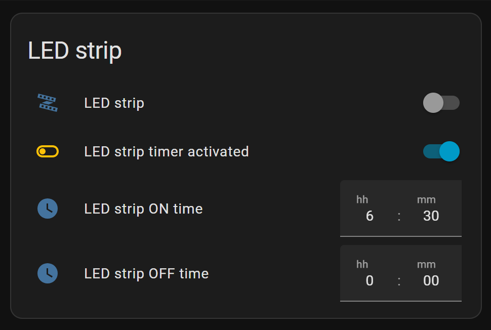
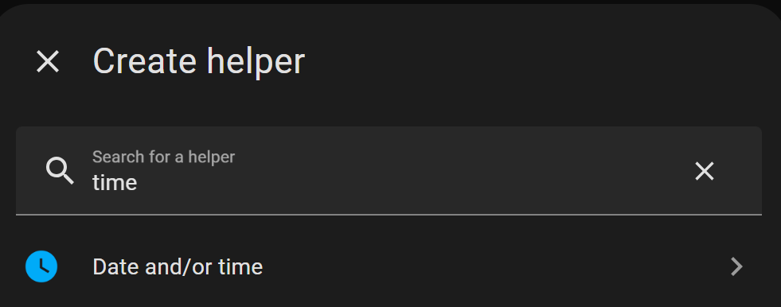
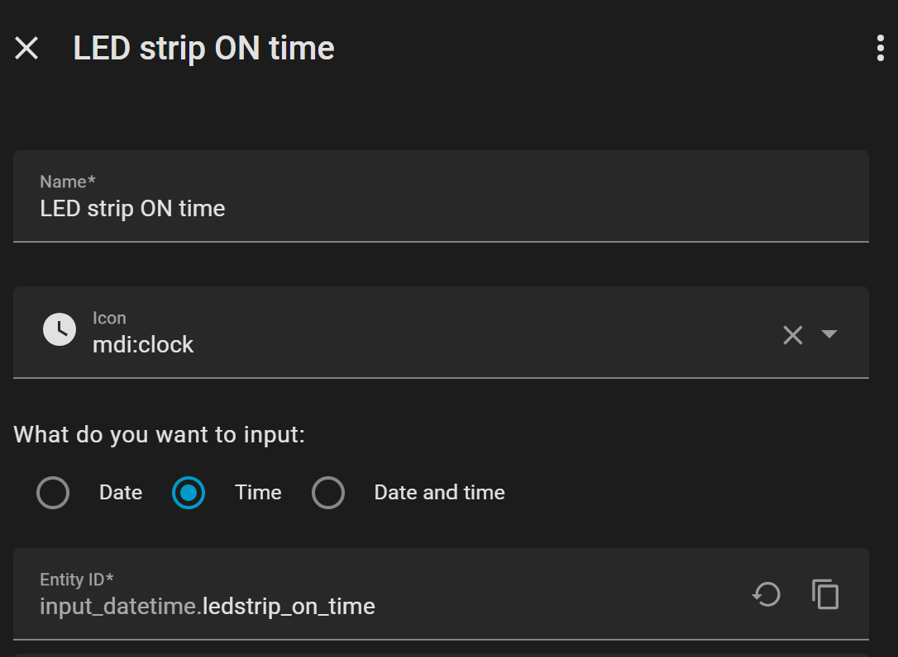
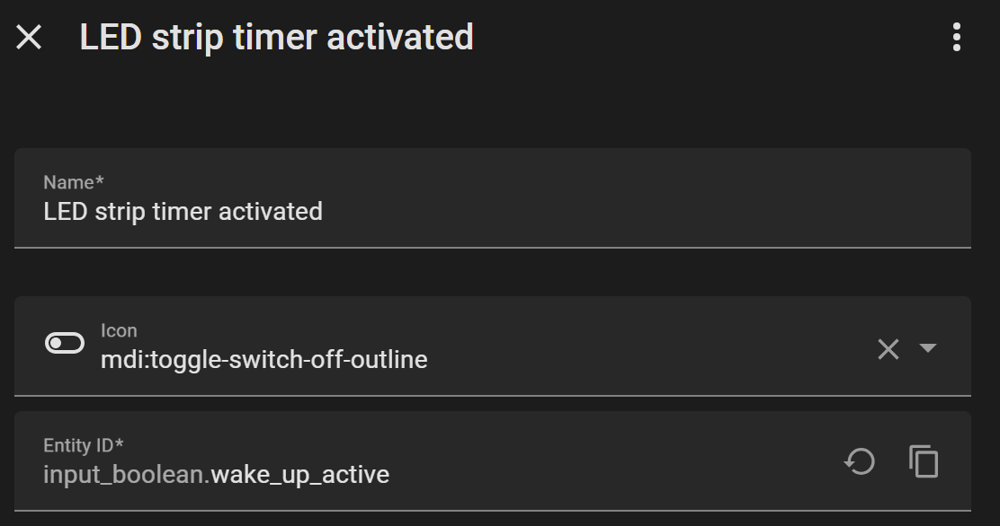
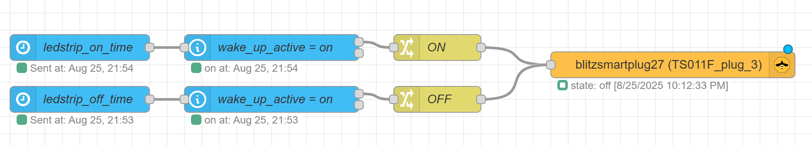
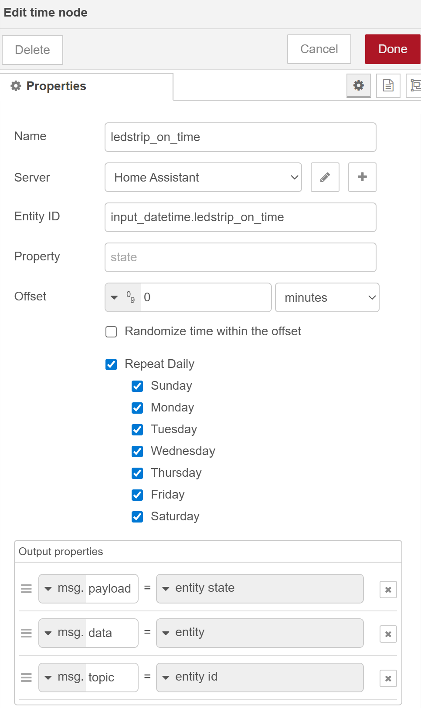
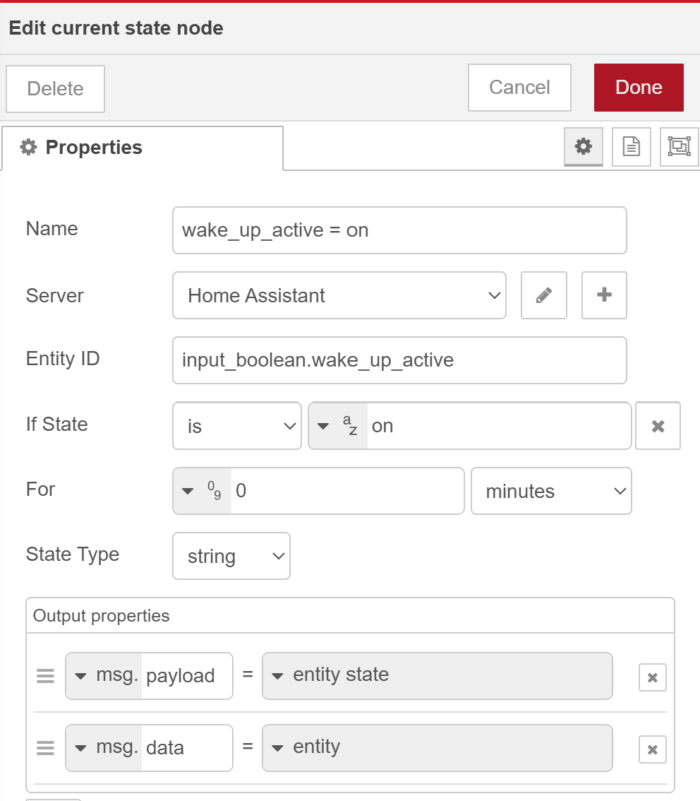

# Home Assistant dashboard:<br>Wake-up alarm light

<a href="index"></a>

Here you find an explanation of a Home Assistant dashboard with an alarm timer on it which can be changed via the dashboard itself.
This way dashboard users can make modifications to the ON and OFF time of an entity.

This can be used, for example, as wake-up alarm light.



---
## Table of Contents
<!-- TOC -->
  * [Hardware](#hardware)
  * [Home Assistant config](#home-assistant-config)
    * [Dashboard](#dashboard)
    * [Entities](#entities)
      * [Timer helper entities](#timer-helper-entities)
      * [Boolean helper entity](#boolean-helper-entity-)
    * [Automation](#automation)
<!-- TOC -->

---

## Hardware

The hardware I used for this project is a dump LED strip, modified to work direct on power without a switch and controlled by a [smart socket](/buy/smart_home_best_buy_tips#smart-socket).
As alternative a [smart LED strip](/buy/smart_home_best_buy_tips#led-strip) controlled by Zigbee/WiFi can also be used for it.

With a [smart wireless button](/buy/smart_home_best_buy_tips#portable-button) it's possible to manually control the LED strip state.

---

## Home Assistant config

To define the timer and (de)activate toggle on the dashboard customer helpers are used.

### Dashboard

This is how the final dashboard looks like:


This is the corresponding YAML code:

```yaml

# Sourcecode by vdbrink.github.io
# Dashboard Entities card configuration
type: entities
entities:
  - entity: switch.blitzsmartplug_led
  - entity: input_boolean.wake_up_active
  - entity: input_datetime.ledstrip_on_time
  - entity: input_datetime.ledstrip_off_time
state_color: true
title: LED strip
show_header_toggle: false

```

---
### Entities

The dashboard is build up of four entities:

* An entity to control the LED strip.
  * In this case `switch.blitzsmartplug_led`
* A helper entity for the time the LED strip will be turned ON.
  * In this case `input_datetime.ledstrip_on_time`
* A helper entity for the time the LED strip will be turned OFF.
  * In this case `input_datetime.ledstrip_off_time`
* (Optional) A helper entity to skip the timer.
  * In this case `input_boolean.wake_up_active`

In the next chapters I'll explain how to create these helpers.


#### Timer helper entities

Go to the **Settings** menu item,
then go to **Devices and Services** and select **Helpers** in the top bar.\
This button directly opens the **Helpers** page in your Home Assistant:

[](https://my.home-assistant.io/redirect/helpers/)

Select the bottom-right button `+ CREATE HELPER`,
select **Template** then **Date and/or time**.\



Give it a name (this will also automatically be used for the entity name).\
Optional select an icon, like `mdi:clock`.\
Select the input type **Time**.



Follow the same steps for the OFF helper entity.

#### Boolean helper entity 

For the extra helper to skip the ON/OFF timer (on a free day).

Create a new helper and this one should be of the type **Boolean**.\
This entity has two states: `true` for active, `false` for inactive.



---
### Automation

I have my automations in [Node-RED](/node-red).\
There I use the created HA helpers as Node in my automation flows.

The first flow is build up with these nodes:
* HA time node which is triggered at the defined ON time.
* HA current state node which checks of the flow should continue or stop.
* Change node to set the state `ON` to the payload.
* Zigbee2MQTT out node where the smart socket or LED-strip is defined.

The second flow is build up with these nodes:
* HA time node which is triggered at the defined OFF time.
* HA current state node which checks of the flow should continue or stop.
* Change node to set the state `OFF` to the payload.
* Zigbee2MQTT out node where the smart socket or LED-strip is defined.

<a href="images_date_time/node_red_ha_timers.png">

</a>

This is the config of the first HA time node:



This is the config of the second HA current state node:



The corresponding Node-RED code is:

```yaml

[{"id":"fe336467d8c9e5e7","type":"tab","label":"LED strip dashboard timer","disabled":false,"info":"","env":[]},{"id":"0458588aeb772415","type":"ha-time","z":"fe336467d8c9e5e7","name":"ledstrip_on_time","server":"969e9e50.88897","version":3,"exposeAsEntityConfig":"","entityId":"input_datetime.ledstrip_on_time","property":"","offset":"0","offsetType":"num","offsetUnits":"minutes","randomOffset":false,"repeatDaily":true,"outputProperties":[{"property":"payload","propertyType":"msg","value":"","valueType":"entityState"},{"property":"data","propertyType":"msg","value":"","valueType":"entity"},{"property":"topic","propertyType":"msg","value":"","valueType":"triggerId"}],"sunday":true,"monday":true,"tuesday":true,"wednesday":true,"thursday":true,"friday":true,"saturday":true,"x":100,"y":200,"wires":[["19ad4e20fd4bd0e6"]]},{"id":"a95bd8de81466cf6","type":"ha-time","z":"fe336467d8c9e5e7","name":"ledstrip_off_time","server":"969e9e50.88897","version":3,"exposeAsEntityConfig":"","entityId":"input_datetime.ledstrip_off_time","property":"","offset":"0","offsetType":"num","offsetUnits":"minutes","randomOffset":false,"repeatDaily":true,"outputProperties":[{"property":"payload","propertyType":"msg","value":"","valueType":"entityState"},{"property":"data","propertyType":"msg","value":"","valueType":"entity"},{"property":"topic","propertyType":"msg","value":"","valueType":"triggerId"}],"sunday":false,"monday":true,"tuesday":true,"wednesday":true,"thursday":true,"friday":true,"saturday":false,"x":100,"y":260,"wires":[["0d6d1a13fa8cdd83"]]},{"id":"19ad4e20fd4bd0e6","type":"api-current-state","z":"fe336467d8c9e5e7","name":"wake_up_active = on","server":"969e9e50.88897","version":3,"outputs":2,"halt_if":"on","halt_if_type":"str","halt_if_compare":"is","entity_id":"input_boolean.wake_up_active","state_type":"str","blockInputOverrides":false,"outputProperties":[{"property":"payload","propertyType":"msg","value":"","valueType":"entityState"},{"property":"data","propertyType":"msg","value":"","valueType":"entity"}],"for":"0","forType":"num","forUnits":"minutes","override_topic":false,"state_location":"payload","override_payload":"msg","entity_location":"data","override_data":"msg","x":320,"y":200,"wires":[["ba2620444a93c308"],[]]},{"id":"0d6d1a13fa8cdd83","type":"api-current-state","z":"fe336467d8c9e5e7","name":"wake_up_active = on","server":"969e9e50.88897","version":3,"outputs":2,"halt_if":"on","halt_if_type":"str","halt_if_compare":"is","entity_id":"input_boolean.wake_up_active","state_type":"str","blockInputOverrides":false,"outputProperties":[{"property":"payload","propertyType":"msg","value":"","valueType":"entityState"},{"property":"data","propertyType":"msg","value":"","valueType":"entity"}],"for":"0","forType":"num","forUnits":"minutes","override_topic":false,"state_location":"payload","override_payload":"msg","entity_location":"data","override_data":"msg","x":320,"y":260,"wires":[["113c0428cf1ff845"],[]]},{"id":"ba2620444a93c308","type":"change","z":"fe336467d8c9e5e7","name":"ON","rules":[{"t":"set","p":"payload","pt":"msg","to":"ON","tot":"str"}],"action":"","property":"","from":"","to":"","reg":false,"x":510,"y":200,"wires":[["a7f5291a94c9c1e5"]]},{"id":"113c0428cf1ff845","type":"change","z":"fe336467d8c9e5e7","name":"OFF","rules":[{"t":"set","p":"payload","pt":"msg","to":"OFF","tot":"str"}],"action":"","property":"","from":"","to":"","reg":false,"x":510,"y":260,"wires":[["a7f5291a94c9c1e5"]]},{"id":"a7f5291a94c9c1e5","type":"zigbee2mqtt-out","z":"fe336467d8c9e5e7","name":"blitzsmartplug_led","server":"4ec1da88.92f82c","friendly_name":"blitzsmartplug_led (TS011F_plug_3)","device_id":"0xb0c7defffe5ecdf9","command":"state","commandType":"z2m_cmd","payload":"payload","payloadType":"msg","optionsValue":"","optionsType":"nothing","x":750,"y":200,"wires":[]},{"id":"e6d720a35e80d0e0","type":"mqtt in","z":"fe336467d8c9e5e7","name":"","topic":"zigbee2mqtt/button","qos":"0","datatype":"json","broker":"7527d055.ed7e2","nl":false,"rap":false,"inputs":0,"x":110,"y":140,"wires":[["409bab4984395b68"]]},{"id":"409bab4984395b68","type":"change","z":"fe336467d8c9e5e7","name":"toggle","rules":[{"t":"set","p":"payload","pt":"msg","to":"toggle","tot":"str"}],"action":"","property":"","from":"","to":"","reg":false,"x":510,"y":142,"wires":[["a7f5291a94c9c1e5"]]},{"id":"392c626c1e2e3696","type":"comment","z":"fe336467d8c9e5e7","name":"vdbrink.github.io","info":"","x":100,"y":100,"wires":[]},{"id":"969e9e50.88897","type":"server","name":"Home Assistant","version":5,"addon":false,"rejectUnauthorizedCerts":true,"ha_boolean":"y|yes|true|on|home|open","connectionDelay":false,"cacheJson":true,"heartbeat":false,"heartbeatInterval":"30","areaSelector":"friendlyName","deviceSelector":"friendlyName","entitySelector":"friendlyName","statusSeparator":"at: ","statusYear":"hidden","statusMonth":"short","statusDay":"numeric","statusHourCycle":"h23","statusTimeFormat":"h:m","enableGlobalContextStore":true},{"id":"4ec1da88.92f82c","type":"zigbee2mqtt-server","name":"mosquitto","host":"mosquitto","mqtt_port":"1883","mqtt_username":"x","mqtt_password":"y","mqtt_qos":"0","tls":"","usetls":false,"base_topic":"zigbee2mqtt"},{"id":"7527d055.ed7e2","type":"mqtt-broker","name":"","broker":"mosquitto","port":"1883","tls":"bbaa4676.58e4c8","clientid":"node-red-client","autoConnect":true,"usetls":false,"protocolVersion":"5","keepalive":"60","cleansession":false,"autoUnsubscribe":true,"birthTopic":"","birthQos":"0","birthPayload":"","birthMsg":{},"closeTopic":"","closePayload":"","closeMsg":{},"willTopic":"","willQos":"0","willPayload":"","willMsg":{},"userProps":"","sessionExpiry":""},{"id":"bbaa4676.58e4c8","type":"tls-config","name":"","cert":"","key":"","ca":"","certname":"m2mqtt_srv.crt","keyname":"m2mqtt_srv.key","caname":"m2mqtt_ca.crt","servername":"","verifyservercert":false},{"id":"e076735f496c3f06","type":"global-config","env":[],"modules":{"node-red-contrib-home-assistant-websocket":"0.59.0","node-red-contrib-zigbee2mqtt":"2.7.1"}}]

```

---

[<< See also my other Home Assistant tips and tricks](index)