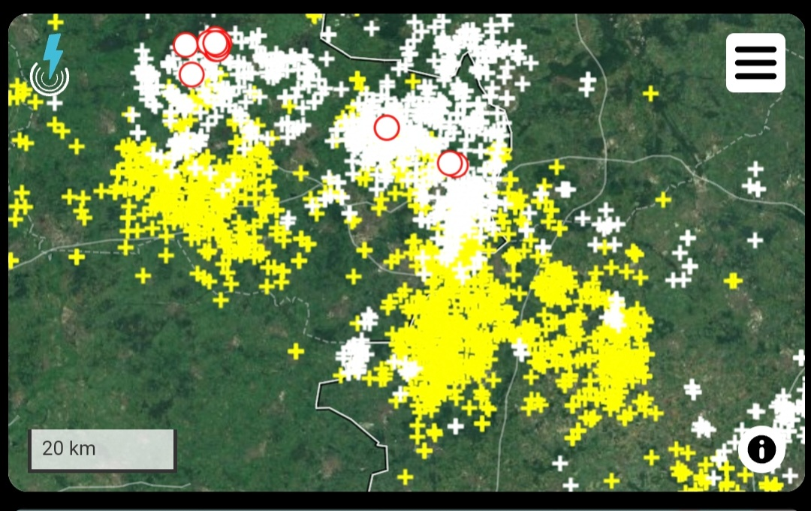

# Home Assistant dashboard: Weather

<a href="index"></a>

Here you can find dashboard for weather examples for your own dashboard.
<br/>
<br/>
<br/>
<br/>

---

## Lightning and thunderstorm

Show an iframe with the realtime lightning and thunderstorm activities from blitzortung.org.



```yaml

# Sourcecode by vdbrink.github.io
# Dashboard
type: iframe
url: >-
https://map.blitzortung.org/index.php?interactive=0&NavigationControl=0&FullScreenControl=0&Cookies=0&InfoDiv=0&MenuButtonDiv=1&ScaleControl=1&LinksCheckboxChecked=1&LinksRangeValue=10&MapStyle=0&MapStyleRangeValue=0&Advertisment=#7.5/52.2273/6.866
aspect_ratio: '1:0.6'

```

> I'm only looking for the query parameter to accept the cookies.
Do you know how to accept then? [Please let me know.](https://github.com/vdbrink/vdbrink.github.io/issues)

---
[<< Back to the Home Assistant index page](index)