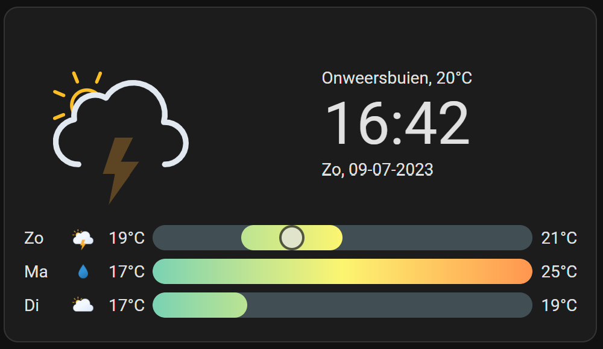
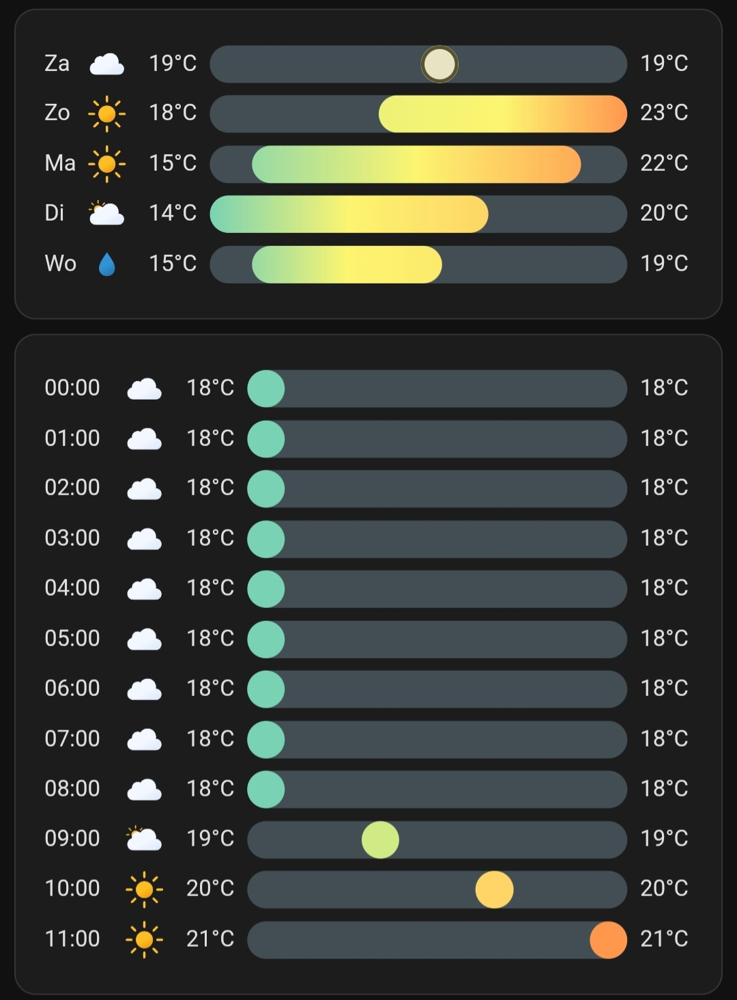

# Home Assistant dashboard: Weather

<a href="index"></a>

Here you can find weather related examples for your own dashboard.

[Here](homeassistant_dashboard_weather_nl) you can also find Dutch weather elements.

---
## Table of Contents
<!-- TOC -->
  * [Lightning and thunderstorm](#lightning-and-thunderstorm)
  * [Outside pressure, good vs bad](#outside-pressure-good-vs-bad)
  * [HACS Clock weather card](#hacs-clock-weather-card)
  * [Kleenex pollen radar Integration](#kleenex-pollen-radar-integration)
<!-- TOC -->

---

## Lightning and thunderstorm

Show an iframe with the realtime lightning and thunderstorm activities from blitzortung.org.


```yaml

# Sourcecode by vdbrink.github.io
# Dashboard card code
type: iframe
url: >-
https://map.blitzortung.org/index.php?interactive=0&NavigationControl=0&FullScreenControl=0&Cookies=0&InfoDiv=0&MenuButtonDiv=1&ScaleControl=1&LinksCheckboxChecked=1&LinksRangeValue=10&MapStyle=0&MapStyleRangeValue=0&Advertisment=#10/52.100676/5.168668
aspect_ratio: '1:0.6'

```

## Outside pressure, good vs bad

A template that indicates good or bad based on a threshold value.

```yaml

# Sourcecode by vdbrink.github.io
# Dashboard card code
- platform: template
  sensors:
    temp_pressure_ok:
      friendly_name: "temp_pressure_ok"
      value_template: >-
        
          good
        
          bad
        

```

---

## HACS Clock weather card



Install the HACS [**clock-weather-card**](https://github.com/pkissling/clock-weather-card#readme) integration via this button
[](https://my.home-assistant.io/redirect/hacs_repository/?owner=pkissling&repository=clock-weather-card&category=integration)

```yaml

# Sourcecode by vdbrink.github.io
# Dashboard card code
type: custom:clock-weather-card
entity: weather.home
forecast_days: 3
locale: nl
time_format: 24
date_pattern: P
hide_today_section: false
hide_forecast_section: false

```

<a name="clock-weather-card-per-hour"></a>

This card is highly customizable.
To show more days, no clock and also the expected weather per weather hour.



This is the corresponding code:

```yaml

# Sourcecode by vdbrink.github.io
# Dashboard card code
type: custom:clock-weather-card
entity: weather.forecast_home
forecast_days: 5
locale: nl
time_format: 24
hide_clock: true
date_pattern: ""
hide_today_section: true
hide_forecast_section: false
hourly_forecast: true
forecast_rows: 12

```

---

## Kleenex pollen radar Integration


Check out my [dedicated page](homeassistant_hacs_kleenex) about this integration.

---

[Dutch weather elements >>](homeassistant_dashboard_weather)

[<< See also my other Home Assistant tips and tricks](index)