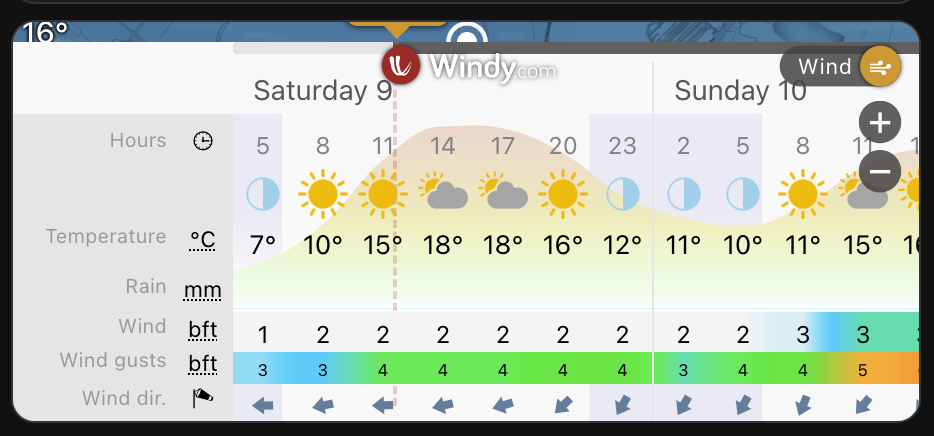
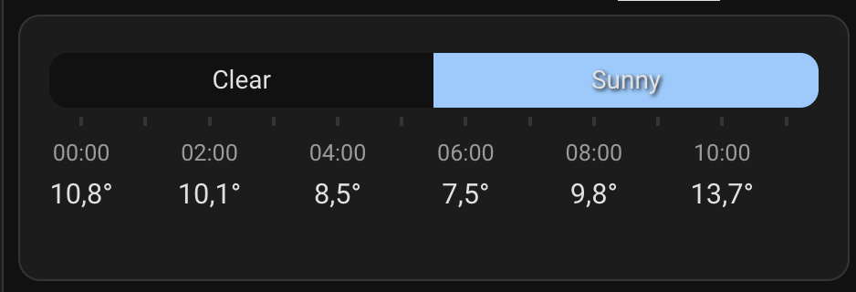
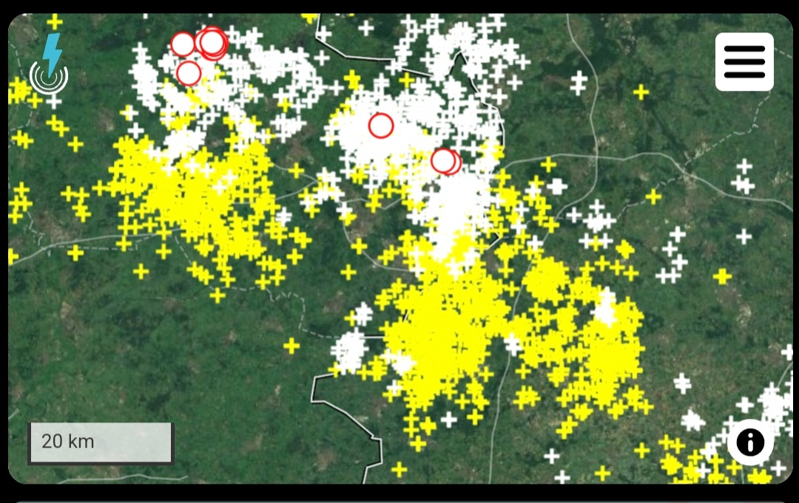

# Home Assistant dashboard: Weather

<a href="index"></a>

Here you can find different examples of weather forecast dashboard cards with copy-paste YAML code.

Most of the cards are highly configurable, check the source site for all possible parameters which fits your needs the best.

---
## Table of Contents
<!-- TOC -->
  * [Weather Chart Card](#weather-chart-card)
  * [Animated weather card](#animated-weather-card)
  * [Clock weather card](#clock-weather-card)
  * [Windy.com compact forecast](#windycom-compact-forecast)
  * [Hourly Weather Card](#hourly-weather-card)
  * [Kleenex pollen radar Integration](#kleenex-pollen-radar-integration)
  * [Lightning and thunderstorm](#lightning-and-thunderstorm)
  * [Outside pressure, good vs bad](#outside-pressure-good-vs-bad)
<!-- TOC -->

---
## Weather Chart Card

### Example 1

With current weather conditions and forecast for the upcoming hours.


Install this HACS [**Weather Chart Card**](https://github.com/mlamberts78/weather-chart-card?tab=readme-ov-file#weather-chart-card) integration via this button
[](https://my.home-assistant.io/redirect/hacs_repository/?owner=mlamberts78&repository=weather-chart-card&category=integration)

With no extra parameters defined you get a full card with available data.

```yaml

# Sourcecode by vdbrink.github.io
# Dashboard card code
type: custom:weather-chart-card
entity: weather.home

```

### Example 2

If you want to customize the presentation it can get a complete different look, and you can (de)active elements.

E.g. only with forecast data and an alternative presentation style.


Install this HACS [**Weather Chart Card**](https://github.com/mlamberts78/weather-chart-card?tab=readme-ov-file#weather-chart-card) integration via this button
[](https://my.home-assistant.io/redirect/hacs_repository/?owner=mlamberts78&repository=weather-chart-card&category=integration)

```yaml

# Sourcecode by vdbrink.github.io
# Dashboard card code
type: custom:weather-chart-card
entity: weather.forecast_home
forecast:
  style: style2
  round_temp: true
  condition_icons: false
  show_wind_forecast: false
show_main: false
show_attributes: false

```

---
## Animated Weather Card

This Animated Weather Card comes with current weather conditions and the predictions for the coming days.


Install the HACS [**Animated Weather Card**](https://github.com/bramkragten/weather-card) integration via this button.\
[](https://my.home-assistant.io/redirect/hacs_repository/?owner=bramkragten&repository=weather-card&category=integration)

```yaml

# Sourcecode by vdbrink.github.io
# Dashboard card code
type: custom:weather-card
entity: weather.yourweatherentity
current: true
details: false
forecast: true
hourly_forecast: false
number_of_forecasts: 5

```

---
## Clock Weather Card

Animated weather icon, with current weather and a temperature forecast with min/max temperature bars for the upcoming days.


Install the HACS [**Clock Weather Card**](https://github.com/pkissling/clock-weather-card#readme) integration via this button
[](https://my.home-assistant.io/redirect/hacs_repository/?owner=pkissling&repository=clock-weather-card&category=integration)

```yaml

# Sourcecode by vdbrink.github.io
# Dashboard card code
type: custom:clock-weather-card
entity: weather.home
forecast_days: 3
locale: nl
time_format: 24
date_pattern: P
hide_today_section: false
hide_forecast_section: false

```

<a name="clock-weather-card-per-hour"></a>

This card is highly customizable.
To show more days, no clock and also the expected weather per weather hour.


This is the corresponding code:

```yaml

# Sourcecode by vdbrink.github.io
# Dashboard card code
type: custom:clock-weather-card
entity: weather.forecast_home
forecast_days: 5
locale: nl
time_format: 24
hide_clock: true
date_pattern: ""
hide_today_section: true
hide_forecast_section: false
hourly_forecast: true
forecast_rows: 12

```

---
## Windy.com compact forecast

Show an iframe with a very compact presentation but with much information for the upcoming hours.
Clouds/sunny, position of the sun, temperature, rain, wind force, wind gust, wind direction, 



Replace in this YAML code the longitude and latitude values (2x) for the weather at your location.
```yaml

# Sourcecode by vdbrink.github.io
# Dashboard card code
type: iframe
url: https://embed.windy.com/embed2.html?lat=52.000&lon=4.000&detailLat=52.000&detailLon=4.000&width=650&height=180&zoom=11&level=surface&overlay=wind&product=ecmwf&menu=&message=true&marker=&calendar=now&pressure=&type=map&location=coordinates&detail=true&metricWind=bft&metricTemp=%C2%B0C&radarRange=-1
aspect_ratio: 44%

```

---
## Hourly Weather Card

The forecast in a bar and with the temperature per hour.



Install the HACS [**Hourly Weather Card**](https://github.com/pkissling/clock-weather-card#readme) integration via this button
[](https://my.home-assistant.io/redirect/hacs_repository/?owner=decompil3d&repository=lovelace-hourly-weather&category=integration)

```yaml

# Sourcecode by vdbrink.github.io
# Dashboard card code
type: custom:hourly-weather
entity: weather.forecast_home
show_precipitation_probability: true
show_precipitation_amounts: true
show_wind: "false"
name: " "

```

---
## Kleenex pollen radar Integration

Pollen integration with intensity for weeds, grasses and trees for today.


Check out my [dedicated page](homeassistant_hacs_kleenex) about this integration for more cards with multi day forecast.
And graphs with details different types of pollen per type of trees.

---
## Lightning and thunderstorm

Show an iframe with the realtime lightning and thunderstorm activities from blitzortung.org.



```yaml

# Sourcecode by vdbrink.github.io
# Dashboard card code
type: iframe
url: https://map.blitzortung.org/index.php?interactive=0&NavigationControl=0&FullScreenControl=0&Cookies=0&InfoDiv=0&MenuButtonDiv=1&ScaleControl=1&LinksCheckboxChecked=1&LinksRangeValue=10&MapStyle=0&MapStyleRangeValue=0&Advertisment=#10/52.100676/5.168668
aspect_ratio: '1:0.6'

```

---
## Outside pressure, good vs bad

A template that indicates good or bad based on a threshold value.

```yaml

# Sourcecode by vdbrink.github.io
# Dashboard card code
- platform: template
  sensors:
    temp_pressure_ok:
      friendly_name: "temp_pressure_ok"
      value_template: >-
        
          good
        
          bad
        

```

---

[Dutch focused weather cards >>](homeassistant_dashboard_weather)

[<< See also my other Home Assistant tips and tricks](index)