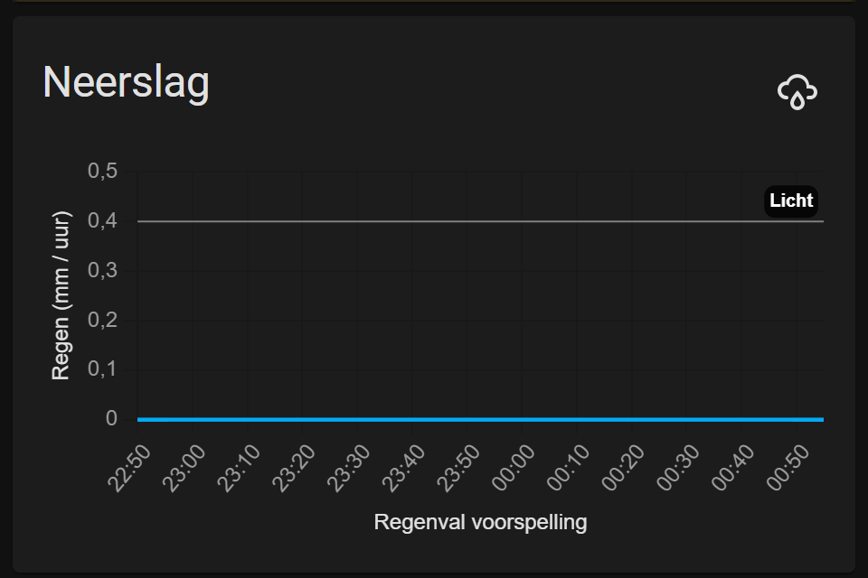
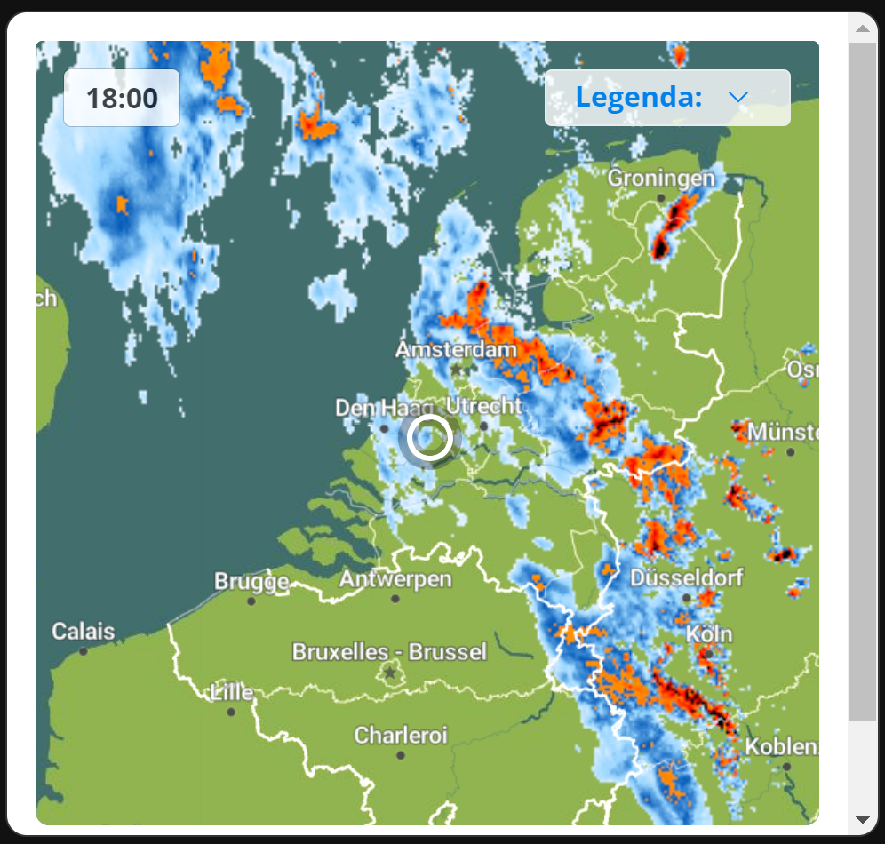
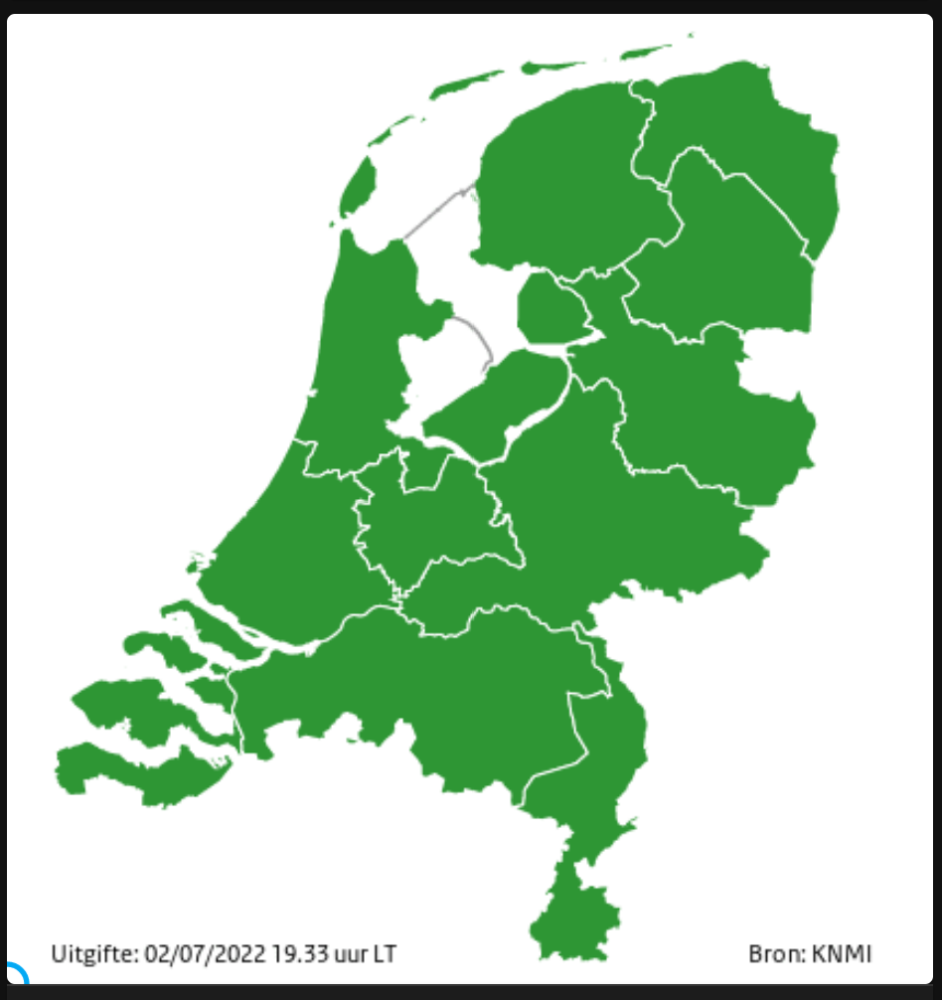
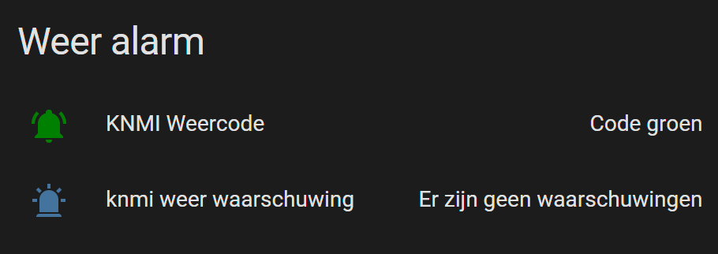
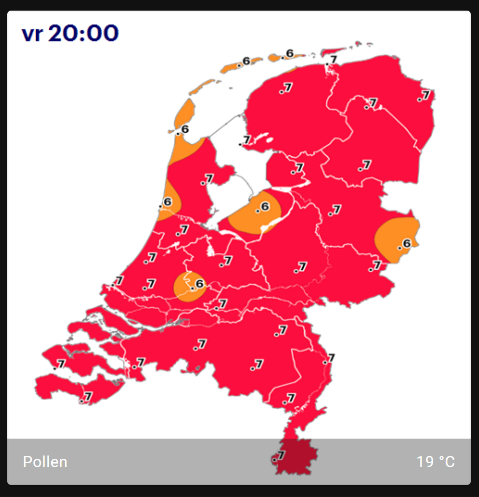
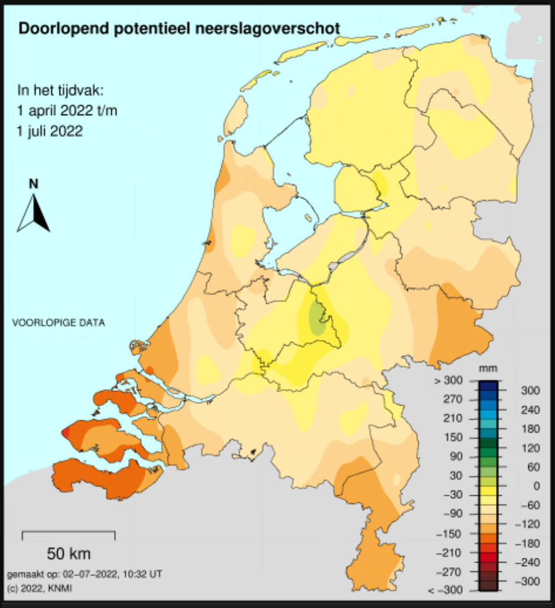

# Home Assistant dashboard: Weather in The Netherlands


Here you can find dashboard related to the weather in the Netherlands.

There are a lot of weather sites who service weather data on the web or in apps.
We can use that data also to show direct on our Home Assistant dashboards.

---
## Table of Contents

* [Rain radar](#rain-radar)
* [Rain radar animated](#rain-radar-animated)
* [Weather alarm map](#weather-alarm-map)
* [Weather alarm](#weather-alarm)
    * [Conditional weather alarm](#conditional-weather-alarm)
* [Pollen](#pollen)
    * [image 1](#image-1)
    * [Image 2](#image-2)
* [Precipitation surplus (neerslagoverschot)](#precipitation-surplus-neerslagoverschot)
* [Bike/BBQ/Terrace weather score upcoming days](#bikebbqterrace-weather-score-upcoming-days)

---
## Rain radar

Source: Buienradar and Buienalarm



```yaml

# Sourcecode by vdbrink.github.io
# Dashboard
type: custom:neerslag-card
title: Neerslag
entities:
  - sensor.neerslag_buienalarm_regen_data
  - sensor.neerslag_buienradar_regen_data

```
---

## Rain radar animated 

Source: Weeronline

An animated image of 2 hours prediction of the rain in steps of 5 minutes.



```yaml

# Sourcecode by vdbrink.github.io
# Dashboard
type: iframe
url: https://www.weeronline.nl/widget/radar?id=135
aspect_ratio: '1.06'

```
---

## Weather alarm map

Source: KNMI

Alarm code colors per province.



```yaml

# Sourcecode by vdbrink.github.io
# Dashboard
type: picture-elements
image: https://cdn.knmi.nl/knmi/map/general/waarschuwing_land_48_new.gif
elements:
- type: image
  title: Weercode
  tap_action:
  action: url
  url_path: https://knmi.nl

```
---

## Weather alarm

Source: KNMI

Read the weather alarm code and description from the KNMI.nl site.



First you need to define a scraper to scrape every 10 minutes the latest alarm code and text.

```yaml

# Sourcecode by vdbrink.github.io
# configuration.yaml
- platform: scrape
  resource: https://www.knmi.nl/nederland-nu/weer/waarschuwingen/overijssel
  select: "div.alert__heading"
  name: "knmi weercode"
  scan_interval: 600

- platform: scrape
  resource: https://www.knmi.nl/nederland-nu/weer/waarschuwingen/overijssel
  select: "a.alert__description"
  name: "knmi weer waarschuwing"
  scan_interval: 600

```
This is the corresponding code for the screenshot.

The custom CSS color styling is done with the module [lovelace-card-mod](https://github.com/thomasloven/lovelace-card-mod)

```yaml

# Sourcecode by vdbrink.github.io
# Dashboard
type: entities
title: Weer alarm
entities:
    - entity: sensor.knmi_weercode
      name: KNMI Weercode
      icon: mdi:bell-ring
      card_mod:
          style: |
          :host {
              --card-mod-icon-color:
              
                #008000;
              
                #ffd700;
              
                #ffa500;
              
                #ff4500;
              
                #44739e
              
          }
    - entity: sensor.knmi_weer_waarschuwing
      icon: mdi:alarm-light
show_header_toggle: true
state_color: true

```

### Conditional weather alarm

You can add this data also to your `Important data panel` and only show this information when it's not code green.
The text is also clickable to open the corresponding site with more info.

```yaml

# Sourcecode by vdbrink.github.io
# Dashboard
- type: conditional
  conditions:
    - entity: sensor.knmi_weercode
      state_not: Code groen
  row:
    entity: sensor.knmi_weercode
    tap_action:
      action: url
      url_path: >-
        https://www.knmi.nl/nederland-nu/weer/waarschuwingen/overijssel  
- type: conditional
  conditions:
    - entity: sensor.knmi_weercode
      state_not: Code groen
  row:
    entity: sensor.knmi_weer_waarschuwing
    tap_action:
      action: url
      url_path: >-
        https://www.knmi.nl/nederland-nu/weer/waarschuwingen/overijssel

```

---
## Pollen

### image 1
Source: Pollennieuws

Show the actual pollen intensity image.


This is the basic variant which show only the image.
```yaml

# Sourcecode by vdbrink.github.io
# Dashboard
type: picture-elements
image: https://pollennieuws.nl/weerkaart/KaartNL_280-website.png

```

In this version it's possible to also click on the image to open the Pollennieuws website.

You have to place the [overlay image black.png](images/black.png) in the Home Assistant `www` directory first.

```yaml

# Sourcecode by vdbrink.github.io
# Dashboard
type: picture-elements
image: https://pollennieuws.nl/weerkaart/KaartNL_280-website.png
elements:
- type: image
  title: Pollennieuws
  tap_action:
    action: url
    url_path: https://pollennieuws.nl
  image: /local/black.png
  aspect_ratio: 1x1
  style:
    top: 0%
    left: 0%
    height: 200%
    width: 228%
    opacity: 0%

```

### Image 2

Source: Buienradar

Show the actual pollen intensity image from another source.



Another way to show an image is with the image entity card.
Here you can also add some text and an entity, like the current outside temperature.

```yaml

# Sourcecode by vdbrink.github.io
# Dashboard
show_state: false
show_name: true
camera_view: auto
type: picture-entity
image: https://api.buienradar.nl/image/1.0/pollenradarhourlynl?w=500&h=512
entity: sensor.outside_temp_rounded
name: Pollen
tap_action:
  action: url
  url_path: https://www.buienradar.nl/nederland/gezondheid/pollen

```
---

## Precipitation surplus (neerslagoverschot)

Source: KNMI

Image with the precipitation surplus (neerslagoverschot) for (the last) 3 months.



```yaml

# Sourcecode by vdbrink.github.io
# Dashboard
type: picture-elements
image: >-
  https://cdn.knmi.nl/knmi/map/page/klimatologie/geografische-overzichten/rdev/rdev_geografisch.png
elements:
  - type: image
    title: Neerslagoverschot

```
---

## Bike/BBQ/Terrace weather score upcoming days

Source: Weerplaza

An iframe with a compact presentation of the weather for the next 3 or 5 days and a score for different type of activities.


Find more widgets at [https://www.weerplaza.nl/weerwidgets/](https://www.weerplaza.nl/weerwidgets/)

```yaml

# Sourcecode by vdbrink.github.io
# Dashboard
type: iframe
url: https://www.weerplaza.nl/weerwidgets/activiteit/?YT1maWV0cyZnaWQ9NTU3NQ==
aspect_ratio: 60%
title: fietsweer

```

---
Consider a donation if this is useful for you, via [PayPal](https://www.paypal.me/revdbrink)

---
[<< Back to the Home Assistant index page](index)