# Home Assistant dashboard: Weather in The Netherlands


<a href="index"></a>

Here you can find dashboard related to the weather in the Netherlands.

There are a lot of weather sites that provide weather data on the web or in apps.
We can also use that data to show directly on our Home Assistant dashboards.

<a href="index">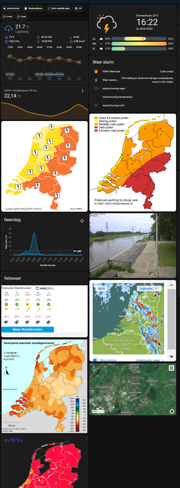</a>

---
## Table of Contents
<!-- TOC -->
  * [Neerslag App](#neerslag-app)
  * [Animated weather predictions](#animated-weather-predictions)
  * [Weather predictions](#weather-predictions)
  * [Rain expected value](#rain-expected-value)
  * [Rain radar animated](#rain-radar-animated)
    * [Buienradar with residence marker](#buienradar-with-residence-marker)
    * [Weeronline](#weeronline)
      * [3 days weather predictions](#3-days-weather-predictions)
      * [Rain Radar](#rain-radar)
  * [Weather alarm map](#weather-alarm-map)
  * [Weather alarm](#weather-alarm)
    * [Weather alarm with colored icon](#weather-alarm-with-colored-icon)
    * [Conditional weather alarm 1](#conditional-weather-alarm-1)
    * [Conditional weather alarm 2](#conditional-weather-alarm-2)
  * [Pollen](#pollen)
    * [image](#image)
    * [Kleenex pollen radar Integration](#kleenex-pollen-radar-integration)
  * [Precipitation surplus (neerslagoverschot)](#precipitation-surplus-neerslagoverschot)
  * [Bike/BBQ/Terrace weather score upcoming days](#bikebbqterrace-weather-score-upcoming-days)
<!-- TOC -->

---
## Neerslag App

Show expected rain from the possible Dutch sources Buienalarm and Buienradar.


Repo: [https://github.com/aex351/home-assistant-neerslag-app](https://github.com/aex351/home-assistant-neerslag-app)

Install this integration via this button in your own Home Assistant instance.\
[](https://my.home-assistant.io/redirect/hacs_repository/?owner=aex351&repository=home-assistant-neerslag-app&category=integration)

```yaml

# Sourcecode by vdbrink.github.io
# Dashboard card code
type: custom:neerslag-card
title: Neerslag
entities:
- sensor.neerslag_buienalarm_regen_data
- sensor.neerslag_buienradar_regen_data

```

<!--
Based on the Buienalarm data, I created [multiple sensors](/homeassistant/homeassistant_templates#rain-conditions)
to indicate when:
* [It starts with light/medium/heavy rain](/homeassistant/homeassistant_templates#time-when-heavy-rain-is-expected)
* [At what time it will be dry again](/homeassistant/homeassistant_templates#time-when-it-becomes-dry-again)
* [Expected rain amount](/homeassistant/homeassistant_templates#expected-rain-amount)

Take also a look at these templates.
-->

---
## Animated weather predictions

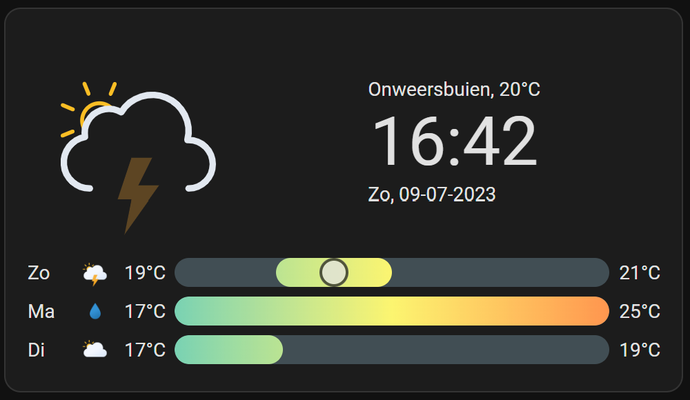

Install the HACS [**clock-weather-card**](https://github.com/pkissling/clock-weather-card#readme) integration via this button
[](https://my.home-assistant.io/redirect/hacs_repository/?owner=pkissling&repository=clock-weather-card&category=integration)

```yaml

# Sourcecode by vdbrink.github.io
# Dashboard card code
type: custom:clock-weather-card
entity: weather.home
forecast_days: 3
locale: nl
time_format: 24
date_pattern: P
hide_today_section: false
hide_forecast_section: false

```

This card is highly customizable.
To show more days, no clock and also the expected weather per weather hour.

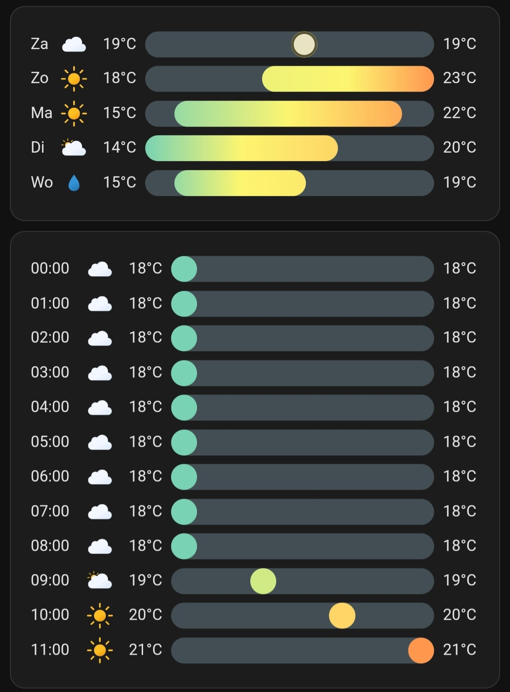

This is the corresponding code:

```yaml

# Sourcecode by vdbrink.github.io
# Dashboard card code
type: custom:clock-weather-card
entity: weather.forecast_home
forecast_days: 5
locale: nl
time_format: 24
hide_clock: true
date_pattern: ""
hide_today_section: true
hide_forecast_section: false
hourly_forecast: true
forecast_rows: 12

```

---
## Weather predictions

Nice overview of the current weather predictions.

Install the HACS [**weather-chart-card**](https://github.com/mlamberts78/weather-chart-card?tab=readme-ov-file#weather-chart-card) integration via this button
[](https://my.home-assistant.io/redirect/hacs_repository/?owner=mlamberts78&repository=weather-chart-card&category=integration)

### Example 1

With current weather conditions.

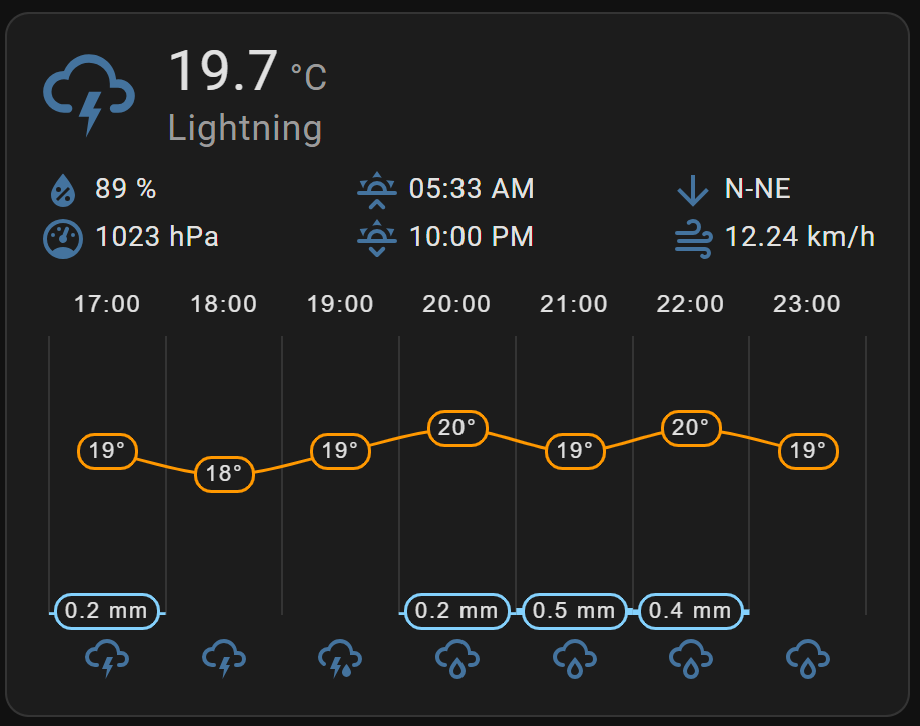

```yaml

# Sourcecode by vdbrink.github.io
# Dashboard card code
type: custom:weather-chart-card
entity: weather.home

```

### Example 2

Only with forecast data and alternative style 2.

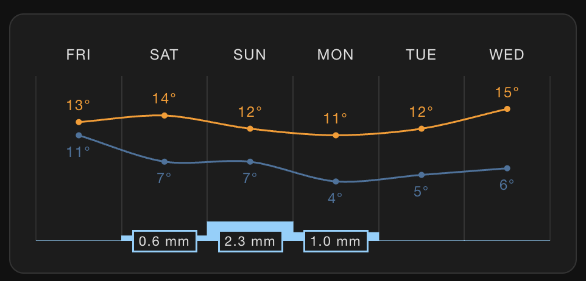

```yaml

# Sourcecode by vdbrink.github.io
# Dashboard card code
type: custom:weather-chart-card
entity: weather.forecast_home
forecast:
  style: style2
  round_temp: true
  condition_icons: false
  show_wind_forecast: false
show_main: false
show_attributes: false

```

---
## Rain expected value

Based on the Buienalarm data: a number how much rain is expected.

```yaml

# Sourcecode by vdbrink.github.io
# Dashboard card code
- platform: template
  sensors:
    buienalarm_rain_expected:
      friendly_name: "rain expected"
      value_template: >-
        
        
        
          
        
        {{ total_precip }}

```

---

## Rain radar animated

### Buienradar with residence marker

Buienradar has a Home Assistant [integration](https://www.home-assistant.io/integrations/buienradar/) which contains, next to weather entities, also an animation of the rain expectation for The Netherlands.

*I added myself an extra residence marker to it !!!!*

#### Result

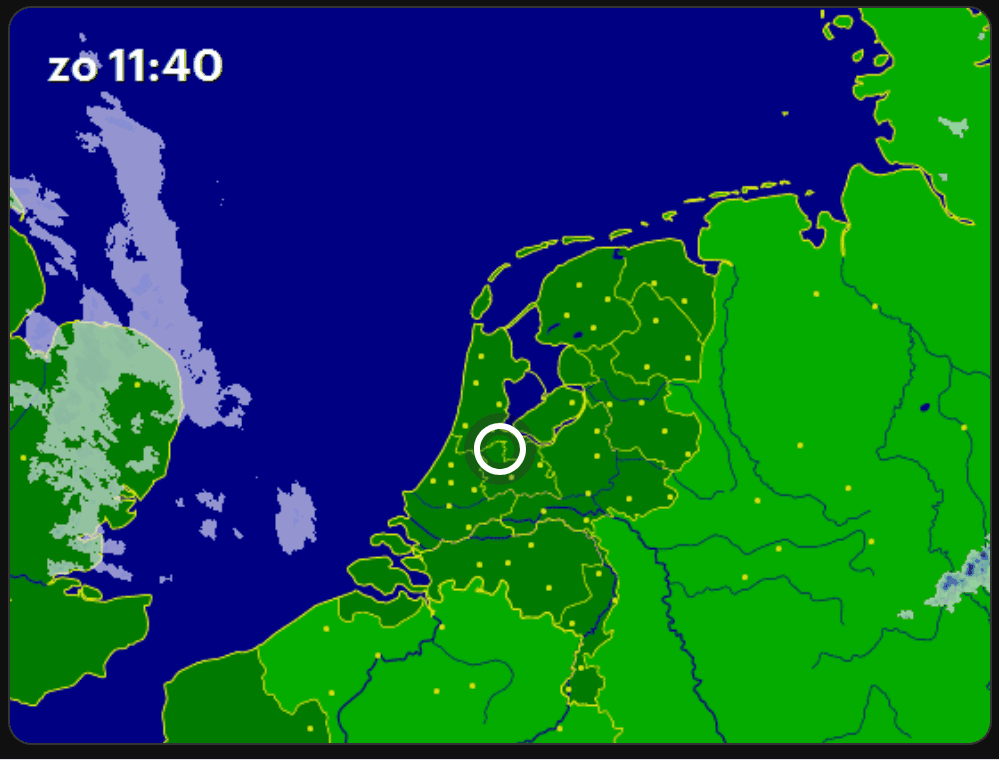

#### Installation

You need to install the `Buienradar` integration with this button
[](https://my.home-assistant.io/redirect/config_flow_start/?domain=buienradar)

#### Enable the radar entity

Enable the Buienradar radar entity `camera.buienradar`, this one is disabled by default.

See how to do this:

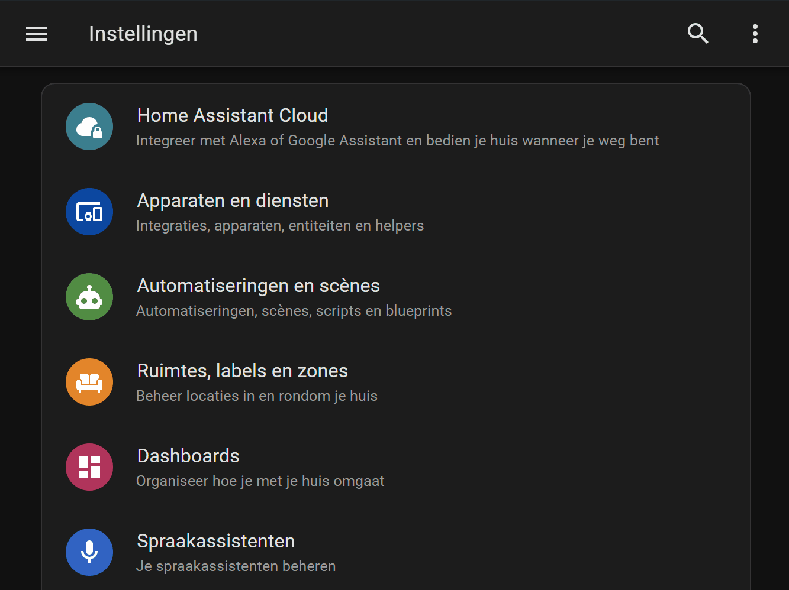

Or direct go to all entities [](https://my.home-assistant.io/redirect/entities) and filter on `camera.buienradar`.

#### Create the dashboard card

Now all preparations are done, the dashboard card can be created.

Add a new card to your dashboard (or edit your existing) with this content
and change the `top` and `left` properties to position the marker to your residence.
And use `scale` to change the size of the image.

The marker looks like this: \
You can also use any other images you like better.

```yaml

# Sourcecode by vdbrink.github.io
# Dashboard card code
type: picture-elements
camera_image: camera.buienradar
camera_view: live
aspect_ratio: '1:0.75'
elements:
  - type: image
    image: https://vdbrink.github.io/homeassistant/images_weather/marker_home.svg
    style:
      top: 60%
      left: 50%
      scale: 100%

```

(The `aspect_ratio` is needed because by default only half of the image is shown.)

#### Alternative implementation

Instead of an online file, it's also possible to use a camera entity or download the file locally.

<details markdown="1">
  <summary><b>> Click here to see the other examples with: camera entity / local file >></b></summary>

##### Via a camera image

Add a Generic camera integration:

[](https://my.home-assistant.io/redirect/config_flow_start/?domain=generic)

Use the url [https://raw.githubusercontent.com/vdbrink/vdbrink.github.io/main/homeassistant/images_weather/marker_home.svg](https://raw.githubusercontent.com/vdbrink/vdbrink.github.io/main/homeassistant/images_weather/marker_home.svg)
It's this marker


Rename the sensor to `camera.marker_home`

```yaml

# Sourcecode by vdbrink.github.io
# Dashboard card code
type: picture-elements
camera_image: camera.buienradar
camera_view: live
aspect_ratio: '1:0.75'
elements:
  - type: image
    entity: camera.marker_home
    camera_image: camera.marker_home
    style:
      top: 60%
      left: 50%
      scale: 100%

```

##### Via a local image

You can also use the image as a local image.\
Download the file [https://raw.githubusercontent.com/vdbrink/vdbrink.github.io/main/homeassistant/images_weather/marker_home.svg](https://raw.githubusercontent.com/vdbrink/vdbrink.github.io/main/homeassistant/images_weather/marker_home.svg)
and place if in your local Home Assistant `/www/` directory.\
And use this script:

```yaml

# Sourcecode by vdbrink.github.io
# Dashboard card code
type: picture-elements
camera_image: camera.buienradar
camera_view: live
aspect_ratio: '1:0.75'
elements:
  - type: image
    image: /local/marker_home.svg
    style:
      top: 60%
      left: 50%
      scale: 100%

```
</details>

---

### Weeronline

Via the link [https://www.weeronline.nl/widgets](https://www.weeronline.nl/widgets) you can select multiple widgets and the corresponding city.
These widgets can be include via an iframe on your dashboard.

#### 3 days weather predictions

Three days weather predictions.

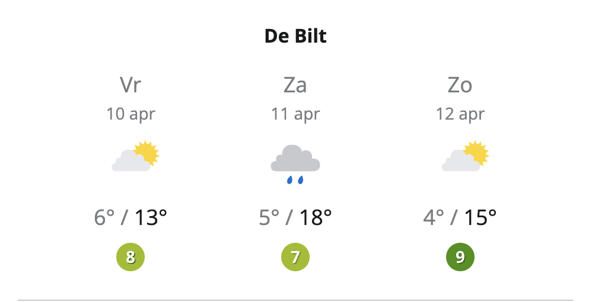

```yaml

# Sourcecode by vdbrink.github.io
# Dashboard card code
type: iframe
url: https://www.weeronline.nl/widget/weather?id=4058458
aspect_ratio: "1.7"

```

#### Rain Radar

An animated image of 2 hours prediction of the rain in steps of 5 minutes.

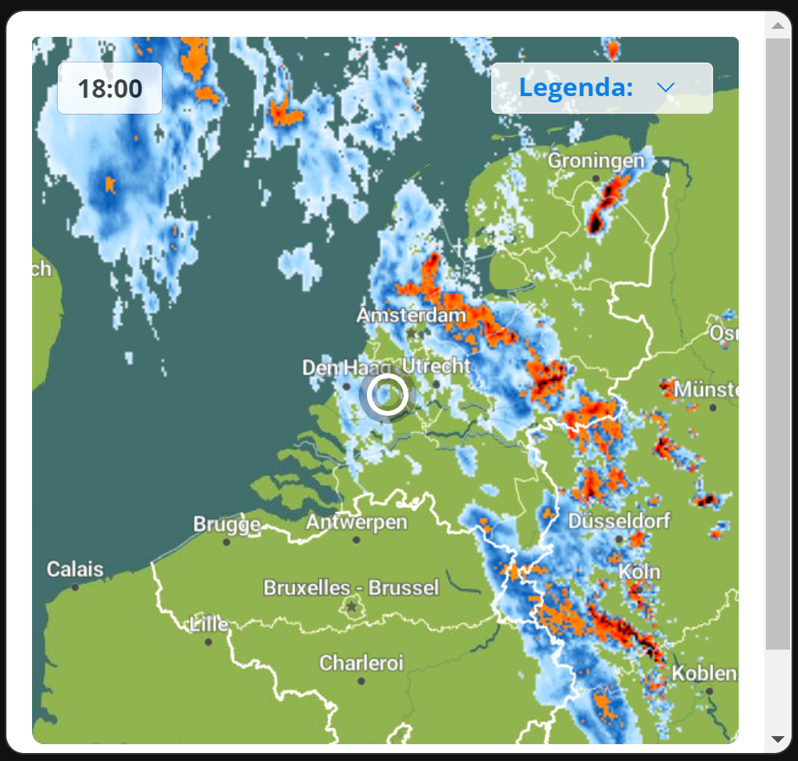

```yaml

# Sourcecode by vdbrink.github.io
# Dashboard card code
type: iframe
url: https://www.weeronline.nl/widget/radar?id=135
aspect_ratio: '1.06'

```

---

## Weather alarm map

Source: KNMI

Alarm code colors per province.

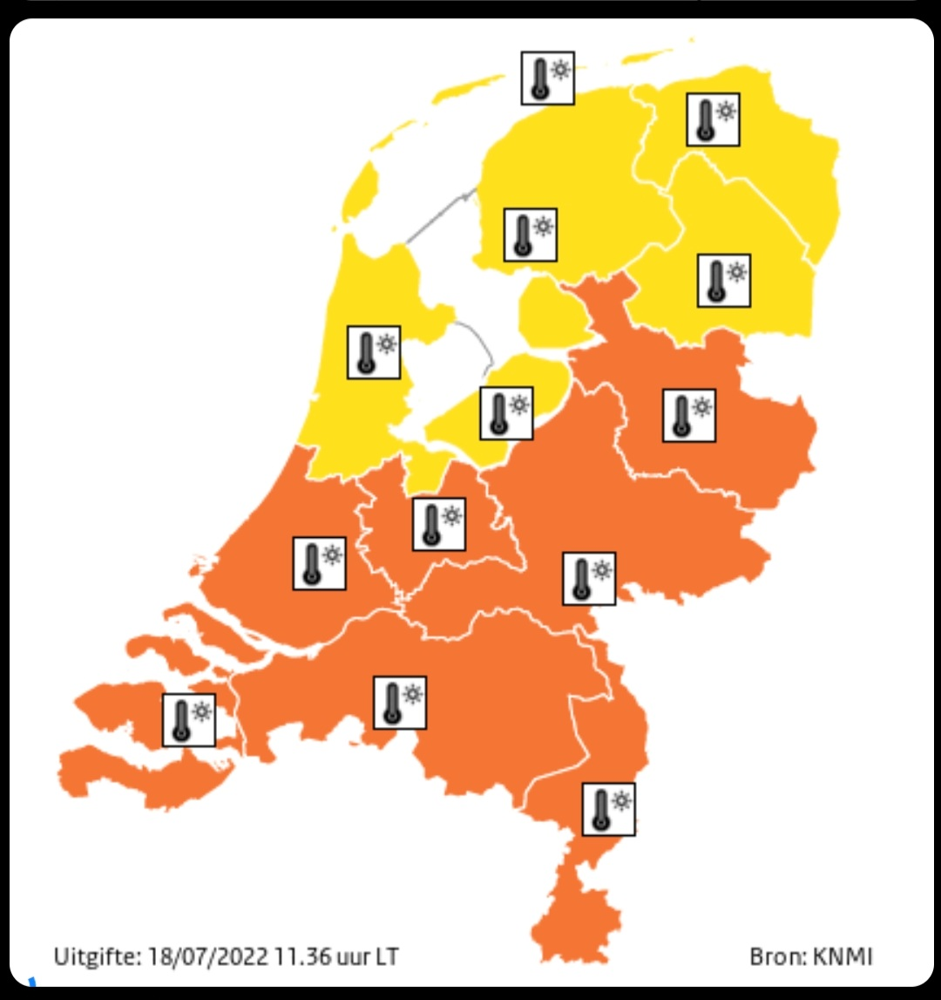

```yaml

# Sourcecode by vdbrink.github.io
# Dashboard card code
type: picture-elements
image: https://cdn.knmi.nl/knmi/map/current/weather/warning/waarschuwing_land_0_new.gif
elements:
- type: image
  title: Weercode
  tap_action:
  action: url
  url_path: https://knmi.nl

```
---

## Weather alarm

Source: KNMI

Show the weather alarm code and description from the [KNMI.nl site](https://www.knmi.nl/nederland-nu/weer/waarschuwingen/) direct on your dashboard like this:

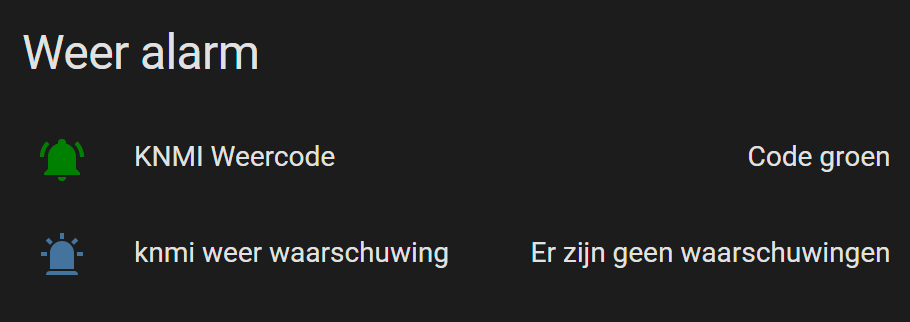

First, you need to define a scraper to scrape every 10 minutes the latest alarm code and description.

You can accomplish this by adding the YAML to the `configuration.yaml` file or by configure it via the Home Assistant frontend **Scrape** integration.\
I also have a [dedicated page](homeassistant_web_scraper) about this integration, how it can be used to integrate almost any website data direct into your dashboard.\
Install this integration via this button in your own Home Assistant instance.\
[](https://my.home-assistant.io/redirect/config_flow_start/?domain=scrape)

```yaml

# Sourcecode by vdbrink.github.io
# configuration.yaml
- platform: scrape
  resource: https://www.knmi.nl/nederland-nu/weer/waarschuwingen/overijssel
  select: "div.alert__heading"
  name: "knmi weercode"
  scan_interval: 600

- platform: scrape
  resource: https://www.knmi.nl/nederland-nu/weer/waarschuwingen/overijssel
  select: "a.alert__description"
  name: "knmi weer waarschuwing"
  scan_interval: 600

```

### Weather alarm with colored icon

Weather alarm block with a colored icon in the color of the alarm.

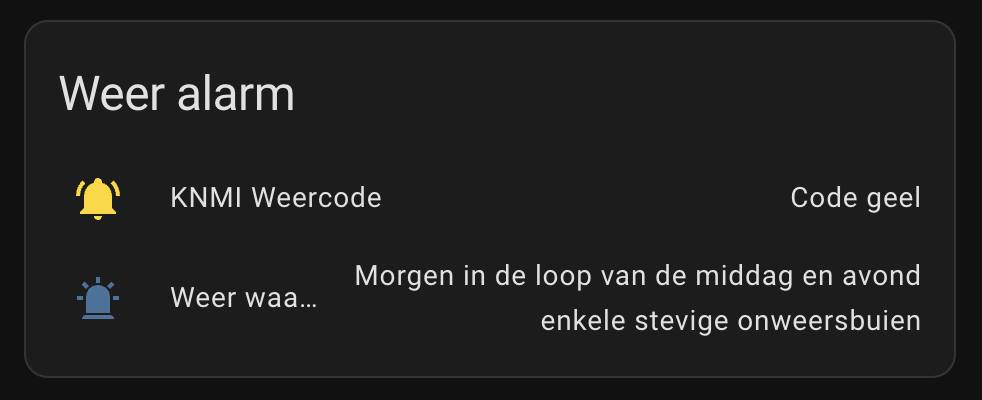

The custom CSS color styling is done with the HACS module [lovelace-card-mod](https://github.com/thomasloven/lovelace-card-mod).\
Install this integration via this button in your own Home Assistant instance.\
[](https://my.home-assistant.io/redirect/hacs_repository/?owner=thomasloven&repository=lovelace-card-mod&category=integration)

Corresponding YAML code:
```yaml

# Sourcecode by vdbrink.github.io
# Dashboard card code
type: entities
title: Weer alarm
entities:
    - entity: sensor.knmi_weercode
      name: KNMI Weercode
      icon: mdi:bell-ring
      card_mod:
        style: |
          :host {
              --card-mod-icon-color:
              
                #008000;
              
                #ffd700;
              
                #ffa500;
              
                #ff4500;
              
                #44739e
              
          }
    - entity: sensor.knmi_weer_waarschuwing
      icon: mdi:alarm-light
show_header_toggle: true
state_color: true

```

Check the [styling](homeassistant_dashboard_styling) page for more ways to give elements the color of the weather alarm.

### Conditional weather alarm 1

You can add this data also to a section on your dashboard with `Important data` and only show this information when it's not code green.
The text is also clickable to open the corresponding site with more details.

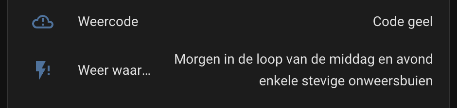

```yaml

# Sourcecode by vdbrink.github.io
# Dashboard card code
- type: entities
  entities:
    - type: conditional
      conditions:
        - entity: sensor.knmi_weercode
          state_not: Code groen
      row:
        entity: sensor.knmi_weercode
        tap_action:
          action: url
          url_path: >-
            https://www.knmi.nl/nederland-nu/weer/waarschuwingen/overijssel
    - type: conditional
      conditions:
        - entity: sensor.knmi_weercode
          state_not: Code groen
      row:
        entity: sensor.knmi_weer_waarschuwing
        tap_action:
          action: url
          url_path: >-
            https://www.knmi.nl/nederland-nu/weer/waarschuwingen/overijssel

```

---
### Conditional weather alarm 2

Based on the [KNMI weather alarm website data](#weather-alarm) is this another presentation.
It shows the weather alarm text in a large size with the background card color the same as the weather alarm level, green, yellow, orange or red.

For this card I used the extra HACS integrations [Mushroom card](/homeassistant/homeassistant_dashboard_card_mushroom) and [card_mod](/homeassistant/homeassistant_dashboard_hacs#card-mod-3-lovelace-card-mod) to add the custom color styling.

This YAML codes show the card only when the weather code is not code green (unavailable).
To show the alarm also when there is no alarm, just remove the `type: conditional` block and only use the YAML code starting from `type: custom:mushroom-title-card`.

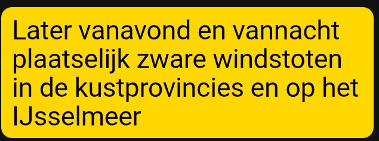

This is the corresponding code with a bigger font size:
```yaml

type: conditional
conditions:
  - entity: sensor.knmi_weercode
    state_not: unavailable
card:
  type: custom:mushroom-title-card
  title: |
    {{states('sensor.knmi_weer_waarschuwing')}}
  card_mod:
    style: |
      ha-card {
        background:
        
         #008000 !important;
        
         #ff4500 !important;
        
         #ffd700 !important;
        
         #ff4d00 !important;
        
         #44739e !important;
        
        --title-color: #000 !important;
        padding-top: 10px !important;
        h1 {
          font-size: 30px !important;
        }
       }

```

---
## Pollen

### image
Source: Pollennieuws

Show the current pollen intensity image.

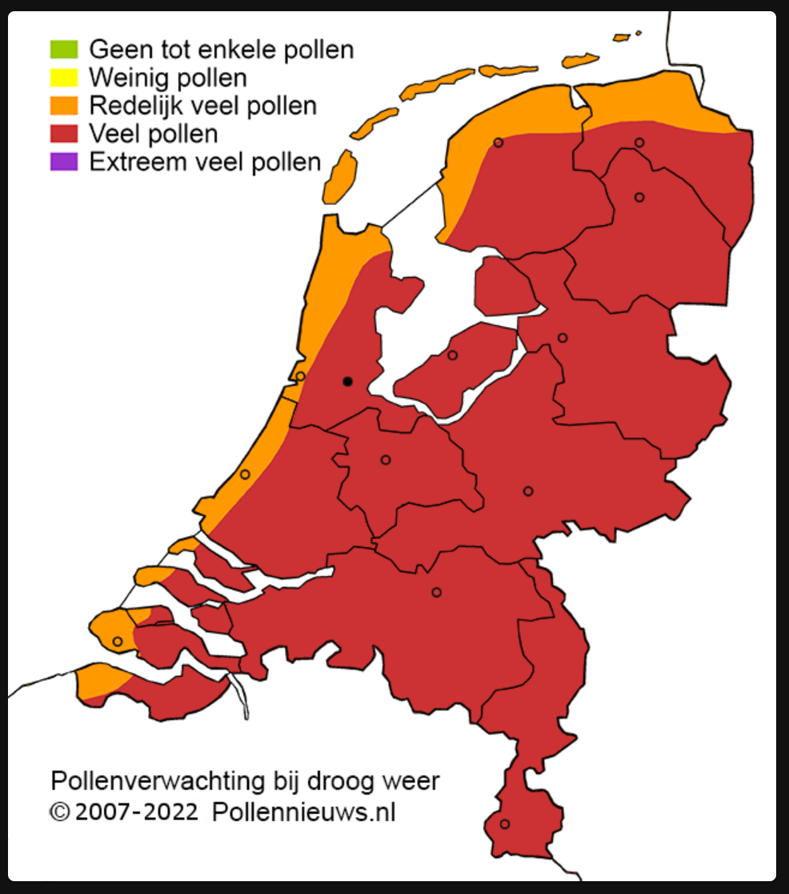

This is the basic variant that shows only the image.
```yaml

# Sourcecode by vdbrink.github.io
# Dashboard card code
type: picture-elements
image: https://pollennieuws.nl/weerkaart/KaartNL_280-website.png

```

In this version, it's possible to also click on the image to open the Pollennieuws website.

You have to place the [overlay image black.png](images/black.png) in the Home Assistant `www` directory first.

```yaml

# Sourcecode by vdbrink.github.io
# Dashboard card code
type: picture-elements
image: https://pollennieuws.nl/weerkaart/KaartNL_280-website.png
elements:
- type: image
  title: Pollennieuws
  tap_action:
    action: url
    url_path: https://pollennieuws.nl
  image: /local/black.png
  aspect_ratio: 1x1
  style:
    top: 0%
    left: 0%
    height: 200%
    width: 228%
    opacity: 0%

```

---

### Kleenex pollen radar Integration

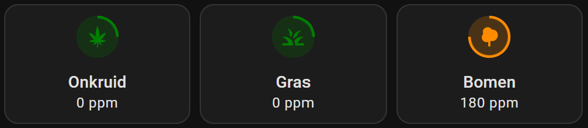

Check out my [dedicated page](homeassistant_hacs_kleenex) about this integration.

---

## Precipitation surplus (neerslagoverschot)

Source: KNMI

Image with the precipitation surplus (neerslagoverschot) for (the last) 3 months.

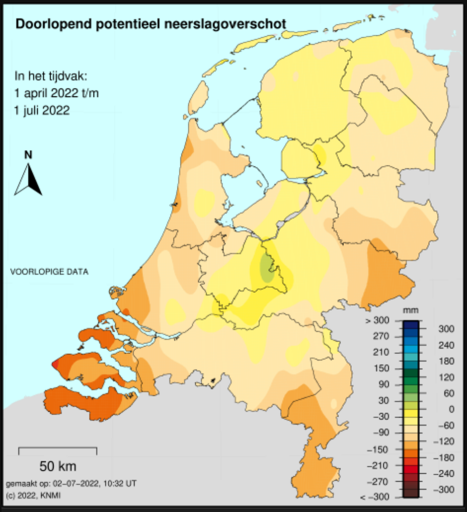

```yaml

# Sourcecode by vdbrink.github.io
# Dashboard card code
type: picture-elements
image: >-
  https://cdn.knmi.nl/knmi/map/page/klimatologie/geografische-overzichten/rdev/rdev_geografisch.png
elements:
  - type: image
    title: Neerslagoverschot

```

---

## Bike/BBQ/Terrace weather score upcoming days

Source: Weerplaza

An iframe with a compact presentation of the weather for the next 3 or 5 days and a score for different type of activities.

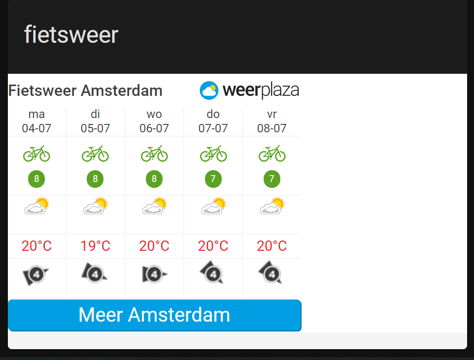

Find more widgets at [https://www.weerplaza.nl/weerwidgets/](https://www.weerplaza.nl/weerwidgets/)

```yaml

# Sourcecode by vdbrink.github.io
# Dashboard card code
type: iframe
url: https://www.weerplaza.nl/weerwidgets/activiteit/?YT1maWV0cyZnaWQ9NTU3NQ==
aspect_ratio: 60%
title: fietsweer

```

---

[<< See also my other Home Assistant tips and tricks](index)
