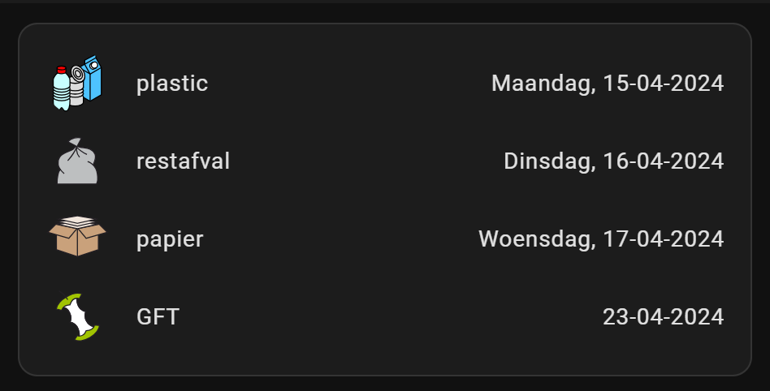
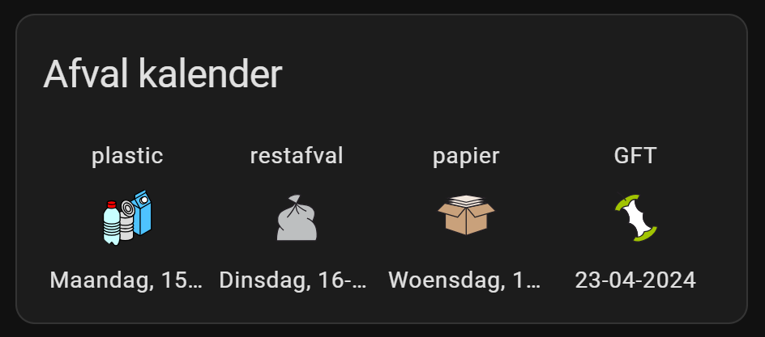
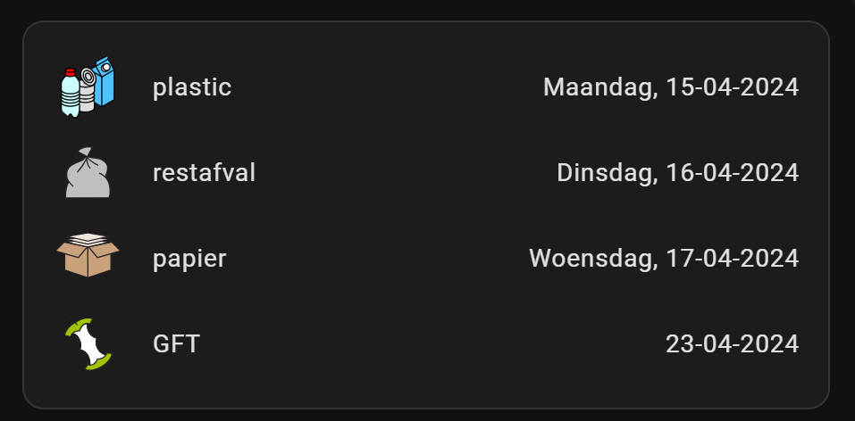
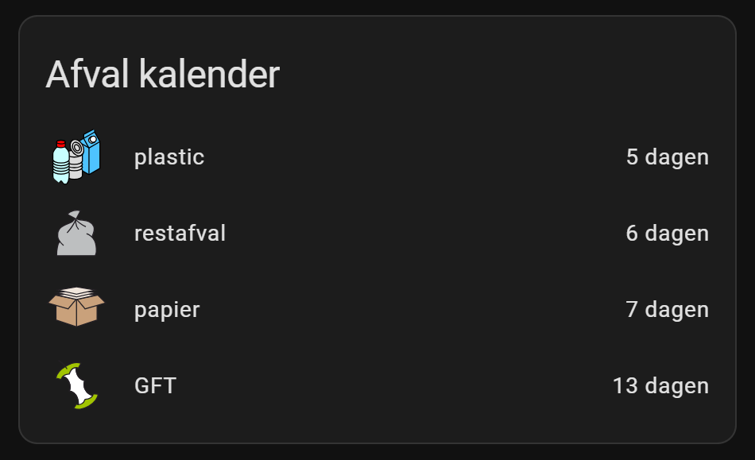
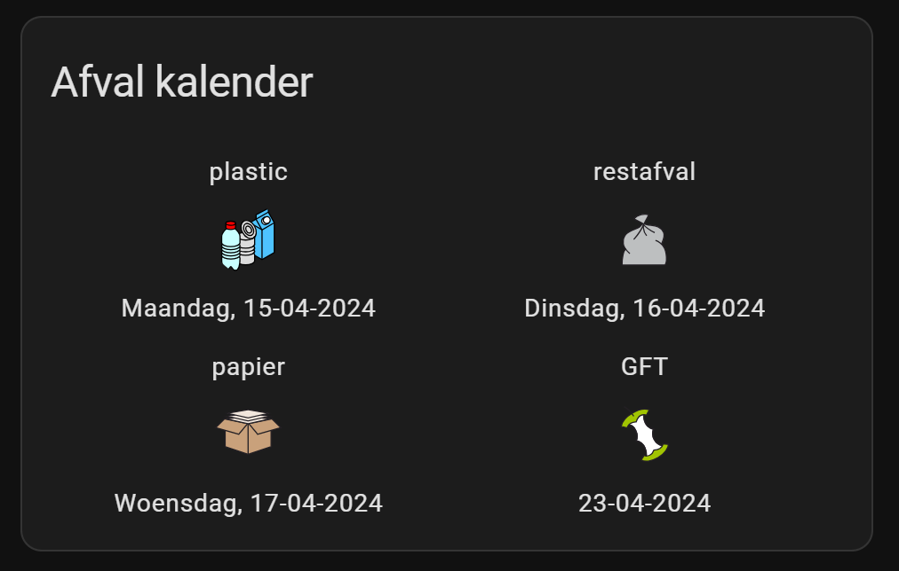
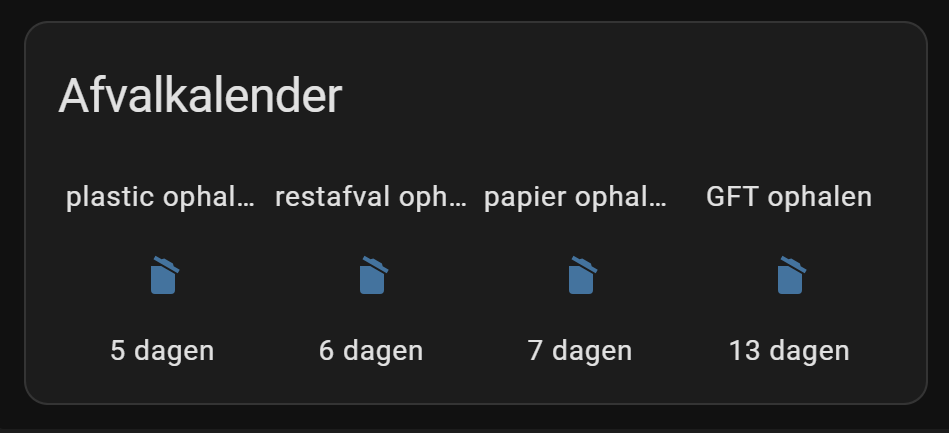
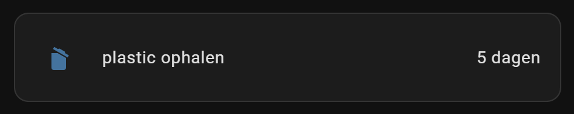
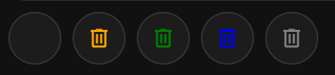

# Home Assistant HACS Afvalbeheer


<a href="index"></a>

Here you find Home Assistant (lovelace) dashboard examples related to the custom HACS integration **Afvalbeheer** which you can easily use on your own dashboards.

Afvalbeheer is a Dutch and Belgium integration for a multiple company who pickup trash. This integration adds sensors to HA to show when specific "kliko" (or for people in the east of NL call it "otto") get picked up.  

Check the git repository to find all the options and if you can use it in your city. https://github.com/pippyn/Home-Assistant-Sensor-Afvalbeheer/

---
## Table of Contents
<!-- TOC -->
  * [Intro](#intro)
  * [Installation](#installation)
    * [Afvalbeheer integration](#afvalbeheer-integration)
    * [Auto-entities integration](#auto-entities-integration)
  * [Default presentation](#default-presentation)
  * [Sort by date](#sort-by-date)
    * [As row - order by date](#as-row---order-by-date)
    * [As list](#as-list)
    * [As list - days countdown](#as-list---days-countdown)
    * [As 2x2 raster](#as-2x2-raster)
  * [Custom helper entities: days countdown](#custom-helper-entities-days-countdown)
  * [Sorted by new countdown entities](#sorted-by-new-countdown-entities)
    * [As row](#as-row)
    * [As list](#as-list-1)
  * [Show conditional, only for the next 5 days](#show-conditional-only-for-the-next-5-days)
  * [Mushroom element](#mushroom-element)
  * [LED strip indicator](#led-strip-indicator)
<!-- TOC -->

---

## Intro

I want to show the upcoming waste collecting not with a date as state but a days countdown.
Also, a presentation that shows only the ones that are relevant for the upcoming few days.
This is not by default available, but I've made it the way I wanted it. 

Here you can read how I did this, enjoy!

---

## Installation

### Afvalbeheer integration

The HACS integration `afvalbeheer` is available for a lot of cities.
After the installation you need to add and config these settings to your `configuration.yaml`.

```yaml

# Sourcecode by vdbrink.github.io
# Dashboard card code
# configuration.yaml
afvalbeheer:
    wastecollector: XXX  # Check https://github.com/pippyn/Home-Assistant-Sensor-Afvalbeheer/?tab=readme-ov-file#wastecollector
    resources:
        - restafval
        - gft
        - papier
        - pmd
    postcode: 1234AB
    streetnumber: 1
    upcomingsensor: 0        # (optional)
    dateformat: '%d-%m-%Y'   # (optional)
    dateonly: 1              # (optional)
    name: ""                 # (optional)
    nameprefix: 1            # (optional)
    builtinicons: 0          # (optional)
    dutch: 1                 # (optional)

```

### Auto-entities integration

To show the (countdown) entities by wildcard and sort them by date, you also need the HACS frontend repository [auto-entities](homeassistant_dashboard_card_auto-entities).

---
## Default presentation

When the installation is complete, you get at least 4 entities which you can add to your dashboard.

This is the default presentation.



The downside is that it isn't ordered by date, you get a colored (distracting) icon and you don't see the numbers of days. Now you need to know the current date and calculate when it's the right date to put it on the street. So work todo to make it more practical and a cleaner presentation. 

This dashboard code belongs to the above presentation screenshot.
In my case my `wastecollector` is `cyclus` that's why I have that name in my sensor name. Yours can be different.

```yaml

# Sourcecode by vdbrink.github.io
# Dashboard Entities card code
type: entities
entities:
  - entity: sensor.cyclus_pmd
  - entity: sensor.cyclus_restafval
  - entity: sensor.cyclus_papier
  - entity: sensor.cyclus_gft
show_header_toggle: false

```

---
## Sort by date

Each entity comes with extra data which we can use to sort by date for example.
It has an attribute called `Days_until` which contains the numeric days to bin day. 
We can use it for sorting on date in combination by using the custom HACS card `auto-entities`.

### As row - order by date

An example to show the entities sorted by date in a row.
In this example `dateonly: 0` which also add the day. But when you set `dateonly: 1` you only see the date as state underneath the icon.

Unfortunately: It's not possible to show an attribute value in combination with card type glance...\
I create new helper [countdown](#custom-helper-entities-days-countdown) entities which make this possible.



The corresponding code:
```yaml

# Sourcecode by vdbrink.github.io
# Entities Card Configuration
type: custom:auto-entities
card:
  type: glance
  title: Afval kalender
  columns: 4
filter:
  include:
    - entity_id: sensor.cyclus_*
sort:
  method: attribute
  attribute: Days_until
  numeric: true

```

### As list

Show the default entities as a list, without a header, ordered by date.



The corresponding code:
```yaml

# Sourcecode by vdbrink.github.io
# Entities Card Configuration
type: custom:auto-entities
card:
  type: entities
filter:
  include:
    - entity_id: sensor.cyclus_*
sort:
  method: attribute
  attribute: Days_until
  numeric: true

```

### As list - days countdown

Show the default entities as a list, ordered by date and show the days until bin day.



The corresponding code:
```yaml

# Sourcecode by vdbrink.github.io
# Entities Card Configuration
type: custom:auto-entities
card:
  type: entities
  title: 'Afval kalender'
filter:
  include:
    - entity_id: sensor.cyclus_*
      options:
        type: custom:template-entity-row
        state: >
          {{state_attr(config.entity,'Days_until')}} dagen
sort:
  method: attribute
  attribute: Days_until
  numeric: true

```

### As 2x2 raster

Show the default entities in a 2x2 raster, ordered by date.



The corresponding code:
```yaml

# Sourcecode by vdbrink.github.io
# Entities Card Configuration
type: custom:auto-entities
card:
  type: glance
  title: Afval kalender
  columns: 2
filter:
  include:
    - entity_id: sensor.cyclus_*
sort:
  method: attribute
  attribute: Days_until
  numeric: true

```

---
## Custom helper entities: days countdown

I wanted my presentation like this.\
Only with the numbers of days instead of the full date as the state value.\
Also, a more subtle icon which match the rest of the icons on my dashboard.


To get this done, I needed to create some new helper sensors with the countdown in days as state value.\
Add this to `configuration.yaml` (or add it to `sensor.yaml` without the first `sensor:` line.)

```yaml

# Sourcecode by vdbrink.github.io
# configuration.yaml
sensor:
  - platform: template
    sensors:
      paper_waste_pickup_countdown:
        friendly_name: "papier ophalen"
        value_template: >-
          
          {{ ((as_timestamp(strptime(datex, '%Y%m%d')) - as_timestamp(now())) / (60 * 60 * 24)) | round(0, 'ceil')  }}
        icon_template: mdi:delete-empty
        unit_of_measurement: "dagen"
    
  - platform: template
    sensors:
      gft_waste_pickup_countdown:
        friendly_name: "GFT ophalen"
        value_template: >-
          
          {{ ((as_timestamp(strptime(datex, '%Y%m%d')) - as_timestamp(now())) / (60 * 60 * 24)) | round(0, 'ceil')  }}
        icon_template: mdi:delete-empty
        unit_of_measurement: "dagen"
    
  - platform: template
    sensors:
      rest_waste_pickup_countdown:
        friendly_name: "restafval ophalen"
        value_template: >-
          
          {{ ((as_timestamp(strptime(datex, '%Y%m%d')) - as_timestamp(now())) / (60 * 60 * 24)) | round(0, 'ceil')  }}
        icon_template: mdi:delete-empty
        unit_of_measurement: "dagen"
    
  - platform: template
    sensors:
      plastic_waste_pickup_countdown:
        friendly_name: "plastic ophalen"
        value_template: >-
          
          {{ ((as_timestamp(strptime(datex, '%Y%m%d')) - as_timestamp(now())) / (60 * 60 * 24)) | round(0, 'ceil')  }}
        icon_template: mdi:delete-empty
        unit_of_measurement: "dagen"

```

---
## Sorted by new countdown entities

### As row

Show the new countdown entities, with the countdown days, all with the same icon, ordered by date in a row.



The corresponding code:
```yaml

# Sourcecode by vdbrink.github.io
# Entities Card Configuration
type: custom:auto-entities
card:
  type: glance
  title: 'Afvalkalender'
filter:
  include:
    - entity_id:  sensor.*waste*countdown
sort:
  method: state
  numeric: true

```

### As list

The countdown entities sorted by days in a list.


The corresponding code:
```yaml

# Sourcecode by vdbrink.github.io
# Dashboard card code
type: custom:auto-entities
card:
  type: entities
  show_header_toggle: false
  state_color: false
filter:
  include:
    - entity_id: sensor.*waste_pickup_countdown
  exclude: null
show_empty: false
sort:
  method: state
  numeric: true

```

---
## Show conditional, only for the next 5 days

Show only the waste pickup for the upcoming 5 days.\
In this case there is only one pickup in the next 5 days otherwise more entities will be visible.



```yaml

# Sourcecode by vdbrink.github.io
# Dashboard card code
type: custom:auto-entities
card:
  type: entities
filter:
  include:
    - entity_id: sensor.*_waste_pickup_countdown
      state 1: < 6
      state 2: '> 0'

```

---
## Mushroom element

On top of my dashboard I also show a small [Mushroom](homeassistant_dashboard_card_mushroom) icon which trash can must be outside.
I have for each type a different color. Orange for plastic, green for green, blue for paper and gray for the grey container with rest trash. These are all the possible visible icon options (only one is visible at the same time).



I use here also my extra created countdown helper entities.\
The condition is: If tomorrow some waste must be placed outside, it shows the corresponding color trashcan, otherwise there is no trashcan visible in the circle. 

```yaml

# Sourcecode by vdbrink.github.io
# Dashboard card code
type: custom:mushroom-chips-card
chips:
  - chip: null
    type: template
    entity: sensor.cyclus_gft
    icon: mdi:trash-can-outline
    content: ''
    card_mod:
      style: |
        :host {
          --card-mod-icon-color: 
          
           green
          
           blue
          
           orange
          
           brown
          
           #1C1C1C
          
        }

```

---
## LED strip indicator


---
[^^ Top](#table-of-contents)

[<< See also my other Home Assistant pages](index)