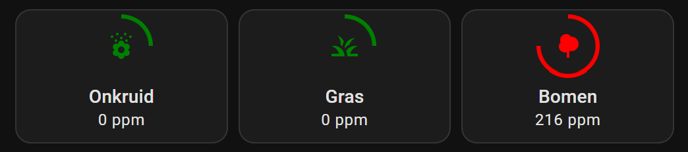

# Home Assistant -<br>HACS Kleenex Pollen Radar

<a href="images_kleenex/kleenex_advanced_presentation.png">

</a>
<a href="index"></a>

Here you find Home Assistant (lovelace) dashboard examples related to the custom HACS integration **Kleenex Pollen Radar** which you can easily use on your own dashboards.

This integration shows Pollen information for grass, weeds and trees.

It's available for the countries: France, Italy, the Netherlands, the United Kingdom and the United States of America.

Check the git repository to find out all the options: https://github.com/MarcoGos/kleenex_pollenradar

---
## Table of Contents
<!-- TOC -->
  * [Installation](#installation)
  * [HA presentations](#ha-presentations)
    * [Default presentation](#default-presentation)
    * [Advanced: with colors](#advanced-with-colors)
    * [Advanced: with a clickable link, colors and labels](#advanced-with-a-clickable-link-colors-and-labels)
<!-- TOC -->

---

## Installation

Here are the steps to setup this HACS `Kleenex Pollen Radar` integration.

* Use this button to install the [Kleenex pollen radar / Scottex](https://github.com/MarcoGos/kleenex_pollenradar) integration:
 
  [](https://my.home-assistant.io/redirect/hacs_repository/?owner=MarcoGos&repository=kleenex_pollenradar&category=Integration)
* Click Add integration
  Now you get one search result.
* Select the Kleenex integration
* Click on the detail page, in the right bottom corner on `Download`
* Click this button to install the integration:

  [](https://my.home-assistant.io/redirect/config_flow_start/?domain=kleenex_pollenradar)
* Select your country and press Submit.

  <a href="images_kleenex/kleenex_setup.png">
  
  </a>

Now you have these five new sensors.

<a href="images_kleenex/kleenex_sensors.png">

</a>

Each sensor contains also in its `attributes` also extra information about different subtypes and a forecast for the upcoming days.

Use this button to go to the `Developer tools` and filter the entities on `kleenex`.

[](https://my.home-assistant.io/redirect/developer_states/)

<a href="images_kleenex/kleenex_forecast.png">

</a>

---
## HA presentations

### Default presentation

When the installation is complete, you get at least three entities which you can add to your dashboard.

This is a default presentation with the entities card.


```yaml

# Sourcecode by vdbrink.github.io
# Entities Card Configuration
type: entities
entities:
  - sensor.kleenex_pollen_radar_huis_grass
  - sensor.kleenex_pollen_radar_huis_trees
  - sensor.kleenex_pollen_radar_huis_weeds

```

---

### Advanced: with colors

#### Result

Show the entities with matching colors and a level border color.

<a href="images_kleenex/kleenex_colored_presentation.png">

</a>

The entities are clickable which show you the values over time:


For the advanced presentation, you need to add three new sensors to divide the ppm number into a textual value.
This value will be used as text, but also be used for different colors and an indication circle of the intensity.

#### Helper sensors

You need to add these three helper sensors first.

This can be done to the sensor section in the file `configuration.yaml` with this code.\
Or create them via the HA helper frontend, see below this code block.

```yaml

# Sourcecode by vdbrink.github.io
# configuration.yaml
- platform: template
  sensors:
    pollen_grass_concentration:
      value_template: >-
        
         Laag
         Gemiddeld
         Hoog
         Zeer Hoog
        
    pollen_trees_concentration:
      value_template: >-
        
         Laag
         Gemiddeld
         Hoog
         Zeer Hoog
        
    pollen_weeds_concentration:
      value_template: >-
        
         Laag
         Gemiddeld
         Hoog
         Zeer Hoog
        

```

#### Via the frontend

The other way is via the frontend, you can create a new template via the **Settings** menu item,
then go to **Devices and Services** and select **Helpers**.\
This button directly opens the **Helpers** page in your Home Assistant:

[](https://my.home-assistant.io/redirect/helpers/)

Select the bottom-right button `+ CREATE HELPER`,
select **Template** then one of the option **Template a sensor**

<a href="images_kleenex/kleenex_sensor_create_template_helper.png">

</a>

Fill the fields like this.
Do this three times also for the `pollen_weeds_concentration` and `pollen_trees_concentration`

<a href="images_kleenex/kleenex_sensor_create_template.png">

</a>

Read more how to add a template (via the HA frontend itself) here on my [advanced Templates page](homeassistant_templates#how-to-add-a-template).

#### Dashboard code

This is the corresponding dashboard YAML code for the screenshot. 

```yaml

# Sourcecode by vdbrink.github.io
# Horizontal Stack Card Configuration
type: horizontal-stack
cards:
  - entity: sensor.kleenex_pollen_radar_huis_weeds
    name: Onkruid
    type: tile
    vertical: true
    tap_action:
      action: more-info
    card_mod:
      style: |
        .icon-container {
          
          
          
                  
          
          border-radius: 24px;
          background: radial-gradient(var(--card-background-color) 60%,transparent calc(60% + 1px)),
          conic-gradient({{level_color}} {{percentage}}% 0%,
          var(--card-background-color) 0% 100%);
        }
        ha-tile-icon {
          
                        
          
          --tile-color: {{level_color}};
        }
  - entity: sensor.kleenex_pollen_radar_huis_grass
    name: Gras
    type: tile
    vertical: true
    tap_action:
      action: more-info
    card_mod:
      style: |
        .icon-container {
          
          
          
                  
          
          border-radius: 24px;
          background: radial-gradient(var(--card-background-color) 60%,transparent calc(60% + 1px)),
          conic-gradient({{level_color}} {{percentage}}% 0%,
          var(--card-background-color) 0% 100%)
        }
        ha-tile-icon {
          
          
          ;
          --tile-color: {{level_color}};
        }
  - entity: sensor.kleenex_pollen_radar_huis_trees
    name: Bomen
    type: tile
    vertical: true
    tap_action:
      action: more-info
    card_mod:
      style: |
        .icon-container {
           
           
          
                  
          
          border-radius: 24px;
          background: radial-gradient(var(--card-background-color) 60%,transparent calc(60% + 1px)),
          conic-gradient({{level_color}} {{percentage}}% 0%,
          var(--card-background-color) 0% 100%);
        }
        ha-tile-icon {
          
          
          ;
          --tile-color: {{level_color}};
        }

```

---
### Advanced: with a clickable link, colors and labels

Show a clickable link to the Kleenex website, the entities with matching colors and colored labels, like this:

<a href="images_kleenex/kleenex_advanced_presentation.png">

</a>

This is the corresponding code:

```yaml

# Sourcecode by vdbrink.github.io
# Entities Card Configuration
type: vertical-stack
cards:
  - type: heading
    heading: Pollen in de lucht
    heading_style: title
    card_mod:
      class: class-section-heading
    tap_action:
      action: url
      url_path: https://www.kleenex.nl/pollenradar
  - type: horizontal-stack
    cards:
      - entity: sensor.kleenex_pollen_radar_huis_weeds
        name: Onkruid
        type: tile
        vertical: true
        tap_action:
          action: more-info
        card_mod:
          style: |
            .icon-container {
              
              
              
                      
              
              border-radius: 24px;
              background: radial-gradient(var(--card-background-color) 60%,transparent calc(60% + 1px)),
              conic-gradient({{level_color}} {{percentage}}% 0%,
              var(--card-background-color) 0% 100%);
            }
            ha-tile-icon {
              
                            
              
              --tile-color: {{level_color}};
            }
      - entity: sensor.kleenex_pollen_radar_huis_grass
        name: Gras
        type: tile
        vertical: true
        tap_action:
          action: more-info
        card_mod:
          style: |
            .icon-container {
              
              
              
                      
              
              border-radius: 24px;
              background: radial-gradient(var(--card-background-color) 60%,transparent calc(60% + 1px)),
              conic-gradient({{level_color}} {{percentage}}% 0%,
              var(--card-background-color) 0% 100%)
            }
            ha-tile-icon {
              
              
              ;
              --tile-color: {{level_color}};
            }
      - entity: sensor.kleenex_pollen_radar_huis_trees
        name: Bomen
        type: tile
        vertical: true
        tap_action:
          action: more-info
        card_mod:
          style: |
            .icon-container {
               
               
              
                      
              
              border-radius: 24px;
              background: radial-gradient(var(--card-background-color) 60%,transparent calc(60% + 1px)),
              conic-gradient({{level_color}} {{percentage}}% 0%,
              var(--card-background-color) 0% 100%);
            }
            ha-tile-icon {
              
              
              ;
              --tile-color: {{level_color}};
            }
  - type: horizontal-stack
    cards:
      - type: markdown
        entity: sensor.pollen_weeds_concentration
        card_mod:
          style: |
            ha-card {
              background: rgb(128,193,177);
              color:
                
                
                
                {{level_color}};
              font-weight: 800;
              text-align: center;
            }
        content: |
          {{states(config.entity)}}
      - type: markdown
        entity: sensor.pollen_grass_concentration
        card_mod:
          style: |
            ha-card {
              background: rgb(128,193,177);
              color:
                
                
                
                {{level_color}};
              font-weight: 800;
              text-align: center;
            }
        content: |
          {{states(config.entity)}}
      - type: markdown
        entity: sensor.pollen_trees_concentratie
        card_mod:
          style: |
            ha-card {
              background: rgb(128,193,177);
              color:
                
                
                
                {{level_color}};
              font-weight: 800;
              text-align: center;
            }
        content: |
          {{states('sensor.pollen_trees_concentration')}}

```

---

### Specific subtypes forecast

Work in progress ...

<br>

Good luck with the integration!

---
[^^ Top](#table-of-contents)

[<< See also my other Home Assistant tips and tricks](index)

[Home Assistant integration: Afvalbeheer >>](homeassistant_hacs_afvalbeheer)

[Home Assistant: Templates >>](homeassistant_templates)
