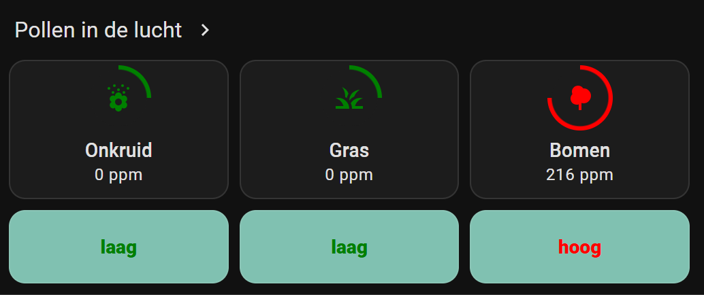
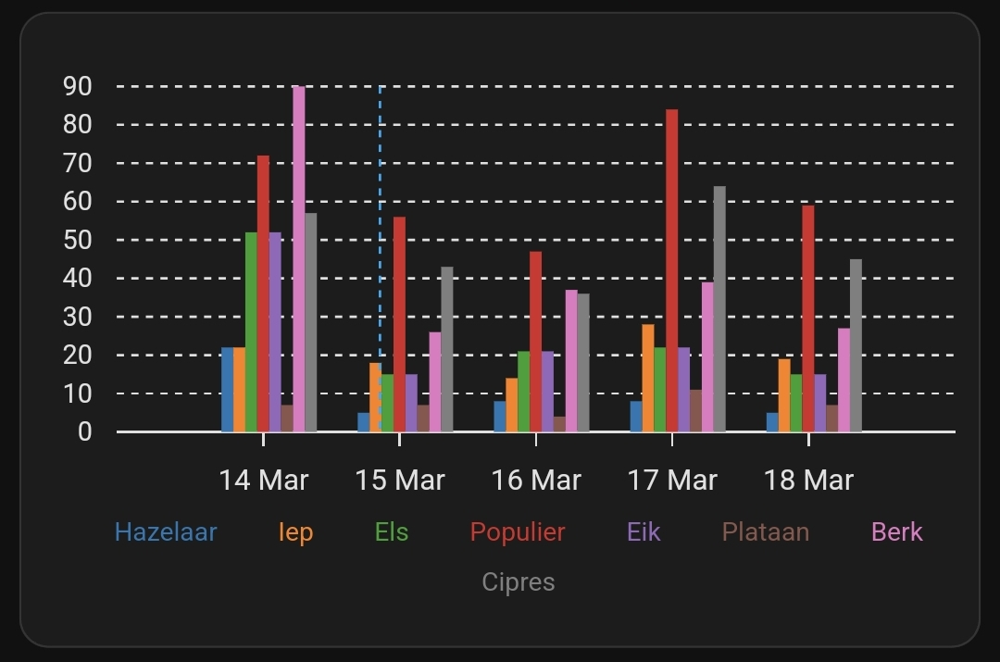

# Home Assistant -<br>HACS Kleenex Pollen Radar

<a href="images_kleenex/kleenex_advanced_presentation.png">

</a>
<a href="index"></a>

Here you find Home Assistant (lovelace) dashboard examples related to the custom HACS integration **Kleenex Pollen Radar** which you can easily add to your own dashboard.

This integration shows Pollen information for grass, trees and weeds.

It's available for the countries: The Netherlands, France, Italy, the United Kingdom and the United States of America.\
Check the git repository to find out all options: https://github.com/MarcoGos/kleenex_pollenradar

**Alternative integration**

If your country isn't in the list, 
or you want to try another data provider, 
you can also look at the [Google Pollen](https://github.com/svenove/home-assistant-google-pollen#home-assistant-google-pollen) integration.

> **_UPDATE -  23 March 2025:_** Since version [1.1.3 released at 17 March 2025](https://github.com/MarcoGos/kleenex_pollenradar/releases/tag/v1.1.3) the data structure is changed. 
> I updated this manual afterwards and is now compatible with version 1.1.6

---
## Table of Contents
<!-- TOC -->
  * [Installation](#installation)
  * [Dashboard presentations](#dashboard-presentations)
    * [Alternative icons](#alternative-icons)
    * [Default presentation](#default-presentation)
    * [Mushroom](#mushroom)
    * [Tile card with progress indicator](#tile-card-with-progress-indicator)
    * [Tile card: with an extra clickable link and labels](#tile-card-with-an-extra-clickable-link-and-labels)
    * [Subtypes values](#subtypes-values)
    * [Specific subtypes forecast](#specific-subtypes-forecast)
  * [Credits](#credits)
<!-- TOC -->

---

## Installation

Here are the steps to install this HACS `Kleenex Pollen Radar` integration.

* Use this button to add the [Kleenex pollen radar / Scottex](https://github.com/MarcoGos/kleenex_pollenradar) integration:
 
  [](https://my.home-assistant.io/redirect/hacs_repository/?owner=MarcoGos&repository=kleenex_pollenradar&category=Integration)
* Click `Add integration`\
  Now you get one search result.
* Select the Kleenex integration
* Click on the detail page, in the right bottom corner on `Download`

Now is the integration added, but not yet installed. 
* Click this button to install the integration:

  [](https://my.home-assistant.io/redirect/config_flow_start/?domain=kleenex_pollenradar)
* Select your country and press the `Submit` button.

  <a href="images_kleenex/kleenex_setup.png">
  
  </a>

Now you have these five new sensors.

<a href="images_kleenex/kleenex_sensors.png">

</a>

---

### Subtypes in attributes

Each sensor contains also in it's `attribute` value extra information about different subtypes and a forecast for the upcoming days.\
These subtypes are possible:

* Trees
  * Hazelaar (NL), Hazel (EN)
  * Pijnboom (NL), Pine (EN)
  * Populier (NL), Poplar (EN)
  * Plataan (NL), Plane (EN)
  * Cipres (NL), Cypress (EN)
  * Els (NL), Els (EN)
  * Iep (NL), Elm (EN)
  * Berk (NL), Birch (EN)
  * Eik (NL), Oak (EN)
* Grass
  * Poaceae (NL), Poaceae (EN)
* Weeds
  * Bijvoet (NL), Mugwort (EN)
  * Ganzevoet (NL), Goosefoot (EN)
  * Ambrosia (NL), Ambrosia (EN)
  * Brandnetel (NL), Nettle (EN)

To see this subtype and forecast data use this button to go to the `Developer tools` and filter the entities on with the keyword `kleenex`.
<br>

[](https://my.home-assistant.io/redirect/developer_states/)

Click on the image to see all the forecast and subtype details which are stored in the `attribute` data. 

<a href="images_kleenex/kleenex_forecast.png">

</a>

<!--
I created also a [presentation](#) based on these attributes.
-->

---
## Dashboard presentations

I have different examples of how to present this data on your dashboard:
* [Default as list entities](#default-presentation) - no extra modules needed.\
  <a href="#default-presentation"></a>
* [Mushroom template with bigger icons](#mushroom) - extra mushroom modules required.\
  <a href="#mushroom"></a>
* [Tile card with level indicator](#tile-card-with-progress-indicator) - extra helpers needed to create. With default Dutch text.\
  <a href="#tile-card-with-progress-indicator"></a>
  * [Same as previous but with extra clickable link to Kleenex website and labels](#tile-card-with-an-extra-clickable-link-and-labels)\
    <a href="#tile-card-with-an-extra-clickable-link-and-labels"></a>
* [Sub types](#subtypes-values) - two tree subtype examples.\
  <a href="#subtypes-values"></a>
* [Sub types forecast graph](#specific-subtypes-forecast) - trees forecast.\
  <a href="#specific-subtypes-forecast"></a>
---
### Alternative icons

If you want an alternative icon for weeds you can also use `mdi:sprout` or `mdi:flower-pollen`.

<a href="images_kleenex/sprout_icon.jpg">

</a>

<a href="images_kleenex/flower-pollen_icon.jpg">

</a>

---
### Default presentation

When the installation is complete, you get at least three entities which you can add to your dashboard.

This is a default presentation with the entities card.


```yaml

# Sourcecode by vdbrink.github.io
# Entities Card Configuration
type: entities
entities:
  - sensor.kleenex_pollen_radar_huis_grass
  - sensor.kleenex_pollen_radar_huis_trees
  - sensor.kleenex_pollen_radar_huis_weeds

```

---
### Mushroom

This presentation uses English levels and has bigger icons.\
No need to create extra helper sensors.

<a href="images_kleenex/kleenex_mushroom_presentation.jpg">

</a>

This presentation required the HACS integration [lovelace-mushroom](https://github.com/piitaya/lovelace-mushroom) to create this custom presentation.\
Install the integration via this button:

[](https://my.home-assistant.io/redirect/hacs_repository/?owner=piitaya&repository=lovelace-mushroom&category=integration)

<details>
  <summary><b>> Click here to see the corresponding dashboard YAML code >></b></summary>

```yaml

# Sourcecode by vdbrink.github.io
type: grid
cards:
  - type: custom:mushroom-template-card
    primary: >-
      Trees: 
       None
       Low
       Moderate 
       High
       very High
      
    secondary: "{{ states('sensor.kleenex_pollen_radar_home_trees') }} ppm"
    icon: mdi:tree
    icon_color: |-
      
      
      #FFFFFF
      
      #006400
      
      #008000
      
      #90EE90
      
      #FFFF00
      
      #FFD700
      
      #FFA500
      
      #FF8C00
      
      #FF0000
      
      #8B0000
      
      #800080
       
    layout: vertical
    entity: sensor.kleenex_pollen_radar_home_trees
    multiline_secondary: false
    tap_action:
      action: more-info
    layout_options:
      grid_columns: 1
      grid_rows: 2
    card_mod:
      style: |
        ha-card {
          --icon-size: 60px;
          background-color: hsla(0, 0%, 0%, 0);
        }
  - type: custom:mushroom-template-card
    primary: >-
      Grass: 
       None
       Low
       Moderate 
       High
       very High
      
    secondary: "{{ states('sensor.kleenex_pollen_radar_home_grass') }} ppm"
    icon: mdi:grass
    icon_color: |-
      
      
      #FFFFFF
      
      #006400
      
      #008000
      
      #90EE90
      
      #FFFF00
      
      #FFD700
      
      #FFA500
      
      #FF8C00
      
      #FF0000
      
      #800080
       
    layout: vertical
    entity: sensor.kleenex_pollen_radar_home_grass
    multiline_secondary: false
    tap_action:
      action: more-info
    layout_options:
      grid_columns: 1
      grid_rows: 2
    card_mod:
      style: |
        ha-card {
          --icon-size: 60px;
          background-color: hsla(0, 0%, 0%, 0);
        }
  - type: custom:mushroom-template-card
    primary: |-
      Weeds:
      
       None
       Low
       Moderate 
       High
       very High
      
    secondary: "{{ states('sensor.kleenex_pollen_radar_home_weeds') }} ppm"
    icon: mdi:flower-pollen
    icon_color: |-
      
      
      #FFFFFF
      
      #006400
      
      #008000
      
      #90EE90
      
      #FFFF00
      
      #FFD700
      
      #FFA500
      
      #FF8C00
      
      #FF0000
      
      #8B0000
      
      #800080
       
    layout: vertical
    entity: sensor.kleenex_pollen_radar_home_weeds
    multiline_secondary: false
    tap_action:
      action: more-info
    layout_options:
      grid_columns: 1
      grid_rows: 2
    card_mod:
      style: |
        ha-card {
          --icon-size: 60px;
          background-color: hsla(0, 0%, 0%, 0);
        }

```
</details>

---

### Tile card with progress indicator

This presentation shows the entities with matching colors and a level border color.

<a href="images_kleenex/kleenex_colored_presentation.png">

</a>

The entities are clickable which show you the values over time:


<a name="lovelace-card-mod"/>

This presentation required the HACS module [lovelace-card-mod](https://github.com/thomasloven/lovelace-card-mod) to add custom CSS styling like the progress circle.\
Install it via this button:

[](https://my.home-assistant.io/redirect/hacs_repository/?owner=thomasloven&repository=lovelace-card-mod&category=integration)

#### Dashboard code

<details>
  <summary><b>> Click here to see the corresponding dashboard YAML code >></b></summary>

```yaml

# Sourcecode by vdbrink.github.io
# Horizontal Stack Card Configuration
type: horizontal-stack
cards:
  - entity: sensor.kleenex_pollen_radar_huis_weeds
    name: Onkruid
    type: tile
    vertical: true
    tap_action:
      action: more-info
    card_mod:
      style: |
        .icon-container {
          
          
          
                  
          
          border-radius: 24px;
          background: radial-gradient(var(--card-background-color) 60%,transparent calc(60% + 1px)),
          conic-gradient({{level_color}} {{percentage}}% 0%,
          var(--card-background-color) 0% 100%);
        }
        ha-tile-icon {
          
                        
          
          --tile-color: {{level_color}};
        }
  - entity: sensor.kleenex_pollen_radar_huis_grass
    name: Gras
    type: tile
    vertical: true
    tap_action:
      action: more-info
    card_mod:
      style: |
        .icon-container {
          
          
          
                  
          
          border-radius: 24px;
          background: radial-gradient(var(--card-background-color) 60%,transparent calc(60% + 1px)),
          conic-gradient({{level_color}} {{percentage}}% 0%,
          var(--card-background-color) 0% 100%)
        }
        ha-tile-icon {
          
          
          ;
          --tile-color: {{level_color}};
        }
  - entity: sensor.kleenex_pollen_radar_huis_trees
    name: Bomen
    type: tile
    vertical: true
    tap_action:
      action: more-info
    card_mod:
      style: |
        .icon-container {
           
           
          
                  
          
          border-radius: 24px;
          background: radial-gradient(var(--card-background-color) 60%,transparent calc(60% + 1px)),
          conic-gradient({{level_color}} {{percentage}}% 0%,
          var(--card-background-color) 0% 100%);
        }
        ha-tile-icon {
          
          
          ;
          --tile-color: {{level_color}};
        }

```
</details>

---
### Tile card: with an extra clickable link and labels

Show a clickable link to the Kleenex website, the entities with matching colors and colored labels, like this:

<a href="images_kleenex/kleenex_advanced_presentation.png">

</a>

<details>
  <summary><b>> Click here to see the corresponding dashboard YAML code >></b></summary>

```yaml

# Sourcecode by vdbrink.github.io
# Entities Card Configuration
type: vertical-stack
cards:
  - type: heading
    heading: Pollen in de lucht
    heading_style: title
    card_mod:
      class: class-section-heading
    tap_action:
      action: url
      url_path: https://www.kleenex.nl/pollenradar
  - type: horizontal-stack
    cards:
      - entity: sensor.kleenex_pollen_radar_huis_weeds
        name: Onkruid
        type: tile
        vertical: true
        tap_action:
          action: more-info
        card_mod:
          style: |
            .icon-container {
              
              
              
                      
              
              border-radius: 24px;
              background: radial-gradient(var(--card-background-color) 60%,transparent calc(60% + 1px)),
              conic-gradient({{level_color}} {{percentage}}% 0%,
              var(--card-background-color) 0% 100%);
            }
            ha-tile-icon {
              
                            
              
              --tile-color: {{level_color}};
            }
      - entity: sensor.kleenex_pollen_radar_huis_grass
        name: Gras
        type: tile
        vertical: true
        tap_action:
          action: more-info
        card_mod:
          style: |
            .icon-container {
              
              
              
                      
              
              border-radius: 24px;
              background: radial-gradient(var(--card-background-color) 60%,transparent calc(60% + 1px)),
              conic-gradient({{level_color}} {{percentage}}% 0%,
              var(--card-background-color) 0% 100%)
            }
            ha-tile-icon {
              
              
              ;
              --tile-color: {{level_color}};
            }
      - entity: sensor.kleenex_pollen_radar_huis_trees
        name: Bomen
        type: tile
        vertical: true
        tap_action:
          action: more-info
        card_mod:
          style: |
            .icon-container {
               
               
              
                      
              
              border-radius: 24px;
              background: radial-gradient(var(--card-background-color) 60%,transparent calc(60% + 1px)),
              conic-gradient({{level_color}} {{percentage}}% 0%,
              var(--card-background-color) 0% 100%);
            }
            ha-tile-icon {
              
              
              ;
              --tile-color: {{level_color}};
            }
  - type: horizontal-stack
    cards:
      - type: markdown
        entity: sensor.kleenex_pollen_radar_huis_weeds_level
        card_mod:
          style: |
            ha-card {
              background: rgb(128,193,177);
              color:
                
                
                
                {{level_color}};
              font-weight: 800;
              text-align: center;
            }
        content: |
          {{states(config.entity)}}
      - type: markdown
        entity: sensor.kleenex_pollen_radar_huis_grass_level
        card_mod:
          style: |
            ha-card {
              background: rgb(128,193,177);
              color:
                
                
                
                {{level_color}};
              font-weight: 800;
              text-align: center;
            }
        content: |
          {{states(config.entity)}}
      - type: markdown
        entity: sensor.kleenex_pollen_radar_huis_trees_level
        card_mod:
          style: |
            ha-card {
              background: rgb(128,193,177);
              color:
                
                
                
                {{level_color}};
              font-weight: 800;
              text-align: center;
            }
        content: |
          {{states('sensor.kleenex_pollen_radar_huis_trees_level')}}

```
</details>

---
### Subtypes values

I filtered from the tree attributes the values from the `Hazelaar` (Hazel) and `Berk` (Birch).

<a href="images_kleenex/attribute_tree_data_tile.jpg">

</a>

<details>
  <summary><b>> Click here to see the corresponding dashboard YAML code >></b></summary>

```yaml

# Sourcecode by vdbrink.github.io
# Entities Card Configuration
type: horizontal-stack
cards:
  - type: tile
    entity: sensor.kleenex_pollen_radar_huis_trees
    name: Hazelaar
    grid_options:
      columns: 3
      rows: 2
    vertical: true
    features_position: bottom
    card_mod:
      style:
        ha-tile-icon: >
           
           
           
            
           
          

          ha-state-icon {
            conic-gradient({{ level_color }} var(--card-background-color) 0% 100%);
          }

          ha-tile-icon {
             --tile-color: {{level_color}};
          }
        ha-tile-info$: >
            
           
          

          .secondary state-display {
            display: none;
          }

          .secondary::after {
            content: "{{ item.value }} ppm";
            display: block;
            text-align: center;
          }
  - type: tile
    entity: sensor.kleenex_pollen_radar_huis_trees
    name: Berk
    grid_options:
      columns: 3
      rows: 2
    vertical: true
    features_position: bottom
    card_mod:
      style:
        ha-tile-icon: >
           
           
           
            
           
          

          ha-state-icon {
            conic-gradient({{ level_color }} var(--card-background-color) 0% 100%);
          }

          ha-tile-icon {
             --tile-color: {{level_color}};
          }
        ha-tile-info$: >
            
           
          

          .secondary state-display {
            display: none;
          }

          .secondary::after {
            content: "{{ item.value }} ppm";
            display: block;
            text-align: center;
          }

```

</details>

---
### Specific subtypes forecast

#### ApexCharts

I created a bar graph with all tree data for the upcoming days.
I used for this presentation the HACS [ApexCharts Card](https://github.com/RomRider/apexcharts-card) integration.

Click this button to install the ApexCharts Card:

[](https://my.home-assistant.io/redirect/hacs_repository/?owner=RomRider&repository=apexcharts-card&category=module)

<a href="images_kleenex/attribute_tree_data_apexcharts.jpg">

</a>

<details>
  <summary><b>> Click here to see the corresponding dashboard YAML code >></b></summary>

```yaml

# Sourcecode by vdbrink.github.io
# Entities Card Configuration
type: custom:apexcharts-card
now:
  show: true
graph_span: 3d
span:
  start: day
  offset: +2d
all_series_config:
  show:
    legend_value: false
series:
  - name: Hazelaar
    entity: sensor.kleenex_pollen_radar_huis_trees
    type: column
    color: "#1f77b4"
    data_generator: >
      return entity.attributes.forecast.map(d => [new
      Date(d.date).getTime(), d.details.find(t => t.name === "Hazelaar").value]);
  - name: Iep
    entity: sensor.kleenex_pollen_radar_huis_trees
    type: column
    color: "#ff7f0e"
    data_generator: >
      return entity.attributes.forecast.map(d => [new
      Date(d.date).getTime(), d.details.find(t => t.name === "Iep").value]);
  - name: Els
    entity: sensor.kleenex_pollen_radar_huis_trees
    type: column
    color: "#2ca02c"
    data_generator: >
      return entity.attributes.forecast.map(d => [new
      Date(d.date).getTime(), d.details.find(t => t.name === "Els").value]);
  - name: Populier
    entity: sensor.kleenex_pollen_radar_huis_trees
    type: column
    color: "#d62728"
    data_generator: >
      return entity.attributes.forecast.map(d => [new
      Date(d.date).getTime(), d.details.find(t => t.name === "Populier").value]);
  - name: Eik
    entity: sensor.kleenex_pollen_radar_huis_trees
    type: column
    color: "#9467bd"
    data_generator: >
      return entity.attributes.forecast.map(d => [new
      Date(d.date).getTime(), d.details.find(t => t.name === "Eik").value]);
  - name: Plataan
    entity: sensor.kleenex_pollen_radar_huis_trees
    type: column
    color: "#8c564b"
    data_generator: >
      return entity.attributes.forecast.map(d => [new
      Date(d.date).getTime(), d.details.find(t => t.name === "Plataan").value]);
  - name: Berk
    entity: sensor.kleenex_pollen_radar_huis_trees
    type: column
    color: "#e377c2"
    data_generator: >
      return entity.attributes.forecast.map(d => [new
      Date(d.date).getTime(), d.details.find(t => t.name === "Berk").value]);
  - name: Cipres
    entity: sensor.kleenex_pollen_radar_huis_trees
    type: column
    color: "#7f7f7f"
    data_generator: >
      return entity.attributes.forecast.map(d => [new
      Date(d.date).getTime(), d.details.find(t => t.name === "Cipres").value]);
apex_config:
  chart:
    type: bar
  xaxis:
    type: datetime
  plotOptions:
    bar:
      columnWidth: 70%
  tooltip:
    enabled: true
  legend:
    labels:
      useSeriesColors: true

```
</details>

---
#### Markdown table

I created a table, based on a Markdown Card, with all tree data for today.

<a href="images_kleenex/attribute_tree_data_table.jpg">

</a>

<details>
  <summary><b>> Click here to see the corresponding dashboard YAML code >></b></summary>

```yaml

# Sourcecode by vdbrink.github.io
# Markdown Card Configuration
type: markdown
content: >-
  <table width="100%">
    <thead>
      <tr>
        <th align="left">Tree</th>
        <th align="left">Value</th>
        <th align="left">Level</th>
      </tr>
    </thead>
    <tbody>
  
    <tr>
      <td>{{ tree.name }}</td>
      <td>{{ tree.value }}</td>
      <td>{{ tree.level }}</td>
    </tr>
  
    </tbody>
  </table>
card_mod:
  style: |
    ha-card {
      font-size: 14px;
      th {
        text-align:left;
      }
    }

```
</details>

---
<br>

Good luck with the integration!

Any questions or suggestions?\
Please let me know then I can improve this page for the next reader.

---

## Credits

I got some ideas for the presentations from this HA forum:
[[Help request] Pollen sensor Dutch hooikoortsradar.nl](https://community.home-assistant.io/t/help-request-pollen-sensor-dutch-hooikoortsradar-nl/524633)\
If you got any questions you can also ask them here.

---

[<< See also my other Home Assistant tips and tricks](index)

[Home Assistant integration: Afvalbeheer >>](homeassistant_hacs_afvalbeheer)

[Home Assistant: Templates >>](homeassistant_templates)
