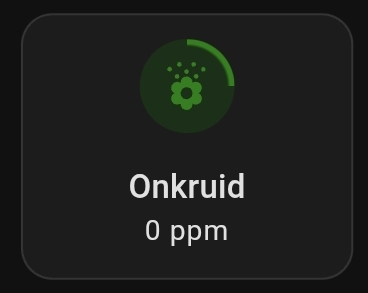

# Home Assistant -<br>HACS Kleenex Pollen Radar

<a href="images_kleenex/kleenex_advanced_presentation.png">

</a>
<a href="index"></a>

Here you find Home Assistant (lovelace) dashboard examples related to the custom HACS integration **Kleenex Pollen Radar** which you can easily use on your own dashboards.

This integration shows Pollen information for grass, weeds and trees.

It's available for the countries: France, Italy, the Netherlands, the United Kingdom and the United States of America.

Check the git repository to find out all the options: https://github.com/MarcoGos/kleenex_pollenradar

---
## Table of Contents
<!-- TOC -->
  * [Installation](#installation)
  * [Dashboard presentations](#dashboard-presentations)
    * [Alternative icons](#alternative-icons)
    * [Default presentation](#default-presentation)
    * [Mushroom](#mushroom)
    * [Tile card with progress indicator](#tile-card-with-progress-indicator)
    * [Tile card: with an extra clickable link and labels](#tile-card-with-an-extra-clickable-link-and-labels)
    * [Specific subtypes forecast](#specific-subtypes-forecast)
  * [Credits](#credits)
<!-- TOC -->

---

## Installation

Here are the steps to setup this HACS `Kleenex Pollen Radar` integration.

* Use this button to install the [Kleenex pollen radar / Scottex](https://github.com/MarcoGos/kleenex_pollenradar) integration:
 
  [](https://my.home-assistant.io/redirect/hacs_repository/?owner=MarcoGos&repository=kleenex_pollenradar&category=Integration)
* Click Add integration
  Now you get one search result.
* Select the Kleenex integration
* Click on the detail page, in the right bottom corner on `Download`
* Click this button to install the integration:

  [](https://my.home-assistant.io/redirect/config_flow_start/?domain=kleenex_pollenradar)
* Select your country and press Submit.

  <a href="images_kleenex/kleenex_setup.png">
  
  </a>

Now you have these five new sensors.

<a href="images_kleenex/kleenex_sensors.png">

</a>

---

### Sub types in attributes

Each sensor contains also in its `attributes` also extra information about different subtypes and a forecast for the upcoming days.

* Trees
  * Hazelaar (NL), Hazel (EN)
  * Pijnboom (NL), Pine (EN)
  * Populier (NL), Poplar (EN)
  * Plataan (NL), Plane (EN)
  * Cipres (NL), Cypress (EN)
  * Els (NL), Els (EN)
  * Iep (NL), Elm (EN)
  * Berk (NL), Birch (EN)
  * Eik (NL), Oak (EN)
* Grass
  * Poaceae (NL), Poaceae (EN)
* Weeds
  * Bijvoet (NL), Mugwort (EN)
  * Ganzevoet (NL), Goosefoot (EN)
  * Ambrosia (NL), Ambrosia (EN)
  * Brandnetel (NL), Nettle (EN)

To see this forecast data use this button to go to the `Developer tools` and filter the entities on with the keyword `kleenex`.
<br>

[](https://my.home-assistant.io/redirect/developer_states/)

Click on the image to see all the forecast and subtype details which are stored in the `attribute` data. 

<a href="images_kleenex/kleenex_forecast.png">

</a>

<!--
I created also a [presentation](#) based on these attributes.
-->

---
## Dashboard presentations

I have different examples of how to present this data on your dashboard:
* [Default as list entities](#default-presentation) - no extra modules needed.\
  <a href="#default-presentation"></a>
* [Mushroom template with bigger icons](#mushroom) - extra mushroom modules required.\
  <a href="#mushroom"></a>
* [Tile card with level indicator](#tile-card-with-progress-indicator) - extra helpers needed to create. With default Dutch text.\
  <a href="#tile-card-with-progress-indicator"></a>
  * [Same as previous but with extra clickable link to Kleenex website and labels](#tile-card-with-an-extra-clickable-link-and-labels)\
    <a href="#tile-card-with-an-extra-clickable-link-and-labels"></a>

---
### Alternative icons

If you want an alternative icon for weeds you can also use `mdi:sprout` or `mdi:flower-pollen`.

<a href="images_kleenex/sprout_icon.jpg">

</a>

<a href="images_kleenex/flower-pollen_icon.jpg">

</a>

---
### Default presentation

When the installation is complete, you get at least three entities which you can add to your dashboard.

This is a default presentation with the entities card.


```yaml

# Sourcecode by vdbrink.github.io
# Entities Card Configuration
type: entities
entities:
  - sensor.kleenex_pollen_radar_huis_grass
  - sensor.kleenex_pollen_radar_huis_trees
  - sensor.kleenex_pollen_radar_huis_weeds

```

---
### Mushroom

This presentation uses English levels and has bigger icons.\
No need to create extra helper sensors.

<a href="images_kleenex/kleenex_mushroom_presentation.jpg">

</a>

This presentation required the HACS integration [lovelace-mushroom](https://github.com/piitaya/lovelace-mushroom) to create a custom presentation.\
Install it via this button:

[](https://my.home-assistant.io/redirect/hacs_repository/?owner=piitaya&repository=lovelace-mushroom&category=integration)

<details>
  <summary><b>> Click here to see the corresponding dashboard YAML code >></b></summary>

```yaml

# Sourcecode by vdbrink.github.io
type: grid
cards:
  - type: custom:mushroom-template-card
    primary: >-
      Trees: 
       Low
       Moderate 
       High
       very High
      
    secondary: "{{ states('sensor.kleenex_pollen_radar_home_trees') }} ppm"
    icon: mdi:tree
    icon_color: |-
      
      
      #006400
      
      #008000
      
      #90EE90
      
      #FFFF00
      
      #FFD700
      
      #FFA500
      
      #FF8C00
      
      #FF0000
      
      #8B0000
      
      #800080
       
    layout: vertical
    entity: sensor.kleenex_pollen_radar_home_trees
    multiline_secondary: false
    tap_action:
      action: more-info
    layout_options:
      grid_columns: 1
      grid_rows: 2
    card_mod:
      style: |
        ha-card {
          --icon-size: 60px;
          background-color: hsla(0, 0%, 0%, 0);
        }
  - type: custom:mushroom-template-card
    primary: >-
      Grass: 
       Low
       Moderate 
       High
       very High
      
    secondary: "{{ states('sensor.kleenex_pollen_radar_home_grass') }} ppm"
    icon: mdi:grass
    icon_color: |-
      
      
      #006400
      
      #008000
      
      #90EE90
      
      #FFFF00
      
      #FFD700
      
      #FFA500
      
      #FF8C00
      
      #FF0000
      
      #8B0000
      
      #800080
       
    layout: vertical
    entity: sensor.kleenex_pollen_radar_home_grass
    multiline_secondary: false
    tap_action:
      action: more-info
    layout_options:
      grid_columns: 1
      grid_rows: 2
    card_mod:
      style: |
        ha-card {
          --icon-size: 60px;
          background-color: hsla(0, 0%, 0%, 0);
        }
  - type: custom:mushroom-template-card
    primary: |-
      Weeds:
      
       Low
       Moderate 
       High
       very High
      
    secondary: "{{ states('sensor.kleenex_pollen_radar_home_weeds') }} ppm"
    icon: mdi:flower-pollen
    icon_color: |-
      
      
      #006400
      
      #008000
      
      #90EE90
      
      #FFFF00
      
      #FFD700
      
      #FFA500
      
      #FF8C00
      
      #FF0000
      
      #8B0000
      
      #800080
       
    layout: vertical
    entity: sensor.kleenex_pollen_radar_home_weeds
    multiline_secondary: false
    tap_action:
      action: more-info
    layout_options:
      grid_columns: 1
      grid_rows: 2
    card_mod:
      style: |
        ha-card {
          --icon-size: 60px;
          background-color: hsla(0, 0%, 0%, 0);
        }

```
</details>

---

### Tile card with progress indicator

Show the entities with matching colors and a level border color.

<a href="images_kleenex/kleenex_colored_presentation.png">

</a>

The entities are clickable which show you the values over time:


For this advanced presentation, you also need to add **three new sensors** to divide the ppm number into a textual value.
This value will be used as text, but also be used for different colors and an indication circle of the intensity.
<a name="lovelace-card-mod"/>
And this presentation required the HACS module [lovelace-card-mod](https://github.com/thomasloven/lovelace-card-mod) to add custom CSS styling like the progress circle.\
Install it via this button:

[](https://my.home-assistant.io/redirect/hacs_repository/?owner=thomasloven&repository=lovelace-card-mod&category=integration)

#### Helper sensors

You need to add these three helper sensors first.

This can be done to the sensor section in the file `configuration.yaml` with this code.\
Or create them via the [HA helper frontend](#via-the-frontend), see below this code block.

<details>
  <summary><b>> Click here to see the corresponding dashboard YAML code >></b></summary>

```yaml

# Sourcecode by vdbrink.github.io
# configuration.yaml
- platform: template
  sensors:
    pollen_grass_concentration:
      value_template: >-
        
         Laag
         Gemiddeld
         Hoog
         Zeer Hoog
        
    pollen_trees_concentration:
      value_template: >-
        
         Laag
         Gemiddeld
         Hoog
         Zeer Hoog
        
    pollen_weeds_concentration:
      value_template: >-
        
         Laag
         Gemiddeld
         Hoog
         Zeer Hoog
        

```
</details>

#### Via the frontend

The other way is via the frontend, you can create a new template via the **Settings** menu item,
then go to **Devices and Services** and select **Helpers**.\
This button directly opens the **Helpers** page in your Home Assistant:

[](https://my.home-assistant.io/redirect/helpers/)

Select the bottom-right button `+ CREATE HELPER`,
select **Template** then one of the option **Template a sensor**

<a href="images_kleenex/kleenex_sensor_create_template_helper.png">

</a>

Fill the fields like this.
Do this three times also for the `pollen_weeds_concentration` and `pollen_trees_concentration`

<a href="images_kleenex/kleenex_sensor_create_template.png">

</a>

Read more how to add a template (via the HA frontend itself) here on my [advanced Templates page](homeassistant_templates#how-to-add-a-template).

#### Dashboard code

This is the corresponding dashboard YAML code for the screenshot. 

<details>
  <summary><b>> Click here to see the corresponding dashboard YAML code >></b></summary>

```yaml

# Sourcecode by vdbrink.github.io
# Horizontal Stack Card Configuration
type: horizontal-stack
cards:
  - entity: sensor.kleenex_pollen_radar_huis_weeds
    name: Onkruid
    type: tile
    vertical: true
    tap_action:
      action: more-info
    card_mod:
      style: |
        .icon-container {
          
          
          
                  
          
          border-radius: 24px;
          background: radial-gradient(var(--card-background-color) 60%,transparent calc(60% + 1px)),
          conic-gradient({{level_color}} {{percentage}}% 0%,
          var(--card-background-color) 0% 100%);
        }
        ha-tile-icon {
          
                        
          
          --tile-color: {{level_color}};
        }
  - entity: sensor.kleenex_pollen_radar_huis_grass
    name: Gras
    type: tile
    vertical: true
    tap_action:
      action: more-info
    card_mod:
      style: |
        .icon-container {
          
          
          
                  
          
          border-radius: 24px;
          background: radial-gradient(var(--card-background-color) 60%,transparent calc(60% + 1px)),
          conic-gradient({{level_color}} {{percentage}}% 0%,
          var(--card-background-color) 0% 100%)
        }
        ha-tile-icon {
          
          
          ;
          --tile-color: {{level_color}};
        }
  - entity: sensor.kleenex_pollen_radar_huis_trees
    name: Bomen
    type: tile
    vertical: true
    tap_action:
      action: more-info
    card_mod:
      style: |
        .icon-container {
           
           
          
                  
          
          border-radius: 24px;
          background: radial-gradient(var(--card-background-color) 60%,transparent calc(60% + 1px)),
          conic-gradient({{level_color}} {{percentage}}% 0%,
          var(--card-background-color) 0% 100%);
        }
        ha-tile-icon {
          
          
          ;
          --tile-color: {{level_color}};
        }

```
</details>

#### Help

If you don't get the progress indicator visible, this could be due to different reasons.
How this works:
* The helper sensors you also need to create converts the numbered value `sensor.kleenex_pollen_radar_huis_grass` to `pollen_grass_concentration` 
that contains a textual value `Laag` (Dutch for low) for example.
* This line converts this text to a color, `Laag` -> `green` etc.\
  ```yaml```
* This line defines the progress of the darker circle around the icon.
  ```yaml```    
* This CSS code defines the background color and circle.
    ```yaml
    
    border-radius: 24px;
    background: radial-gradient(var(--card-background-color) 60%,transparent calc(60% + 1px)),
    conic-gradient({{level_color}} {{percentage}}% 0%,
    var(--card-background-color) 0% 100%);
    
    ```
* This custom CSS requires the extra HACS integration `lovelace-card-mod`, is this installed? See [earlier on this page](#lovelace-card-mod) how to do this.

---
### Tile card: with an extra clickable link and labels

Show a clickable link to the Kleenex website, the entities with matching colors and colored labels, like this:

<a href="images_kleenex/kleenex_advanced_presentation.png">

</a>

<details>
  <summary><b>> Click here to see the corresponding dashboard YAML code >></b></summary>

```yaml

# Sourcecode by vdbrink.github.io
# Entities Card Configuration
type: vertical-stack
cards:
  - type: heading
    heading: Pollen in de lucht
    heading_style: title
    card_mod:
      class: class-section-heading
    tap_action:
      action: url
      url_path: https://www.kleenex.nl/pollenradar
  - type: horizontal-stack
    cards:
      - entity: sensor.kleenex_pollen_radar_huis_weeds
        name: Onkruid
        type: tile
        vertical: true
        tap_action:
          action: more-info
        card_mod:
          style: |
            .icon-container {
              
              
              
                      
              
              border-radius: 24px;
              background: radial-gradient(var(--card-background-color) 60%,transparent calc(60% + 1px)),
              conic-gradient({{level_color}} {{percentage}}% 0%,
              var(--card-background-color) 0% 100%);
            }
            ha-tile-icon {
              
                            
              
              --tile-color: {{level_color}};
            }
      - entity: sensor.kleenex_pollen_radar_huis_grass
        name: Gras
        type: tile
        vertical: true
        tap_action:
          action: more-info
        card_mod:
          style: |
            .icon-container {
              
              
              
                      
              
              border-radius: 24px;
              background: radial-gradient(var(--card-background-color) 60%,transparent calc(60% + 1px)),
              conic-gradient({{level_color}} {{percentage}}% 0%,
              var(--card-background-color) 0% 100%)
            }
            ha-tile-icon {
              
              
              ;
              --tile-color: {{level_color}};
            }
      - entity: sensor.kleenex_pollen_radar_huis_trees
        name: Bomen
        type: tile
        vertical: true
        tap_action:
          action: more-info
        card_mod:
          style: |
            .icon-container {
               
               
              
                      
              
              border-radius: 24px;
              background: radial-gradient(var(--card-background-color) 60%,transparent calc(60% + 1px)),
              conic-gradient({{level_color}} {{percentage}}% 0%,
              var(--card-background-color) 0% 100%);
            }
            ha-tile-icon {
              
              
              ;
              --tile-color: {{level_color}};
            }
  - type: horizontal-stack
    cards:
      - type: markdown
        entity: sensor.pollen_weeds_concentration
        card_mod:
          style: |
            ha-card {
              background: rgb(128,193,177);
              color:
                
                
                
                {{level_color}};
              font-weight: 800;
              text-align: center;
            }
        content: |
          {{states(config.entity)}}
      - type: markdown
        entity: sensor.pollen_grass_concentration
        card_mod:
          style: |
            ha-card {
              background: rgb(128,193,177);
              color:
                
                
                
                {{level_color}};
              font-weight: 800;
              text-align: center;
            }
        content: |
          {{states(config.entity)}}
      - type: markdown
        entity: sensor.pollen_trees_concentration
        card_mod:
          style: |
            ha-card {
              background: rgb(128,193,177);
              color:
                
                
                
                {{level_color}};
              font-weight: 800;
              text-align: center;
            }
        content: |
          {{states('sensor.pollen_trees_concentration')}}

```
</details>

---

### Specific subtypes forecast

I created a bar graph with all tree data for the upcoming days.
I used for this presentation the HACS [ApexCharts Card](https://github.com/RomRider/apexcharts-card) integration.

Click this button to install the ApexCharts Card:

[](https://my.home-assistant.io/redirect/hacs_repository/?owner=RomRider&repository=apexcharts-card&category=module)

<a href="images_kleenex/attribute_tree_data_apexcharts.jpg">

</a>


<details>
  <summary><b>> Click here to see the corresponding dashboard YAML code >></b></summary>

```yaml

# Sourcecode by vdbrink.github.io
# Entities Card Configuration
type: custom:apexcharts-card
header:
  show: true
  title: Kleenex Pollen Radar (Huis) - Trees
  show_states: true
  colorize_states: true
now:
  show: true
graph_span: 4d
span:
  start: day
  offset: +1d
series:
  - name: Hazelaar
    entity: sensor.kleenex_pollen_radar_huis_trees
    type: column
    color: "#1f77b4" # Blue
    data_generator: |
      let data = [];
      if (entity.attributes.current) {
        data.push([new Date(entity.attributes.current.date).getTime(), entity.attributes.current.details.find(t => t.name === "Hazelaar").value]);
      }
      return data.concat(entity.attributes.forecast.map(d => [new Date(d.date).getTime(), d.details.find(t => t.name === "Hazelaar").value]));
  - name: Iep
    entity: sensor.kleenex_pollen_radar_huis_trees
    type: column
    color: "#ff7f0e" # Orange
    data_generator: |
      let data = [];
      if (entity.attributes.current) {
        data.push([new Date(entity.attributes.current.date).getTime(), entity.attributes.current.details.find(t => t.name === "Iep").value]);
      }
      return data.concat(entity.attributes.forecast.map(d => [new Date(d.date).getTime(), d.details.find(t => t.name === "Iep").value]));
  - name: Els
    entity: sensor.kleenex_pollen_radar_huis_trees
    type: column
    color: "#2ca02c" # Green
    data_generator: |
      let data = [];
      if (entity.attributes.current) {
        data.push([new Date(entity.attributes.current.date).getTime(), entity.attributes.current.details.find(t => t.name === "Els").value]);
      }
      return data.concat(entity.attributes.forecast.map(d => [new Date(d.date).getTime(), d.details.find(t => t.name === "Els").value]));
  - name: Populier
    entity: sensor.kleenex_pollen_radar_huis_trees
    type: column
    color: "#d62728" # Red
    data_generator: |
      let data = [];
      if (entity.attributes.current) {
        data.push([new Date(entity.attributes.current.date).getTime(), entity.attributes.current.details.find(t => t.name === "Populier").value]);
      }
      return data.concat(entity.attributes.forecast.map(d => [new Date(d.date).getTime(), d.details.find(t => t.name === "Populier").value]));
  - name: Eik
    entity: sensor.kleenex_pollen_radar_huis_trees
    type: column
    color: "#9467bd" # Purple
    data_generator: |
      let data = [];
      if (entity.attributes.current) {
        data.push([new Date(entity.attributes.current.date).getTime(), entity.attributes.current.details.find(t => t.name === "Eik").value]);
      }
      return data.concat(entity.attributes.forecast.map(d => [new Date(d.date).getTime(), d.details.find(t => t.name === "Eik").value]));
  - name: Plataan
    entity: sensor.kleenex_pollen_radar_huis_trees
    type: column
    color: "#8c564b" # Brown
    data_generator: |
      let data = [];
      if (entity.attributes.current) {
        data.push([new Date(entity.attributes.current.date).getTime(), entity.attributes.current.details.find(t => t.name === "Plataan").value]);
      }
      return data.concat(entity.attributes.forecast.map(d => [new Date(d.date).getTime(), d.details.find(t => t.name === "Plataan").value]));
  - name: Berk
    entity: sensor.kleenex_pollen_radar_huis_trees
    type: column
    color: "#e377c2" # Pink
    data_generator: |
      let data = [];
      if (entity.attributes.current) {
        data.push([new Date(entity.attributes.current.date).getTime(), entity.attributes.current.details.find(t => t.name === "Berk").value]);
      }
      return data.concat(entity.attributes.forecast.map(d => [new Date(d.date).getTime(), d.details.find(t => t.name === "Berk").value]));
  - name: Cipres
    entity: sensor.kleenex_pollen_radar_huis_trees
    type: column
    color: "#7f7f7f" # Grey
    data_generator: |
      let data = [];
      if (entity.attributes.current) {
        data.push([new Date(entity.attributes.current.date).getTime(), entity.attributes.current.details.find(t => t.name === "Cipres").value]);
      }
      return data.concat(entity.attributes.forecast.map(d => [new Date(d.date).getTime(), d.details.find(t => t.name === "Cipres").value]));
apex_config:
  chart:
    type: bar
  xaxis:
    type: datetime
  plotOptions:
    bar:
      columnWidth: "60%" # Adjust for better visibility
  tooltip:
    enabled: true
  legend:
    show: true
    position: bottom
    markers:
      fillColors:
        - "#1f77b4" # Hazelaar
        - "#ff7f0e" # Iep
        - "#2ca02c" # Els
        - "#d62728" # Populier
        - "#9467bd" # Eik
        - "#8c564b" # Plataan
        - "#e377c2" # Berk
        - "#7f7f7f" # Cipres
  
```
</details>

<br>

Good luck with the integration!

## Credits

I got the ideas for the presentations from the HA forum:
[[Help request] Pollen sensor Dutch hooikoortsradar.nl](https://community.home-assistant.io/t/help-request-pollen-sensor-dutch-hooikoortsradar-nl/524633)\
If you got any questions you can ask them also here.

---
[^^ Top](#table-of-contents)

[<< See also my other Home Assistant tips and tricks](index)

[Home Assistant integration: Afvalbeheer >>](homeassistant_hacs_afvalbeheer)

[Home Assistant: Templates >>](homeassistant_templates)
