style="float:right;margin-left:15px"

#  Which Home Assistant hardware?
*Will it be a N100, Raspberry Pi, HP T630 Thin client, or anything else...*

## Introduction

You maybe already have one or more vendor-locked hubs with some smart sensors, each hub has its own app.
And ALL your data is stored in the big guys cloud.
And there is no way you can let them work nicely together or combine it in one app.

"Home automations with Home Assistant" you heard about it, you read about it, and it all sounds as the holy grail!
You've made the choice to dive into the rabbit hole called "Home Assistant" (aka HA).

<a href="images_hardware/beelink_front_back.jpg">
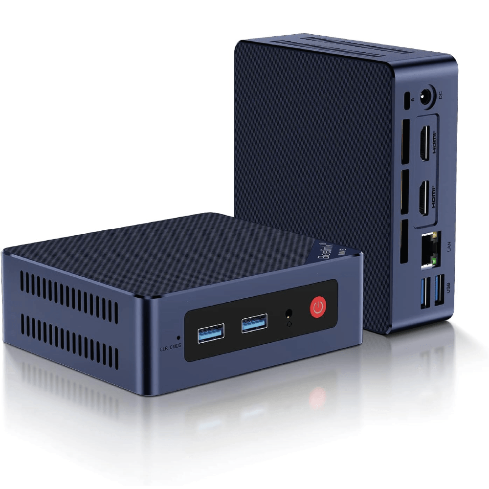
</a>

Then comes the question: On which hardware should I run it?
It can be installed on a whole range of hardware, like a **Mini PC, Home Assistant Green, Home Assistant Yellow, Raspberry Pi, old laptop/desktop, thin client, etc...**\
I explain on this page which one of these systems fits the best for your situation and what the differences between the hardware are.

I don't mention ALL possible options here, just in my eyes, the most popular ones.

After reading this page, if you still have questions, about the choice you need to make, don't contact me personally, but use the [social media channels or forums](#need-help).
There are also a lot of other smart and experienced people who can help you further.

> There are also links on this page which are affiliate links, you pay the same price, AND you support this blog.

---

## Table of Contents
<!-- TOC -->
  * [Terminology](#terminology)
  * [Older hardware](#older-hardware)
    * [Desktop](#desktop)
    * [Laptop](#laptop)
    * [Thin client](#thin-client)
    * [NAS](#nas)
  * [New hardware](#new-hardware)
    * [All-in-one mini PCs](#all-in-one-mini-pcs)
    * [Home Assistant Green vs Yellow](#home-assistant-green-vs-yellow)
    * [Raspberry Pi](#raspberry-pi)
  * [Need help?](#need-help)
  * [Remarks](#remarks)
<!-- TOC -->

---

## Terminology

First, I want to explain some terms that are used here, and frequently in discussions about this topic.

| Term        | Explanation                                                                                                                                                           | 
|-------------|-----------------------------------------------------------------------------------------------------------------------------------------------------------------------|
| 12th Gen    | The version of Intel Core **processors**. The name for it is 'Alder Lake' and is used in the popular N100 mini PC's.                                                  | 
| Bare metal  | It refers to a **physical computer** system running without (an operating system or) virtualization layer (like Docker, Proxmox), directly utilizing the hardware.    | 
| Docker      | It's is an **application** that let you package a full configured app in a single file and run it direct on a machine with only configure some (optional) parameters. | 
| Form factor | A common design for a PC group.                                                                                                                                       | 
| HA          | Abbreviation for **Home Assistant**                                                                                                                                   | 
| HAOS        | Abbreviation for **Home Assistant Operating System**                                                                                                                  | 
| Mini PC     | This refer to the size of popular **small pc** cases.                                                                                                                 | 
| NAS         | Abbreviation for **Network-Attached Storage** a network computer which can contain multiple hard disk that can be access by all devices in the network.               | 
| NUC         | Abbreviation for **Next Unit of Computing** a small (4"x4") but complete desktop pc series, original from Intel and now take over by Asus.                            | 
| N100        | It's a popular, low power consuming, but powerful Intel **processor** number, mostly used in mini PCs. Others N-series processors are N95, N200, N305.                | 
| Proxmox     | Is a Debian Linux **Operating System** where applications can be 'installed' via virtual machines and (Docker) containers.                                            | 
| T630/T620   | A small, compact and energy effective Thin client **PC model** (like a NUC) by HP. A cheap, second hands, opportunity to run HA on.                                   | 
| Thin client | An energy effective **PC** with just enough power to connect to a central system where the heavy tasks runs.                                                          | 

---

## Older hardware

> Target group: If you still have some unused hardware available. Or buy it inexpensive second hand if you want to find out this is something for you.

Make sure the hardware has at least 8 GB RAM and 64 GB SSD hard disk space to install Home Assistant on and have enough space to install also other related applications.

Computer stores or on sites, like Ebay, they sell refurbished computers, mostly did they them get them bulk from companies.
Clean them, upgrade the memory or hard disk and sell them. 
These computers are not the newest but have enough power and can run for another few years without any problem.
This is an affordable way to buy hardware to test HA on.

### Desktop

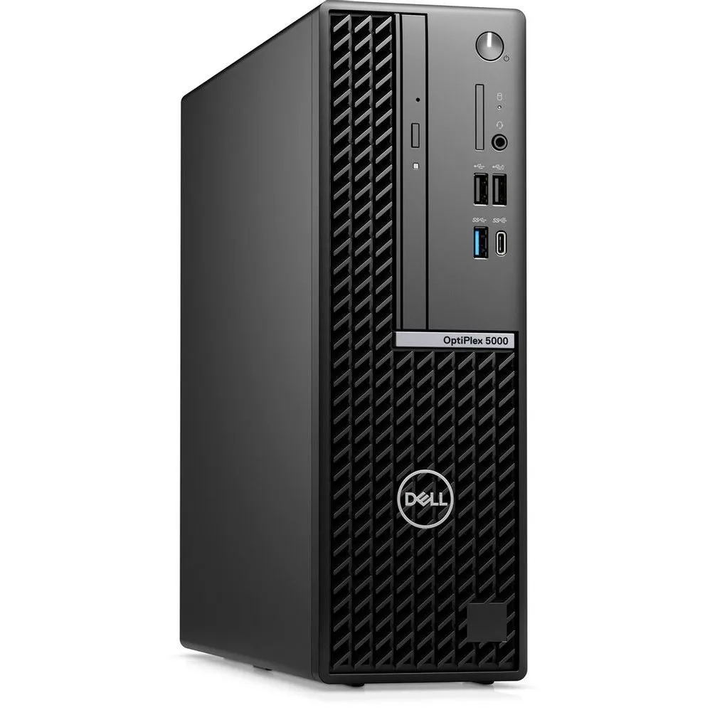
If you still have a desktop PC lying around, you can use it to run Home Assistant on.

The advantage is that you can easily upgrade hardware elements like memory, processor or extra video card power if needed.

The disadvantage is they use more power than a laptop or mini PC.

### Laptop

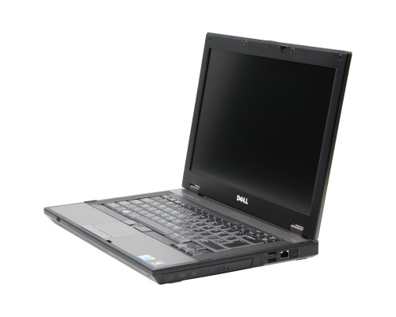
A spare laptop can also be used as a server to run Home Assistant on.

The advantage is it's energy-effective and compact.

The disadvantage can be the battery constant on the power or charge daily. 
Some laptops also run without a battery, which is the best solution.

### Thin client

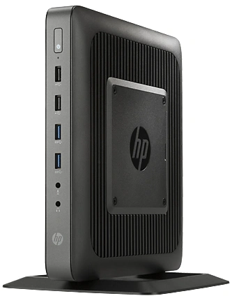
A Thin client is compact, energy effective, silent and not expensive. 

HP has the T630 or T620 which are often mentioned as good hardware.\
Dell has also Thin clients: the Wyse 5060 or 7020.

They are used in offices and now widely available second hand on sites like Ebay.
Even with HA already installed on it.

### NAS

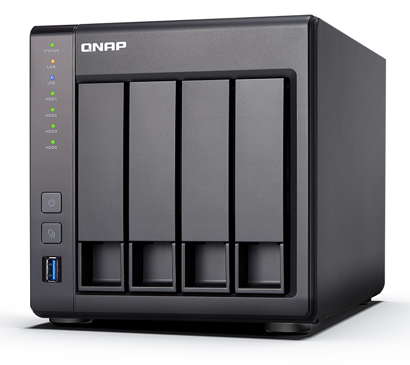
A NAS, is a Network-Attached Storage mostly used as shared network storage, 
but there are models that have enough power to also install your own Docker application on.

A Synology or QNAP NAS are examples of that.

[Install HA on a NAS](https://www.home-assistant.io/installation/alternative/#install-home-assistant-container)

---

## New hardware

### All-in-one mini PCs

> It's a kind of mini desktop PC with laptop features.

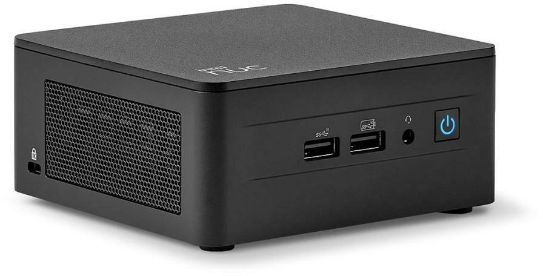
Intel started with the all-in-one NUC mini PCs.
They have a small nice-looking and silent square form factor which you also can place ON your desk.
They contain all required hardware in it and with many external ports (USB, network, display). 

After this success, many other manufacturers followed with their own versions of this form factor.
 
The current most popular hardware to run Home Assistant on are the all-in-one mini PCs. 
They have enough power to run Home Assistant, together with a lot other applications.
Without to worry about latency or any other performance issues for the best experience.

> Target group: More advanced and demanding users



[AliExpress](https://s.click.aliexpress.com/e/_oFB63ZC)
[AliExpress](https://s.click.aliexpress.com/e/_ooqM2zc)
[AliExpress](https://s.click.aliexpress.com/e/_oFB63ZC)
[AliExpress](https://s.click.aliexpress.com/e/_oFyTKN0)
[AliExpress](https://s.click.aliexpress.com/e/_ol4rnNM)
[AliExpress](https://s.click.aliexpress.com/e/_oEKgH2g)
[AliExpress](https://s.click.aliexpress.com/e/_okQwYnU)

[Amazon US](https://amzn.to/4gV8vqH)
[Amazon US](https://amzn.to/4b7HYVT)
[Amazon US](https://amzn.to/3W6s5Zk)
[Amazon US](https://amzn.to/4gRClfx)
[Amazon US](https://amzn.to/3XeMBYl)
[Amazon US](https://amzn.to/4gqln8T)
[Amazon US](https://amzn.to/3D2V7CU)

[Amazon UK](https://amzn.to/3D31xSr)
[Amazon UK](https://amzn.to/3D1TVQa)
[Amazon UK](https://amzn.to/4hKHeIH)
[Amazon UK](https://amzn.to/4gSCdMZ)
[Amazon UK](https://amzn.to/3EQDoiH)
[Amazon UK](https://amzn.to/4k6T5T1)
[Amazon UK](https://amzn.to/41rdn2a)

[Amazon DE](https://amzn.to/3QuWBJh)
[Amazon DE](https://amzn.to/41dcbhL)
[Amazon DE](https://amzn.to/3D31YMz)
[Amazon DE](https://amzn.to/4gSCEXD)
[Amazon DE](https://amzn.to/4gRdTen)
[Amazon DE](https://amzn.to/431bmLo)
[Amazon DE](https://amzn.to/3D3AA0W)

[Amazon NL](https://amzn.to/3ERkmbZ)
[Amazon NL](https://amzn.to/4i9askm)
[Amazon NL](https://amzn.to/4iclwgD)
[Amazon NL](https://amzn.to/3XgabUK)
[Amazon NL](https://amzn.to/41pTFnv)
[Amazon NL](https://amzn.to/4kcvyAc)
[Amazon NL](https://amzn.to/3QwKfjQ)

#### Basic

| Model                | N150                          | N100                           | N97                           | N95                           |  
|----------------------|-------------------------------|--------------------------------|-------------------------------|-------------------------------|
| **Model**            | Mini S13                      | Mini S12 Pro                   | G2                            | Mini S12                      |  
| **Brand**            | Beelink                       | Beelink                        | GMKtec                        | Beelink                       |  
| **Processor**        | 14th Gen Twin Lake Intel-N150 | 13th Gen Alder Lake Intel-N100 | 12th Gen Intel Alder Lake-N97 | 12th Gen Intel Alder Lake-N95 |  
| **CPU**              | 3.6 GHz                       | 1.8 GHz with 3.4 GHz turbo     | 1.8 GHz with 3.6 GHz turbo    | 2 GHz with 3.4 GHz turbo      |  
| **Memory**           | 16 GB                         | 16 GB                          | 12 GB                         | 8 GB                          |  
| **Hard disk**        | 512 GB                        | 500 GB                         | 512 GB                        | 256 GB                        |  
| **Cores / Threads**  | 8 / 8                         | 4 / 4                          | 4 / 4                         | 4 / 4                         |  
| **Price indication** | &euro; 220                    | &euro; 240                     | &euro; 150                    | &euro; 200                    |  
| **AliExpress**       | {{n150_global}}               | {{n100_global}}                | {{n97_global}}                | {{n95_global}}                |  
| **Amazon US**        | {{n150_us}}                   | {{n100_us}}                    | {{n97_us}}                    | {{n95_us}}                    |  
| **Amazon NL**        | {{n150_uk}}                   | {{n100_nl}}                    | {{n97_nl}}                    | {{n95_nl}}                    |  
| **Amazon UK**        | {{n150_uk}}                   | {{n100_uk}}                    | {{n97_uk}}                    | {{n95_uk}}                    |  
| **Amazon DE**        | {{n150_de}}                   | {{n100_de}}                    | {{n97_de}}                    | {{n95_de}}                    |  

#### High end

If you really want to run also heavy processes with small AI models on the server, you can choose for a high-end model.

max-width: 150px; height: auto; display: block; margin: auto;padding:15px
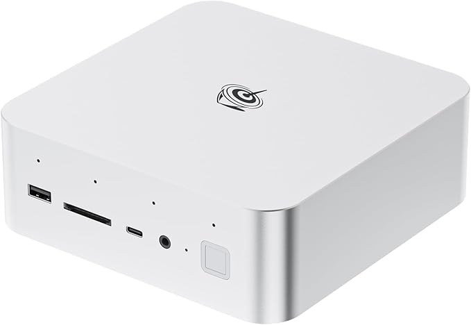

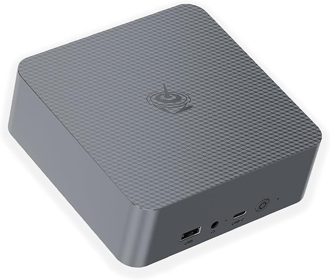

| Model                | SER9               | 185H               | 12650H            | 
|----------------------|--------------------|--------------------|-------------------|
| **Model**            | {{ser9_img}}       | {{185h_img}}       | {{12650h_img}}    | 
| **Model**            | SER9               | GTi14              | EQi12             | 
| **Brand**            | Beelink            | Beelink            | Beelink           | 
| **Processor**        | AMD Ryzen 9 HX 370 | Intel Core Ultra 9 | Core i7-12650H    | 
| **CPU**              | 5.1 GHz            | 5.1 GHz            | 4.7 GHz           | 
| **Memory**           | 32 GB              | 32 GB              | 24 GB             | 
| **Hard disk**        | 1024 GB            | 1024 GB            | 512 GB            | 
| **Cores / Threads**  | 12 / 24            | 16 / 22            | 10 / 16           | 
| **Price indication** | &euro; 1400        | &euro; 1200        | &euro; 600 - 700  | 
| **AliExpress**       | {{ser9_global}}    | {{185h_global}}    | {{12650h_global}} | 
| **Amazon US**        | {{ser9_us}}        | {{185h_us}}        | {{12650h_us}}     | 
| **Amazon NL**        | {{ser9_nl}}        | {{185h_nl}}        | {{12650h_nl}}     | 
| **Amazon UK**        | {{ser9_uk}}        | {{185h_uk}}        | {{12650h_uk}}     | 
| **Amazon DE**        | {{ser9_de}}        | {{185h_de}}        | {{12650h_de}}     | 

<!--
latency

https://www.cnx-software.com/2024/05/04/intel-processor-n95-vs-n97-vs-n100-vs-core-i3-n305-benchmarks-comparison/

https://www.facebook.com/share/p/VWSek5d4MwHSbFde/
-->

---
### Home Assistant Green vs Yellow

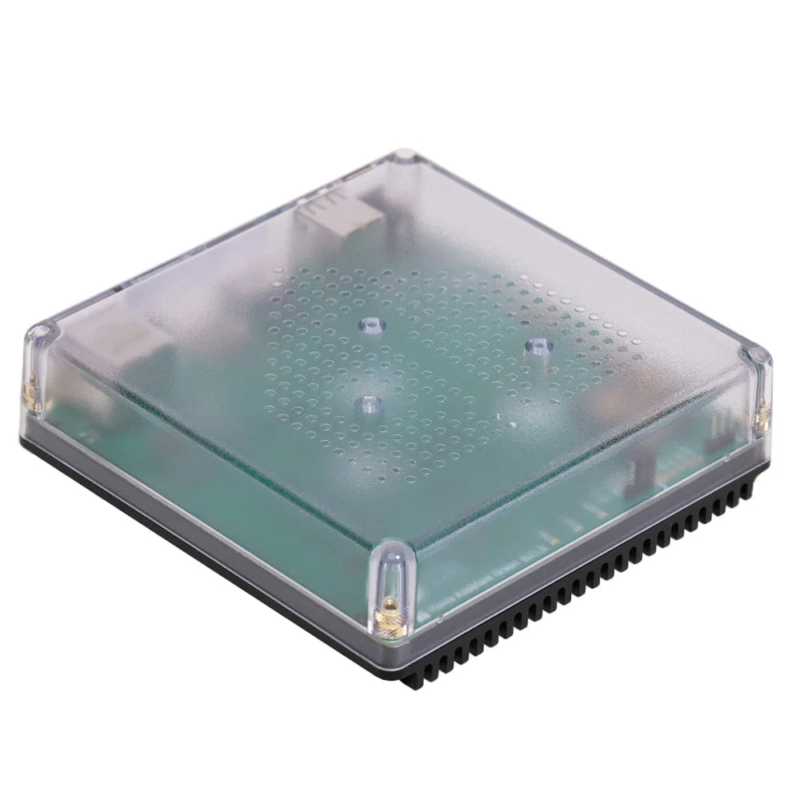
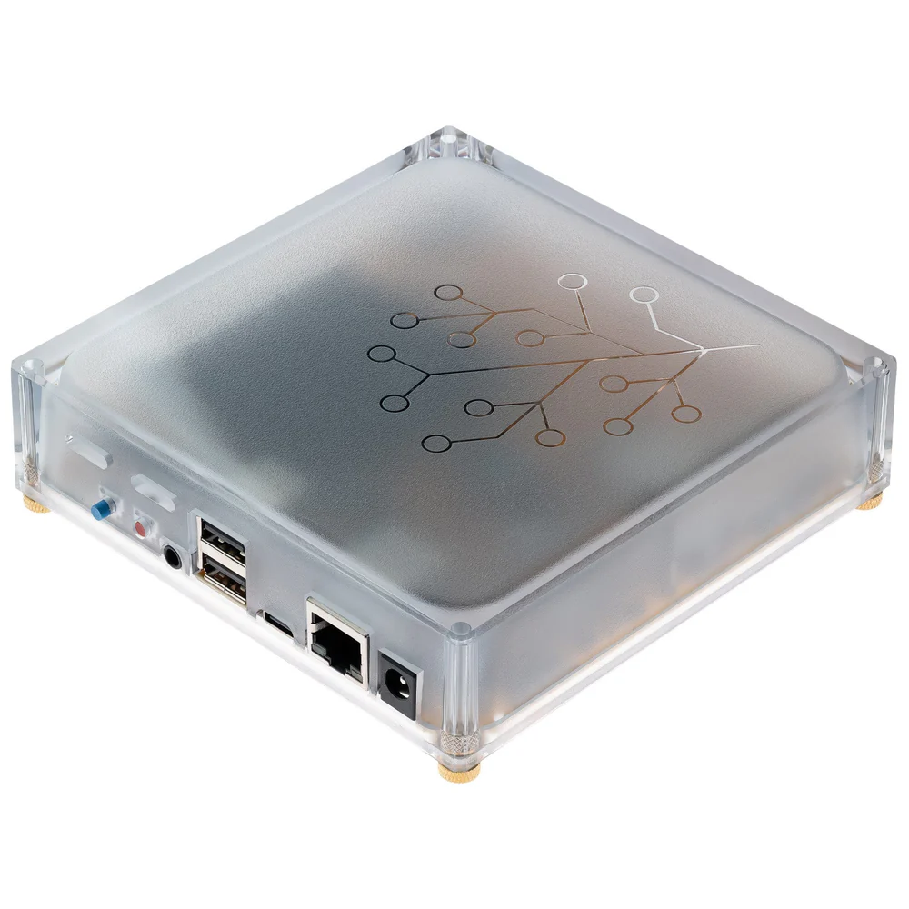

|                               | Home Assistant Green                                                            | Home Assistant Yellow                                                        |
|-------------------------------|---------------------------------------------------------------------------------|------------------------------------------------------------------------------|
| **Photo**                     | {{ha_green_img}}                                                                | {{ha_yellow_img}}                                                            | 
| **Website**                   | https://www.home-assistant.io/green/                                            | https://www.home-assistant.io/yellow/                                        | 
| **Brand**                     | Nabu Casa                                                                       | Nabu Casa                                                                    | 
| **Operating system**          | Home Assistant Operating System                                                 | Home Assistant Operating System                                              | 
| **Processor**                 | 1.8 Ghz Quad core AMD                                                           | (Not included: Raspberry Pi Compute Module 4 (CM 4))                         | 
| **Working memory (RAM)**      | 4 GB                                                                            |                                                                              | 
| **Hard disk**                 | 32 GB external flash drive                                                      | (Not included: )                                                             | 
| **Local protocols**           | Only WiFi                                                                       | WiFi, Zigbee 3.0, OpenThread and Matter                                      | 
| **Power consumption on load** | 3 W                                                                             | 5-9 W                                                                        | 
| **Target group**              | beginner                                                                        | medior                                                                       | 
| **Price range**               | $ 99 / &euro; 110                                                               | (+ costs for RAM, CM4, hard disk)                                            | 
| **Pros**                      | * Cheap * Plug-and-play                                                      | * More RAM * More and faster hard disk * Support for Zigbee and Matter | 
| **Cons**                      | By default **no** Zigbee or Matter support, extra stick needed. Slow hard disk. |                                                                              | 
| **Buy link**                  | [NL](https://www.robbshop.nl/home-assistant-green-smart-hub)                    |                                                                              |
---

### Raspberry Pi

The Raspberry Pi models where for a long term very popular to run Home Assistant on. 
Because of the all-in-one board, with low energy consumption and it was cost-efficient.

Currently, they are nowadays less popular due to new [all-in-one mini PCs](#all-in-one-mini-pcs) like the `N100` which are more powerful and have more memory and storage.

Click to go to the original post:

<a href="https://www.facebook.com/groups/HomeAssistant/permalink/3935518023386205/">
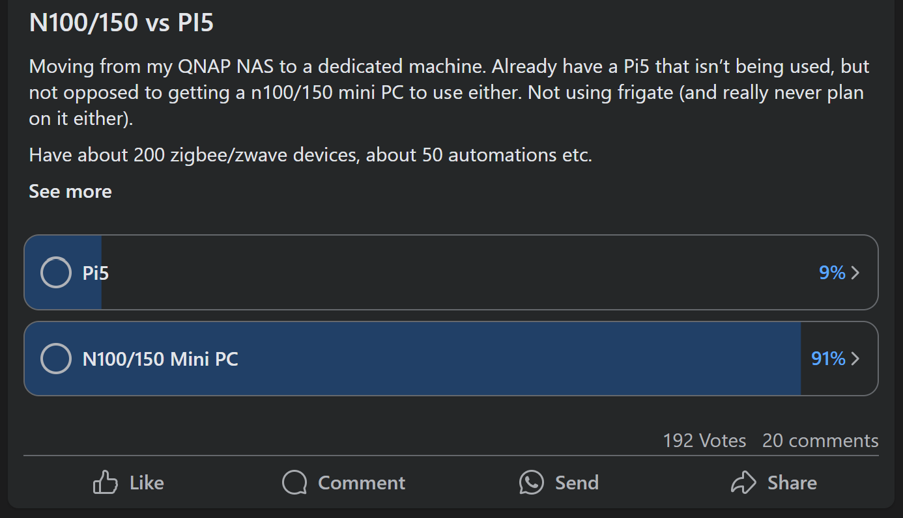
</a>

[AliExpress](https://s.click.aliexpress.com/e/_oDWgdri)
[AliExpress](https://s.click.aliexpress.com/e/_oEyiS2c)
[AliExpress](https://s.click.aliexpress.com/e/_oCaXY9K)

N/A
[Amazon US](https://amzn.to/41vT9Ez)
[Amazon US](https://amzn.to/4hg55Pz)

[Amazon UK](https://amzn.to/4kg9YL2)
[Amazon UK](https://amzn.to/3QDlXom)
[Amazon UK](https://amzn.to/4hTmwGt)

[Amazon DE](https://amzn.to/3XgLK9J)
[Amazon DE](https://amzn.to/3Qz8TAi)
[Amazon DE](https://amzn.to/3Xj2ygm)

[Amazon NL](https://amzn.to/3EU3Mbq)
[Amazon NL](https://amzn.to/3DaETHT)
[Amazon NL](https://amzn.to/4kcHm5j)

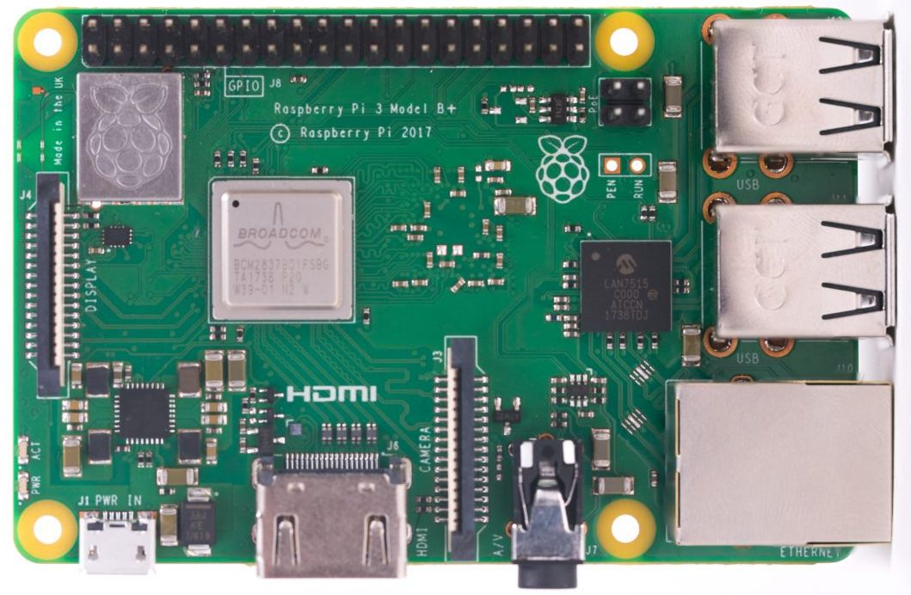
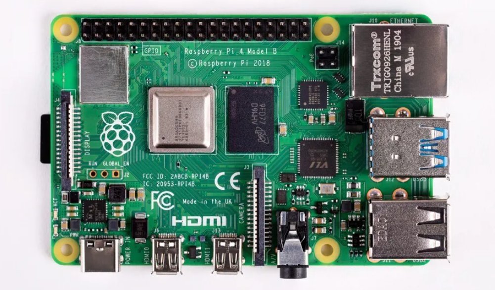
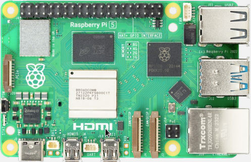

Check the website for even more details about the boards if you want to know more about them.

|                                   | Raspberry Pi 5 - 8 GB                   | Raspberry Pi 4B - 8 GB              | Raspberry Pi 3B+ - 1 GB       |
|-----------------------------------|-----------------------------------------|-------------------------------------|-------------------------------|
| **Photo**                         | {{rpi5_img}}                            | {{rpi4_img}}                        | {{rpi3_img}}                  |
| **Releases**                      | 10 - 2023                               | 05 - 2020                           | 03 - 2018                     |
| **Remarks**                       | Latest model                            | A very good device to run HA        | Multiple upgrades: A+, B, B+  |
| **Performance**                   |                                         | 3x faster then the Pi 3             | Less resources, only 1 GB mem |
| **Processor**                     | Cortex-A76 ARM quad-core                | Cortex-A72 (ARM v8) quad-core       | Cortex-A53 quad-core          |
| **Working memory (RAM)**          | 8 GB (also available in 2, 4, 16 GB) | 8 GB (also available in 2, 4 GB) | 1 GB                          |
| **CPU**                           | 2.4 GHz                                 | 1.5 GHz                             | 1.4GHz                        |
| **Cores / Threads**               | 4                                       | 4                                   | 4                             |
| **Power consumption idle / load** | 3 W / 6 W                               | 3 W / 6 W                           | 2 W / 5 W                     |
| **Price range**                   | &euro; 100 - 140                        | &euro; 90                           | &euro; 41                     |
| **AliExpress**                    | {{rpi5_global}}                         | {{rpi4_global}}                     | {{rpi3_global}}               |
| **Amazon US**                     | {{rpi5_us}}                             | {{rpi4_us}}                         | {{rpi3_us}}                   |
| **Amazon NL**                     | {{rpi5_nl}}                             | {{rpi4_nl}}                         | {{rpi3_nl}}                   |
| **Amazon UK**                     | {{rpi5_uk}}                             | {{rpi4_uk}}                         | {{rpi3_uk}}                   |
| **Amazon DE**                     | {{rpi5_de}}                             | {{rpi4_de}}                         | {{rpi3_de}}                   |
---

## Need help?

If you need help in your choice, DON'T contact me personally, but use the social media communities or fora.
There are also a lot other smart people who can help you further.

* [Home Assistant forum](https://community.home-assistant.io/)
* [Reddit - Home Assistant](https://www.reddit.com/r/homeassistant/)
* [Reddit - MiniPCs](https://www.reddit.com/r/MiniPCs/)
* [Facebook - Home Assistant worldwide](https://www.facebook.com/homeassistantio)
* [Facebook - Home Assistant Dutch](https://www.facebook.com/groups/2111849735740313)
* [Discord Chat Server](https://www.home-assistant.io/join-chat)

---

## Remarks
I hope this pages helps you to make a choice in the hardware you want to run Home Assistant on.

Do you have any other remarks, suggestions, spell errors found after reading this page?\
Please let me know, you can reach me in one of mine social media posts or create a [GitHub issue](https://github.com/vdbrink/vdbrink.github.io/issues).
