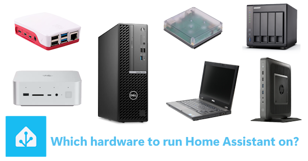

style="float:right;margin-left:15px"

# Which hardware to run Home Assistant on?

*Will it be a N100, Raspberry Pi, HP T630 Thin client, or anything else...*

## Introduction

Maybe you have one or more vendor-locked hubs with its own smart sensors, and each hub has its own app.
And ALL your data is stored in the big guys cloud.
And there is no way you can let them work nicely together or combine it in one app.

"Home automations with Home Assistant" you heard about it, you read about it, and it all sounds as the holy grail!
You've made the choice to dive into the rabbit hole called "Home Assistant" (aka HA).

Or if you're already running Home Assistant on a Raspberry, but it will now become a bit slower,
and you want to upgrade to something more powerful but don't want to spend a fortune on it.
Then you're here at the right place to find out which hardware could be the best for you.

Then comes the question: On which hardware should I run it?
It can be installed on a whole range of hardware: like a **Mini PC, Home Assistant Green, Home Assistant Yellow,
Raspberry Pi, old laptop/desktop, thin client, etc...**
I split it up in two sections: new hardware but you can also run it on refurbished PCs could be powerful enough!
I explain on this page which one of these systems fits the best for your situation and what the differences between the
hardware are.

I don't mention ALL possible options here, just in my opinion, the most popular ones.

In the hardware tables, I added the row **CPU benchmark**.
This is a raw multi-thread CPU speed indicator that gives you an indication of how it performs compared to other hardware.
Know that the total performance also depends on the speed of the memory and harddisk etc.!

After reading this page, if you still have questions about the choice you need to make, don't contact me personally,
but use the [social media channels or forums](#need-help).
There are also a lot of other smart and experienced people who can help you further.

> There are also links on this page which are affiliate links, you pay the same price, AND you support this blog.

---

## Table of Contents

<!-- TOC -->

* [Terminology](#terminology)
* [New hardware](#new-hardware)
  * [All-in-one mini PCs](#all-in-one-mini-pcs)
  * [Home Assistant Green vs Yellow](#home-assistant-green-vs-yellow)
  * [Raspberry Pi](#raspberry-pi)
* [Older hardware](#older-hardware)
  * [Desktop](#desktop)
  * [Laptop](#laptop)
  * [Thin client](#thin-client)
  * [NAS](#nas)
* [Need help?](#need-help)
* [Remarks](#remarks)

<!-- TOC -->

---

## Terminology

First, I want to explain some terms that are used here, and frequently used in discussions about this topic.

| Term            | Explanation                                                                                                                                                           |
| --------------- |-----------------------------------------------------------------------------------------------------------------------------------------------------------------------|
| 12th Gen        | The version of Intel Core **processors**. The name for it is 'Alder Lake' and is used in the popular N100 mini PC's.                                                  |
| Bare metal      | It refers to a **physical computer** system running without (an operating system or) virtualization layer (like Docker, Proxmox), directly utilizing the hardware.    |
| Beelink         | It's a brand which makes **Mini PCs**                                                                                                                                 |
| Docker          | It's is an **application** that let you package a full configured app in a single file and run it direct on a machine with only configure some (optional) parameters. |
| Form factor     | A common design for a PC group.                                                                                                                                       |
| HA              | Abbreviation for **Home Assistant**                                                                                                                                   |
| HAOS            | Abbreviation for **Home Assistant Operating System**                                                                                                                  |
| Home lab        | It's another name for a PC used as a server in your home, running (home automation) applications 24/7.                                                                |
| Mini PC         | This refer to the size of popular **small pc** cases.                                                                                                                 |
| NAS             | Abbreviation for **Network-Attached Storage** a network computer which can contain multiple hard disk that can be access by all devices in the network.               |
| NUC             | Abbreviation for **Next Unit of Computing** a small (4"x4") but complete desktop pc series, original from Intel and now take over by Asus.                            |
| N100            | It's a popular, low power consuming, but powerful Intel **processor** number, mostly used in mini PCs. Others N-series processors are N95, N150, N200, N305.          |
| Proxmox         | Is a Debian Linux **Operating System** where applications can be 'installed' via virtual machines and (Docker) containers.                                            |
| Synology        | A brand name which makes NAS computers.                                                                                                                               |
| T630/T620       | A small, compact and energy effective Thin client **PC model** (like a NUC) by HP. A cheap, second hands, opportunity to run HA on.                                   |
| Thin client     | An energy effective **PC** with just enough power to connect to a central system where the heavy tasks runs.                                                          |
| Virtual machine | Also known as VM, is a software-based simulation of a physical computer that runs on top of an other operating system.                                                |

---

## New hardware

If you always want the best experience with Home Assistant, you better choose for new hardware.
If you want to run it for the upcoming years without any performance issue and want to try new (machine learning) features,
then you better choose for a new powerful device.
Nothing is so frustrating as automations that react slow.

The current most popular hardware to run Home Assistant on is an all-in-one mini PCs.

> Target group: If you want to run Home Assistant (and more) on a brand new and fast device.

### All-in-one mini PCs

> It's a kind of mini desktop PC with laptop components and features.

Intel started with the all-in-one NUC mini PCs.
They have a small nice-looking and silent square form factor which you also can place ON your desk.
They contain all required hardware in it and with many external ports (USB, network, display).

After this success, many other manufacturers followed with their own versions of this form factor.
 
They have enough power to run Home Assistant, together with a lot of other applications.
Without to worry about latency or any other performance issues for the best experience.

> Target group: More advanced and demanding users



[AliExpress](https://s.click.aliexpress.com/e/_ok3c5OT)*
[AliExpress](https://s.click.aliexpress.com/e/_c3Y6rDrn)
[2](https://s.click.aliexpress.com/e/_c4B2ED2n)
[AliExpress](https://s.click.aliexpress.com/e/_c4cybVgl)
[AliExpress](https://s.click.aliexpress.com/e/_c3r8jpfR)
[2](https://s.click.aliexpress.com/e/_c2IMmsxn)*
[AliExpress](https://s.click.aliexpress.com/e/_c42OETY1)
[AliExpress](https://s.click.aliexpress.com/e/_c4aqbUfj)
[AliExpress](https://s.click.aliexpress.com/e/_c3RWz1fn)

[Beelink sold out](https://www.bee-link.com/products/beelink-mini-s12-n95)
 n/a 
[Beelink sold out](https://www.bee-link.com/products/beelink-mini-s12-pro-n100?variant=46167095771378)
[Beelink](https://www.bee-link.com/products/beelink-eq14-n150?variant=46285631291634)
[Beelink](https://www.bee-link.com/products/beelink-eqi12-intel%C2%AE-core-1220p-12450h-12650h?variant=47617869545714)
[Beelink](https://www.bee-link.com/products/beelink-sei14-ultra9-185h?variant=47143958085874)
[Beelink](https://www.bee-link.com/products/beelink-ser9-ai-9-hx-370?variant=46822393512178)

[Amazon US](https://amzn.to/3L0WiGV#ad)
[Amazon US](https://amzn.to/3MHeAgO#ad)
[Amazon US](https://amzn.to/48Cc9F4#ad)
[Amazon US](https://amzn.to/44mUajl#ad)
[Amazon US](https://amzn.to/4rLZ6Iu#ad)
[Amazon US](https://amzn.to/4rTAUUJ#ad)
[Amazon US](https://amzn.to/44p9Qm6#ad)

[Amazon NL](https://amzn.to/45BtFHY#ad)
[Amazon NL](https://amzn.to/3EFaBOk#ad)
[Amazon NL](https://amzn.to/4iclwgD#ad)
[Amazon NL](https://amzn.to/4p3vIes#ad)
[Amazon NL](https://amzn.to/41pTFnv#ad)
[Amazon NL](https://amzn.to/4kcvyAc#ad)
[Amazon NL](https://amzn.to/3QwKfjQ#ad)

[5.358](https://www.cpubenchmark.net/cpu.php?cpu=Intel+N95&id=5206)
[5.643](https://www.cpubenchmark.net/cpu.php?cpu=Intel+N97&id=5337)
[5.407](https://www.cpubenchmark.net/cpu.php?cpu=Intel+N100&id=5157)
[5.542](https://www.cpubenchmark.net/cpu.php?cpu=Intel+N150&id=6304)
[22.161](https://www.cpubenchmark.net/cpu.php?cpu=Intel+Core+i7-12650H&id=4771)
[29.430](https://www.cpubenchmark.net/cpu.php?cpu=Intel+Core+Ultra+9+185H&id=5815)
[35.215](https://www.cpubenchmark.net/cpu.php?cpu=AMD+Ryzen+AI+9+HX+370&id=6143)

#### Basic

As of 2025, the most popular entry-level hardware for Home Assistant is a mini PC with an N100 processor.
This option offers more than enough power to run Home Assistant smoothly, along with several add-ons, making it the best value for your money.

The N95 and N97 models deliver similar performance, while the newer N150 features more cores and threads, providing even greater speed.
If you want higher performance, it may be worth spending a bit more on the N150.

Prices for these models can fluctuate based on supply and demand, so I’ve included links to help you compare current offers.

| Model                | N150                               | N100                              | N97                              | N95                           |
| -------------------- | ---------------------------------- | --------------------------------- | -------------------------------- | ----------------------------- |
| **Model**            | **EQ 14**                          | **Mini S12 Pro**                  | **G5**                           | **Mini S12**                  |
| **Brand**            | Beelink                            | Beelink                           | GMKtec                           | Beelink                       |
| **Processor**        | 14th Gen Twin Lake Intel-N150      | 13th Gen Alder Lake Intel-N100    | 12th Gen Intel Alder Lake-N97    | 12th Gen Intel Alder Lake-N95 |
| **CPU benchmark**    | {{n150_performance}}               | {{n100_performance}}              | {{n97_performance}}              | {{n95_performance}}           |
| **CPU basic**        | 0.8 GHz                            | 0.7 GHz                           | 3.6 GHz                          | 1.7 GHz                       |
| **CPU Turbo**        | 3.6 GHz                            | 3.4 GHz                           | -                                | 3.4 GHz                       |
| **Memory**           | 16 GB                              | 16 GB                             | 12 GB                            | 8 GB                          |
| **Hard disk**        | 512 GB                             | 500 GB                            | 512 GB                           | 256 GB                        |
| **Cores / Threads**  | 4 / 4                              | 4 / 4                             | 4 / 4                            | 4 / 4                         |
| **Price indication** | &euro; 260 - 500                   | &euro; 300 - 450                  | &euro; 150                       | &euro; 200                    |
| **AliExpress**       | {{n150_global}} / {{n150_global2}} | {{n100_global}} | {{n97_global}} / {{n97_global2}} | {{n95_global}}                |
| **Amazon US**        | {{n150_us}}                        | {{n100_us}}                       | {{n97_us}}                       | {{n95_us}}                    |
| **Amazon NL**        | {{n150_nl}}                        | {{n100_nl}}                       | {{n97_nl}}                       | {{n95_nl}}                    |
| **Beelink**          | {{n150_beelink}}                   | {{n100_beelink}}                  | {{n97_beelink}}                  | {{n95_beelink}}               |

 

\* Make sure you select the right product and check the shipping cost, these can be high sometimes to reduce the price of the product!

#### High end

If you want to run heavy processes, like local machine learning functionality on the server, you better can choose for a high-end
model with more memory, faster CPU, GPU and more cores.

max-width: 150px; height: auto; display: block; margin: auto;padding:15px




| Model                | SER9                     | 185H                        | 12650H                 |
| -------------------- |--------------------------|-----------------------------|------------------------|
| **Photo**            | {{hx370_img}}            | {{185h_img}}                | {{12650h_img}}         |
| **Model**            | **SER9 Pro AI**          | **GTi14 AI**                | **EQi12**              |
| **Brand**            | Beelink                  | Beelink                     | Beelink                |
| **Processor**        | AMD Ryzen 9 HX 370       | Intel Core Ultra 9 185H     | Intel Core i7-12650H   |
| **CPU benchmark**    | {{hx370_performance}}    | {{185h_performance}}        | {{12650h_performance}} |
| **CPU**              | 5.1 GHz                  | 5.1 GHz                     | 4.7 GHz                |
| **GPU**              | AMD Radeon 890M          | Intel Arc graphics 2.35GHz  | Intel UHD Graphics     |
| **Memory**           | 32 GB (also with 64 GB)  | 32 GB (also with 64, 96 GB) | 24 GB                  |
| **Hard disk**        | 1024 GB (also with 2 TB) | 1024 GB (also with 2 TB)    | 512 GB                 |
| **Cores / Threads**  | 12 / 24                  | 16 / 22                     | 10 / 16                |
| **Price indication** | &euro; 1200 - 2700       | &euro; 900 - 2000           | &euro; 500 - 800       |
| **AliExpress**       | {{hx370_global}}         | {{185h_global}}             | {{12650h_global}}      |
| **Amazon US**        | {{hx370_us}}             | {{185h_us}}                 | {{12650h_us}}          |
| **Amazon NL**        | {{hx370_nl}}             | {{185h_nl}}                 | {{12650h_nl}}          |
| **Beelink**          | {{hx370_beelink}}        | {{185h_beelink}}            | {{12650h_beelink}}     |

<!--
latency

https://www.cnx-software.com/2024/05/04/intel-processor-n95-vs-n97-vs-n100-vs-core-i3-n305-benchmarks-comparison/

https://www.facebook.com/share/p/VWSek5d4MwHSbFde/
-->

---

### Home Assistant Green vs Yellow

Nabu Casa, the company behind Home Assistant, provides an official hardware device to run Home Assistant on:
the **Home Assistant Green**
The green is the all-in-one entry-level device.

The [**Home Assistant Yellow**](https://www.home-assistant.io/yellow/) is not in production anymore.


[NL](https://www.robbshop.nl/home-assistant-green-smart-hub)   [US](https://www.seeedstudio.com/Home-Assistant-Green-p-5792.html)

|                               | Home Assistant Green                                                                   | 
| ----------------------------- |----------------------------------------------------------------------------------------| 
| **Photo**                     | {{ha_green_img}}                                                                       | 
| **Website**                   | https://www.home-assistant.io/green/                                                   | 
| **Brand**                     | Nabu Casa                                                                              | 
| **Operating system**          | Home Assistant Operating System                                                        | 
| **Processor**                 | 1.8 Ghz Quad core Rockchip RK3566 Arm Cortex-A55 CPU                                   | 
| **CPU benchmark**             | [798](https://www.cpubenchmark.net/cpu.php?cpu=ARM+Cortex-A55+4+Core+2208+MHz&id=6543) | 
| **Working memory (RAM)**      | 4 GB                                                                                   | 
| **Hard disk**                 | 32 GB external flash drive                                                             | 
| **Local protocols**           | Only WiFi                                                                              | 
| **Power consumption on load** | 3 W                                                                                    | 
| **Target group**              | beginner                                                                               | 
| **Price range**               | $ 99 / &euro; 110                                                                      | 
| **Pros**                      | * Cheap * Plug-and-play                                                             | 
| **Cons**                      | By default**no** Zigbee or Matter support, extra stick needed. Slow hard disk.         | 
| **Buy links**                 | {{ha_green_buy_1}}                                                                     | 

---

### Raspberry Pi

The Raspberry Pi models where for a long time very popular to run Home Assistant on.
Because of the all-in-one board, with low energy consumption and it was cost-efficient.

Currently, they are nowadays less popular due to new [all-in-one mini PCs](#all-in-one-mini-pcs) like the **N100** which
are in the same price range.
They are more powerful (check the CPU benchmark stats!) and have all required components (like memory and storage) already build in.

See this Facebook poll how popular the mini pcs are.
Click on the image to go to the original post:

[AliExpress](https://s.click.aliexpress.com/e/_oDWgdri)
[AliExpress](https://s.click.aliexpress.com/e/_c3ucQGT7)
[AliExpress](https://s.click.aliexpress.com/e/_oCaXY9K)

[Amazon US](https://amzn.to/4d0606a)
[Amazon US](https://amzn.to/41vT9Ez)
[Amazon US](https://amzn.to/4hg55Pz)

[Amazon NL](https://amzn.to/3EU3Mbq)
[Amazon NL](https://amzn.to/3DaETHT)
[Amazon NL](https://amzn.to/4kcHm5j)

[739](https://www.cpubenchmark.net/cpu.php?cpu=ARM+Cortex-A53+8+Core+1512+MHz&id=4150)
[1.071](https://www.cpubenchmark.net/cpu.php?cpu=ARM+Cortex-A72+6+Core+1416+MHz&id=4487)
[3.118](https://www.cpubenchmark.net/cpu.php?cpu=ARM+Cortex-A76+4+Core+1800+MHz&id=5424)





Check the website for even more details about the boards if you want to know more about them.

Be aware that the price here is without a hard disk, power supply and a case!

|                                   | Raspberry Pi 5 - 8 GB                   | Raspberry Pi 4B - 8 GB              | Raspberry Pi 3B+ - 1 GB       |
| --------------------------------- |-----------------------------------------|-------------------------------------|-------------------------------|
| **Photo**                         | {{rpi5_img}}                            | {{rpi4_img}}                        | {{rpi3_img}}                  |
| **Model**                         | Pi 5                                    | Pi 4B                               | Pi 3B+                        |
| **Releases**                      | 10 - 2023                               | 05 - 2020                           | 03 - 2018                     |
| **Remarks**                       | Latest model                            | A very good device to run HA        | Multiple upgrades: A+, B, B+  |
| **Performance remarks**           |                                         | 3x faster then the Pi 3             | Less resources, only 1 GB mem |
| **Processor**                     | Cortex-A76 ARM quad-core                | Cortex-A72 (ARM v8) quad-core       | Cortex-A53 quad-core          |
| **CPU benchmark**                 | {{rpi5_performance}}                    | {{rpi4_performance}}                | {{rpi3_performance}}          |
| **Working memory (RAM)**          | 8 GB (also available in 2, 4, 16 GB) | 8 GB (also available in 2, 4 GB) | 1 GB                          |
| **CPU**                           | 2.4 GHz                                 | 1.5 GHz                             | 1.4GHz                        |
| **Cores / Threads**               | 4                                       | 4                                   | 4                             |
| **Power consumption idle / load** | 3 W / 6 W                               | 3 W / 6 W                           | 2 W / 5 W                     |
| **Price range**                   | &euro; 60 - 110                         | &euro; 60                           | &euro; 41 - 55                |
| **AliExpress**                    | {{rpi5_global}}                         | {{rpi4_global}}                     | {{rpi3_global}}               |
| **Amazon US**                     | {{rpi5_us}}                             | {{rpi4_us}}                         | {{rpi3_us}}                   |
| **Amazon NL**                     | {{rpi5_nl}}                             | {{rpi4_nl}}                         | {{rpi3_nl}}                   |

---

## Older hardware

> Target group: If you still have some unused hardware available.
> Or buy it inexpensive second hand if you want to find out this is something for you.

Make sure the hardware has at least 8 GB RAM and 64 GB SSD hard disk space to install Home Assistant on and have enough
space for related applications as well.

Computer stores or online sites, like Ebay, they sell refurbished computers, mostly they get them in bulk from companies.
They clean them, upgrade the memory and/or hard disk and sell them.
These computers aren’t the newest but have enough power and with the small upgrade can run for another few years without any problem.
This is an affordable way to buy/upgrade hardware to test HA on.

### Desktop

If you still have a desktop PC lying around, you can use it to run Home Assistant on.

The advantage is that you can easily upgrade hardware elements like memory, processor or extra video card power if
needed.

The disadvantage is they use more power than a laptop or mini PC.

### Laptop

A spare laptop can also be used as a server to run Home Assistant on.

The advantage is it's energy-effective and compact.

The disadvantage can be the battery constant on the power or charge daily.
Some laptops also run without a battery, which is the best solution.

### Thin client

A Thin client is compact, energy effective, silent and not expensive.

HP has the T630 or T620 which are often mentioned as good hardware.
Dell has also Thin clients: the Wyse 5060 or 7020.

They used in offices and now widely available on second hand sites like Ebay.
Even with HA already installed on it.

### NAS

A NAS, is a Network-Attached Storage mostly used as shared network storage,
but there are models that have enough power to also install your own Docker applications, like Home Assistant, on.

A Synology or QNAP NAS are examples of that.

[Install HA on a NAS](https://www.home-assistant.io/installation/alternative/#install-home-assistant-container)

---

## Need help?

If you need help in your choice, use these social media communities or forums.
There are also many other people who can help you further.

* [Home Assistant forum](https://community.home-assistant.io/)
* [Reddit - Home Assistant](https://www.reddit.com/r/homeassistant/)
* [Reddit - MiniPCs](https://www.reddit.com/r/MiniPCs/)
* [Facebook - Home Assistant worldwide](https://www.facebook.com/homeassistantio)
* [Facebook - Home Assistant Dutch](https://www.facebook.com/groups/2111849735740313)
* [Discord Chat Server](https://www.home-assistant.io/join-chat)

---

## Remarks

I hope this pages helps you to make a choice in the best hardware for you to run Home Assistant on.

Do you have any other remarks, suggestions, spell errors found after reading this page?
Please let me know, you can reach me in one of mine social media posts or create
a [GitHub issue](https://github.com/vdbrink/vdbrink.github.io/issues).
