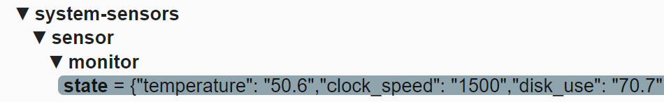

# Home Assistant: hardware monitor

<a href="index"></a>

Here you find a Home Assistant (lovelace) dashboard to monitor your server hardware.

Git repository: https://github.com/Sennevds/system_sensors

---

## Table of Contents
<!-- TOC -->
* [Intro](#intro)
* [Setup](#setup)
* [MQTT](#mqtt)
* [Dashboard](#dashboard)
* [Remarks or suggestions?](#remarks-or-suggestions)
<!-- TOC -->

---

## Intro


I want to monitor how my server is doing in use of resources.

How does adding a new specific docker container impact the load on my server?

I was looking for a script which monitor temperature, cpu, disk, memory and push that to MQTT. 

From MQTT it's easy to load it into Home Assistant to create a presentation of it and with Node-RED to create alerts when it reaches a maximum value.

---
## Setup

I can copy the steps, but it's easier to just follow the installation instructions on the [site](https://github.com/Sennevds/system_sensors#installation)

I use these values in the `settings.yaml` file.

```yaml

# Sourcecode by vdbrink.github.io
# settings.yaml
mqtt:
  hostname: 127.0.0.1
  port: 1883
  user: <username>
  password: <password>
deviceName: monitor
client_id: monitor
timezone: Europe/Amsterdam
update_interval: 60
sensors:
  temperature: true
  clock_speed: true
  disk_use: true
  memory_use: true
  cpu_usage: true
  load_1m: true
  load_5m: true
  load_15m: true
  net_tx: false
  net_rx: false
  swap_usage: false
  power_status: true
  last_boot: true
  hostname: false
  host_ip: false
  host_os: false
  host_arch: false
  last_message: false
  updates: false
  wifi_strength: false
  wifi_ssid: false

```

---
## MQTT

When the script is running fine it will push every minute a message to topic `system-sensors/sensor/monitor/state`
and it will look like this:



This is an example of the payload:

```yaml

# Sourcecode by vdbrink.github.io
{
  "temperature" : "50.6",
  "clock_speed" : "1500",
  "disk_use"    : "70.6",
  "memory_use"  : "52.6",
  "cpu_usage"   : "18.5",
  "load_1m"     : "1.07",
  "load_5m"     : "0.95",
  "load_15m"    : "0.99",
  "last_boot"   : "2022-09-11T23:09:42+02:00"
}

```

---
## Dashboard

On the github page there is an example card to present the data in a nice way.

I modified it a bit and mine look like this.\
It's using the HACS cards `vertical-stack-in-card`, `mini-graph-card` and `bar-card`.


This is the corresponding Home Assistant yaml code:
```yaml

# Sourcecode by vdbrink.github.io
type: custom:vertical-stack-in-card
title: System Monitor
cards:
  - type: horizontal-stack
    cards:
      - type: custom:mini-graph-card
        entities:
          - sensor.monitor_cpu_usage
        name: CPU
        line_color: '#3123b9'
        line_width: 2
        hours_to_show: 24
      - type: custom:mini-graph-card
        entities:
          - sensor.monitor_temperature
        name: Temp
        line_color: '#d080b9'
        line_width: 2
        hours_to_show: 24
  - type: custom:mini-graph-card
    entities:
      - sensor.monitor_memory_use
    name: memory
    line_color: '#2980b9'
    line_width: 2
    hours_to_show: 24
  - type: custom:bar-card
    entity: sensor.monitor_cpu_usage
    name: CPU
    positions:
      icon: outside
      name: inside
    color: '#3123b9'
  - type: custom:bar-card
    entity: sensor.monitor_memory_use
    name: RAM
    positions:
      icon: outside
      name: inside
  - type: custom:bar-card
    entity: sensor.monitor_disk_use
    name: HDD
    positions:
      icon: outside
      name: inside
    color: '#00ba6a'
  - type: entities
    entities:
      - sensor.monitor_last_boot

```

enjoy!

---

## Remarks or suggestions?
Do you have any remarks or suggestions please let me know via github issues.

[Create an issue](https://github.com/vdbrink/vdbrink.github.io/issues)

Or via a [private message](https://gathering.tweakers.net/forum/send_privatemessage/172381) on the Tweakers.net forum.

---

[<< See also my other Home Assistant pages](index)