# Home Assistant: Templates

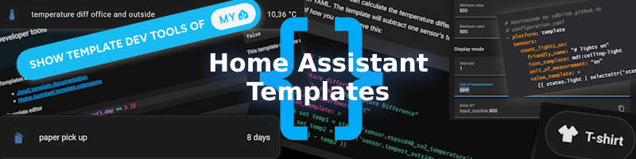
<br><br>
<a href="index"></a>

Here you find some Home Assistant template examples.\
With these templates you can create new custom sensors based on other sensor values to use on the dashboard or in automations.
This new sensor can have a textual output or a boolean value true/false.
<br>

---
### Table of Contents
<!-- TOC -->
  * [Home Assistant](#home-assistant)
    * [What is the difference between a binary and normal sensor?](#what-is-the-difference-between-a-binary-and-normal-sensor)
    * [How to add a template](#how-to-add-a-template)
    * [How to debug a template](#how-to-debug-a-template)
    * [Where to get help](#where-to-get-help)
  * [Template examples](#template-examples)
    * [Is it a specific day in the year](#is-it-a-specific-day-in-the-year)
    * [Count the number of lights on](#count-the-number-of-lights-on)
    * [Calculate temperature differences](#calculate-temperature-differences)
    * [Unavailable devices](#unavailable-devices)
    * [Low battery](#low-battery)
    * [Floor activity](#floor-activity)
    * [Day of the week translation](#day-of-the-week-translation)
    * [Trash bin days countdown](#trash-bin-days-countdown)
    * [Minutes since mail is delivered](#minutes-since-mail-is-delivered)
    * [What to wear outside](#what-to-wear-outside)
    * [Calculate daylight brightness percentage](#calculate-daylight-brightness-percentage)
    * [Daylight brightness to opacity](#daylight-brightness-to-opacity)
    * [Is it night](#is-it-night)
    * [Expected rain amount](#expected-rain-amount)
    * [Rain intensity](#rain-intensity)
    * [CO2 threshold values](#co2-threshold-values)
    * [Overlay based on lux](#overlay-based-on-lux)
    * [Moon image based on state](#moon-image-based-on-state)
    * [DIY Sink leak status](#diy-sink-leak-status)
    * [DIY Chair occupancy status](#diy-chair-occupancy-status)
<!-- TOC -->

---
## Home Assistant

### What is the difference between a binary and normal sensor?

A normal sensor can have any output, text, number or a boolean also and a binary sensor can only have a boolean value as output. 
It can only have the state `true` or `false`. 
This sensor can be used in automations to check if a condition matches. 

### How to add a template

There are two ways to add a template to your Home Assistant:

#### Via configuration.yaml

One way to add a new template is by adding the code to the `configuration.yaml` file.
In 2022 the configuration for template entities changed. Where previously the configuration was placed under the `sensor:` or `binary_sensor:` section a new `template` section was introduced.
Using the modern template format has a couple of advantages. 
You can use a `trigger` and `action` (like in automations) which gives more control over when the entity should be updated, and it allows to set a `state_class` so the state of the entity will also be stored in Long Term Statistics. It also allows to create `button`, `image`, `number` and `select` entities which is not possible using the legacy platform.

For more information also see the [Home Assistant documentation](<https://www.home-assistant.io/integrations/template/>). The legacy format is still documented all the way at the bottom.

All the examples below start with the `template:` key. Be sure to define this only once in your `configuration.yaml`. All template enitites should be created under the same `template:` key.

#### Via the frontend

The other way is via the frontend, you can create a new template via the **Settings** menu item, 
then go to **Devices and Services** and select **Helpers**.\
This button directly opens the **Helpers** page in your Home Assistant:

[](https://my.home-assistant.io/redirect/helpers/)

Select the bottom-right button `+ CREATE HELPER`, 
select **Template** then one of the two options **Template a sensor** or **Template a binary sensor**.

Copy the `value_template` part from the below examples and add it in the visual editor under **State template***.

In this example, a (binary) template is created to check if the current month is August.

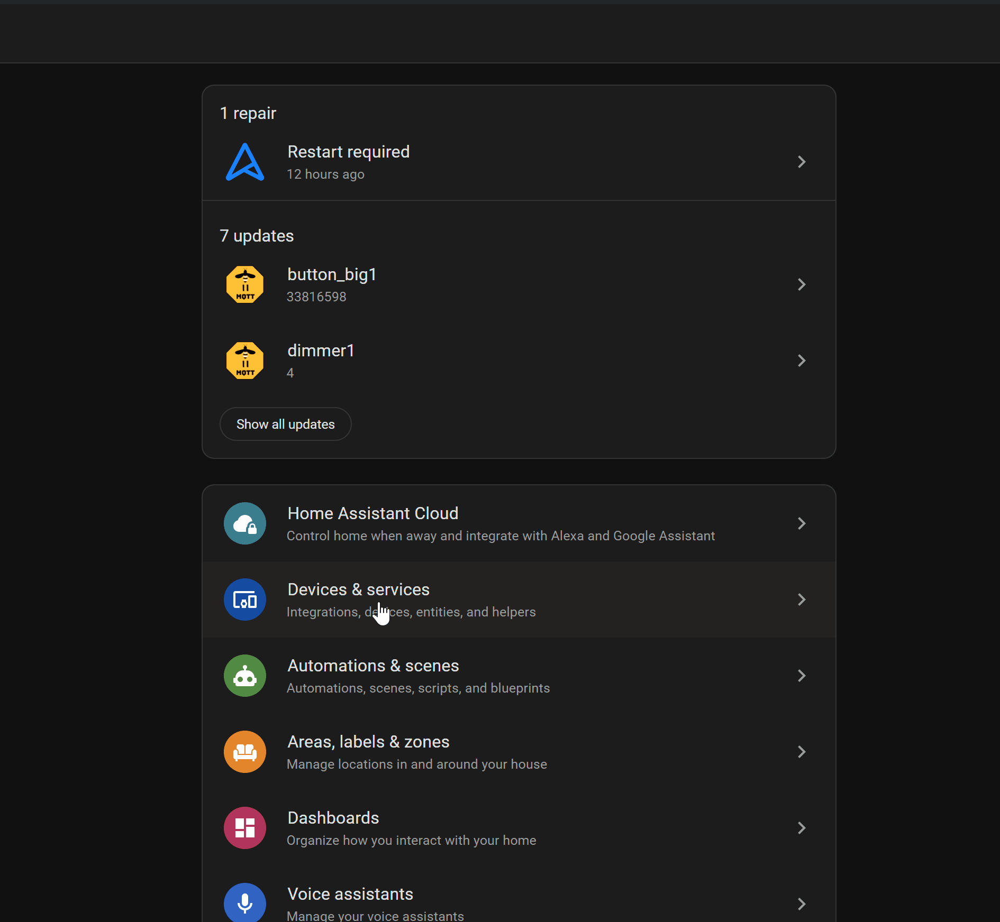

The template helpers are more user-friendly to create, but lack some of the options the YAML configuration does, like templating the icon of the sensor, and working with triggers. It also doesn't have the option to provide a template for `availablity` of the entity.

---

### How to debug a template

Via the Home Assistant frontend you can create and test a Template.\
Go to the **Developer tools** menu item, 
then go to **Template** tab.

Or use this button to open the Helpers in your Home Assistant:

[](https://my.home-assistant.io/redirect/developer_template/)

Now you're here:

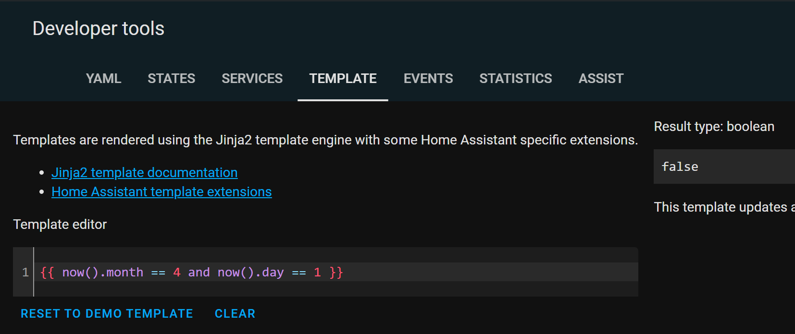

In the **Template editor** the code can be placed and edit, and on the right you see direct the output.

Home Assistant uses [Jinja](https://jinja.palletsprojects.com/en/3.1.x/templates/?sfnsn=wa) as a template engine to combine static text with variables.

---
### Where to get help

Use the below examples, search the internet, use the Home Assistant Community forum, the HA Facebook groups, Reddit or ChatGPT to help you to create your own new templates.

[The Home Assistant website contains also a lot of examples!](https://www.home-assistant.io/docs/configuration/templating/)

ChatGPT is really useful and fast with helping you to create a new template and improve it to fine-tune it.


---

## Template examples

Here are all kinds of different template examples.
Note that every entity has a `unique_id`. This does not define the entity_id, the entity_id is defined by the name (so `name: "Lights On"` will generate `sensor.lights_on`). 
By providing a `unique_id` you will be able to change `name`, `icon`, `entity_id` and based on the type of entity also the `device_class` in the frontend. 
It also ensures you don't get suffixes like `_2` after changing your configuration and reloading the template entities.

### Is it a specific day in the year?

A boolean sensor to test if it is a specific month, season, day (like Christmas or April Fools' Day etc.)?
This will create `binary_sensor` entities which will be `on` when the template returns `true` and otherwise they will be `off`
You can optionally refine the entities even more by providing a template for the `icon`

```yaml

# Sourcecode by vdbrink.github.io
# configuration.yaml
template:
  - binary_sensor:
      - name: "Is January"
        unique_id: is_january
        state: >
          {{ now().month == 1 }}
      - name: "Is Monday"
        unique_id: is_monday
        state: >
          {{ now().isoweekday() == 1 }}
      - name: "Is April Fools Day"
        unique_id: is_april_fools
        state: >
          {{ now().month == 4 and now().day == 1 }}
      - name: "Is Christmas"
        unique_id: is_christmas
        state: >
          {{ now().month == 12 and now().day == 25 }}
      - name: "Is around Christmas"
        unique_id: is_around_christmas
        state: >
          {{ (now().month == 12 and now().day > 10) or (now().month == 1 and now().day < 11) }}
      - name: "Is new years eve"
        unique_id: is_new_years_eve
        state: >
          {{ now().month == 12 and now().day == 31 }}

```

---
### Count the number of lights on

Count the number of lights with the status `on`.
By checking if the `entity_id` attribute exists on the light entities it will exclude the light groups created in Home Assistant. 
Otherwise, it would count both the group, and the members as light, which will give a higher number than expected.
The icon is changed dynamically based on the state of the sensor itself, and self references the state using `this.state`. 

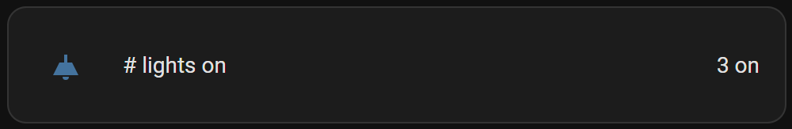

```yaml

# Sourcecode by vdbrink.github.io
# configuration.yaml
template:
  - sensor:
      - name: "# lights on"
        unique_id: count_lights_on
        icon: "{{ 'mdi:lightbulb' if this.state | int(0) > 0 else 'mdi:lightbulb-off' }}"
        unit_of_measurement: "lights"
        state: >
          {{ states.light | rejectattr('attributes.entity_id', 'defined') | selectattr('state', 'eq', 'on') | list | count }}

```

---
### Calculate temperature differences

Calculate the temperature difference between an inside room temperature and the outside temperature, and round by two decimals.
This sensor introduces an `availability` template, which will ensure the template sensor will only be available when both source sensors are working properly. 
If not, the template sensor will show as unavailable.

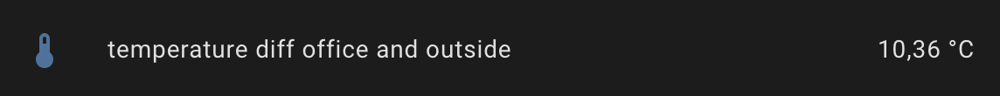

```yaml

# Sourcecode by vdbrink.github.io
# configuration.yaml
template:
  - sensor:
      - name: "Temperature diff office and outside"
        unique_id: template_diff_office_and_outside
        icon: mdi:thermometer
        unit_of_measurement: "°C"
        state: >
          
          
          {{ (temp1 - temp2) | round(2, 'ceil') }}
        availabilty: "{{ 'sensor.espscd40_co2_temperature' | has_value and 'sensor.tempest_outside_temperature' | has_value }}"

```

---
### Unavailable devices

Get all devices by name that have the state unavailable in a sorted list. 
As states are limited to 255 characters, the list is stored in an attribute, the state of the entity will be a count of the unavailable devices.
The device is considered unavailable when ALL entities belonging to that device are unavailable, as it could happen that only one entity is unavailable for specific reasons.\
The icon is changed dynamically and will show the number of devices as well (9+ in case it's over 9).

```yaml

# Sourcecode by vdbrink.github.io
# configuration.yaml
template:
  - sensor:
      - name: "Unavailable devices"
        unique_id: count_unavailable_devices
        state: " {{ this.attributes.get('devices', []) | count }}"
        icon: >
          
          {{ 'mdi:numeric-9-plus-circle' if count > 9 else ('mdi:numeric-' ~ count ~ '-circle') }}
        attributes:
          devices: >
            
            
            
              
              
                
              
             
            {{ ns.unavailable }}

```

---
### Low battery

Get all devices by name that have the battery level with less than 10% in a sorted list.
It is not possible to simply filter on the state, as all states in Home Assistant are a string, and if you compare the string `"6"` with the string `"10"` you get unwanted results (`"6" < "10"` returns `false`).\
Therefore, it is needed to convert the strings to a number first.\
As we also still want to access the other properties, this requires a for-loop. 
To access the data created in the for loop outside the for loop, a namespace has to be used.
Just like in the previous example, the names are listed in an attribute, because otherwise the character limit of 255 characters for an entity state can become an issue.

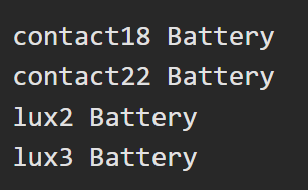

```yaml

# Sourcecode by vdbrink.github.io
# configuration.yaml
template:
  - sensor:
      - name: "Low Battery Devices"
        unique_id: count_low_batt_devices
        state: " {{ this.attributes.get('devices', []) | count }}"
        icon: >
          
          {{ 'mdi:numeric-9-plus-circle' if count > 9 else ('mdi:numeric-' ~ count ~ '-circle') }}
        attributes:
          devices: >
            
            
            
            
              
            
            {{ ns.batt_low }}

```

---
### Floor activity

Check if there is any activity on a specific floor or section based on multiple sensors.\
One minute after the last trigger the state goes back to `off`.

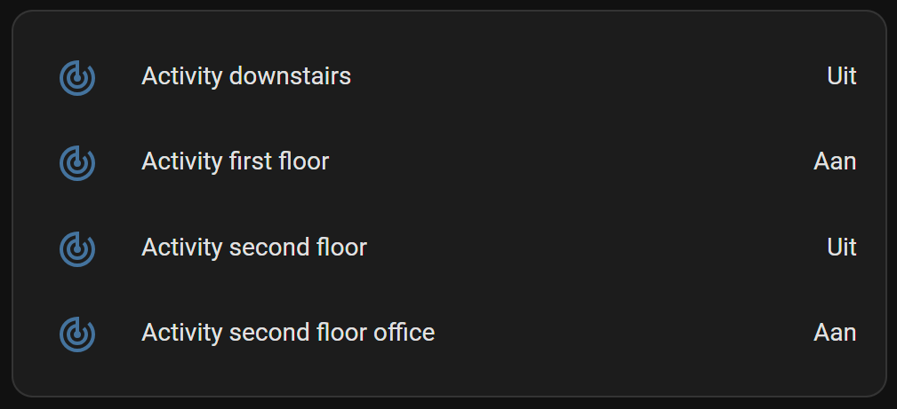

```yaml

# Sourcecode by vdbrink.github.io
# configuration.yaml
template:
  - binary_sensor:
      - name: "Activity downstairs"
        unique_id: activity_downstairs_sensor
        state: >
         {{ is_state("binary_sensor.motion1_occupancy", "on")
           or is_state("binary_sensor.motion2_occupancy", "on") 
           or is_state("binary_sensor.motion3_occupancy", "on") 
         }}
        device_class: occupancy
        delay_off: "00:01:00"

```

---
### Day of the week translation

By default, the day of the week is in English.\
With this template, it translates the day to a non-English language (like here to Dutch).

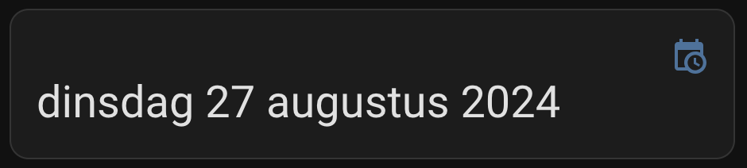

```yaml

# Sourcecode by vdbrink.github.io
# configuration.yaml
template:
  - sensor:
      - name: "Day of week"
        unique_id: day_of_week_sensor
        icon: mdi:calendar
        state: >
          {{ ["maandag", "dinsdag", "woensdag", "donderdag", "vrijdag", "zaterdag", "zondag"][now().weekday()] }}

```

---
### Day countdown

This day countdown can be used for any big day, like a wedding, birth of a child, birthday, christmas, etc..

#### Create date sensor

First, you need to create two helpers.
* One to define the date, this can be done with a `Date and/or time` helper;
* The other one to calculate the difference in date between THE date and now, this can be done with a `template a sensor` helper.

[Check here (also on this page) how to create these two helpers via the frontend.](#via-the-frontend)

The first sensor is the `Date and/or time` helper. 
Give it a name, in this case `Community Day`.
Select for the input type a `Date`.

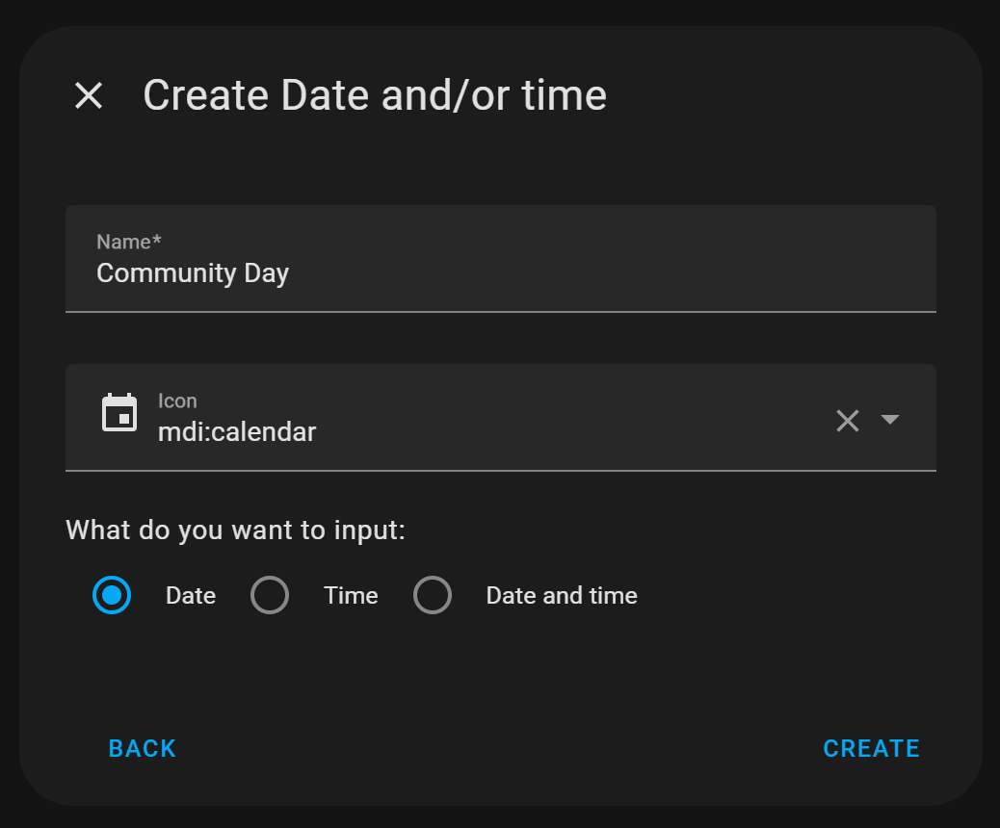

Once the helper `input_datetime.community_day` is created, click on it and set the correct date. 
Now this part is ready. 

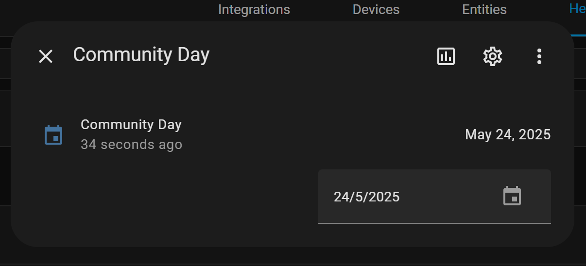

Now we need to create another sensor, 
from the type `template a sensor` to calculate the days until the defined date.
The value of the `State template must be:`
```yaml

# Sourcecode by vdbrink.github.io
{% set com_date = strptime(states('input_datetime.community_day'), '%Y-%m-%d') %}
{{ (com_date.date() - now().date()).days }}

```
And in the `Unit of measurement` field you can set it on `days`.\
The other fields are not required.

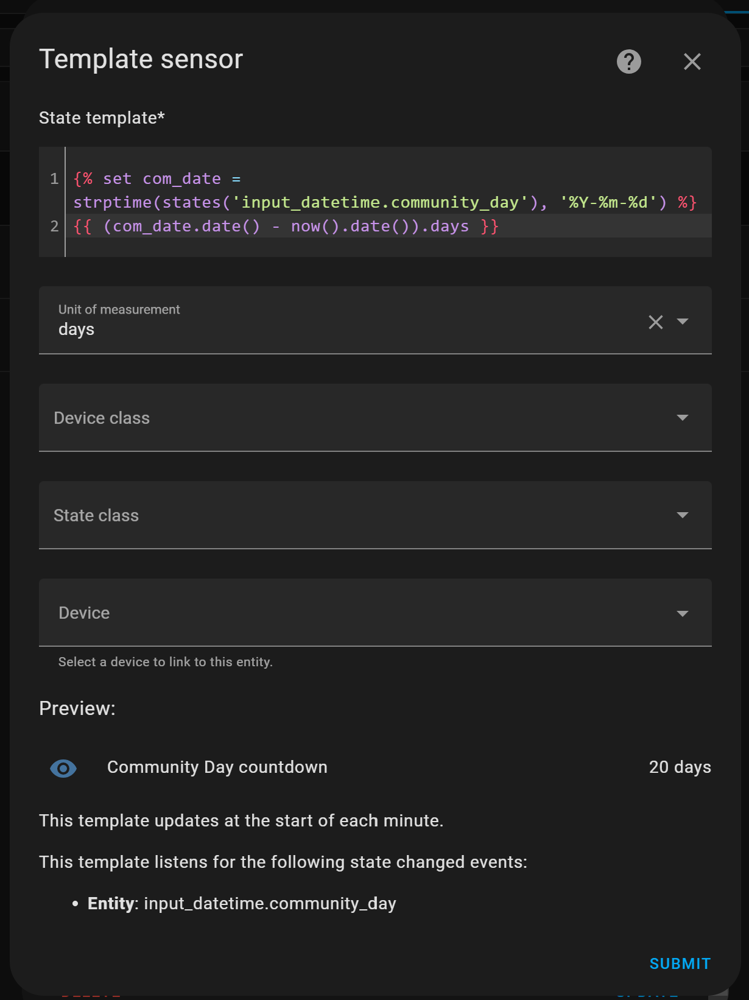

Now you have created these two sensors!

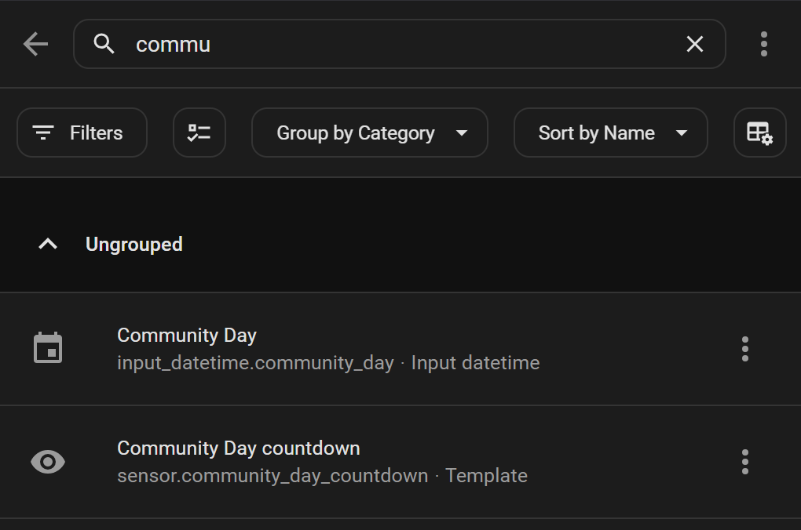


#### Community day countdown

Count the days before the Home Assistant Community day.
With a background image.
Based on a Picture Entity card.


```yaml

# Sourcecode by vdbrink.github.io
type: picture-entity
entity: sensor.community_day_countdown
show_state: true
show_name: false
image: >-
  https://images.lumacdn.com/cdn-cgi/image//calendar-cover-images/ud/ec89cf26-ebe8-4966-b2b6-ac982a5ebf57.png

```

A slightly different presentation for the countdown with a some CSS modifications, no transparant background, black text color and bigger font, for the Picture Entity card with the help of the `card_mod` integration.
You can install it via this button\
[](https://my.home-assistant.io/redirect/hacs_repository/?owner=thomasloven&repository=lovelace-card-mod&category=integration)

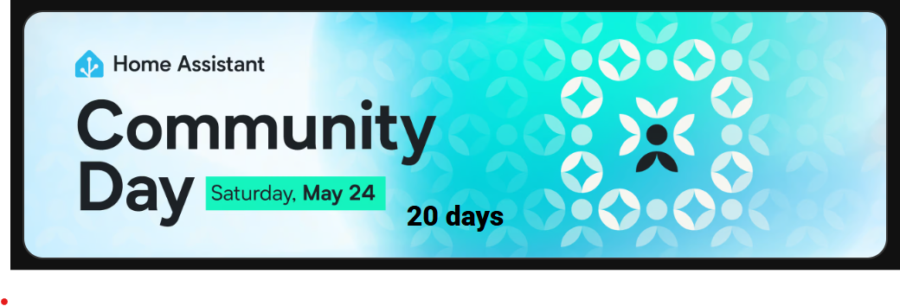

```yaml

# Sourcecode by vdbrink.github.io
type: picture-entity
entity: sensor.community_day_countdown
show_state: true
show_name: false
image: >-
  https://images.lumacdn.com/cdn-cgi/image//calendar-cover-images/ud/ec89cf26-ebe8-4966-b2b6-ac982a5ebf57.png
card_mod:
  style: |
    ha-card {
      .footer {
        background: none;
        color: black;
        font-weight: 800;
      }
    }

```

#### Trash bin day countdown
Count the days before the paper bin will be picked up.


```yaml

# Sourcecode by vdbrink.github.io
# configuration.yaml
template:
  - sensor:
      - name: "Paper Waste Pickup Countdown"
        unique_id: paper_waste_pickup_countdown
        icon: mdi:delete-empty
        state: >
          {% set pickup_date = strptime(state_attr('sensor.cyclus_papier','Sort_date'), '%Y%m%d') %}
          {{ (pickup_date.date() - now().date()).days }}
        unit_of_measurement: days
        availability: "{{ strptime(state_attr('sensor.cyclus_papier','Sort_date', none), '%Y%m%d') is not none }}"

```

The sensor `sensor.cyclus_papier` has an attribute `Sort_date` which holds the date for the bin pickup day in the format "YYYYMMDD".\
Based on today's date the diff in days is calculated.\
(The sensor value is not always accurate, that's why I use the attribute value.)

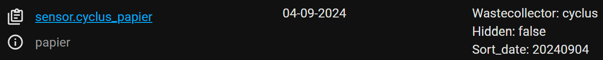

---
### Minutes since mail is delivered

Minutes since the snail mail is delivered. 


```yaml

# Sourcecode by vdbrink.github.io
# configuration.yaml
template:
  - sensor:
      - name: "Mail Delivered"
        unique_id: sensor_mail_delivered
        state: >
          
          {{ (now() - mailbox_datetime).total_seconds() // 60  }}
        icon: mdi:mailbox
        unit_of_measurement: minutes

```

---
### What to wear outside

Based on the outside temperature defined what to wear when you go outside.

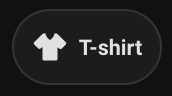

```yaml

# Sourcecode by vdbrink.github.io
# configuration.yaml
template:
  - sensor:
      - name: "Wear outside"
        unique_id: sensor_wear_outside
        icon: mdi:tshirt-crew
        state: >-
          
          
            winter jacket and hand gloves
          
            softshell
          
            thin jacket
          
            T-shirt
          
        availability: "{{ 'sensor.tempest_temperature_feels_like_rounded' | has_value }}

```
This is the code for the mushroom card, as shown on the image, based on this template.
```yaml

# Sourcecode by vdbrink.github.io
# dashboard card code
type: custom:mushroom-chips-card
chips:
  - type: entity
    entity: sensor.what_to_wear_outside
    icon: mdi:tshirt-v

```
---
### Calculate daylight brightness percentage

Based on the sun sensor elevation and the cloud coverage, calculate the daylight brightness percentage.
Which can be used to control the lights, the window blinds or on a floor map as overlay image.

```yaml

# Sourcecode by vdbrink.github.io
# configuration.yaml
template:
  - sensor:
      - name: "Sunlight pct"
        unique_id: sunlight_pct_sensor
        state: >
          
          
          
          
          
          
          
          
          
          
          
          
          {{ brightness | round }}
        unit_of_measurement: '%'
        device_class: 'illuminance'

```

---
### Daylight brightness to opacity

Daylight brightness, from the previous template, converted to opacity for CSS to use as overlay on a floor map.

```yaml

# Sourcecode by vdbrink.github.io
# configuration.yaml
template:
  - sensor:
      - name: "Sunlight Opacity"
        unique_id: sensor_sunlight_opacity
        state: > 
          
          {{ sunpct / 100 | float }}
 
```

---
### Is it night

Boolean state if it is night. Will be `on` when it's night, otherwise it will be `off`.

```yaml

# Sourcecode by vdbrink.github.io
# configuration.yaml
template:
  - binary_sensor:
      - name: "Night State"
        unique_id: binary_sensor_night_state
        state: "{{ is_state('sun.sun', 'below_horizon') }}"
        icon: "{{ 'mdi:weather-night' if is_state('sun.sun', 'below_horizon') else 'mdi:weather-sunny' }}" 

```

---
### Expected rain amount

Expected rain amount for the coming hours based on the Dutch Buienradar data.

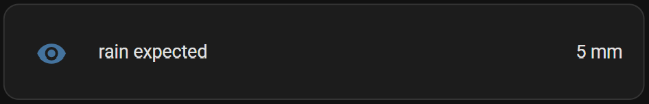

```yaml

# Sourcecode by vdbrink.github.io
# configuration.yaml
template:
  - sensor:
      - name: "Rain Expected"
        unique_id: sensor_expected_rain
        state: >
          
          {{ rain | sum | round }}
        unit_of_measurement: 'mm'

```

---
### Rain intensity

Rain intensity for the coming hours based on the Dutch Buienradar data.


```yaml

# Sourcecode by vdbrink.github.io
# configuration.yaml
template:
  - sensor:
      - name: Buienalarm Rain Level
        icon: mdi:weather-pouring
        state: >-
          
          
          
          
          
            light rain
          
            medium rain
          
            heavy rain
          
            no rain
          

```

---
### CO2 threshold values

Create three static value sensors with the threshold values: 800, 1200 and 1500.
As the entity_id is based on the `name` field, this template sensor uses a trick to give it the right name to base the entity_id on when the entity is created. 
After that, the name will indicate the threshold name.

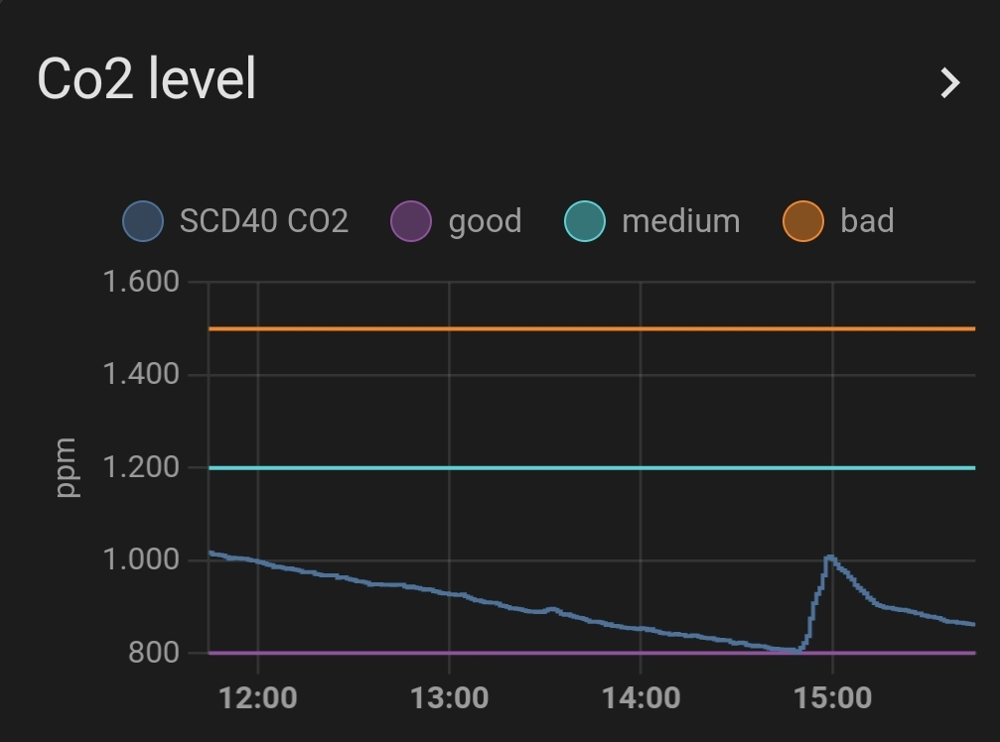

```yaml

# Sourcecode by vdbrink.github.io
# configuration.yaml
template:
  - sensor:
      - name: "{{ 'CO2 value 800' if this.state == 'unknown' else 'Good' }}"
        unique_id: sensor_co2_value_800
        state: 800
        unit_of_measurement: "ppm"
      - name: "{{ 'CO2 value 1200' if this.state == 'unknown' else 'Good' }}"
        unique_id: sensor_co2_value_1200
        state: 1200
        unit_of_measurement: "ppm"
      - name: "{{ 'CO2 value 1500' if this.state == 'unknown' else 'Good' }}"
        unique_id: sensor_co2_value_1500
        state: 1500
        unit_of_measurement: "ppm"

```

It's also possible to use a Number helper for this. 
This generates an `input_number.800` entity which can also be used in graphs. 
It's important to set here also the right unit of measurement.

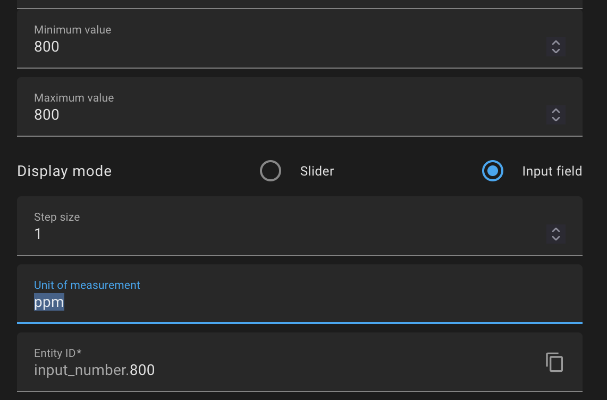

---

### Overlay based on lux

When you have a floor plan and want to show a dark overlay when the lux is low, you can create a new binary sensor based on the lux value.

```yaml

# Sourcecode by vdbrink.github.io
# configuration.yaml
template:
  - binary_sensor:
      - name: "Overlay"
        unique_id: sensor_overlay
        state: "{{ states('sensor.motion_illuminance_lux') | float > 5 }}"
        availability: "{{ 'sensor.motion_illuminance_lux' | has_value }}"

```

---
### Moon image based on state

The default moon component in Home Assistant gives the moon phase as a text value. 
With an image corresponding to each phase, you can show the moon phase as an image.

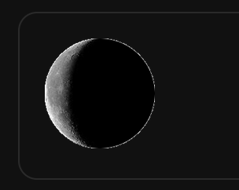

[Download here the moon images.](https://community.home-assistant.io/t/moon-platform-with-moon-phases-pictures/86646/7)

```yaml

# Sourcecode by vdbrink.github.io
# configuration.yaml
# the template for the moon phase pictures using the original moon component
template:
  - sensor:
      - name: "Moon phase"
        unique_id: sensor_moon_phase
        state: "{{ states('sensor.moon') }}"
        entity_picture: /local/moon_phases/{{ this.state }}.png

```

---
### DIY Sink leak status

I created a custom [leak sensor](/zigbee/zigbee_water_leak_sensor) based on a contact sensor.
The used sensor stores the value if it detects a leak in an attribute value `contact`. 
This attribute is now used to create a boolean value.

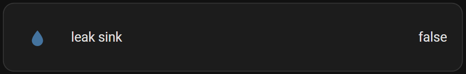

```yaml

# Sourcecode by vdbrink.github.io
# configuration.yaml
template:
  - sensor:
      - name: "Leak Sink"
        unique_id: sensor_leak_sink
        icon: mdi:water
        state: >
          {{ state_attr('binary_sensor.water_contact', 'contact') | lower }}

```

---

### DIY Chair occupancy status

I created a custom [chair occupancy sensor](/zigbee/zigbee_chair_occupancy_sensor) based on a contact sensor.
If you sit on it the contact sensor return `off`.\
The normal value of the contact sensor needs to be inverted.\
That's what happened here.


```yaml

# Sourcecode by vdbrink.github.io
# configuration.yaml
template:
  - binary_sensor:
      - name: "Chair"
        unique_id: binary_sensor_chair
        state: >
          {{ is_state('binary_sensor.contact1_contact', 'off') }}
        device_class: presence

```

---

That's it; I hope you can use some of these templates in your own setup.

Let me know which cool templates you use!

---

[<< See also my other Home Assistant tips and tricks](index)

[Dashboard: Layout examples >>](homeassistant_dashboard_layout)

---
See also my Smart home Best Buy Tips:

<a href="/buy/smart_home_best_buy_tips"></a>
