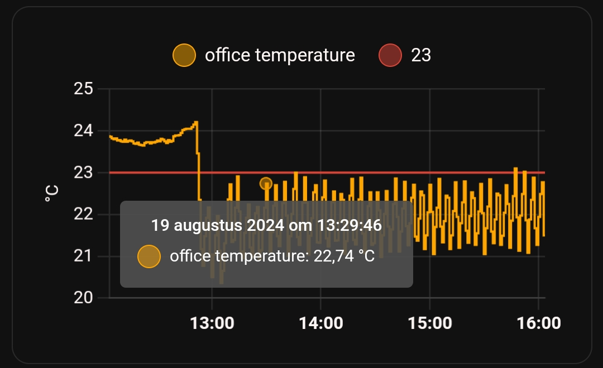

# Home Assistant dashboard: Templates

<a href="index"></a>

Here you find some Home Assistant template examples.\
With templates you can create new custom sensors based on other sensor values to use on the dashboard or in automations.
<br>

---
## Table of Contents
<!-- TOC -->
  * [Count the number of lights on](#count-the-number-of-lights-on)
  * [Floor activity](#floor-activity)
  * [Day of the week translation](#day-of-the-week-translation)
  * [Trash bin days countdown](#trash-bin-days-countdown)
  * [Minutes since mail is delivered](#minutes-since-mail-is-delivered)
  * [What to wear outside](#what-to-wear-outside)
  * [Calculate daylight brightness percentage](#calculate-daylight-brightness-percentage)
  * [Daylight brightness to opacity](#daylight-brightness-to-opacity)
  * [Is it night](#is-it-night)
  * [Expected rain amount](#expected-rain-amount)
  * [Rain intensity](#rain-intensity)
  * [Co2 threshold values](#co2-threshold-values)
  * [Temperature static value](#temperature-static-value)
  * [Overlay based on lux](#overlay-based-on-lux)
  * [Moon image based on state](#moon-image-based-on-state)
  * [DIY Sink leak status](#diy-sink-leak-status)
  * [DIY Chair occupancy status](#diy-chair-occupancy-status)
<!-- TOC -->

---
## Count the number of lights on

Count the number of lights with the status `on`.


```yaml

# Sourcecode by vdbrink.github.io
# configuration.yaml
- platform: template
  sensors:
    count_lights_on:
      friendly_name: "# lights on"
      icon_template: mdi:ceiling-light
      unit_of_measurement: "on"
      value_template: "{{ states.light | selectattr('state', 'eq', 'on') | list | count }}"  

```

---
## Floor activity

Check if there is any activity on a specific floor or section based on multiple sensors.\
One minute after the last trigger the state goes back to `off`.


```yaml

# Sourcecode by vdbrink.github.io
# configuration.yaml
- platform: template
  activity_downstairs:
    friendly_name: Activity downstairs
    icon_template: mdi:radar
    value_template: >
      {{ is_state("binary_sensor.motion1_occupancy", "on")
        or is_state("binary_sensor.motion2_occupancy", "on") 
        or is_state("binary_sensor.motion3_occupancy", "on") 
      }}
    delay_off: "00:01:00"

```

---
## Day of the week translation

By default, the day of the week is in English.\
With this template, you can translate it to a non-English language (like here to Dutch).


```yaml

# Sourcecode by vdbrink.github.io
# configuration.yaml
- platform: template
  sensors:
    dayoftheweek:
      value_template: >
        {{ ["maandag", "dinsdag", "woensdag", "donderdag", "vrijdag", "zaterdag", "zondag"][now().weekday()] }}

```

---
## Trash bin days countdown

Count the days before the paper bin will be picked up.


```yaml

# Sourcecode by vdbrink.github.io
# configuration.yaml
- platform: template
  sensors:
    paper_waste_pickup_countdown:
      friendly_name: "paper pick up"
      icon_template: mdi:delete-empty
      value_template: >-
        
        {{ ((as_timestamp(strptime(datex, '%Y%m%d')) - as_timestamp(now())) / (60 * 60 * 24)) | round(0, 'ceil')  }}
      unit_of_measurement: "days"

```

The sensor `sensor.cyclus_papier` has an attribute `Sort_date` which holds the date for the bin pickup day in the format "YYYYMMDD".\
Based on today's date the diff in days is calculated.\
(The sensor value is not always accurate, that's why I use the attribute value.)


---
## Minutes since mail is delivered

Minutes since the snail mail is delivered. 


```yaml

# Sourcecode by vdbrink.github.io
# configuration.yaml
- platform: template
  sensors:
    mail_delivered_minutes_ago:
      friendly_name: "mail delivered"
      icon_template: mdi:mailbox
      value_template: >-
        
        
        
        {{ minutes }}
      unit_of_measurement: "minutes"

```

---
## What to wear outside

Based on the outside temperature defined what to wear when you go outside.


```yaml

# Sourcecode by vdbrink.github.io
# configuration.yaml
- platform: template
  sensors:
    what_to_wear_outside:
      friendly_name: "wear outside"
      value_template: >-
         winter jacket and hand gloves
         softshell
         thin jacket
         T-shirt

```
This is the code for the mushroom card, as shown on the image, based on this template.
```yaml

# Sourcecode by vdbrink.github.io
# dashboard card code
type: custom:mushroom-chips-card
chips:
  - type: entity
    entity: sensor.what_to_wear_outside
    icon: mdi:tshirt-v

```
---
## Calculate daylight brightness percentage

Based on the sun sensor elevation and the cloud coverage, calculate the daylight brightness percentage.
Which can be used to control the lights, the window blinds or on a floor map as overlay image.

```yaml

# Sourcecode by vdbrink.github.io
# configuration.yaml
- platform: template
  sensors:
    sunlight_pct:
      value_template: >-
        
        
        
        
        
        
        
        
        
        
        
        
        {{ brightness | round }}
      unit_of_measurement: '%'
      device_class: 'illuminance'

```

---
## Daylight brightness to opacity

Daylight brightness, from the previous template, converted to opacity for CSS to use as overlay on a floor map.

```yaml

# Sourcecode by vdbrink.github.io
# configuration.yaml
- platform: template
  sensors:
    sunlight_opacity:
      value_template: >-
        
        
        {{ opacity }}
 
```

---
## Is it night

Boolean value if it is night.

```yaml

# Sourcecode by vdbrink.github.io
# configuration.yaml
- platform: template
  sensors:
    night_state:
      friendly_name: night state
      value_template: "10"

```

---
## Expected rain amount

Expected rain amount for the coming hours based on the Dutch Buienradar data.


```yaml

# Sourcecode by vdbrink.github.io
# configuration.yaml
- platform: template
  sensors:
    buienalarm_rain_expected:
      friendly_name: "rain expected"
      value_template: >-
        
        
        
            
        
        {{ total_precip }}
      unit_of_measurement: 'mm'

```

---
## Rain intensity

Rain intensity for the coming hours based on the Dutch Buienradar data.


```yaml

# Sourcecode by vdbrink.github.io
# configuration.yaml
- platform: template
  sensors:
    buienalarm_rain_level:
      friendly_name: "rain intensity"
      icon_template: mdi:weather-pouring
      value_template: >-
        
        
        
        
        
          {{ 'light rain' }}
        
          {{ 'medium rain' }}
        
          {{ 'heavy rain' }}
        
          {{ 'no rain' }}
        

```

---
## Co2 threshold values

Create three static value sensors with the threshold values: 800, 1200 and 1500.


```yaml

# Sourcecode by vdbrink.github.io
# configuration.yaml
- platform: template
  sensors:
    co2_value_800:
      friendly_name: "good"
      value_template: 800
      unit_of_measurement: 'ppm'
    co2_value_1200:
      friendly_name: "medium"
      value_template: 1200
      unit_of_measurement: 'ppm'
    co2_value_1500:
      friendly_name: "bad"
      value_template: 1500
      unit_of_measurement: 'ppm'

```

---
## Temperature static value

Create a static value sensor with the threshold value of 23 degrees Celsius.
Add this to a graph to get this result:



```yaml

# Sourcecode by vdbrink.github.io
# configuration.yaml
- platform: template
  sensors:
    temp_value_23:
      friendly_name: "23"
      value_template: 23
      unit_of_measurement: '°C'

```

---

## Overlay based on lux

When you have a floor plan and want to show a dark overlay when the lux is low, you can create a new sensor based on the lux value.

```yaml

# Sourcecode by vdbrink.github.io
# configuration.yaml
- platform: template
    overlay:
      friendly_name: "overlay"
      value_template: >-
        
           on
        
           off
        

```

---
## Moon image based on state

The default moon component in Home Assistant gives the moon phase as a text value. 
With an image corresponding to each phase, you can show the moon phase as an image.


[Download here the moon images.](https://community.home-assistant.io/t/moon-platform-with-moon-phases-pictures/86646/7)

```yaml

# Sourcecode by vdbrink.github.io
# configuration.yaml
# the template for the moon phase pictures using the original moon component
- platform: template
  sensors:
    moon_phases:
      friendly_name: 'moonphase'
      value_template: '{{ states.sensor.moon.state }}'
      entity_picture_template: /local/moon_phases/{{ states.sensor.moon.state }}.png

```

---
## DIY Sink leak status

I created a custom [leak sensor](/zigbee/zigbee_water_leak_sensor) based on a contact sensor.
The used sensor stores the value if it detects a leak in an attribute value `contact`. 
This attribute is now used to create a boolean value.


```yaml

# Sourcecode by vdbrink.github.io
# configuration.yaml
- platform: template
  sensors:
    sink_leak:
      friendly_name: "leak sink"
      icon_template: mdi:water
      value_template: >-
        {{ state_attr('binary_sensor.water_contact', 'contact') | lower }}

```

---

## DIY Chair occupancy status

I created a custom [chair occupancy sensor](/zigbee/zigbee_chair_occupancy_sensor) based on a contact sensor.
If you sit on it the contact sensor return `off`.\
The normal value of the contact sensor needs to be inverted.\
That's what happened here.


```yaml

# Sourcecode by vdbrink.github.io
# configuration.yaml
- platform: template
  sensors:
    chair:
      friendly_name: "chair"
      icon_template: mdi:chair-rolling
      value_template: >-
        
           on
        
           off
        

```

---

That's it; I hope you can use some of these templates in your own setup.

Let me know which cool templates you use!

---
[^^ Top](#table-of-contents)

[<< See also my other Home Assistant tips and tricks](index)