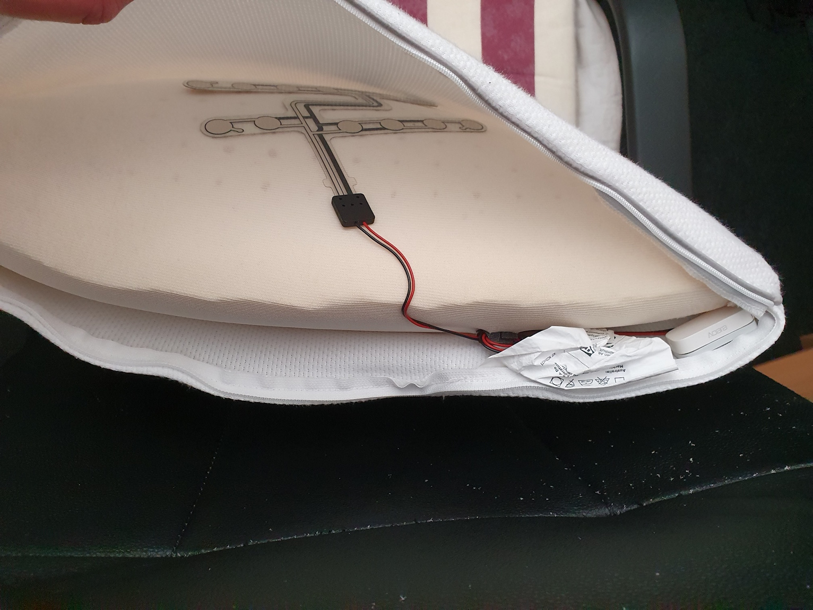

# Home Assistant dashboard: Templates

<a href="index"></a>

Here you find some Home Assistant template examples.\
With these templates you can create new custom sensors based on other sensor values to use on the dashboard or in automations.
This new sensor can have a textual output or a boolean value true/false.
<br>

---
### Table of Contents
<!-- TOC -->
  * [Home Assistant](#home-assistant)
    * [What is the difference between a binary and normal sensor?](#what-is-the-difference-between-a-binary-and-normal-sensor)
    * [How to add a template](#how-to-add-a-template)
    * [How to debug a template](#how-to-debug-a-template)
    * [Where to get help](#where-to-get-help)
  * [Template examples](#template-examples)
    * [Is it a specific day in the year](#is-it-a-specific-day-in-the-year)
    * [Count the number of lights on](#count-the-number-of-lights-on)
    * [Calculate temperature differences](#calculate-temperature-differences)
    * [Unavailable devices](#unavailable-devices)
    * [Low battery](#low-battery)
    * [Floor activity](#floor-activity)
    * [Day of the week translation](#day-of-the-week-translation)
    * [Trash bin days countdown](#trash-bin-days-countdown)
    * [Minutes since mail is delivered](#minutes-since-mail-is-delivered)
    * [What to wear outside](#what-to-wear-outside)
    * [Calculate daylight brightness percentage](#calculate-daylight-brightness-percentage)
    * [Daylight brightness to opacity](#daylight-brightness-to-opacity)
    * [Is it night](#is-it-night)
    * [Expected rain amount](#expected-rain-amount)
    * [Rain intensity](#rain-intensity)
    * [Co2 threshold values](#co2-threshold-values)
    * [Overlay based on lux](#overlay-based-on-lux)
    * [Moon image based on state](#moon-image-based-on-state)
    * [DIY Sink leak status](#diy-sink-leak-status)
    * [DIY Chair occupancy status](#diy-chair-occupancy-status)
<!-- TOC -->

---
## Home Assistant

### What is the difference between a binary and normal sensor?

A normal sensor can have any output, text, number or a boolean also and a binary sensor can only have a boolean value as output. 
It can only have the state `true` or `false`. 
This sensor can be used in automations to check if a condition matches. 

### How to add a template

There are two ways to add a template to your Home Assistant:

#### Via configuration.yaml

One way to add a new template is by adding the code to the `configuration.yaml` file under the `sensor:` or `binary_sensor:` section.

#### Via the frontend

The other way is via the frontend, you can create a new template via the **Settings** menu item, 
then go to **Devices and Services** and select **Helpers**.\
This button directly opens the **Helpers** page in your Home Assistant:

[](https://my.home-assistant.io/redirect/helpers/)

Select the bottom-right button `+ CREATE HELPER`, 
select **Template** then one of the two options **Template a sensor** or **Template a binary sensor**.

Copy the `value_template` part from the below examples and add it in the visual editor under **State template***.

In this example a (binary) template is created to check if the current month is August.


---

### How to debug a template

Via the Home Assistant frontend you can create and test a Template.\
Go to the **Developer tools** menu item, 
then go to **Template** tab.

Or use this button to open the Helpers in your Home Assistant:

[](https://my.home-assistant.io/redirect/developer_template/)

Now you're here:


In the **Template editor** the code can be placed and edit, and on the right you see direct the output.

---
### Where to get help

Use the below examples, search the internet, use the Home Assistant Community forum, the HA Facebook groups, Reddit or ChatGPT to help you to create your own new templates.

ChatGPT is really useful and fast with helping you to create a new template and improve it to fine-tune it.


---

## Template examples

Here are all kinds of different template examples.

### Is it a specific day in the year

A boolean sensor to test if it is a specific month, season, day (like Christmas or April Fools' Day etc.)?

```yaml

# Sourcecode by vdbrink.github.io
# configuration.yaml
- platform: template
  sensors:
    is_january:
      friendly_name: "Is January"
      value_template: >
        {{ now().month == 1 }}
    is_monday:
      friendly_name: "Is Monday"
      value_template: >
        {{ now().isoweekday() == 1 }}
    is_april_fools_day:
      friendly_name: "Is April Fools Day"
      value_template: >
        {{ now().month == 4 and now().day == 1 }}
    is_christmas:
      friendly_name: "Is Christmas"
      value_template: >
        {{ now().month == 12 and now().day == 25 }}
    is_around_christmas:
      friendly_name: "Is around Christmas"
      value_template: >
        {{ (now().month == 12 and now().day > 10) or (now().month == 1 and now().day < 11) }}
    is_new_years_eve:
      friendly_name: "Is new years eve"
      value_template: >
        {{ now().month == 12 and now().day == 31 }}

```

---
### Count the number of lights on

Count the number of lights with the status `on`.


```yaml

# Sourcecode by vdbrink.github.io
# configuration.yaml
- platform: template
  sensors:
    count_lights_on:
      friendly_name: "# lights on"
      icon_template: mdi:ceiling-light
      unit_of_measurement: "on"
      value_template: >
        {{ states.light | selectattr('state', 'eq', 'on') | list | count }}

```

---
### Calculate temperature differences

Calculate the temperature difference between an inside room temperature and the outside temperature, and round by two decimals.


```yaml

# Sourcecode by vdbrink.github.io
# configuration.yaml
- platform: template
  sensors:
    temp_diff_office_outside:
      friendly_name: "temperature diff office and outside"
      icon_template: hass:thermometer
      unit_of_measurement: "°C"
      value_template: >
        
        
        {{ (temp1 - temp2) | round(2, 'ceil') }}

```

---
### Unavailable devices

Get all devices by name that have the state unavailable in a sorted list. 

```yaml

  # Sourcecode by vdbrink.github.io
  # configuration.yaml
- platform: template
  sensors:
    unavailable_devices:
       friendly_name: "unavailable devices"
       value_template: >
         {{ states| selectattr('state', 'in', ['unavailable'])
         | map(attribute='entity_id')
         | map('device_attr', 'name_by_user')
         | reject('match', 'None')
         | unique
         | list
         | sort
         | join('\n')
         }}

```

---
### Low battery

Get all devices by name that have the battery level with less than 10% in a sorted list.


```yaml

# Sourcecode by vdbrink.github.io
# configuration.yaml
- platform: template
  sensors:
     low_battery_devices:
        friendly_name: "low battery devices"
        value_template: >  
          {{ states
          | selectattr('attributes.device_class','in',['battery'])
          | selectattr('state', 'lessthan', '10')
          | map(attribute='entity_id')
          | map('state_attr', 'friendly_name')
          | reject('match', 'None')
          | list
          | sort
          | join('\n')
          }}

```

---
### Floor activity

Check if there is any activity on a specific floor or section based on multiple sensors.\
One minute after the last trigger the state goes back to `off`.


```yaml

# Sourcecode by vdbrink.github.io
# configuration.yaml
- platform: template
  activity_downstairs:
    friendly_name: Activity downstairs
    icon_template: mdi:radar
    value_template: >
      {{ is_state("binary_sensor.motion1_occupancy", "on")
        or is_state("binary_sensor.motion2_occupancy", "on") 
        or is_state("binary_sensor.motion3_occupancy", "on") 
      }}
    delay_off: "00:01:00"

```

---
### Day of the week translation

By default, the day of the week is in English.\
With this template, it translates the day to a non-English language (like here to Dutch).


```yaml

# Sourcecode by vdbrink.github.io
# configuration.yaml
- platform: template
  sensors:
    dayoftheweek:
      value_template: >
        {{ ["maandag", "dinsdag", "woensdag", "donderdag", "vrijdag", "zaterdag", "zondag"][now().weekday()] }}

```

---
### Trash bin days countdown

Count the days before the paper bin will be picked up.


```yaml

# Sourcecode by vdbrink.github.io
# configuration.yaml
- platform: template
  sensors:
    paper_waste_pickup_countdown:
      friendly_name: "paper pick up"
      icon_template: mdi:delete-empty
      value_template: >-
        
        {{ ((as_timestamp(strptime(datex, '%Y%m%d')) - as_timestamp(now())) / (60 * 60 * 24)) | round(0, 'ceil') }}
      unit_of_measurement: "days"

```

The sensor `sensor.cyclus_papier` has an attribute `Sort_date` which holds the date for the bin pickup day in the format "YYYYMMDD".\
Based on today's date the diff in days is calculated.\
(The sensor value is not always accurate, that's why I use the attribute value.)


---
### Minutes since mail is delivered

Minutes since the snail mail is delivered. 


```yaml

# Sourcecode by vdbrink.github.io
# configuration.yaml
- platform: template
  sensors:
    mail_delivered_minutes_ago:
      friendly_name: "mail delivered"
      icon_template: mdi:mailbox
      value_template: >-
        
        
        
        {{ minutes }}
      unit_of_measurement: "minutes"

```

---
### What to wear outside

Based on the outside temperature defined what to wear when you go outside.


```yaml

# Sourcecode by vdbrink.github.io
# configuration.yaml
- platform: template
  sensors:
    what_to_wear_outside:
      friendly_name: "wear outside"
      value_template: >-
         winter jacket and hand gloves
         softshell
         thin jacket
         T-shirt

```
This is the code for the mushroom card, as shown on the image, based on this template.
```yaml

# Sourcecode by vdbrink.github.io
# dashboard card code
type: custom:mushroom-chips-card
chips:
  - type: entity
    entity: sensor.what_to_wear_outside
    icon: mdi:tshirt-v

```
---
### Calculate daylight brightness percentage

Based on the sun sensor elevation and the cloud coverage, calculate the daylight brightness percentage.
Which can be used to control the lights, the window blinds or on a floor map as overlay image.

```yaml

# Sourcecode by vdbrink.github.io
# configuration.yaml
- platform: template
  sensors:
    sunlight_pct:
      value_template: >-
        
        
        
        
        
        
        
        
        
        
        
        
        {{ brightness | round }}
      unit_of_measurement: '%'
      device_class: 'illuminance'

```

---
### Daylight brightness to opacity

Daylight brightness, from the previous template, converted to opacity for CSS to use as overlay on a floor map.

```yaml

# Sourcecode by vdbrink.github.io
# configuration.yaml
- platform: template
  sensors:
    sunlight_opacity:
      value_template: >-
        
        
        {{ opacity }}
 
```

---
### Is it night

Boolean state if it is night.

```yaml

# Sourcecode by vdbrink.github.io
# configuration.yaml
- platform: template
  sensors:
    night_state:
      friendly_name: night state
      value_template: "10"

```

---
### Expected rain amount

Expected rain amount for the coming hours based on the Dutch Buienradar data.


```yaml

# Sourcecode by vdbrink.github.io
# configuration.yaml
- platform: template
  sensors:
    buienalarm_rain_expected:
      friendly_name: "rain expected"
      value_template: >-
        
        
        
            
        
        {{ total_precip }}
      unit_of_measurement: 'mm'

```

---
### Rain intensity

Rain intensity for the coming hours based on the Dutch Buienradar data.


```yaml

# Sourcecode by vdbrink.github.io
# configuration.yaml
- platform: template
  sensors:
    buienalarm_rain_level:
      friendly_name: "rain intensity"
      icon_template: mdi:weather-pouring
      value_template: >-
        
        
        
        
        
          {{ 'light rain' }}
        
          {{ 'medium rain' }}
        
          {{ 'heavy rain' }}
        
          {{ 'no rain' }}
        

```

---
### Co2 threshold values

Create three static value sensors with the threshold values: 800, 1200 and 1500.


```yaml

# Sourcecode by vdbrink.github.io
# configuration.yaml
- platform: template
  sensors:
    co2_value_800:
      friendly_name: "good"
      value_template: 800
      unit_of_measurement: 'ppm'
    co2_value_1200:
      friendly_name: "medium"
      value_template: 1200
      unit_of_measurement: 'ppm'
    co2_value_1500:
      friendly_name: "bad"
      value_template: 1500
      unit_of_measurement: 'ppm'

```

It's also possible to use a Number helper for this. 
This generates an `input_number.800` entity which can also be used in graphs. 
It's important to set here also the right unit of measurement.


---

### Overlay based on lux

When you have a floor plan and want to show a dark overlay when the lux is low, you can create a new sensor based on the lux value.

```yaml

# Sourcecode by vdbrink.github.io
# configuration.yaml
- platform: template
    overlay:
      friendly_name: "overlay"
      value_template: >-
        
           on
        
           off
        

```

---
### Moon image based on state

The default moon component in Home Assistant gives the moon phase as a text value. 
With an image corresponding to each phase, you can show the moon phase as an image.


[Download here the moon images.](https://community.home-assistant.io/t/moon-platform-with-moon-phases-pictures/86646/7)

```yaml

# Sourcecode by vdbrink.github.io
# configuration.yaml
# the template for the moon phase pictures using the original moon component
- platform: template
  sensors:
    moon_phases:
      friendly_name: 'moonphase'
      value_template: '{{ states.sensor.moon.state }}'
      entity_picture_template: /local/moon_phases/{{ states.sensor.moon.state }}.png

```

---
### DIY Sink leak status

I created a custom [leak sensor](/zigbee/zigbee_water_leak_sensor) based on a contact sensor.
The used sensor stores the value if it detects a leak in an attribute value `contact`. 
This attribute is now used to create a boolean value.


```yaml

# Sourcecode by vdbrink.github.io
# configuration.yaml
- platform: template
  sensors:
    sink_leak:
      friendly_name: "leak sink"
      icon_template: mdi:water
      value_template: >-
        {{ state_attr('binary_sensor.water_contact', 'contact') | lower }}

```

---

### DIY Chair occupancy status

I created a custom [chair occupancy sensor](/zigbee/zigbee_chair_occupancy_sensor) based on a contact sensor.
If you sit on it the contact sensor return `off`.\
The normal value of the contact sensor needs to be inverted.\
That's what happened here.



```yaml

# Sourcecode by vdbrink.github.io
# configuration.yaml
- platform: template
  sensors:
    chair:
      friendly_name: "chair"
      icon_template: mdi:chair-rolling
      value_template: >-
        
           on
        
           off
        

```

---

That's it; I hope you can use some of these templates in your own setup.

Let me know which cool templates you use!

---
[^^ Top](#table-of-contents)

[<< See also my other Home Assistant tips and tricks](index)