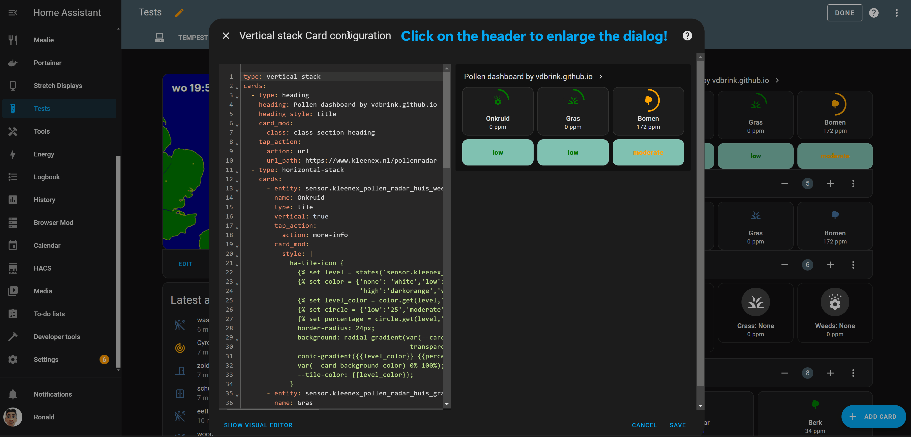
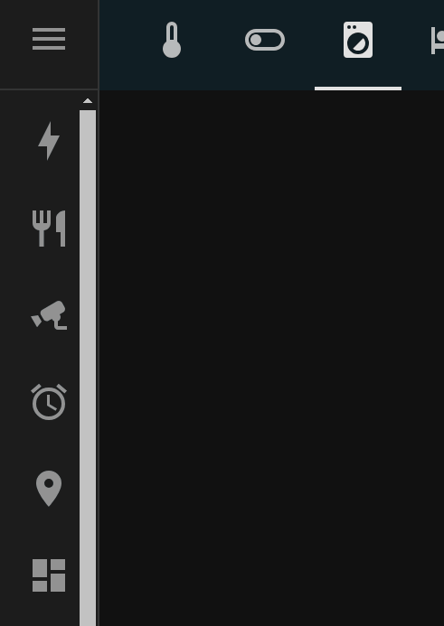
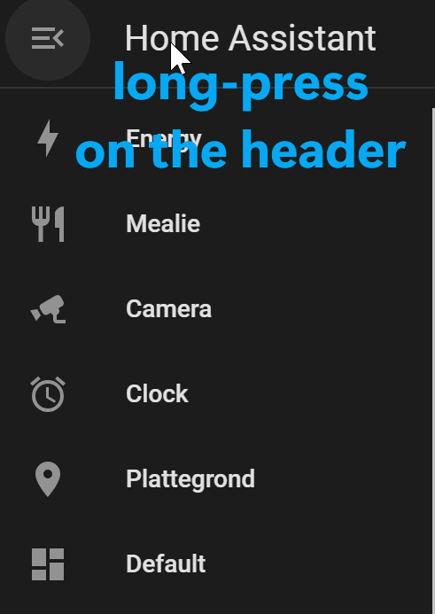

# Home Assistant - Tips & Tricks

Home Assistant useful (hidden) features!

---
## Dashboard edit dialog enlarger

On a bigger screen, the dashboard edit dialog uses by default only half of the screen width.\
But you can click on the dialog header text to enlarge this dialog!

---
## Dashboard side menu reorder

You can rearrange the items in the side menu by double-click on the side menu header.\
Now you can drag and drop the items or remove them by clicking on the cross.\
Click on the `done` button to confirm.

&nbsp; &nbsp; &nbsp; &nbsp;

---

> Do you know more cool features which everybody should know, let me know!

 
 
 

