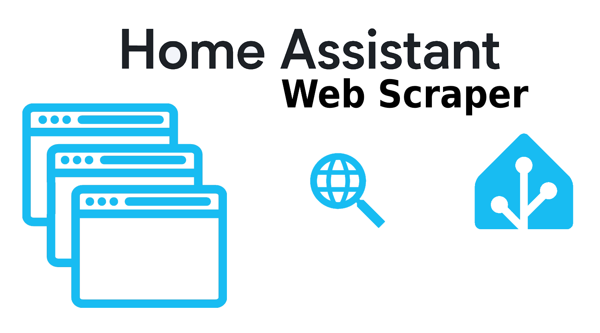
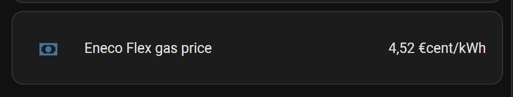
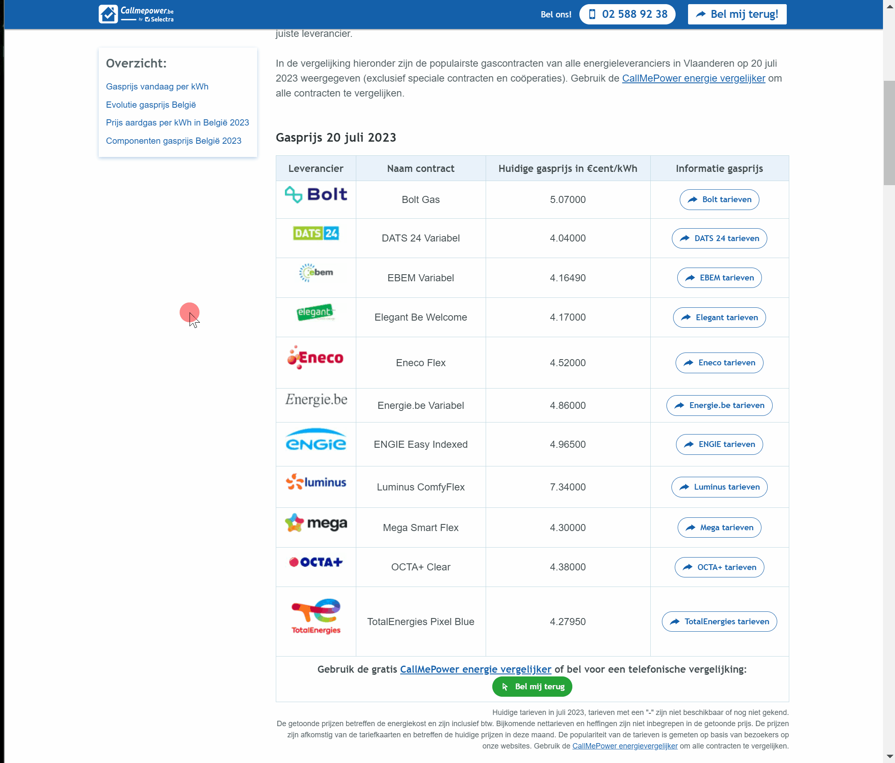
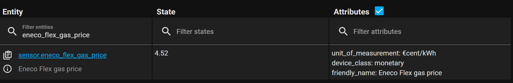

# Home Assistant: Web Scraper

<a href="index"></a>

Here you find how you can scrape (text) elements from a webpage and create a Home Assistant sensor which contains this text.
It also works with data from API calls.

You can use this data to present on your own dashboard or make automations based on it. 
Like run the washing machine based on low dynamic energy prices.
Show the latest (formula 1) news or show the current weather alarm messages.

This *Scrape* integration is by default available in Home Assistant.



The official info page: https://www.home-assistant.io/integrations/scrape/

On this page I use, as example, the actual dynamic gas price (from a specific provider) and show this on my dashboard.



> **_REMARK:_** It's not always possible to scrape all text, this also depends on the website structure.

---

## Table of Contents
<!-- TOC -->
* [How it works](#how-it-works)
* [Define the CSS Selector and Index](#define-the-css-selector-and-index)
* [Configure the scraper in Home Assistant](#configure-the-scraper-in-home-assistant)
* [Check your sensor](#check-your-sensor)
* [Update the sensor](#update-the-sensor)
* [Add it to your dashboard](#add-it-to-your-dashboard)
* [Other examples](#other-examples)
<!-- TOC -->

---
## How it works

The web scraper integration uses underwater the library **Beautiful Soup** to read first the whole website and then with the, so-called, **CSS Selector** it grabs the correct HTML element type (like an A, P, LI, TD or DIV element). 
This selector is normally used to style these elements on a pages with CSS. 
Then find the corresponding **index** which contains the element you want to scrape/extract.\
In the scrape integration, you can define some extra templating to format and fine-tune the value.

Let's get started!

---
## Define the CSS Selector and Index

> **_NOTE:_** Before configuring the Scrape integration in Home Assistant, you need to find first all the required data for it. 

The following steps are necessary to take to get the required **CSS Selector** and **Index** value for the Scrape integration:
1. Get the whole webpage source into an online evaluation page;
2. Find the corresponding CSS Selector for your text;
3. Strip the unneeded part from the CSS Selector;
4. Find the corresponding index.

<br>
In this animation you see all these steps in action.


The page https://callmepower.be/nl/energie/gids/tarief/prijs-gas is used in this example, and the current gas price from 'Eneco Flex' is what we want to scrape.

### 1. Get the whole webpage source into an online evaluate page

To test if the scraper works in Home Assistant we use the evaluation page <a href="https://try.jsoup.org" target="_blank">try.jsoup.org</a>, this page will help us test the correct CSS Selector and index.

* Go to the page <a href="https://try.jsoup.org" target="_blank">try.jsoup.org</a>
* Click on the button **Fetch URL** 
* Fill in the url https://callmepower.be/nl/energie/gids/tarief/prijs-gas 
* Click on the button **Fetch**. Now the whole page source is loaded

It is possible you get an `errors`, then try the manual option.

<details>
  <summary><b>> Click here to see the manual option</b></summary>

* Go with your browser to the website, in this case https://callmepower.be/nl/energie/gids/tarief/prijs-gas
* Right click somewhere and choose to show the **Page Source**
* With CTRL+A and then CTRL+C select and copy everything
* Go to the page <a href="https://try.jsoup.org" target="_blank">try.jsoup.org</a>
* With CTRL+V paste the clipboard data into the field **Input HTML**
</details>

### 2. Find the corresponding CSS Selector for your text

* Go back to the original site
* Right-click on the required text to be stored in the sensor
* Select the menu item **Inspect**. The debug section will open with the page source
* Right-click on the HTML element which contains the required text. In this case `<td>4.520000</td>`
* Select the menu item **Copy** > **Copy selector** (see animation)

### 3. Strip the unneeded part from the CSS Selector

* Go back to the evaluation jsoup.org page
* Paste the clipboard content into the field **Query**
* Remove all the data before the last `>` In this case the original selector value was `#block-agrippa-content > article > div:nth-child(3) > div.table--swap.table--responsive > table > tbody > tr:nth-child(5) > td:nth-child(3)`, keep only `td:nth-child(3)`

### 4. Find the corresponding index

* A numbered list that matches all the third columns values from the table as TD HTML elements, is visible.
* The fifth row contains the data. This is index **4** (start counting by 0)
<br>
Now all the required input data is available for the scraper. It's time to setup the scraper in Home Assistant.

---
## Configure the scraper in Home Assistant

Use the Home Assistant **Scrape** integration for this.

[](https://my.home-assistant.io/redirect/config_flow_start/?domain=scrape)

Or:

* Go in Home Assistant to the menu items **Settings** > **Devices & Services**
* In the bottom right corner, select the **Add Integration** button
* Type `Scrape` and select the integration
* Fill in all the required fields:
  * Tab 1
    * Resource: https://callmepower.be/nl/energie/gids/tarief/prijs-gas 
  * Tab 2
    * Name: **Eneco Flex gas price** (This will also be used for your sensor name)
    * Select: **td:nth-child(3)** (The CSS Selector)
    * Index: **4** (The Index)
    * Value Template: `{{ value | float }}` (This will also round the price)
    * Device Class: **Balance**
    * State Class: **No state class**
    * Unit of Measurement: **€cent/kWh**
* Submit to finish the configuration
<br>

Congratulations! A new web scrape sensor is created!

It's unnecessary to refresh or restart anything, the sensor is directly available.

---
## Check your sensor

Hopefully everything went well. Let's check the result!

* Go in Home Assistant to the menu item **Developers Tools**
* Go to the **State** tab
* Filter on `eneco_flex_gas_price`

Now the just created scrape sensor is available, and looks like this:



---
## Update the sensor

If you're not totally happy with the extracted result:
* Go to **Settings** > **Devices & Services**
* Click on the wheel in the **Scrape** integration
* Click on **Configure** behind the url
* Click on **Configure sensor**
* Make your changes and submit

---
## Add it to your dashboard

Now the new sensor can be added to the dashboard or can be used in an automation.


With a Markdown card, it's possible to only show the extracted data,
for example, if you scrape a news site headline. 


This is the corresponding YAML code: 
```yaml

# Sourcecode by vdbrink.github.io
# Dashboard card code
type: markdown
content: |
  {{ states('sensor.nu_nl_headline') }} [>>](http://nu.nl)

```

---
## Other examples

Just some other pages and settings with data that can be scraped.
It can be used for news, weather, prices, etc.

| Site                     | URL                                                             | Selector                | Index |
|--------------------------|-----------------------------------------------------------------|-------------------------|-------|
| Latest formula 1 news    | https://www.f1news.nl/                                          | `div.uplp-post-title`     | 0     |
| KNMI Dutch weather alarm | https://www.knmi.nl/nederland-nu/weer/waarschuwingen/overijssel | `div.alert__heading` and `a.alert__description` | 0     |
| nu.nl news headline      | https://www.nu.nl                                               | `h1.title.fluid`          | 0     |

<br>
Happy scraping!

<br>
<br>
Let me <a href="#remarks-or-suggestions">know</a> if you have some usefull scraped data!

---
> **_NOTE:_** In the old YAML [Scrape integration](https://www.home-assistant.io/integrations/scrape/) you can set a `scan_interval` how often you want to scrape the site. I don't see this variable in the graphical version. Do you know how to set this? Please let me know!

---
[^^ Top](#table-of-contents)

[<< See also my other Home Assistant tips and tricks](index)

[Dashboard: Layout examples >>](homeassistant_dashboard_layout)