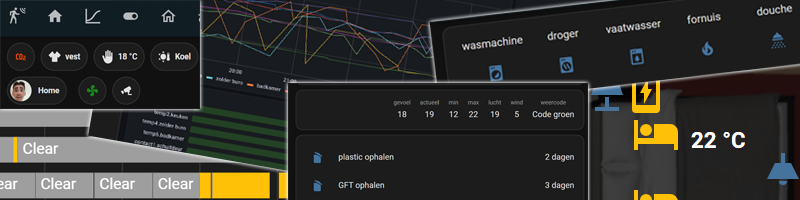

# Home Assistant dashboards

I created so many different dashboards that I want to document and share them with you.
One by one, I will add them here.

I created dashboards with all kinds of elements in it:
* Templates:
  * [Dutch examples](homeassistant_dashboard_templates_nl) (NL: welkomst tekst, weer, kleding advies)
* Weather:
  * [The Netherlands](homeassistant_dashboard_weather_nl) (Buienradar, weeralarm, pollen)
  * [External sites](homeassistant_dashboard_weather) (Thunderstorm) 
* [Layout](homeassistant_dashboard_layout) (Stacks, grid, rows, compact presentations)
* [Styling](homeassistant_dashboard_styling) (Changing the color of icons, status, backgrounds etc.)
* [Formatting](homeassistant_dashboard_formatting) (Rounded temperature sensors)
* [Date & Time](homeassistant_dashboard_date_time) (Days countdown)
* [Interactive floor plan](homeassistant_dashboard_floorplan)
* [Web scraper](homeassistant_web_scraper) (Show website data on your dashboard)
* [Chores](homeassistant_dashboard_chores) (Manage your weekly chores)
* [Recipe manager](homeassistant_dashboard_mealie) (With meal weekplanner)
* [HACS custom elements](homeassistant_dashboard_hacs) (Overview of some very useful custom HACS elements)
  * [Auto entities](homeassistant_dashboard_card_auto-entities) 
  * [Mushroom](homeassistant_dashboard_card_mushroom) 
  * [Afvalbeheer](homeassistant_hacs_afvalbeheer)
* [Control an Orcon ventilation system](../esphome/orcon_mechanic_ventilation)
* [Hardware monitor](homeassistant_hardware_monitor)
* [Random examples](homeassistant_dashboard_examples) (The latest news)
* [Pientere Tuinen](homeassistant_dashboard_pientere_tuinen) (Dutch garden and soil project)

---
## How I use Home Assistant

I started my home automation without Home Assistant. In those days, I used an app ([Mqtt Dashboard](https://play.google.com/store/apps/details?id=com.app.vetru.mqttdashboard)) where I could see and control all my devices. For my smart flows, I used Node-RED.  
After I got more and more sensors, I couldn't get a clear overview of the status of all my sensors anymore.
Then I found the solutions for this where people created floor plans of their house and add there sensor statuses and controls as layers on top of it. This was possible with the tool Home Assistant and so began with it. I created the floor plans I wanted, and I also really liked the (lovelace) dashboards with their endless possibilities.

I use Home Assistant pure as a presentation layer. That's why you don't find Home Assistant flows here, but only Node-RED flows.
In the [Node-RED - Home Assistant integrations](../node-red/node-red_home-assistant) section you find all kinds of integrations between Node-RED and Home Assistant.