# Home Assistant dashboards

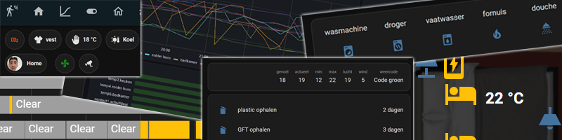

I created so many different dashboards that I want to document and share them with you.
One by one, I will add them here.

I created dashboards with all kinds of elements on it:

<a class="project-card" href="homeassistant_dashboard_fullscreen_camera_stream">
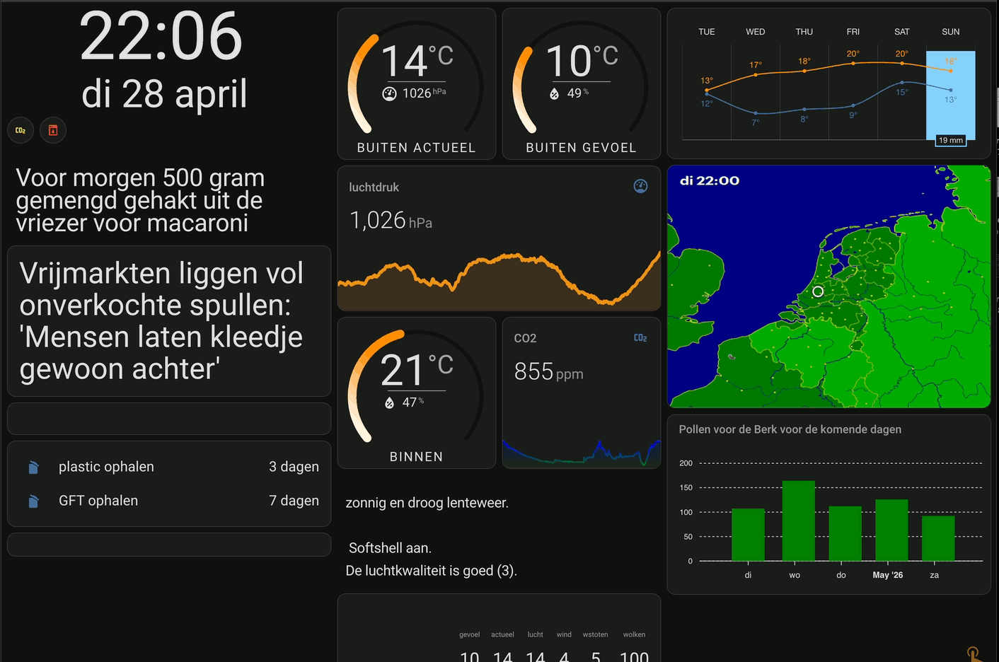
Fullscreen camera stream
</a>

<a class="project-card" href="homeassistant_dashboard_wake-up-alarm-light">
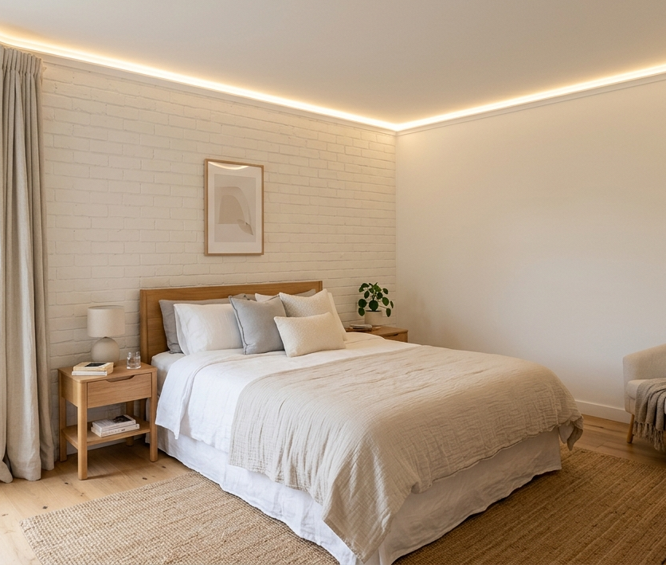
Wake-up alarm light
</a>

<a class="project-card" href="homeassistant_dashboard_tablet_in_kiosk_mode">

Dashboard on a tablet in kiosk mode  <em>Use a tablet to show the dashboard on</em>
</a>

<a class="project-card" href="homeassistant_dashboard_examples_overview">
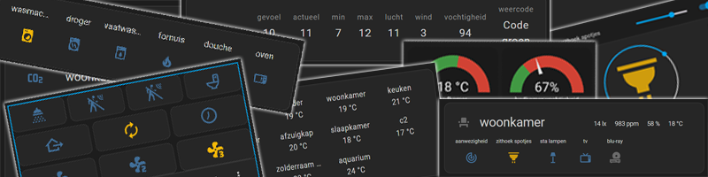
Elements examples overview  <em>Visual element examples overview page</em>
</a>

<a class="project-card" href="homeassistant_tips_tricks">
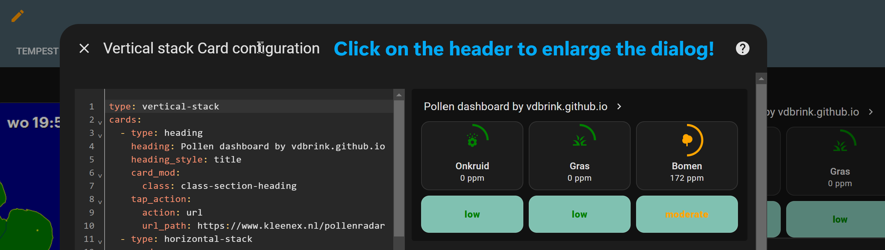
Global HA Tips & Tricks
</a>

<a class="project-card" href="homeassistant_dashboard_layout">

Layout  <em>Stacks, grid, rows, compact presentations</em>
</a>

<a class="project-card" href="homeassistant_templates">

Templates creating, debugger, practical examples
</a>

<a class="project-card" href="homeassistant_dashboard_templates_nl">

Dutch template examples  <em>NL: welkomst tekst, weer, kleding advies</em>
</a>

<a class="project-card" href="homeassistant_dashboard_weather">
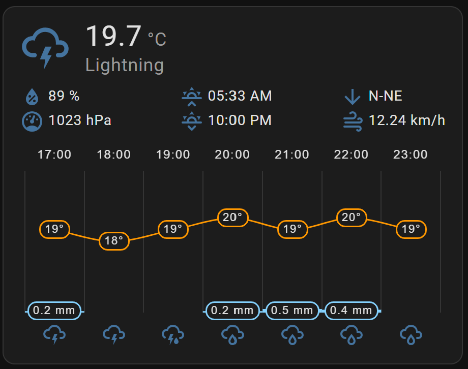
Weather: Forecast temperatures  <em>Temperature, Forecast, Thunderstorm</em>
</a>

<a class="project-card" href="homeassistant_dashboard_weather_nl">

Weather: The Netherlands  <em>Buienradar, weeralarm, pollen</em>
</a>

<a class="project-card" href="homeassistant_aurora">

Weather: Aurora integration Aurora Borealis alert
</a>

<a class="project-card" href="homeassistant_dashboard_hacs">

HACS custom elements  <em>Overview of some very useful custom HACS elements</em>
</a>

<a class="project-card" href="homeassistant_dashboard_card_auto-entities">
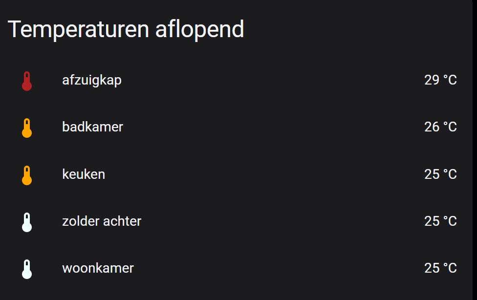
HACS: Auto entities
</a>

<a class="project-card" href="homeassistant_dashboard_card_mushroom">

HACS: Mushroom
</a>

<a class="project-card" href="homeassistant_hacs_kleenex">
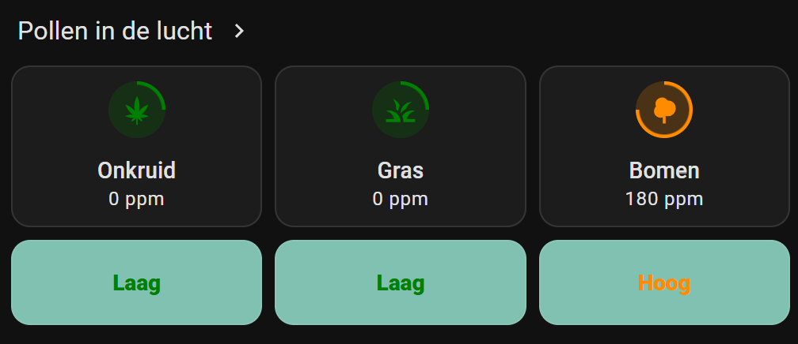
HACS: Pollen Radar
</a>

<a class="project-card" href="homeassistant_hacs_afvalbeheer">

HACS: Afvalbeheer
</a>

<a class="project-card" href="homeassistant_dashboard_grafana">
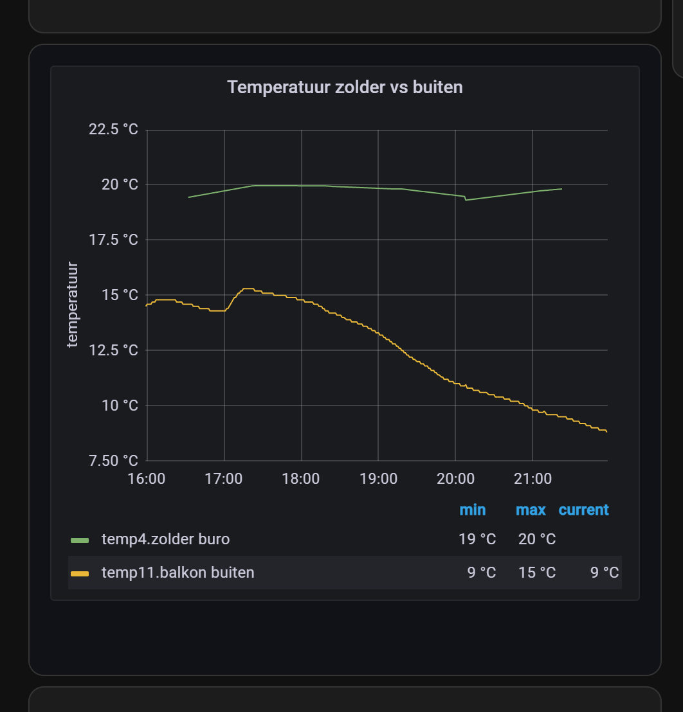
Grafana  <em>Grafana graph integration</em>
</a>

<a class="project-card" href="homeassistant_dashboard_frigate">

Frigate  <em>Frigate integration</em>
</a>

<a class="project-card" href="homeassistant_dashboard_styling">

Styling  <em>Changing the color of icons, status, backgrounds etc.</em>
</a>

<a class="project-card" href="homeassistant_dashboard_date_time">

Date & Time  <em>Days countdown</em>
</a>

<a class="project-card" href="homeassistant_dashboard_formatting">

Formatting  <em>Rounded temperature sensors</em>
</a>

<a class="project-card" href="homeassistant_dashboard_floorplan">
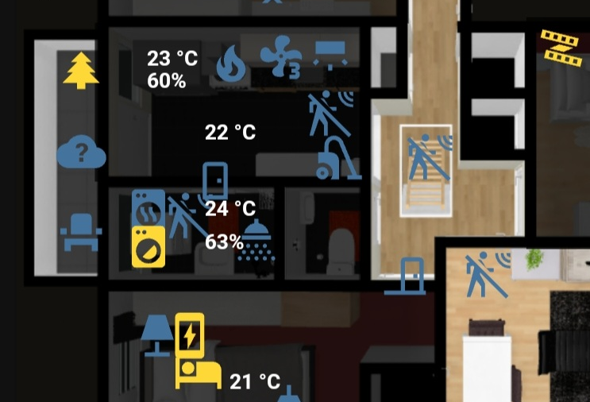
Interactive floor plan
</a>

<a class="project-card" href="homeassistant_dashboard_chores">
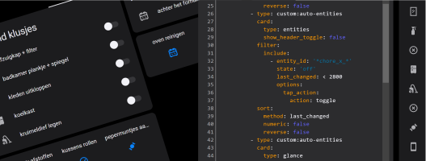
Chores  <em>Manage your weekly chores</em>
</a>

<a class="project-card" href="homeassistant_dashboard_mealie">
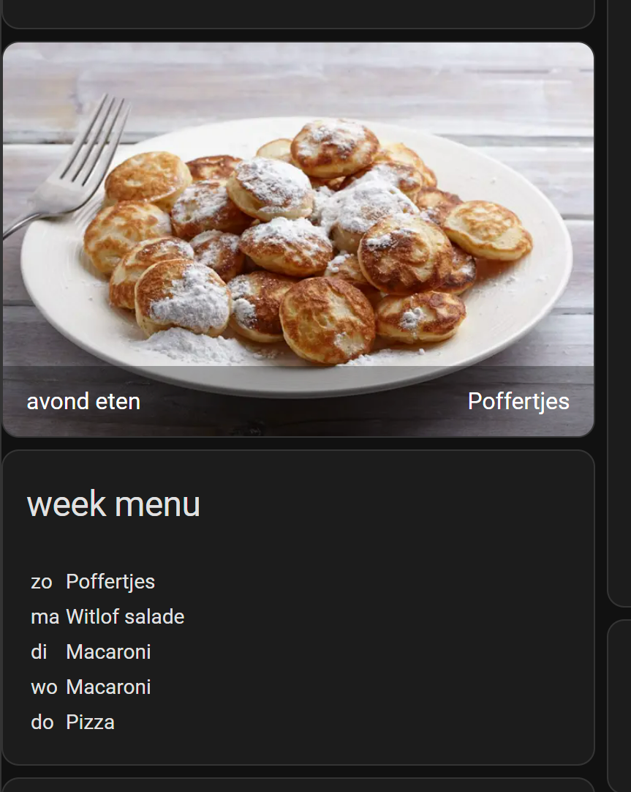
Recipe manager Mealie  <em>With meal weekplanner</em>
</a>

<a class="project-card" href="../esphome/orcon_mechanic_ventilation">

Control an Orcon ventilation system
</a>

<a class="project-card" href="homeassistant_hardware_monitor">
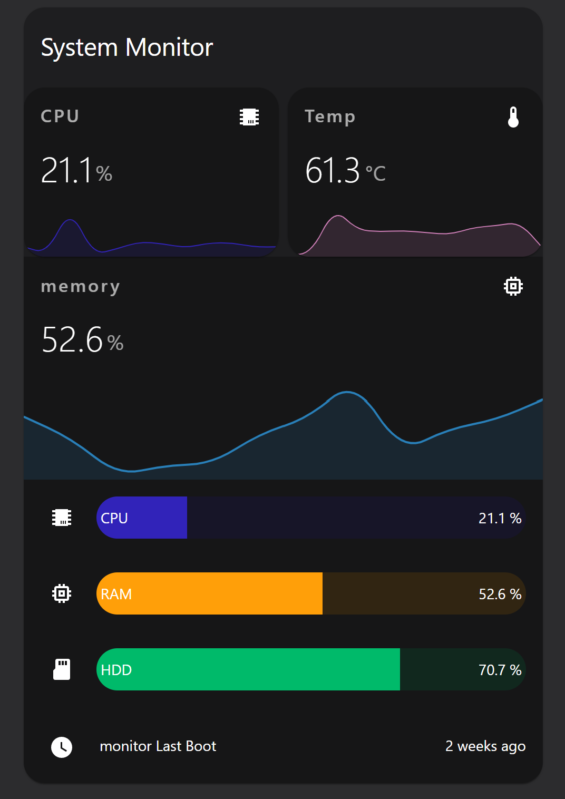
Hardware monitor
</a>

<a class="project-card" href="homeassistant_web_scraper">
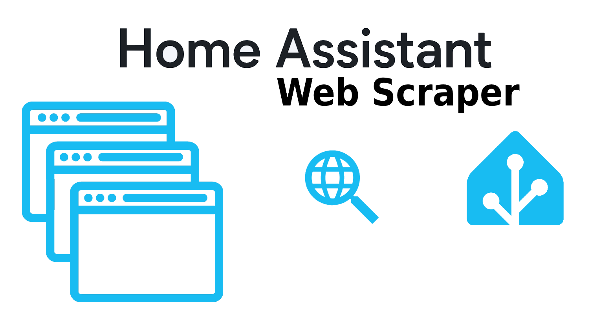
Web scraper  <em>Show website data on your dashboard</em>
</a>

<a class="project-card" href="homeassistant_dashboard_pientere_tuinen">

Pientere Tuinen  <em>Dutch garden and soil project</em>
</a>

<a class="project-card" href="homeassistant_dashboard_latest_news">

Show the latest news  <em>example nu.nl</em>
</a>

---

## Hardware to run HA on

I compare the most popular hardware options, both new and refurbished.
This page will help you to compare the different options you have:
like a NUC mini PC, N100, Raspberry Pi or a refurbished thin client, desktop or laptop.

<a class="project-card" href="homeassistant_hardware">

Which hardware to run Home Assistant on?
</a>

---
## Other Home Assistant integrations

<a class="project-card" href="../zigbee/smart_infrared_transmitter_receiver">

Automate infrared devices in Home Assistant
</a>

<a class="project-card" href="/pihole">

Pi-hole Ad blocker application
</a>

## Node-RED + Home Assistant integration

Here you find flows to interact between Home Assistant and Node-RED.

<a class="project-card" href="/node-red/node-red_home-assistant">

Node-RED - Home Assistant
</a>

<a class="project-card" href="/node-red/node-red_home-assistant_notifications">

Node-RED - Send notifications to the Home Assistant app
</a>

---
## How I use Home Assistant

I started my home automation without Home Assistant on a tiny Raspberry zero (in 2019).
In those days, I used an app ([Mqtt Dashboard](https://play.google.com/store/apps/details?id=com.app.vetru.mqttdashboard)) where I could see and control all my devices.
For my smart flows, I used Node-RED.
After I got more and more sensors, I couldn't get a clear overview of the status of all my sensors anymore.
Then I found a solution where people created floor plans of their house and added their sensor statuses and controls as layers on top of it.
This was possible with the application Home Assistant (not-so-famous yet in 2020) and so I began with it.
I created the [floor plans](homeassistant_dashboard_floorplan) I wanted, and I also really liked the dashboards with their endless possibilities.

I use Home Assistant pure as a presentation layer. That's why you don't find Home Assistant flows here, but only Node-RED flows.
In the [Node-RED - Home Assistant integrations](../node-red/node-red_home-assistant) section you find all kinds of integrations between Node-RED and Home Assistant.
