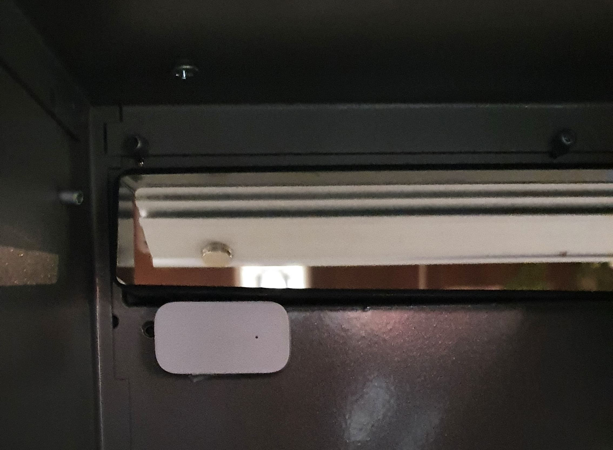
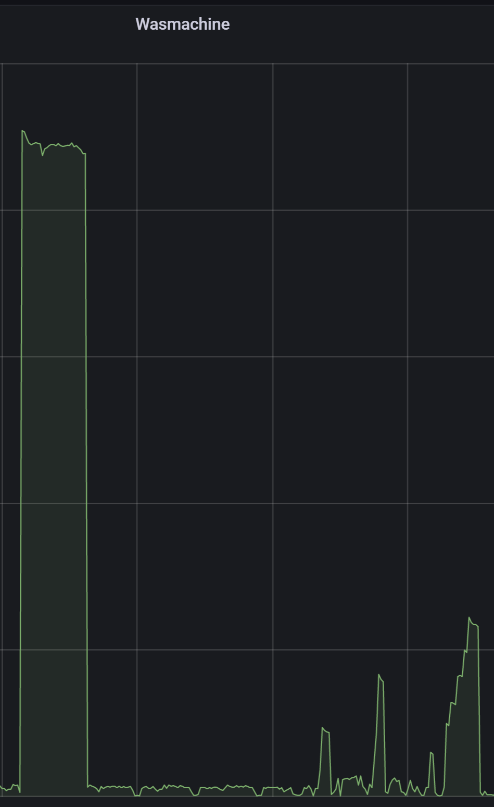
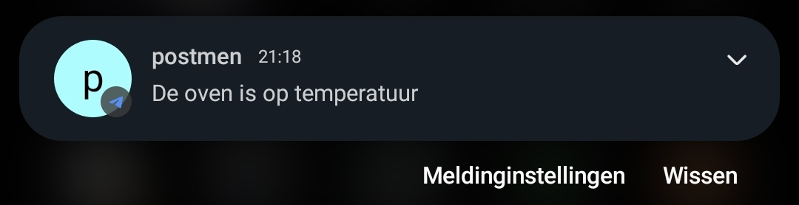
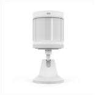
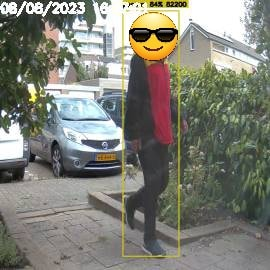
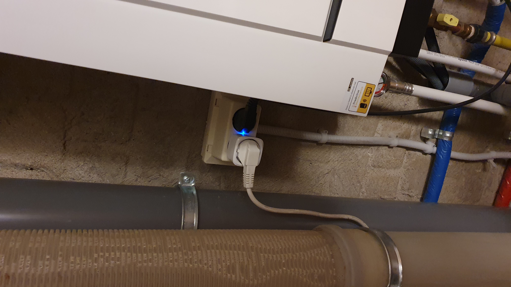
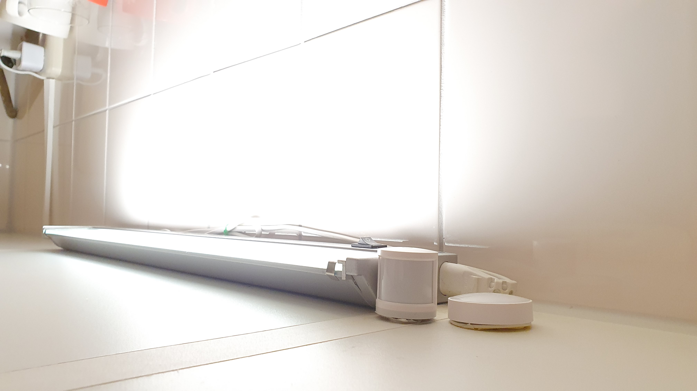
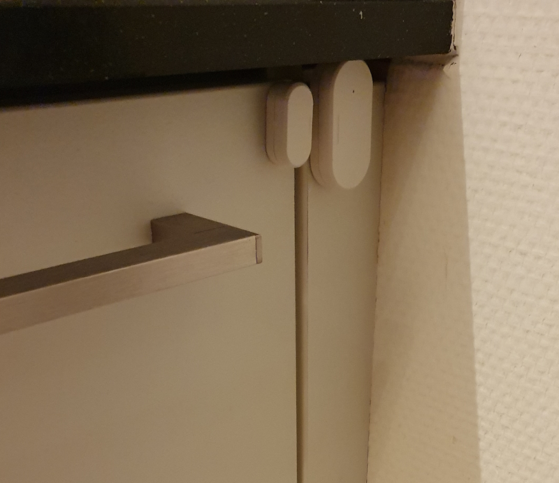
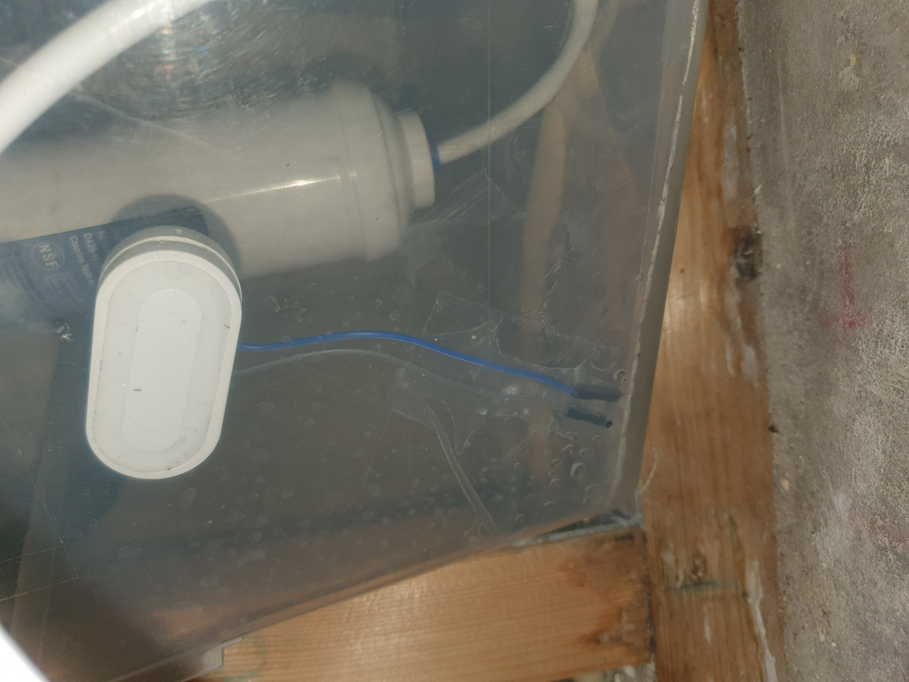
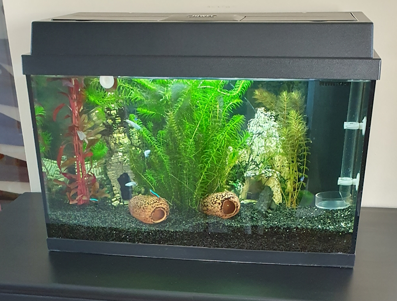

# Home Automation Ideas
*to make your home smart*

</a>

Below is a list of automations, based on a device or location, that I've implemented (or plan to implement) to make my home smarter.
  
Perhaps there are some useful ideas for you too!
  

---

## Table of Contents
<!-- TOC -->
  * [Introduction](#introduction)
  * [Mailbox](#mailbox)
  * [Washing machine / dryer / dishwasher](#washing-machine--dryer--dishwasher)
  * [Oven](#oven)
  * [Living room lights](#living-room-lights)
  * [Front yard](#front-yard)
  * [Christmas lights](#christmas-lights)
  * [Mechanical ventilation](#mechanical-ventilation)
  * [Laundry room](#laundry-room)
  * [(Bed)rooms](#bedrooms)
  * [Bathroom](#bathroom)
  * [Kitchen](#kitchen)
  * [Home office](#home-office)
  * [Outdoor](#outdoor)
  * [Closet / pantry / storage / stairs](#closet--pantry--storage--stairs)
  * [Drawer](#drawer)
  * [Car](#car)
  * [Putting out the bin](#putting-out-the-bin)
  * [Aquarium](#aquarium)
  * [(Dutch) Inspiration videos](#dutch-inspiration-videos)
<!-- TOC -->

---

## Introduction
I've started with a few automations for lights in the living room, the mailbox, and the washing machine.
And I've continually expanded these by adding more and more sensors and actuators, which result in 100+ automation flows running in my home.

Criteria for my own automations are:
* Capable of running locally (no-cloud); 
* It can also be controlled in the traditional way with "old-fashioned" buttons, so that everyone in the house can operate everything, without an app and even if the smart server is down;
* Works regardless of who is present (no extra trackers or apps needed).

\
For already a few years, I follow various forums and newsgroups to gather new ideas, which I then incorporate into my own automations.
\
Here I summarized them together in a list ordered by subject. Most of them are also active at my home.

I hope I can inspire you with some new home automation ideas.

---

## Mailbox
* Notification when mail is delivered. (contact sensor with a separate magnet on the flap)
* Notification if mail is sticking out. (if the contact sensor is broken and not closed again after 1 minute)
 

---

## Washing machine / dryer
* Notification when the washing machine/dryer is finished. (based on smart plug with energy meter)
 

* Notification when washing machine/dryer is not emptied yet after X time. (contact sensor on the door)

---

## Oven
* Notification when the oven reaches his preset temperature. (based on smart plug with energy meter. The power consumption drops when he reaches his temperature)
 

---

## Living room lights
* Lights fading in and out, according to twilight. (smart lights + lux sensor to detect brightness from inside and outside)
* Lights automatically turning off at bedtime. (smart lights + switch button near the bed)
* Lights are automatically turned off when no one is in the living anymore.
* Dimming lights after a few minutes when the DVD player is on. Brightness increases again when someone is detected in the kitchen.
  

---

## Front yard
* Outside lights on when:
  * Someone enters the door. (web-/doorcam with person recognition, smart outside light)
  * You connect to your wifi. (outside light)
  * You enter home-zone. (Home Assistant Companion app and outside light)
  

---

## Christmas lights
* Connecting battery-operated Christmas decorations to the power outlet. (equipped with battery eliminators and multiple connected to an active USB hub, powered by a smart plug for automation)
* Christmas tree lights. (replace the default power switch with always on mode switch and add a smart plug)
  

---

## Mechanical ventilation
* Depends on which area's the ventilation system is connected to.
  In my case, my bathroom humidity/temperature, kitchen humidity/temperature,
  kitchen/bathroom temperature/humidity difference, duration of a toilet visit.
  (lux value above threshold x for time Y) (MV control via an additional remote linked to an ESP)
  [Orcon mechanic ventilation](../esphome/orcon_mechanic_ventilation)
 

---

## Laundry room
* Lights on/off when entering/leaving. (door contact + smart light)
* Dehumidifier on based on humidity. (humidity sensor + dehumidifier also turned on with a smart plug)
* Notification if the water tank of the dehumidifier is full. (leakage sensor in the dehumidifier)
* 

---

## (Bed)rooms
* Light on when entering (and no one is already in bed). (door contact + smart light)
* Soft ledstrip on when going out of bed during the night.
* Dehumidifier on in the evening if the humidity is too high. (humidity sensor + dehumidifier also turned on with smart plug)
* Notification if windows can be opened in summer when it's cooler outside than inside. (indoor + outdoor temperature sensor)
* Notification to open a window if the CO2 level is too high [ESP CO2 sensor](../esphome/co2_senseair_s8_sensor)
* Notification to open a window if the humidity is inside too high compared to the value outside. (contact sensor on the window)
* Notification to close a window if heavy rain is expected within 10 minutes. (API weather forecast + contact sensor on the window)

---

## Bathroom
* Notification when someone takes a shower. (humidity sensor or water usage measuring)

---

## Kitchen

### Lights
* Extraction fan + lights automatically go on, based on temperature/humidity. (temperature sensor in the extractor hood)
* Lights on, based on presence + light. (motion sensor with lux + LED strip with smart plug)

### Dishwasher
* Notification when the dishwasher is finished. (based on smart plug with energy meter)
* Notification when dishwasher is not emptied yet after X time. (contact sensor on the door)
   
  

### Oven
* Notification when the oven reaches his preset temperature. (based on smart plug with energy meter. The power consumption drops when he reaches his temperature)
   
  

### Refrigerator

### Stove

### Sink
* Leak detector under the sink. (leak detector or modified contact sensor)

### Coffee machine

---

## Home office
* Computer screen + lights + phone charger on when you sit in the office chair. (car seat pressure sensor in the chair)
* Computer screen + lights + phone charger on when you enter the office. (contact sensor at the door)
* Office lights only on when it's dark and someone is in the room. (smart lights, lux sensor, mmWave sensor to detect a person who sits still)
* Extra heater on, based on temperature and presence. (temperature sensor + chair occupancy)
* On air light so people at home know you're in a call. (calendar integration + smart light)
* Notification to open a window if the inside temperature is too high compared to the outside temperature. (temperature sensor)
* Notification to open a window if the Co2 value is too high. (Co2 sensor)
* Airco on when it's too hot in- and outside. (smart plug + temperature sensor) 

---

## Outdoor
* Notification when it's nice weather to sit outside. (based on temperature, humidity, lux, sun strength from a weather station)
* Notification to close skylight or other window if it's open and rain is expected within fifteen minutes. (skylight/window contact sensor + API weather forecast/weather station)
* Notification to retract parasols if it's too windy. (outdoor temperature and wind speed from a weather station)
* Notification when the gate is opened (contact sensor)
* Turn the lights on when going outside in the evening/night (lux sensor, smart lights)

---

## Closet / pantry / storage / stairs
* Lights on when you open a closet door. (battery-powered LED light with a PIR sensor. Not connected, but smart/convenient!)

---

## Drawer
* Notify when the drawer is opened. (Attach a contact sensor behind the drawer to the closet and the magnet to the drawer itself, so when you open it, the contact gets broken and a signal is triggered)
* Notify when drawer is not yet opened today at a specific time. For example, if you have medicines in a drawer, you need to take every day.

---

## Car
* Notification to cover the car if the dew point is below -1 in the evening. This increases the chance of not having to scrape in the morning! (weather station)
* Notification to family when I leave work. (location positioning)
* Activate the driveway lights when you arrive home. (When enter the Home-zone, or connect to your local wifi network AND the phone bluetooth is connected to the car)
* Activate the front door lights. (see previous flow)

---

## Putting out the bin
* Notification when paper/green/plastic/residual waste bin needs to be put on the street. (waste calendar integration)
* Light up a LED strip in the color of the waste bin which must be put on the street the next day. (waste calendar integration)

---

## Aquarium
* Automatic turn the lights on and off. (smart plug)
* Turn the lights on when they got fed. (contact sensor at the lid of the aquarium).
* Automatic feeder.
* Water quality check PH-level.
* Temperature warning if water is too hot/cold. (ESP with waterproof temperature sensor)
 

---

## (Dutch) Inspiration videos
There are more home automation geeks like me!

Here are some (Dutch) videos for inspiration:
* [Almere NL (Bright 2024)](https://youtu.be/Q2C1SlfPhKE?si=od3TQVtwhskp71oA)
* [Home tour on a range, US (Smart Home Solver 2023)](https://www.youtube.com/ZYGYG8tDaDY)
* [Home tour by Jimmy, US (Smart Home Solver 2023)](https://youtu.be/bzHdg0RLO1I?si=UwcUB_B8I0oOaBjV)
* [Home tour in Georgia, US (Smart Home Solver 2023)](https://www.youtube.com/watch?v=FkfCoRJZlHA&list=PLERasyubmasVHFLS0ZR4vdg3PVC09hE99&index=4&pp=iAQB)
* [Nieuwbouw woning volledig smart maken, deel 2 (FWD Smart Living Project 2021)](https://www.youtube.com/watch?v=W5c6haXNsic)
* [Nieuwbouw woning volledig smart maken, deel 1 (FWD Smart Living Project 2021)](https://youtu.be/Ff3z3aZfUco?si=c4Hvh6VvqGdYnDpp)
* [Installatie Hue en Google producten (Tweakers 2019)](https://www.youtube.com/watch?v=zqvJerYvlwg)
* [Huis van de oprichter van Tweakers (Tweakers 2017)](https://youtu.be/fWcDT4JISn8?si=C6t0YEN1aYmTF_lu)
* [Huis van de toekomst, met Chriet Titulaer (1989 - 2009)](https://youtu.be/dEsndb8cSn0?si=RisW8OXpGpq5MyYZ)
  
If you know any other great videos that inspired you, let me know via a <a href="#remarks-or-suggestions">message</a>, and I can add it also to this list!