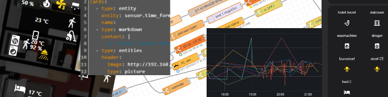

# vd Brink Home Automations

Welcome to my blog about Home Automations.

You find here examples from my automations, which you can use in your own projects.

---

## Updates

My latest biggest updates on this blog:

* [Home Assistant - Community Day countdown](homeassistant/homeassistant_templates#day-countdown)
* [USB adapter switch](/zigbee/usb_adapter_switch) to control USB devices
* [Home Assistant - Tips: Dashboard edit dialog enlarger](/homeassistant/homeassistant_tips_tricks)
* [Home Assistant - Pollen Radar](homeassistant/homeassistant_hacs_kleenex)
* [Home Assistant - Automate infrared-controlled devices](zigbee/smart_infrared_transmitter_receiver)
* [18.5x longer life for a sensor with a CR2032 battery](/buy/cr2032_to_aa_batteries)
* [Batteries - Best Buy Tips](/buy/batteries) for all kinds of batteries to power your sensors.
* I started to share my projects on <a href="https://www.facebook.com/brinkhomeautomations">/brinkhomeautomations</a>

* [Home Automation - Ideas](ideas/home_automation_ideas)
* [Zigbee - DIY chair occupancy sensor](zigbee/zigbee_chair_occupancy_sensor)
* [ESPHome - DIY CO2 sensor](esphome/co2_scd40)

* [Home Assistant - Templates](homeassistant/homeassistant_templates)
* [Home Assistant - Useful HACS custom elements](homeassistant/homeassistant_dashboard_hacs)
* [Smart Home Best Buy Tips](buy/smart_home_best_buy_tips)

---

---

## Topics

Topics you can find here:

|                                                                                                                                          |                                                                                                                                                                                                                            | 
|------------------------------------------------------------------------------------------------------------------------------------------|----------------------------------------------------------------------------------------------------------------------------------------------------------------------------------------------------------------------------|
|       | [Home Assistant](homeassistant/index) related information, examples, integrations etc...                                                                                                                                   |
|                                           | [Zigbee: Why choose it? Create your own Zigbee sensors](zigbee/index)                                                                                                                                                   |
|  | * [Smart Home - Best Buy Tips](buy/smart_home_best_buy_tips) * [Zigbee Outdoor - Best Buy Tips](buy/zigbee_outdoor)  * [ESP DIY - Best Buy Tips](buy/esphome_diy) * [Batteries - Best Buy Tips](buy/batteries) |
|                                       | [ESPHome:  Create your own sensors and actuators](esphome/index)                                                                                                                                                        |
|                    | [Home automation ideas](ideas/home_automation_ideas)  [Home automation videos](ideas/home_automation_videos)                                                                                                         |
|           | [Random automated projects](projects/index) Package mailbox, ventilation system, Christmas deco etc..                                                                                                                   |
|                             | [Node-RED:  Graphical programming tool to create every automation](node-red/index)                                                                                                                                      |
|                                     | [Docker:  Run applications](docker/index)                                                                                                                                                                               |

---

 

    <a href="https://quote-shirt-shop.myspreadshop.net/" target="_blank">
        Computer quotes T-shirts, Hoodies, Mugs, Stickers, etc..
         
        
    </a>

 

---

## Background

Hi, since I was a little kid, I was always interested in home automation and years later still it's my passion to
automate my home!

With the introduction of the ESP boards, with wifi support, it all became easier to create your own sensors.
Manufactures started to create products which are now more affordable and easier to connect to each other.
Software projects, Like Zigbee2MQTT, Home Assistant and Node-RED, popped up, and more users adopted these projects and so did I.
With this as your base, you can connect hardware devices together and let them work together via software, the
possibilities are endless.

LET THE FUN BEGIN!

It started with activate the light based on the darkness, get notifications when you got (snail)mail or the washing
machine is ready.
For most projects, it starts with an idea of something I want to automate.\
Then I start to look for similar projects on all kinds of sources, search the internet, follow forums and groups.
I also get inspired by others with new ideas which I can use for my own setup.

Here you can find examples and configurations which I created and gathered over the years.
I want to share and inspire other people, so they can improve their own home automation projects.