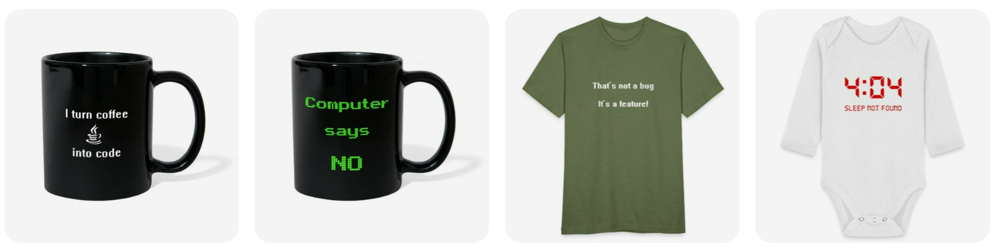

# vd Brink Home Automations

Hi, since I was a little kid I was always interested in home automation and years later still it's my passion to automate my home!

With the introduction of the ESP boards, with wi-fi support, it all became easier to create your own sensors.
Manufactures started to create products which are now more affordable and easier to connect to each other. 
Software projects, Like Zigbee2MQTT, Home Assistant and Node-RED, popped up and more users adopted these projects and so did I.
With this as your base you can connect hardware devices together and let them work together via software, the possibilities are endless.

LET THE FUN BEGIN!

It started with activate the light based on the darkness, get notifications when you got (snail)mail or the washing machine is ready.
For most projects it starts with an idea of something I want to automate.\
Then I start to look for simular projects on all kind of sources, search the internet, follow forums and groups. 
I also get inspired by others with new ideas which I can use for my own setup.

Here you can find examples and configurations which I created and gathered over the years.
I want to share and inspire other people, so they can improve their own home automation projects.

Subjects you can find here are about: [Home Assistant](homeassistant/index), [ESPHome](esphome/index), [Node-RED](node-red/index), Docker, Tasker

----
**Topics you can find here:**

|                                                                                                                                     |                                                                                       | 
|-------------------------------------------------------------------------------------------------------------------------------------|---------------------------------------------------------------------------------------|
|  | [Home Assistant:  Home automation dashboards](homeassistant/index)                 |
|                                  | [ESPHome:  Create your own sensors and actuators](esphome/index)                   |
|                        | [Node-RED:  graphical programming tool to create every automation](node-red/index) |

---
## Feel free to sponsor me

If you like what your read here consider a donation.

It's up to you how much you want to donate to support me writing more articles.

* You can donate via PayPal  

* Or buy one of these cool mugs, shirts or other stuff with cool geeky text on it.
For yourself or as original present.

* Or buy me a coffee, I convert coffee to code and docs!

---
## Remarks or suggestions?
Do you have any remarks, spell improvement suggestions or dead links, please let me know via github issues.

[Create an issue](https://github.com/vdbrink/vdbrink.github.io/issues)
