# vd Brink Home Automations

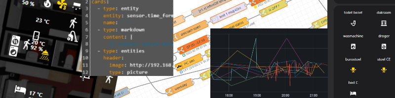

Welcome to my blog about Home Automations and other tech projects.

Here you can find projects I worked on related to Home Assistant, ESP, electronics, Zigbee and my home office.

---

## Updates
My latest 5 posts:

    
    
    <a class="project-card" href="{{ post.url | relative_url }}">
        
        {%- assign date_format = site.minima.date_format | default: "%b %d, %Y" -%}
        {{ post.title | remove_first: "Feed: " | escape }} <em>{{ post.date | date: date_format }}</em>
    </a>
    

See <a href="/feed.html">here</a> all previous posts.

---

## Highlights
My most visited and interrested pages on this site:

    <a class="project-card" href="homeassistant/homeassistant_dashboard_weather_nl">
        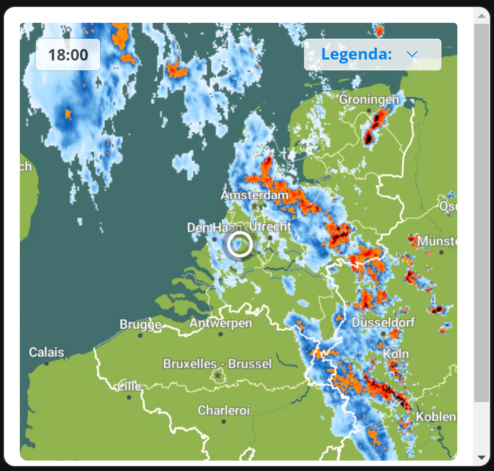
        Home Assistant - Weather in The Netherlands
    </a>
    <a class="project-card" href="esphome/orcon_mechanic_ventilation">
        
        ESPHome - Control an Orcon mechanic ventilation system from Home Assistant
    </a>
    <a class="project-card" href="zigbee/zigbee_chair_occupancy_sensor">
        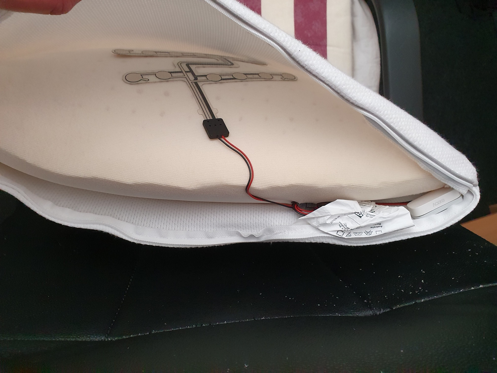
        DIY Zigbee - Chair occupancy sensor
    </a>
    <a class="project-card" href="esphome/co2_scd40">
        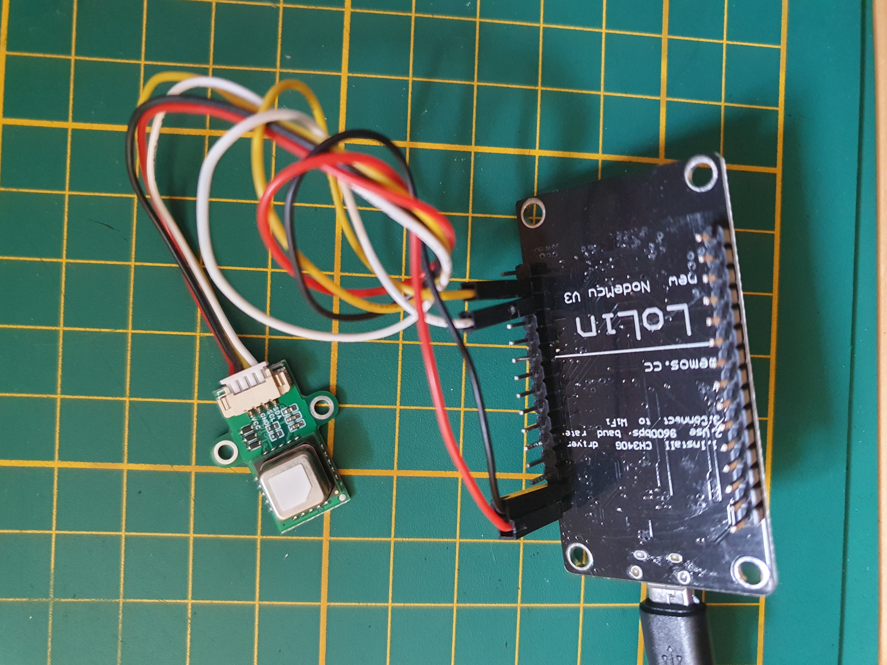
        ESPHome - DIY CO2 (model SCD40) sensor
    </a>
    <a class="project-card" href="/desk">
        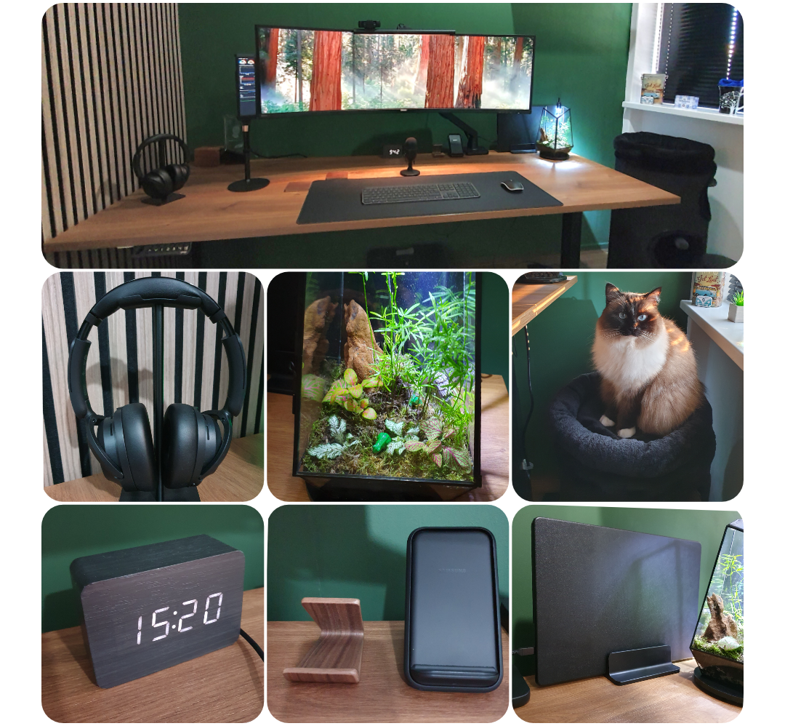
        Home office - Desk setup and room design with AI
    </a>
    <a class="project-card" href="homeassistant/homeassistant_dashboard_tablet_in_kiosk_mode">
        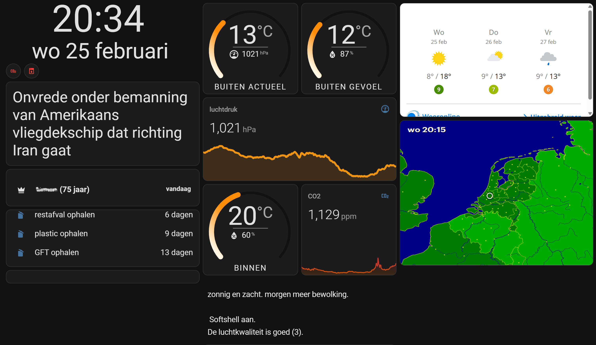
        Home Assistant - Dashboard on a tablet in kiosk mode
    </a>
    <a class="project-card" href="/projects/smart_mailbox">
        
        Projects - Smart traditional mailbox
    </a>
    <a class="project-card" href="/homeassistant/homeassistant_hardware">
        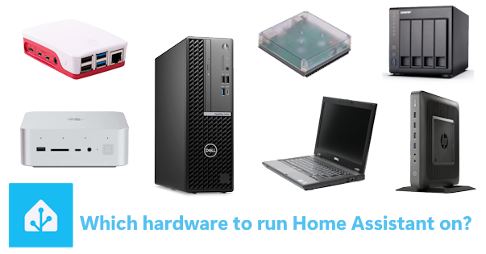
        Home Assistant - Which hardware to run Home Assistant on?
    </a>
    <a class="project-card" href="/homeassistant/homeassistant_dashboard_floorplan">
        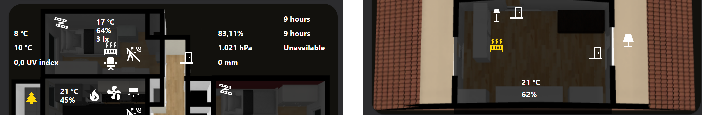
        Home Assistant - Floor plan
    </a>
    <a class="project-card" href="zigbee/smart_infrared_transmitter_receiver">
        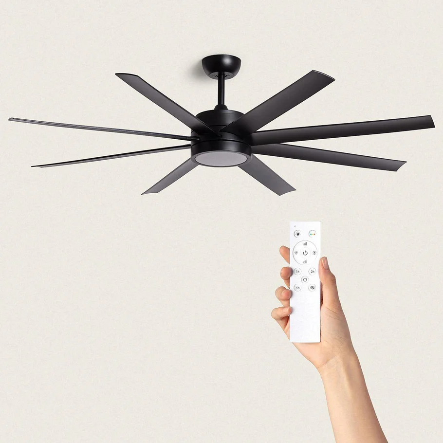
        Home Assistant - Automate infrared-controlled devices
    </a>
    <a class="project-card" href="homeassistant/homeassistant_templates">
        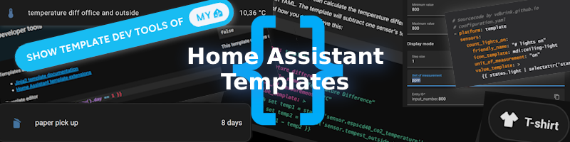
        Home Assistant - Templates
    </a>
    <a class="project-card" href="homeassistant/homeassistant_dashboard_hacs">
        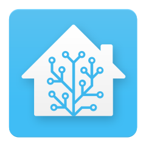
        Home Assistant - Useful HACS custom elements
    </a>
    <a class="project-card" href="buy/smart_home_best_buy_tips">
        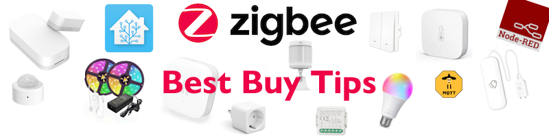
        Buy - Smart Home Best Buy Tips
    </a>

---

## Topics

Topics on this site per category:

|                                                                                                                                          | Subjects                                                                                                                                                                                                                                                                                            |
|------------------------------------------------------------------------------------------------------------------------------------------|-----------------------------------------------------------------------------------------------------------------------------------------------------------------------------------------------------------------------------------------------------------------------------------------------------|
|       | [Home Assistant](homeassistant/index) related information, examples, integrations etc...                                                                                                                                                                                                            |
|                                           | [Zigbee: Why choose it? Create your own Zigbee sensors](zigbee/index)                                                                                                                                                                                                                            |
|  | * [Smart Home - Best Buy Tips](buy/smart_home_best_buy_tips) * [Zigbee Outdoor - Best Buy Tips](buy/zigbee_outdoor) * [Home server - Best Buy Tips](homeassistant/homeassistant_hardware)  * [ESP DIY - Best Buy Tips](buy/esphome_diy) * [Batteries - Best Buy Tips](buy/batteries) |
| <a href="esphome/index">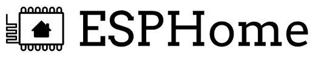</a>                                      | [ESPHome:  Create your own sensors and actuators](esphome/index)                                                                                                                                                                                                                                 |
|                    | [Home automation ideas](ideas/home_automation_ideas)  [Home automation videos](ideas/home_automation_videos)                                                                                                                                                                                  |
| <a href="projects/index">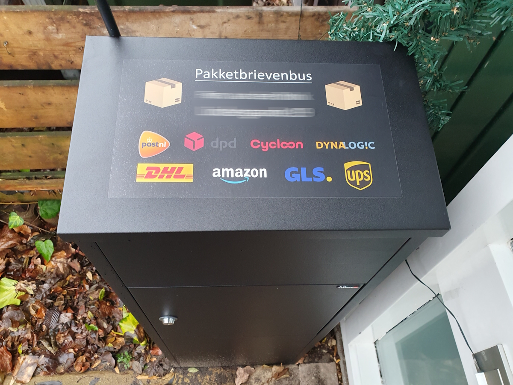</a>          | [Random automated projects](projects/index) Package mailbox, ventilation system, Christmas deco etc..                                                                                                                                                                                            |
| <a href="node-red/index">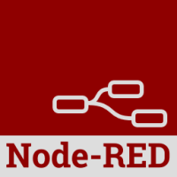</a>                            | [Node-RED:  Graphical programming tool to create every automation](node-red/index)                                                                                                                                                                                                               |
|                                     | [Docker:  Run applications](docker/index)                                                                                                                                                                                                                                                        |

---

 

    <a href="https://quote-shirt-shop.myspreadshop.net/" target="_blank">
        🛒 Check out this Shop: Nerdy famous quotes on T-shirts, Hoodies, Mugs, Stickers &amp; more!
         
        
    </a>

 

---

## Background

Hi, since I was a little kid, I was always interested in home automation and years later still it's my passion to
automate my home!

With the introduction of the ESP boards, with wifi support, it all became easier to create your own sensors.
Manufacturers started to create products that are now more affordable and easier to connect to each other.
Software projects like Zigbee2MQTT, Home Assistant and Node-RED popped up, more users adopted these projects and so did I.
With this as your base, you can connect hardware devices together and let them work together via software, the
possibilities are endless.

LET THE FUN BEGIN!

It started with activating the lights based on darkness, getting notifications when you received (snail) mail or the washing machine was done.
For most projects, it starts with an idea of something I want to automate.\
Then I start to look for similar projects on all kinds of sources, search the internet, follow forums and groups.
I also get inspired by others with new ideas which I can use for my own setup.

Here you can find examples and configurations which I created and gathered over the years.
I want to share and inspire other people, so they can improve their own home automation projects.
