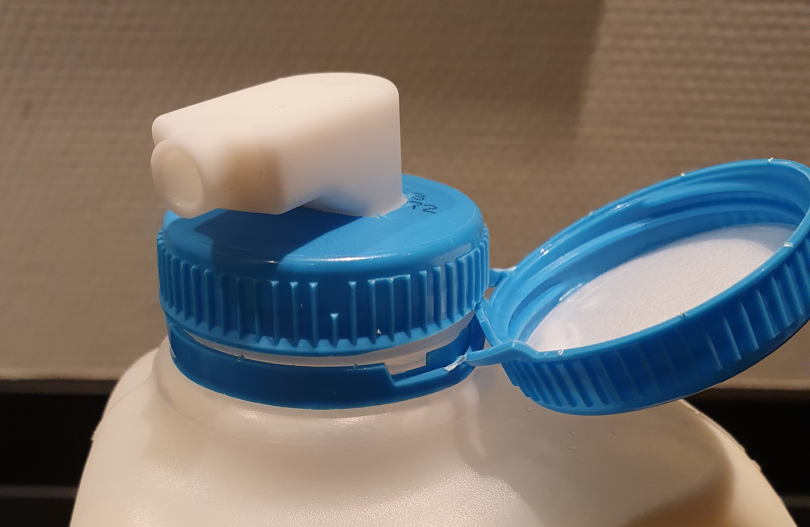
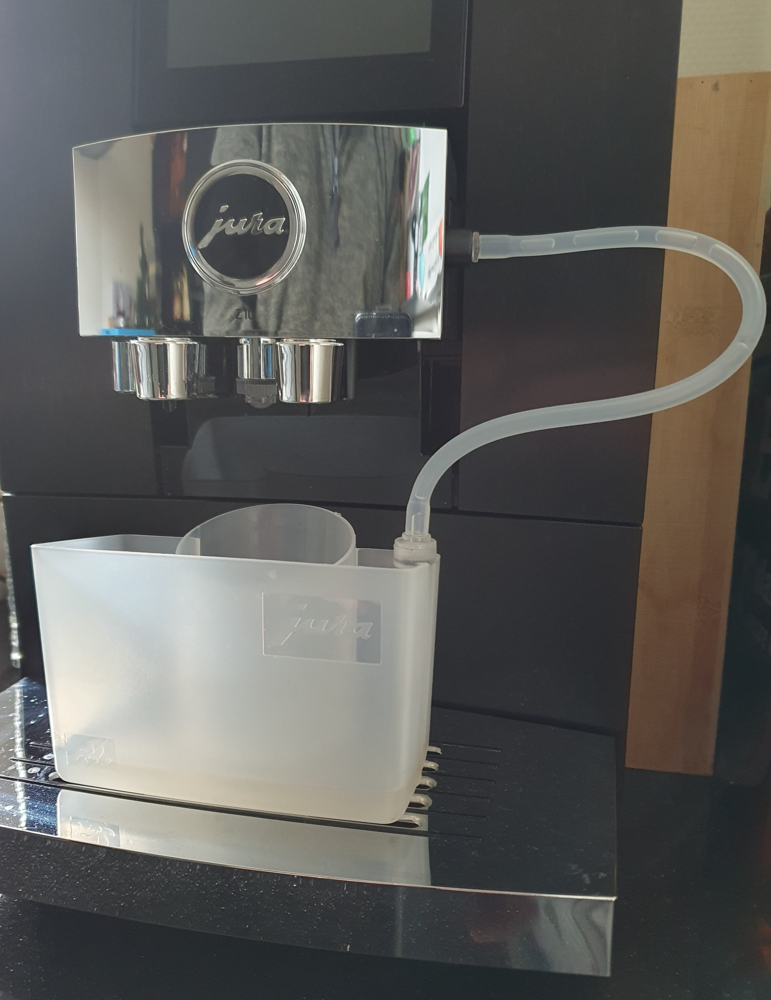
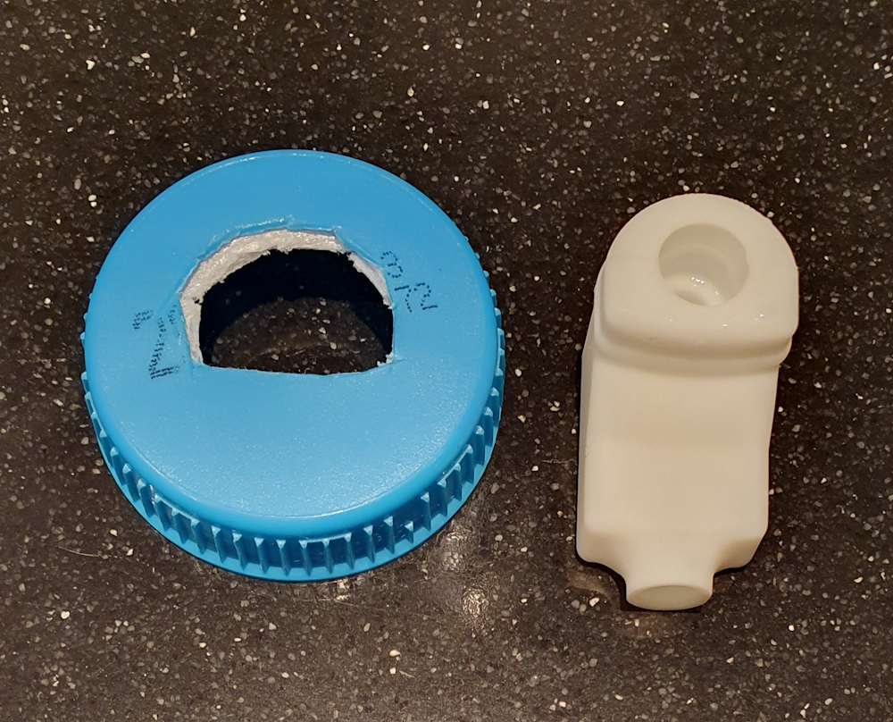
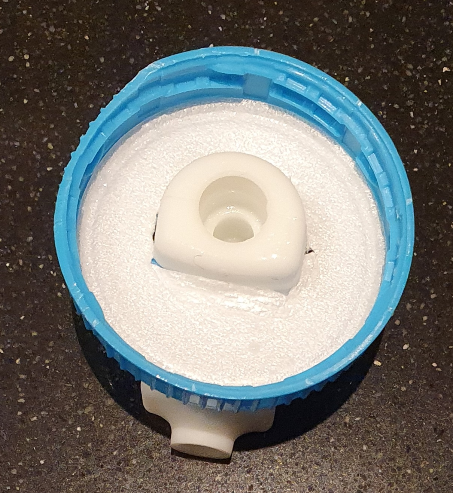
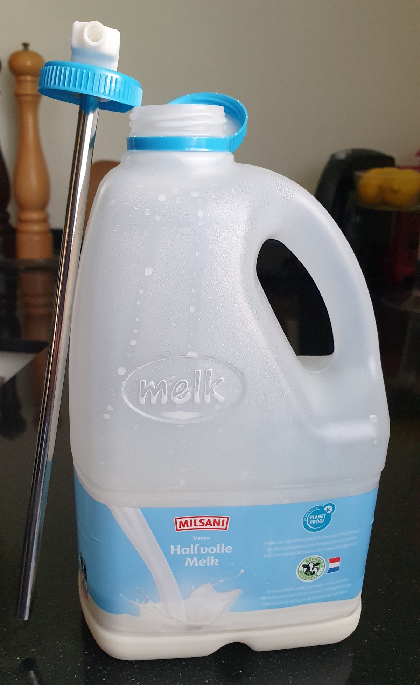
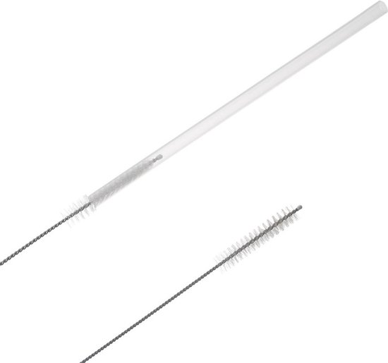



# Plastic milk bottle as compatible Jura container Hack
*supermarket plastic milk bottle directly attached to a Jura coffee machine*

---
## Introduction

My name is Ronald, and I like to simplify life with life hack and digital automations. 
There is this blog about.
Sometimes with some simple combinations of materials, you can make your life easier.
On this page, you can read how I simplified making milk based coffee with my new Jura Z10 machine.

*The end result*

---
## My "problem"

I always drink my coffee with milk, that's why I started by using the [Jura glass milk container](jura_products#basic-container).
It can hold up to 0,5 liter milk, and it works .... but it's not ideal for me.

My "problem"; it doesn't contain enough milk to make two (for me and my partner) big cappuccino's with one filled container.
After the first coffee is created, I needed to add more milk to the glass container from a big supermarket plastic milk bottle before I can make the second one.

Many steps BEFORE I HAD ANY COFFEE :).

 

I could buy a bigger container, 
like a [Jura milk cooler](jura_products#active-cooler-1l) which can hold up to 1 (34 oz) or 2.5 liter (85 oz) milk.
The downsides are: I need to place it also on the kitchen counter, and it takes a lot of space. 
I have to pay extra for the used energy to cool the milk, 
it's not cheap and that for only make twice a day coffee.
And, with this solution, I still need to refill it every day.

So I thought, why can't I use the original milk bottle from the supermarket as a milk container for my Jura machine?
Then I don't have to pour milk anymore.
Then I can get the milk bottle from the refrigerator, attach it, 
make my coffee, and put it back in the refrigerator. 
Done!

That was my new mission to see if this is possible to accomplish!

---

## Table of Contents
<!-- TOC -->
  * [Goal](#goal)
  * [My solution](#my-solution)
    * [Idea](#idea)
    * [Test setup](#test-setup)
    * [Version 1](#version-1)
    * [Version 2](#version-2)
    * [Cheaper version](#cheaper-version)
  * [Cleaning](#cleaning)
  * [Create one yourself](#create-one-yourself)
<!-- TOC -->

---
## Goal

I want to use an original milk bottle from the supermarket as a milk supply for my Jura machine.
Based on the same principal of the original Jura hose and how the original Jura milk container works.
this way I still can use the original hose to clean the milk system.
And easily attach and detach the milk bottle.

I want to screw a normal milk bottle top with a compatible Jura milk connector.
The top should close the milk bottle, so no air can come in.
And with a stainless steel pipe attached to it which reach to the bottom of the bottle. 

That should be brilliant if that's possible!

---

## My solution

### Idea

At the time I was looking for a solution milk adapter, the new Jura milk Carafe was released.
I first looked at a custom 3D printed adapter, but you need special plastic which is also suitable for food.
This [Jura Carafe](/jura/jura_products#carafe) has a removable milk adapter (actually two, a white and a black one)!
A bit expensive for only the adapter but exactly what I need!
It's still cheaper than buying, maintaining and refilling a powered [Jura milk cooler](/jura/jura_products#active-cooler-1l).

 

The [Jura Carafe](/jura/jura_products#carafe) uses an 8 mm wide stainless steel tube, so I need that but a longer version of it.
I found it on AliExpress, a 6 mm [stainless steel tube](https://s.click.aliexpress.com/e/_ombnM7I) with a length of 215 mm.

### Test setup

The carafe uses a 6 mm wide and X cm long stainless steel tube.
But my milk bottle is much deeper than the carafe container, so I need a similar tube but a longer version of it.
I found it on AliExpress, a 6 mm {{imgBasket}} [stainless steel tube](https://s.click.aliexpress.com/e/_ombnM7I) with a length of 215 mm.

The adapter fits perfect on a 6 mm but also on an 8 mm tube.

Now I need to test if this setup also works as intended.
If it still can suck the milk through the extra long tube and no air comes in.

The test succeeded!
The same amount of milk comes through the tube as with the original tube.

### Version 1

Starting the next phase.
Creating a total solution.
Now air comes in through the original milk bottle top, 
so I need to create a new top with the adapter build in the milk bottle top.

I used a screw top from an old bottle and drew the contour of the Jura milk adapter on it.
Then I cut the shape of the adapter out of the cap with a stanley knife.

After testing this for a while with success, there was still some milk left over in the bottle.
I still need a larger amount to decant the leftover milk to the next bottle.
With a bit longer tube, I could reach the complete bottom of the bottle.

### Version 2

I searched and found an even longer version, and replaced it with a longer one.
This [stainless steel tube](https://s.click.aliexpress.com/e/_oFz0a1i) is 8 mm width and 300 mm long (0,24 inch width x 7,78 inch long).
A bit too long, but I could cut it to the right maximum length, now it reaches the complete bottom of the bottle.
This tube is also 2 mm wider but also fits perfect in the milk adapter.

With this replaced tube, there is only a very little milk left over in the bottle! 
This bottle be decanted to the next bottle without any problem.
Perfect!

 

 

 

I'm an even happier person with my Jura and now also with this hack!

### Cheaper version

If you don't want to spend too much money on the Jura Carafe, 
you can buy a [long hoses](https://amzn.to/4rce8XW) and put this direct in an open milk bottle.
The downside is that milk "sticks" to the outside of the hose when you get it out of the bottle, 
and you need to clean it direct to avoid dripping.

---
## Cleaning

To clean the hose, use the milk cleaning program on the machine to remove the left milk from the hose.

The adapter and tube inside the bottle are not part of the cleaning program of the machine itself, you need to clean it manually.
I clean the tube and lid every week when I also clean the rest of the machine.
I use a small and long [brush](https://s.click.aliexpress.com/e/_c3FYnYW9) to also clean the inside of the tube to avoid milk bottle residues.

---

## Create one yourself

Do you also want to create one yourself now?

These are the parts I used to create my final version:
* An old milk bottle top
* [Jura Carafe](jura_products#carafe) for its adapter and hose
* [Stainless steel tube](https://s.click.aliexpress.com/e/_oFz0a1i)
* [Cleaning straw brush](https://s.click.aliexpress.com/e/_c3FYnYW9)
* Stanley knife
* Pencil

 

I like to hear about your experiences!
You can reply in the comments on my social media posts.

---

Enjoy your coffee!

 

[Other Jura Hacks](jura_hacks) | 
[Jura Tip & Tricks](/jura)