

# Plastic milk bottle as compatible Jura container Hack
*supermarket plastic milk bottle directly attached to a Jura coffee machine*

 

<a href="images_bottle_hack/bottle_hack.jpg">
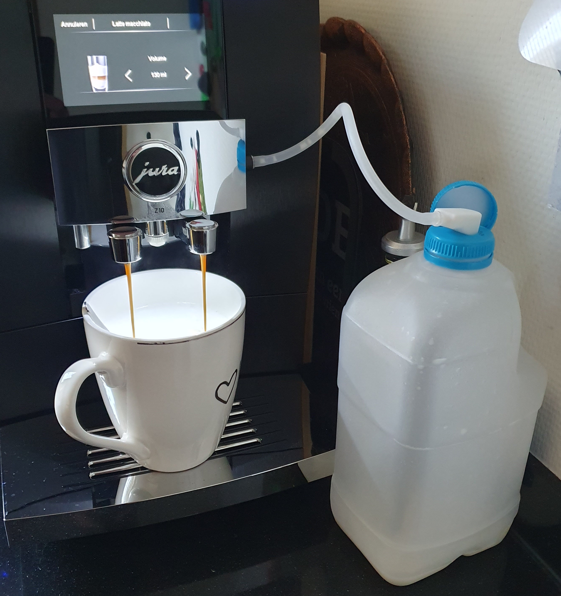
</a>

*The end result*

---
## My "problem"

I always drink my coffee with milk, that's why I started by using the [Jura glass milk container](jura_products#container).
It can hold up to 0,5 liter milk, and it works .... but it's not ideal for me.

My "problem"; it doesn't contain enough milk to make two (for me and my partner) big cappuccino's with one filled container.
After the first coffee is created, I needed to add more milk to the glass container from a big supermarket plastic milk bottle before I can make the second one.
A lot of steps BEFORE YOU HAD ANY COFFEE :).

<a href="images_products/jura_milk_can.jpg">
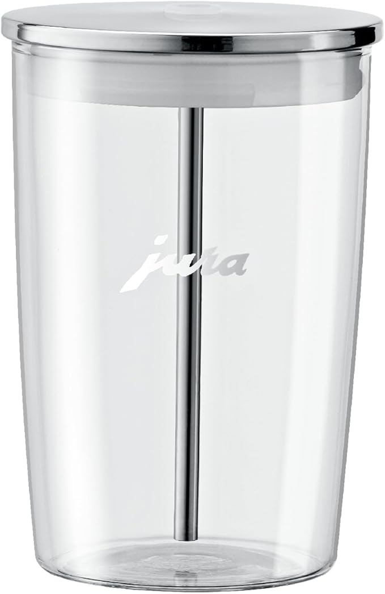
</a>

<a href="images_bottle_hack/milk_can_refill.jpg">
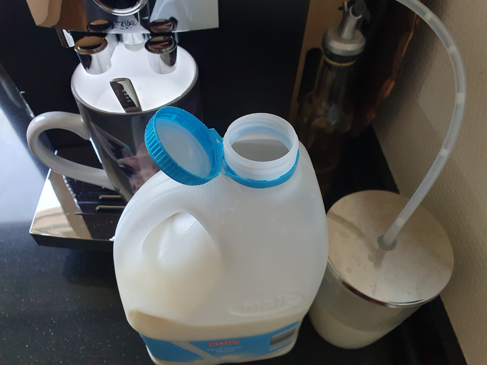
</a>

I could buy a bigger container, 
like a [Jura milk cooler](jura_products#active-cooler-1l) which can hold up to 1 or 3 liter milk.
The downsides are: I need to place it on the kitchen counter, I have to pay extra for the used energy to cool the milk, 
it's not cheap and that for only make twice a day coffee.
AND with this solution, I still need to refill it every day.

So I thought, why can't I use the original milk bottle from the store as a milk supply for my Jura machine?
Then I don't have to pour milk anymore.

That was my new mission!

---

## Table of Contents
<!-- TOC -->
  * [Goal](#goal)
  * [My solution](#my-solution)
    * [Idea](#idea)
    * [Test setup](#test-setup)
    * [Version 1](#version-1)
    * [Version 2](#version-2)
  * [Create one yourself](#create-one-yourself)
<!-- TOC -->

---
## Goal

I want to use an original milk bottle from the supermarket as a milk supply for my Jura machine.
Based on the same way, the principal of the original Jura tube and how the original Jura milk container works.
this way I can still use the original way to clean the milk system.

I want to screw a custom milk can top with a compatible Jura milk connector and with a stainless steel pipe attached to it which reach to the bottom of the can. 
The top should close the milk can, so no air can come in.

That should be brilliant if that's possible!

<a href="images_bottle_hack/new_diy_can_top.jpg">
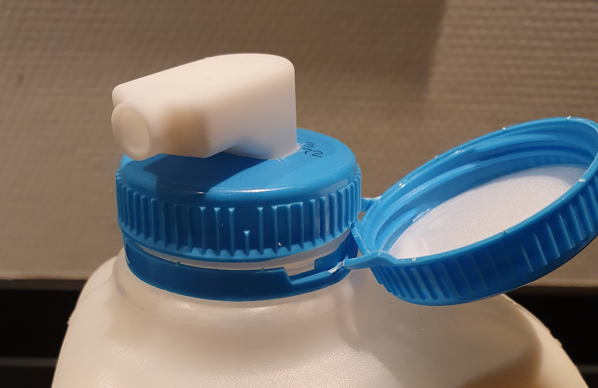
</a>

---

## My solution

### Idea

At the time I was looking for a solution (with a custom 3D printed) milk adapter, the new Jura milk Carafe was released.
This [Jura Carafe](/jura/jura_products#carafe) has a removable milk adapter (actually two, a white and black one)!
A bit expensive for only the adapter but exactly what I need!
It's still cheaper than buying, maintaining and refilling a powered [Jura milk cooler](/jura/jura_products#active-cooler-1l).

<a href="images_bottle_hack/carafe_package.jpg">
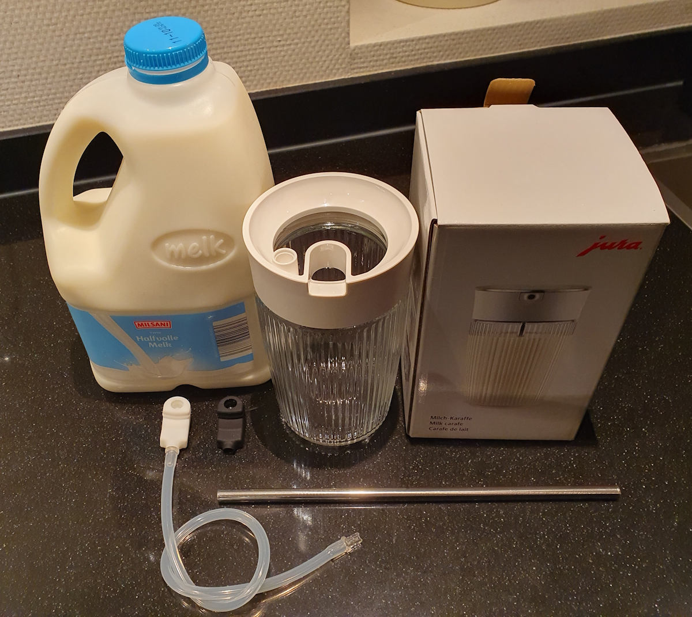
</a>

 

<a href="images_bottle_hack/new_jura_milk_carafe_adapter.jpg">
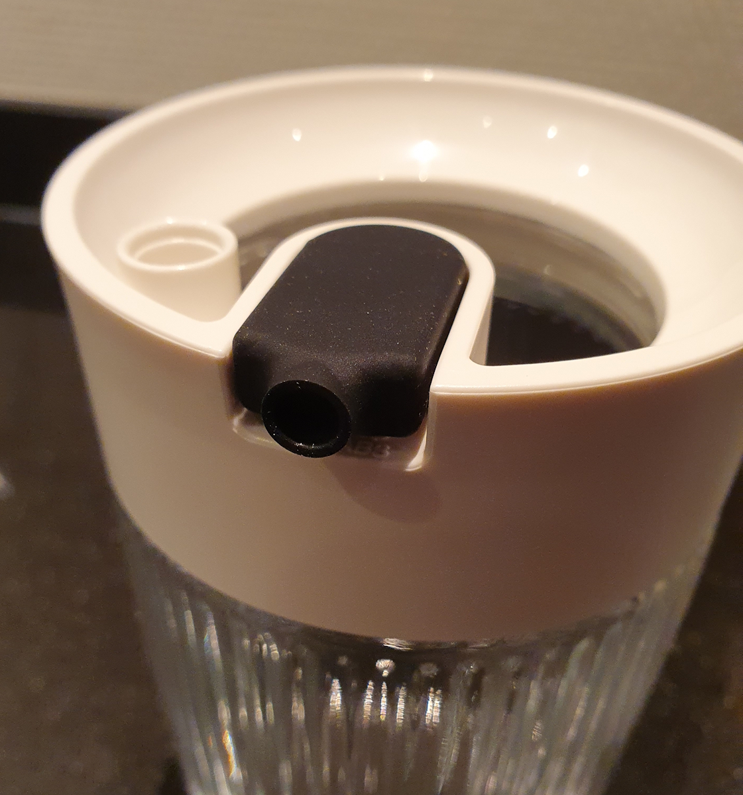
</a>

<a href="images_bottle_hack/jura_adapter.jpg">
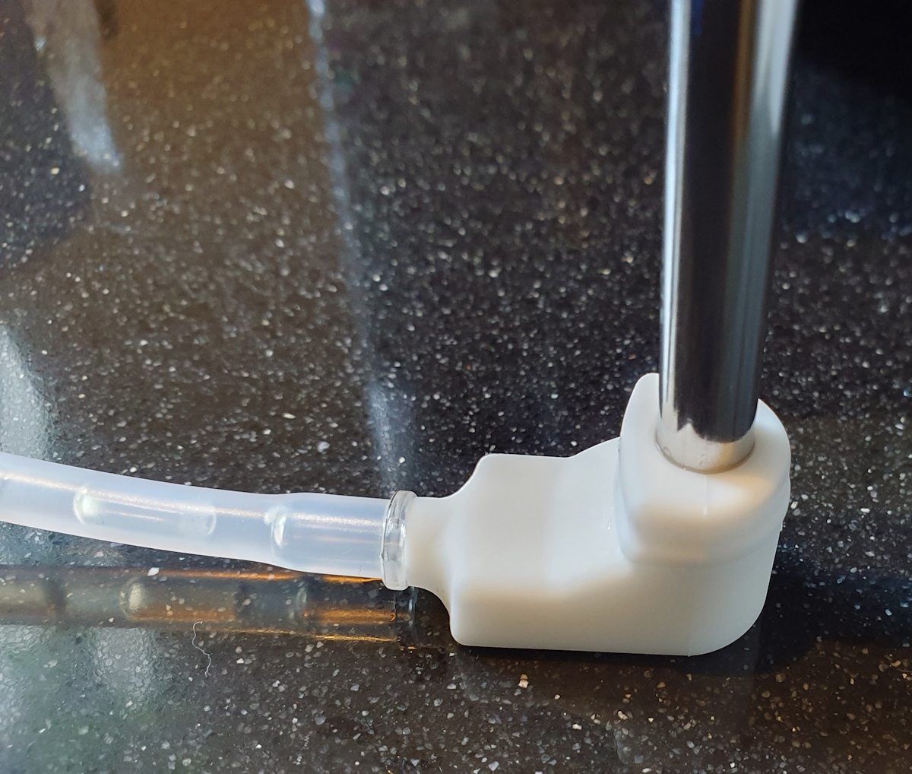
</a>

The [Jura Carafe](/jura/jura_products#carafe) uses an 8 mm wide stainless steel tube, so I need that but a longer version of it.
I found it on AliExpress, a 6 mm [stainless steel tube](https://s.click.aliexpress.com/e/_ombnM7I) with a length of 215 mm.

### Test setup

The carafe uses a 6 mm wide and X cm long stainless steel tube.
But my milk can is much deeper than the carafe container, so I need a similar tube but a longer version of it.
I found it on AliExpress, a 6 mm {{imgBasket}} [stainless steel tube](https://s.click.aliexpress.com/e/_ombnM7I) with a length of 215 mm.

The adapter fits perfect on a 6 mm but also on an 8 mm tube.

Now I need to test if this setup also works as intended.
If it still can suck the milk through the extra long tube and no air comes in.

<a href="images_bottle_hack/test_setup.jpg">
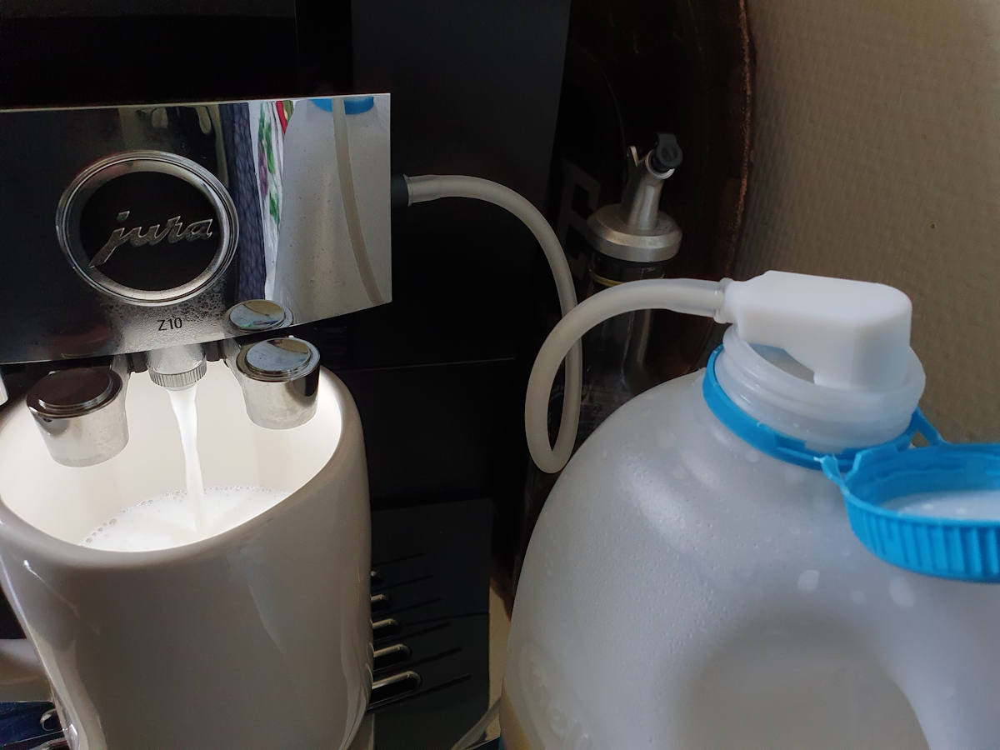
</a>

The test succeeded!
The same amount of milk comes through the tube as with the original tube.

### Version 1

Starting the next phase.
Creating a total solution.
Now air comes in through the original milk can top, 
so I need to create a new top with the adapter build in the milk can top.

I used a screw top from an old bottle and drew the contour of the Jura milk adapter on it.
Then I cut the shape of the adapter out of the cap with a stanley knife.

<a href="images_bottle_hack/same_tube_principle.jpg">
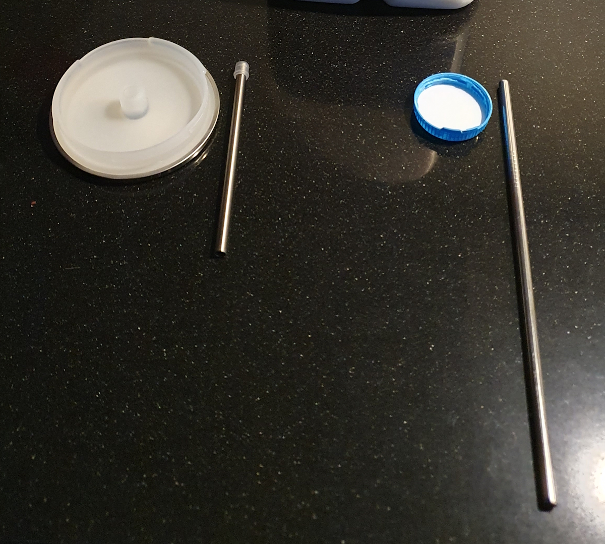
</a>

<a href="images_bottle_hack/diy_top.jpg">
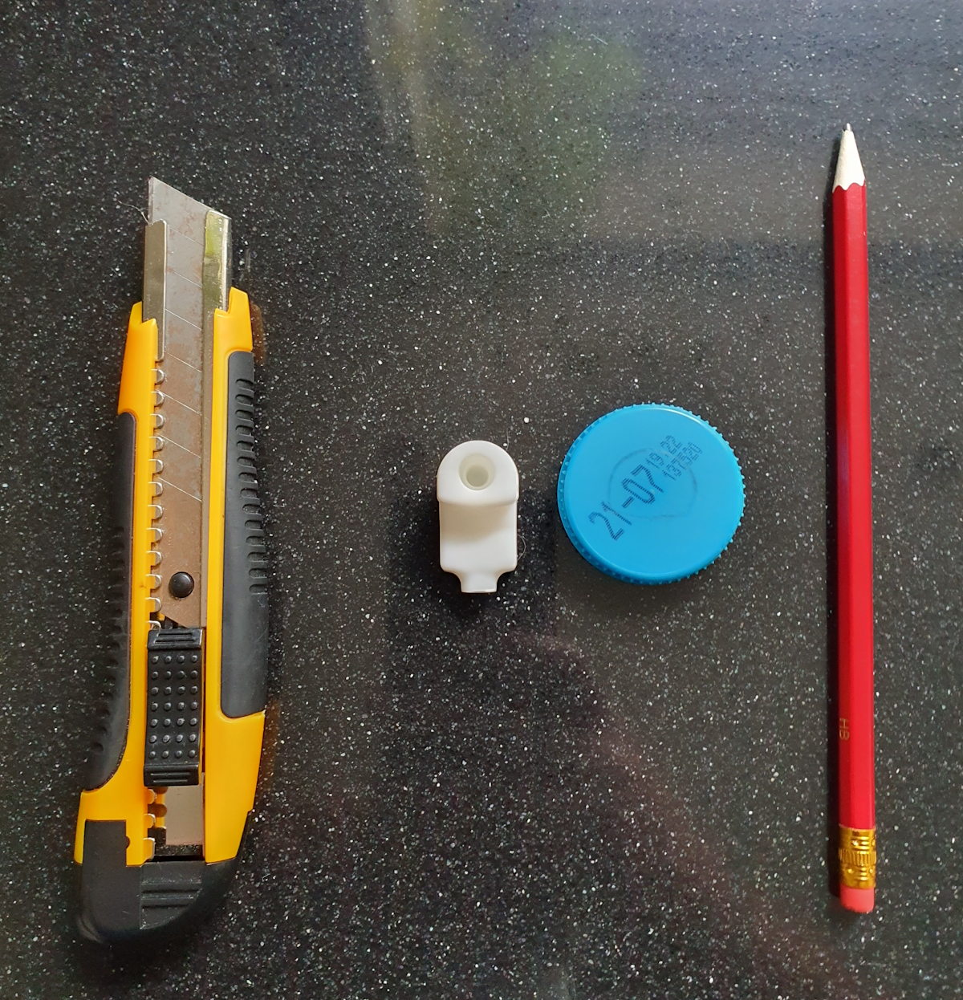
</a>

After testing this for a while with success, there was still some milk left over in the can.
I still need a larger amount to decant the leftover milk to the next can.
With a bit longer tube, I could reach the complete bottom of the can.

### Version 2

I searched and found an even longer version, and replaced it with a longer one.
This [stainless steel tube](https://s.click.aliexpress.com/e/_oFz0a1i) is 8 mm width and 300 mm long (0,24 inch width x 7,78 inch long).
A bit too long, but I could cut it to the right maximum length, now it reaches the complete bottom of the can.
This tube is also 2 mm wider but also fits perfect in the milk adapter.

<a href="images_bottle_hack/saws_tube.jpg">
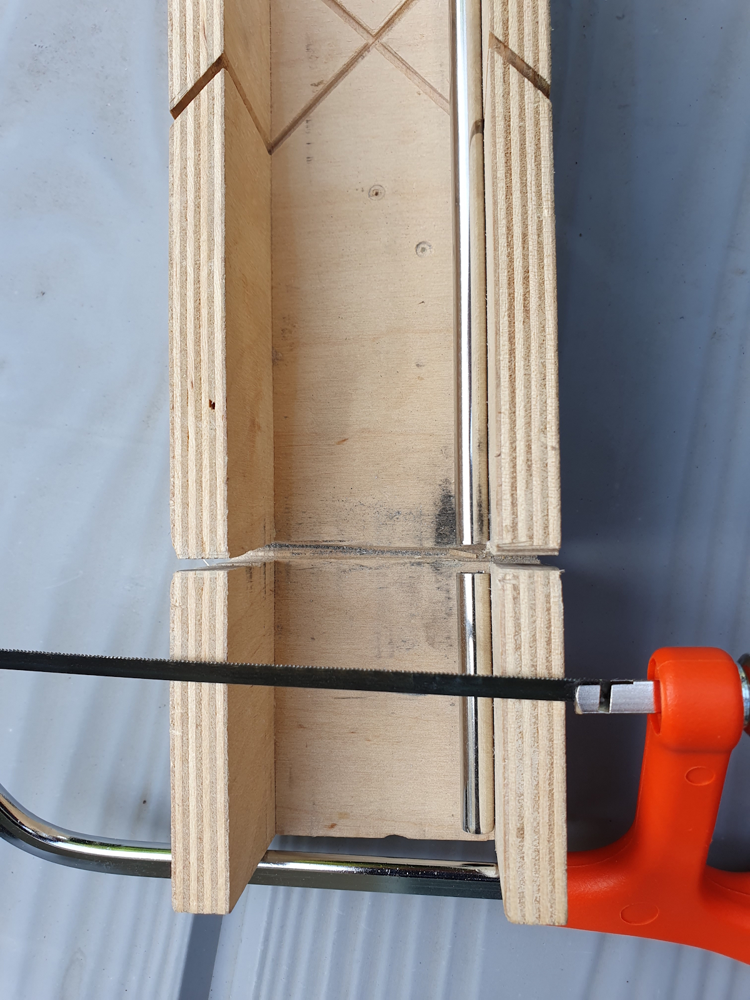
</a>

With this replaced tube, there is only a very tiny bit of milk is left over in the can! 
This can be decanted to the next can without any problem.
Perfect!

 <a href="images_bottle_hack/tube_to_can_bottom.jpg">
 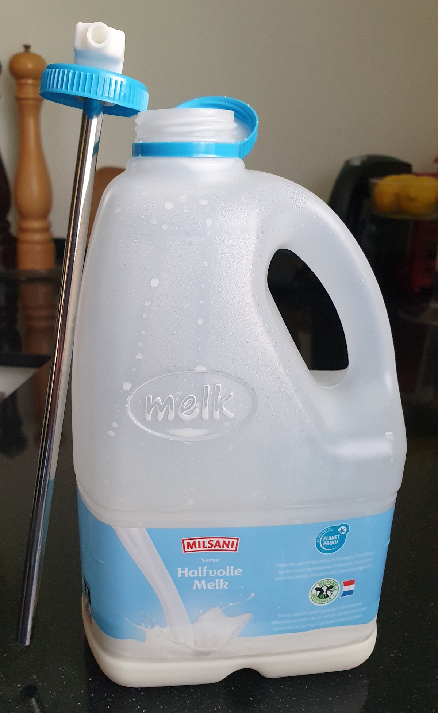
 </a>

 <a href="images_bottle_hack/almost-no_milk_left.jpg">
 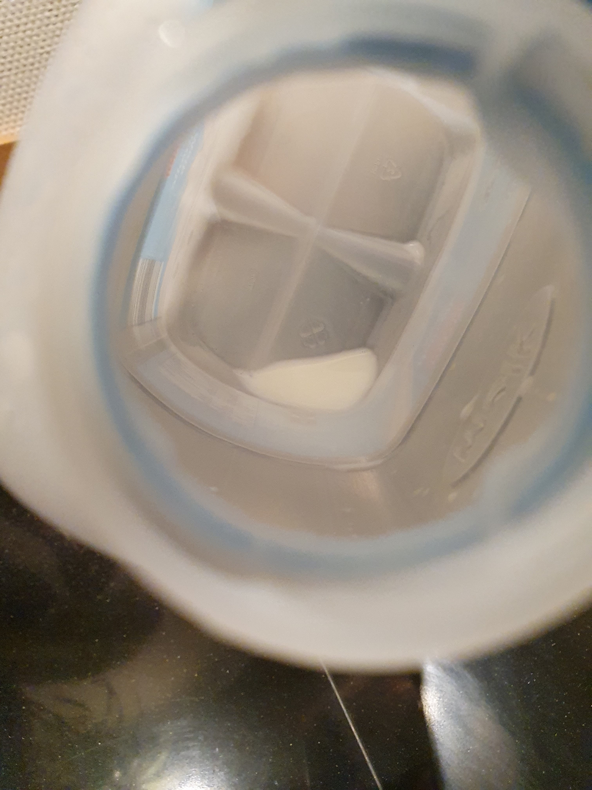
 </a>

I'm a even happier person with my Jura and now also with this hack!

---
## Cleaning

Because the tube is not part of the cleaning program of the machine itself you need to clean it manually.
I clean the tube and lid every week when I also clean the rest of the machine.
I use a small and long [brush]() to also clean the inside of the tube to avoid milk can residues.

---

## Create one yourself

Do you also create one yourself like this?\
I like to hear about your experiences with it.

---

Enjoy your coffee!

 

[Other Jura Hacks](/jura/jura_hacks) | 
[Jura Tip & Tricks](/jura)