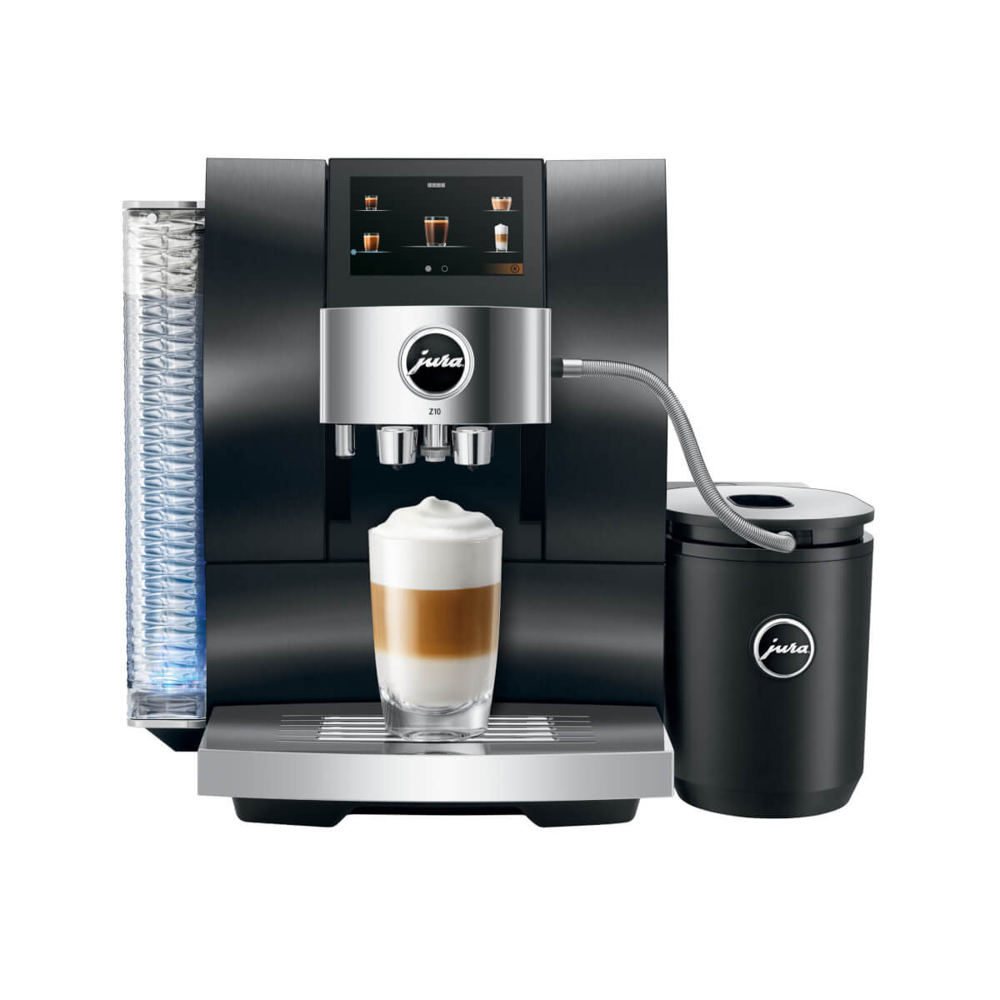
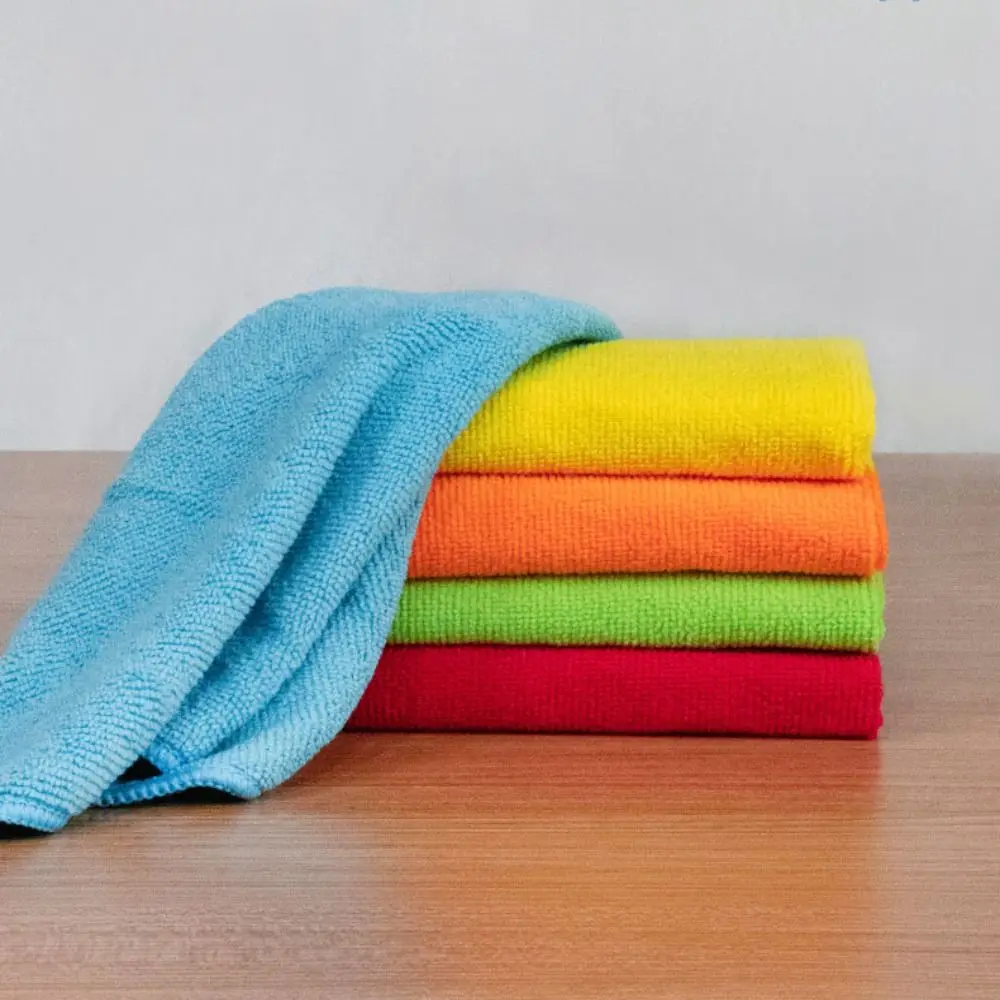
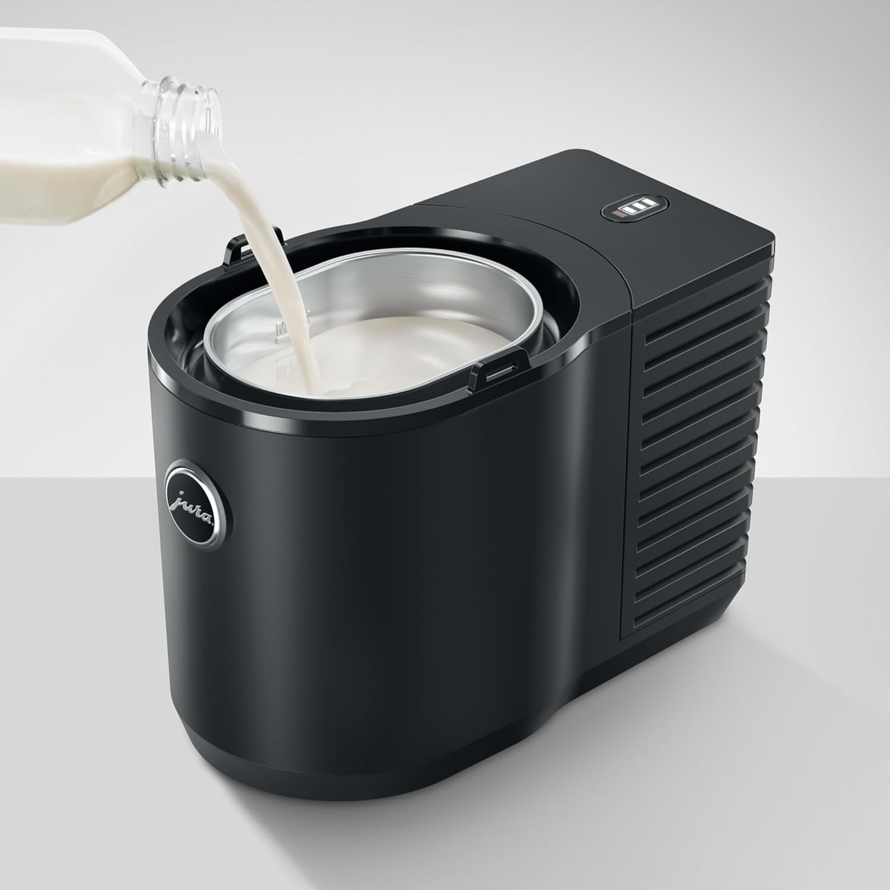
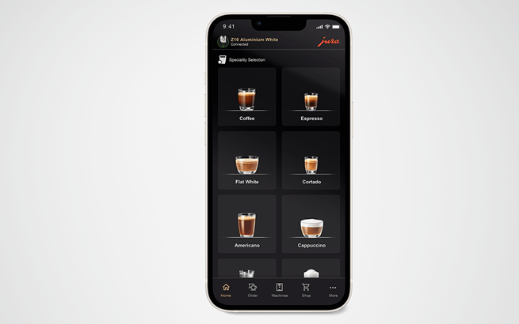

# Jura Tips & Tricks
*for coffee machines*

## Introduction

After I bought a Jura Z10 espresso machine, I had a lot of questions while using it. 
Questions about cleaning, maintenance, possibilities, accessory, hacks, app, etc!
I watched many instruction videos and joined social media groups to learn more and get the most out of my machine.

I decided to bundle my gathered information and experiences on this site, so you can benefit from it as well.

If you have tips or other suggestions for this page, please let me know.

> **_NOTE:_** Also affiliate links are used on these pages. You sponsor my work and still pay the original price.

---

## Cleaning and Maintenance

Manuals how to [clean and maintain](jura_z10_cleaning_maintenance) your Jura coffee machine.

Answers to: 
* Which maintenance does it need
* Which cleaning programs are there (for the Z10) 
* Which cleaning products do you need?

 

Including the corresponding instructions videos all together on one page.

---
## Products

Which [products](jura_products) can you buy to extend, maintain and enjoy your machine even more!

These products can also be used as an original present for your birthday or on your Christmas wish list!

 

---
## Hacks

Jura provides many accessories for their machines, but people are creative and miss sometimes just something small which makes your life a bit nicer with it.

Find here some nice [hacks](jura_hacks) for your Jura coffee machines.

I created a [milk bottle hack](jura_milk_bottle_as_jura_container) myself by using a plastic milk bottle as a compatible Jura container!

---
## App

(Some) Jura machines can be controlled via an [app](jura_app) on your smartphone/tablet/watch to brew your coffee based on custom products which you can predefine in the app.

The app contains much more!
Read more Jura [app](jura_app) tips and tricks to get the most out of it.

---
## FAQ

A collection of Frequently Asked Questions about Jura coffee machines.

Find answers to common [questions](jura_faq) I got after buying and using my Jura coffee machine.

 
 