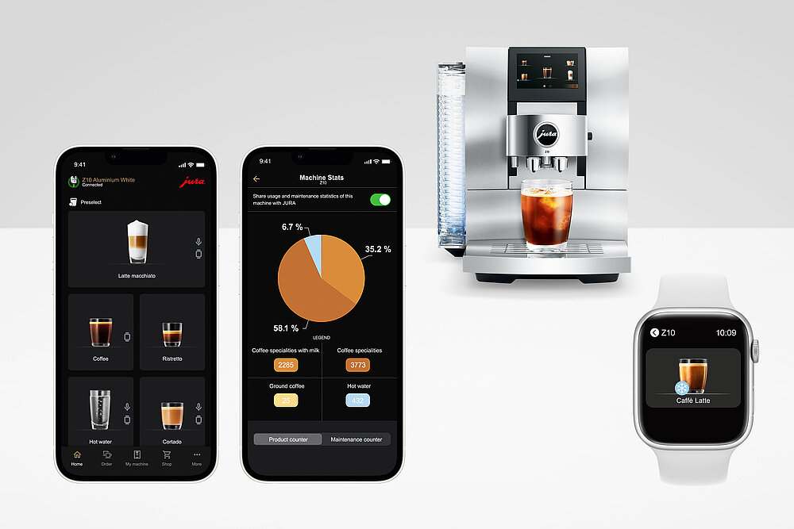
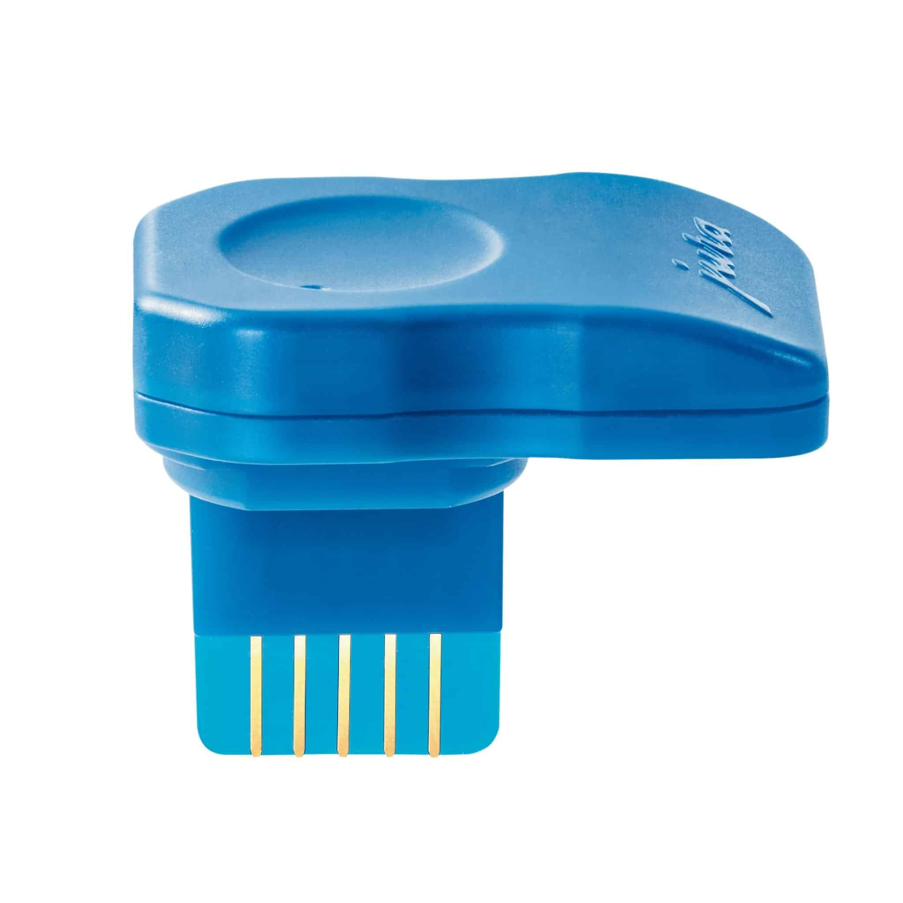

# Jura app

---
## Introduction

Jura provided already for years an advanced app for their coffee machines, which allows you to control your coffee machine from your smartphone, tablet and even smartwatch.
In the app, you can create custom personalized products, adjust the settings of your coffee machine, and monitor the maintenance status.

---
## Installation

The **J**ura **O**perating **E**xperience (J.O.E.) app is available for a wide range of Android and iOS devices.
You can download it from the respective app stores:
* [Android Play Store](https://play.google.com/store/apps/details?id=ch.toptronic.joe)
* [iOS App Store](https://play.google.com/store/apps/details?id=ch.toptronic.joe)

---
## Features

* **Direct control:** Via the app, you can start the machine remotely and prepare various types of coffee specialties. 
This means that, for example, you can make an espresso or cappuccino without having to be physically near the machine.
* **Adjusting coffee settings:** Adjust the strength, amount, and temperature of your coffee to your personal preferences.
* **Multi-user options:** The app allows you to create multiple user profiles, so everyone in the household can save and quickly prepare their own favorite coffee settings.
* **Save favorite recipes:** Save your favorite coffee recipes and give them a personal name and image.
* **Follow maintenance programs:** The app provides step-by-step guidance for maintenance programs, making it easy to maintain your machine’s hygiene.
* **Track statistics:** Keep track of your coffee usage statistics and easily share them via email.

---
## Connectivity with the app

Jura coffee machines can be connected to your smartphone via WiFi or Bluetooth.
To activate this, you need to plug a Bluetooth or WiFi module into the machine and use the app to find the machine.

[//]: # ()

---
## Connectivity issues?

If your phone has problems to find and keep connection to the coffee machine, this can be caused by your Wifi router settings.
If you've set your network SSID to hidden, the Jura app will not easily be able to find your coffee machine.

The machine only uses the 2.4 GHz band to connect to your router over Wifi. 
If you only use 5 GHz it won't work.

The app requires that your Wifi network is connected with the internet to work properly.

---
## My Feature requests

* The option to disable the check if Bluetooth is enabled. 
If you own a machine (like the Z10) which uses only a Wifi connection, you don't need an enabled Bluetooth connection! Now I get an annoying error message that Bluetooth is not enabled, while I don't need it at all!

* No need for an internet connection to use the app.
If your Wifi is (temporarily) not connected to the internet, you cannot use the app to create your coffee.

* Wait a bit longer to show the connectivity to the coffee machine.
Now the status is constant flickering between "Connecting" and "Connected", which is annoying.

* Fix error message translations.

---
### Home Assistant integration

