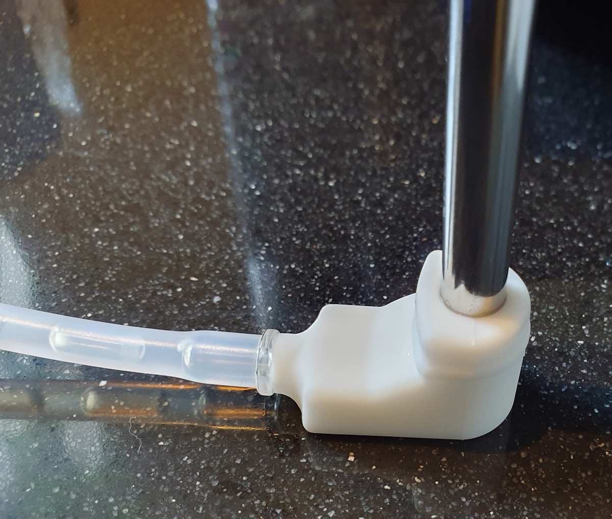
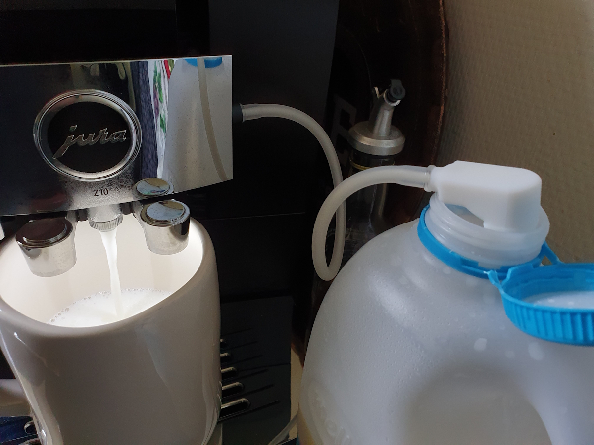
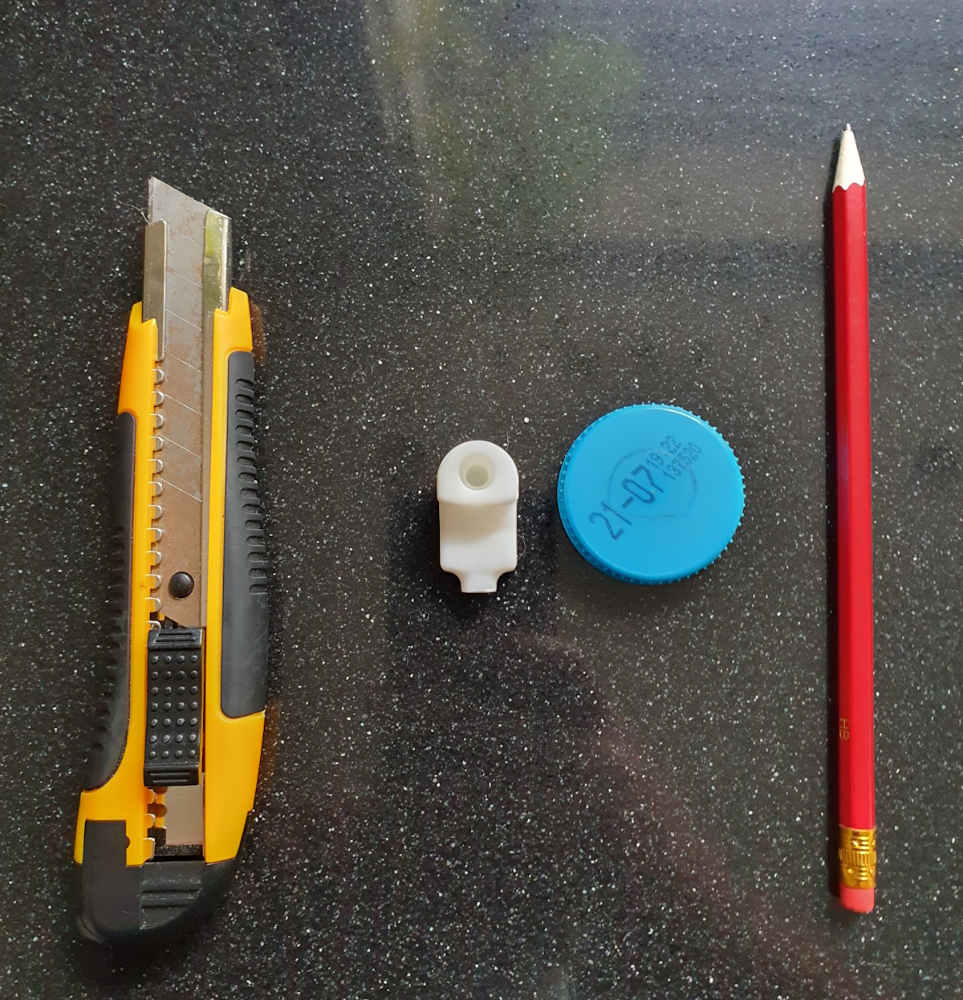
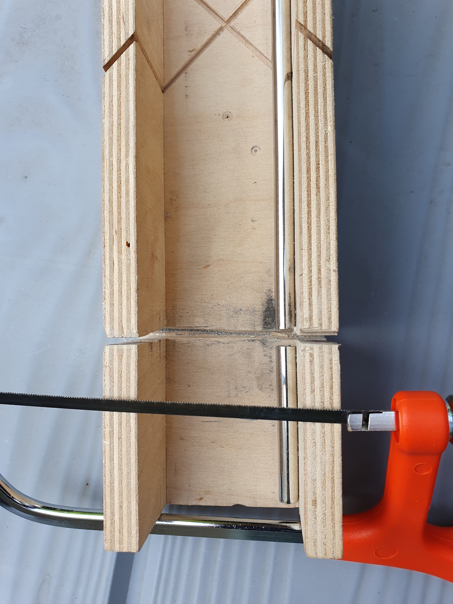
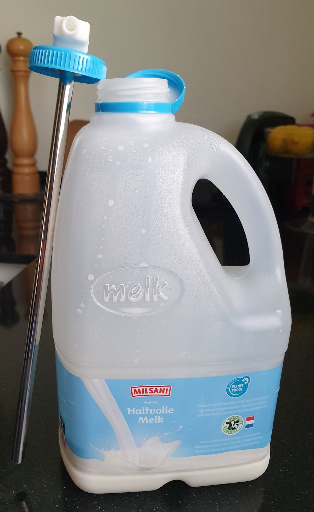

# Plastic milk bottle as compatible Jura container Hack
*supermarket plastic milk bottle attached to a Jura coffee machine*

 

## My "problem"

I drink my coffee always with milk, that's why I started by using the Jura glass milk container.
I can hold up to 0,5 liter milk, and it works .... but it's not ideal.

My "problem", it doesn't contain enough milk to make two (for me and my partner) big cappuccino's with one filled container.
After the first created coffee, I needed to add more milk to the glass container from a big plastic milk bottle before I can make the second one. 

I could buy a bigger container, like a Jura milk cooler which can hold up to 1 liter milk, but it costs a fortune and I only use it normally twice a day.
With that solution, I still need to refill it every day.

Why can't I use the original milk bottle from the store as a milk supply for my Jura machine?

That was my new mission!

---

## Table of Contents
<!-- TOC -->
  * [Goal](#goal)
  * [My solution](#my-solution)
    * [Idea](#idea)
    * [Test setup](#test-setup)
    * [Version 1](#version-1)
    * [Version 2](#version-2)
  * [Help wanted, who can provide only the milk adapter?](#help-wanted-who-can-provide-only-the-milk-adapter)
  * [Create one yourself](#create-one-yourself)
<!-- TOC -->

---
## Goal

I want to use an original milk bottle from the supermarket as a milk supply for my Jura machine.
Based on the same way, the Jura milk container works.

I want to screw a custom milk can top with a Jura milk connector and a stainless steel pipe attached to it which reach to the bottom.

That should be brilliant!

---

## My solution

### Idea

At the time I was looking for a solution (with a custom 3D printed) milk adapter, the new Jura milk Carafe was released.
This [Jura Carafe](/jura/jura_products#carafe) has a removable milk adapter! 
Exactly what I need! 
A bit expensive but exactly what I need! 
It's still cheaper than buying, maintaining and refilling a powered [Jura milk cooler](/jura/jura_products#active-cooler-1l).

 

The [Jura Carafe](/jura/jura_products#carafe) uses an 8 mm wide stainless steel tube, so I need that but a longer version of it.
I found it on AliExpress, a 6 mm [stainless steel tube](https://s.click.aliexpress.com/e/_ombnM7I) with a length of 215 mm.

### Test setup

Now I need to test if this setup also works as intended.
If it still can suck the milk through the total length of the tube and no air comes in.

The test succeeded!

### Version 1

Starting the next phase.
Creating a total setup.
Integrate the adapter in a milk bottle top.

I used a screw top from an old bottle and drew the contour of the Jura milk adapter on it.
Then I cut the shape of the adapter out of the cap with a stanley knife.

After testing this for a while with success, there was still some milk left over in the can.
I still need a larger amount to decant the leftover milk to the next can.
With a bit longer tube, I could reach the complete bottom of the can.

### Version 2

I searched and found an even longer version, and replaced it with a longer one.
This [stainless steel tube](https://s.click.aliexpress.com/e/_oFz0a1i) is 8 mm width and 300 mm long (0,24 inch width x 7,78 inch long).
A bit too long, but I could cut it to the right maximum length, now it reaches the complete bottom of the can.
This tube is also 2 mm wider but also fits perfect in the milk adapter.

Now only just a very tiny bit of milk is left over in the can!
This can be decanted to the next can without any problem.
Perfect!

 

 

---

## Create one yourself

Do you also create one yourself like this?\
I like to hear about your experiences with it.

---

Enjoy your coffee!