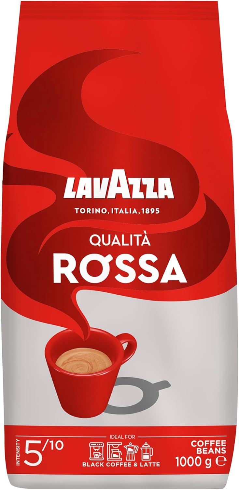
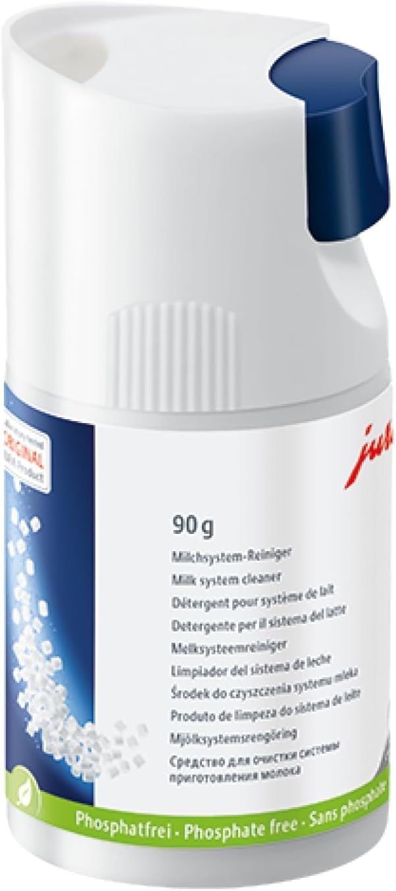
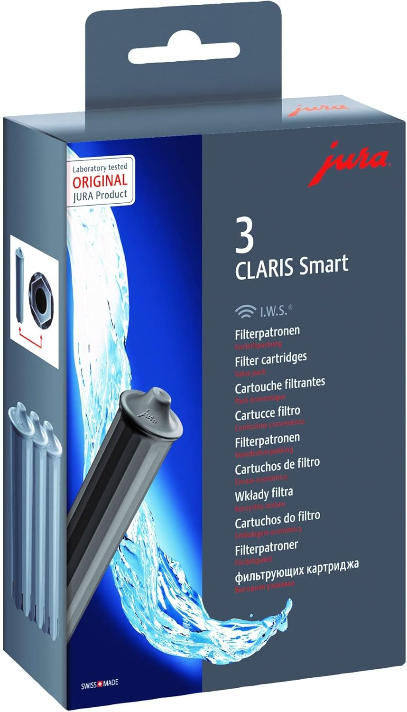

# Jura Products
*for coffee machines*

## Introduction

Jura provides by itself additional products for their machines.
Also, other suppliers have good products which can be used.
Here I summarize some of these products. 

> **_NOTE:_** Also affiliate links are used on these pages. You sponsor my work and still pay the original price.

---

## Table of Contents
<!-- TOC -->
  * [Beans](#beans)
  * [Milk containers](#milk-containers)
    * [Not active cooled](#not-active-cooled)
      * [Basic container](#basic-container)
      * [Carafe](#carafe)
    * [Active cooled](#active-cooled)
      * [Active cooler 1L](#active-cooler-1l)
      * [Active cooler 2.5L](#active-cooler-25l)
  * [Cup warmer](#cup-warmer)
  * [Other Jura products](#other-jura-products)
<!-- TOC -->

---
## Beans

There are many brands with all kinds of flavors for coffee beans. 
All with its own strength and additional tastes.

The most important thing to pay attention is to choose for beans which are not oily. 
The oil can clog grinders and pipes, leading to reduced performance and costly repairs.

One of my favorite tastes is this medium strength [Lavazza, Rossa Beans](https://amzn.to/46nuIMk):

[Amazon NL](https://amzn.to/46nuIMk)

<!--
---
## Cleaning

To keep your coffee machine in the perfect condition, it requires [maintenance](jura_cleaning_maintenance).
With these products, you keep it as new and with the best taste and avoid molt.

### Milk system

*Original*

30 Cleanings, 90 gram

[Amazon NL](),
[Amazon US](https://amzn.to/4lbqr34)

*Alternative*

---
#### Tabs

*Original*

[Amazon NL](),
[Amazon US](),

*Alternative*
-->

---
#### Water filters

With the water filters, you reduce the water hardness and prevent limescale build-up.

*Original*

4 pack Jura Claris Smart+ water filters.

[Amazon NL](https://amzn.to/4oOa9iH)

*Alternative*

---
## Milk containers

All Jura milk containers have an adapter to easy-to-connect the container via the hose to the container.

### Not active cooled

These types of containers are made of glass.
You get it out of the refrigerator, make your coffee with it and put it back in the refrigerator.

#### Basic container

This glass milk container has a capacity of 0.5 liter milk. 
It's dishwasher proof.

[Amazon NL](https://amzn.to/3K6s1pA#ad)
[Amazon DE](https://amzn.to/4oTbaFT#ad)
[Amazon US](https://amzn.to/4plL1PT#ad)

#### Carafe

This glass milk container has a capacity of 0.5 liter milk. 
It's dishwasher proof.
The lid can easily move away to refill it.
AND this one has a removable adapter to make your own [plastic milk bottle container](hack_milk_bottle_as_jura_container).

<a href="https://amzn.to/4lHspJ1#ad" target="_blank">(Amazon NL)</a>
<a href="https://www.bol.com/nl/nl/p/jura-melkkaraf-melkbeker-glas-500ml-24313/930000022669339" target="_blank">(Bol NL)</a>
<a href="https://amzn.to/46WKoX3#ad" target="_blank">(Amazon US)</a>
<a href="https://www.google.com/search?q=jura.com+carafe" target="_blank">(Google search)</a>

### Active cooled
#### Active cooler 1L

If the machine is used during the whole day with and without milk products, 
you can choose to keep a small "refrigerator" directly connected to the machine with this Jura Active cooler.
This version can contain 1 liter (34 oz) milk.

[Amazon NL](https://amzn.to/44coyN1#ad)
[Amazon US](https://amzn.to/4ilB8je#ad)

#### Active cooler 2.5L

This is a bigger version which can contain up to 2.5 liters (85 oz).

[Amazon NL](https://amzn.to/3XnyNut#ad)
[Amazon US](https://amzn.to/4oaUjNS#ad)

---

## Cup warmer

Is your coffee always too fast cold?
With a preheated cup, the coffee will be much warmer than when you use a cold cup.
It holds the cups at a constant temperature of 55 degrees (131 Fahrenheit).

Jura provides a cup warmer with two draws. 
It can contain up to: 6 cappuccino cups (Ø 90 mm), 6 standard espresso cups (Ø 57 mm), 4 coffee cups (Ø 66 mm).

[Amazon NL](https://amzn.to/4r83UHT#ad)
[Amazon US](https://amzn.to/4ofkBON#ad)

---

## Other Jura products

See [here](https://amzn.to/48bcKfs#ad) the full list of Jura products at Amazon.nl

---

<a href="/jura/jura_hacks">Jura Hacks ></a>

<a href="/jura/jura_cleaning_maintenance">< Jura Cleaning and Maintenance</a>