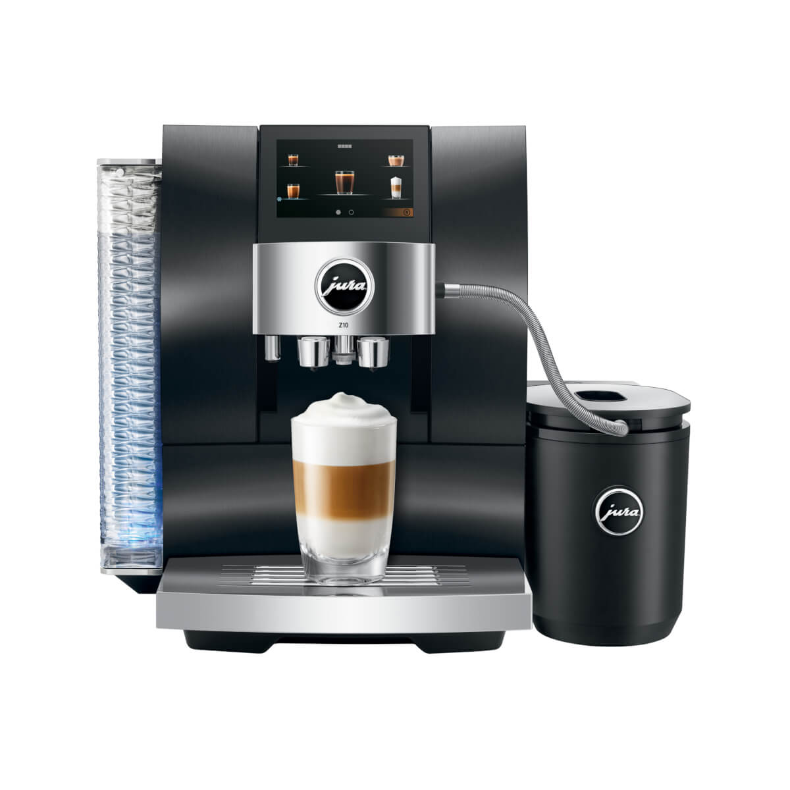
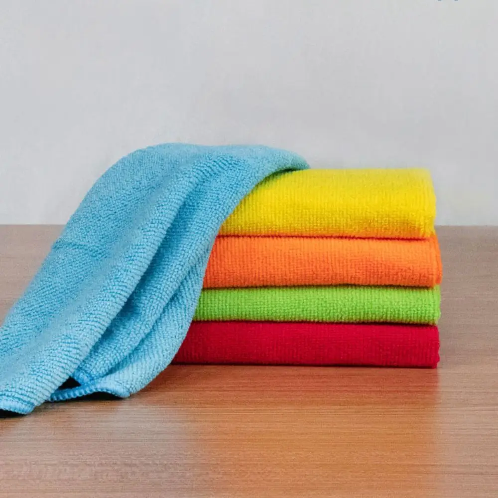



# Jura Cleaning and Maintenance
*for coffee machines*

## Introduction

After I bought the Jura coffee machine, I want to keep it in good condition to enjoy from it for many years to come. 
This page gives you some tips and tricks based on how I clean and maintain my Jura coffee machine.

> **_NOTE:_** Also affiliate links are used on this page. You sponsor my work and still pay the original price.

> **Urnex** is a brand that produces cleaning products for coffee machines, including Jura machines. They offer a range of cleaning tablets and solutions specifically designed to maintain the hygiene and performance of coffee machines.

---
## Machine outside

You shouldn't put this drip rack in the dishwasher, as it can damage the coating.
Instead, using a damp microfiber cloth, you can wash easily the outside of the machine and remove water drips, dust and the coffee stain part without scratching it.

* {{imgBasket}}microfiber cloths (choose your favorite color)
<a href="https://s.click.aliexpress.com/e/_oo2dg9f" target="_blank">(AliExpress)</a>
<a href="https://amzn.to/45rarU7#ad" target="_blank">(Amazon NL)</a>
  <a href="https://amzn.to/45mH2dO#ad" target="_blank">(Amazon US)</a>

---
## Waste water collection

The waste water collection container is located at the bottom of the machine.
You can remove it by pulling the tray out.

I suggest to clean all the waste water collection parts and the coffee grounds collection tray once a week thorough to avoid mold and bacteria growth.
Most parts can be cleaned in the dishwasher, or even better, by hand with warm water and a mild detergent.

Check out this video how you can optimally clean the machine.

---
## Milk system

The milk system cleaner should be used minimal on a daily basis.
Milk system cleaners are designed to break down and remove milk proteins, fats, and calcium buildup that can accumulate in coffee machine milk systems.
These cleaners are essential for maintaining the hygiene and performance of the frothers.
The Jura Z10 has a milk system cleaning program that you can choose manually to clean the milk system.

* {{imgBasket}}Urnex Rinza 1.1L (32 oz) milk system cleaner
[Urnex Rinza instructions](https://urnex.com/blog/milk-system-cleaning-guide)
<a href="https://amzn.to/4f2ZfkY#ad" target="_blank">(Amazon NL)</a>
  <a href="https://amzn.to/3H2MBFQ#ad" target="_blank">(Amazon US)</a>

* {{imgBasket}}Jura milk system cleaner mini tabs 180gr (for ~60 cleanings)
<a href="https://amzn.to/46o0qJw#ad" target="_blank">(Amazon NL)</a>
  <a href="https://amzn.to/4kTkI18#ad" target="_blank">(Amazon US)</a>

Check out this video how to clean the milk system.

---
## Internal brewing unit

The brewing unit isn't a removable part from the Jura machines.
You can clean it by running the cleaning program, which will clean the brewing unit with a cleaning tablet.
The machine indicates when you need to run this program.

You can also trigger the cleaning program manually by <TODO>

Check out this video how to run the brewing unit cleaning program with cleaning tablets.

There are different cleaning tablets brands available for Jura machines:
* {{imgBasket}}Urnex Cafiza 100 cleaning tablets, [Urnex Cafiza instructions](https://urnex.com/blog/brew-group-cleaning-guide)
<a href="https://amzn.to/3IHtXUM#ad" target="_blank">(Amazon NL)</a>
  <a href="https://amzn.to/4f5Cc9h#ad" target="_blank">(Amazon US)</a>

* {{imgBasket}}Jura 3-phase 25 cleaning tablets
<a href="https://amzn.to/40rDVzC#ad" target="_blank">(Amazon NL)</a>

* {{imgBasket}}Jura 2-in-1 6 cleaning tablets
<a href="https://amzn.to/4mb1ViT#ad" target="_blank">(Amazon US)</a>

---
## Water container

The water container should be cleaned regularly from the outside but also from the inside to avoid limescale buildup and bacteria growth.
You can clean it with warm water and a mild detergent. 
Dry it from the inside also to remove all possible water stains.

---
## Descaling

The Jura Z10 has a built-in descaling program that you can run when the machine indicates it.

You can use tabs, powder or liquid descaling agents to descale the machine.

Check out this video how to run the descaling cleaning program.

There are all kinds of descaling products available which can be used for kettles, but those can also be used for your coffee machine.

* Buy it at any supermarket or drugstore
* {{imgBasket}}Jura mini tablets (for 30 cleanings, 90 grams)
  <a href="https://amzn.to/4mgI9CW#ad" target="_blank">(Amazon US)</a>
* {{imgBasket}}Jura 9 descaling tablets
  <a href="https://amzn.to/45O47Hq#ad" target="_blank">(Amazon US)</a>
  <a href="https://amzn.to/4fCGFjV#ad" target="_blank">(Amazon NL)</a>
* {{imgBasket}}Urnex liquid descaler
  <a href="https://amzn.to/#ad" target="_blank">(Amazon US)</a>

---

<a href="/jura/jura_products">Jura Products ></a>

<a href="/jura/">< Jura Tips & Tricks</a>