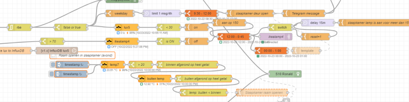

# Node-RED

Node-RED is a graphical programming tool based on blocks (nodes) which can be linked to each other. 
Most nodes have an input and an output. Each node can do a single task, it can evaluate or convert the input value. 

Node-RED has also a module/plugin system, which add extra nodes with specific functionality.

I use it for all my automations. 
* I read local sensors and camera's, and based on these input values I act on it.
* I control actuators like lights, smart sockets, ESP's or send notifications.
* I check online website for sales.
* I use external webservices to add extra functionality to my home automations.

I use this tool for a few years and created 100+ automations from all different types and there is no automation I couldn't create with it!

For more information, check the website: https://nodered.org

---

## Cheat Sheets
Look at these Cheat Sheets where I described how you can convert values from one to another and example flows.

* [Node-RED Cheat Sheet - Basic Nodes](node-red_cheatsheet-basic_nodes)
* [Node-RED Cheat Sheet - Function Node](node-red_cheatsheet-function_node)

---

## Example flows

### Basic flows

Here you find some basic useful example flows to control light, act on temperatures, etc.

* [Node-RED - Temperature flows](node-red_temperature_flows)
  * [Compare two different temperatures (inside/outside)](node-red_diff_different_sensors)
  * [Detect quick temperature change in time](node-red_diff_in_time)

###  Node-RED + Home Assistant integration

Here you find flows to interact between Home Assistant and Node-RED.

* [Node-RED - Home Assistant](node-red_home-assistant)
* [Node-RED - Send notifications to Home Assistant app](node-red_home-assistant_notifications)

### Average flows

* [Node-RED - Check if meat must be defrosted for the meal of tomorrow](../homeassistant/homeassistant_dashboard_mealie#out-of-the-freezer-the-evening-before)

### Advanced flows
Here you see an example of a script which I use to automatically control my ventilation system.
You can read all the details about this project on the [Control an Orcon mechanic ventilation system from Home Assistant](../esphome/orcon_mechanic_ventilation) page.

---
[Homepage](../index) | [Home Assistant](../homeassistant/index) 