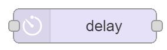
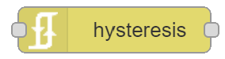
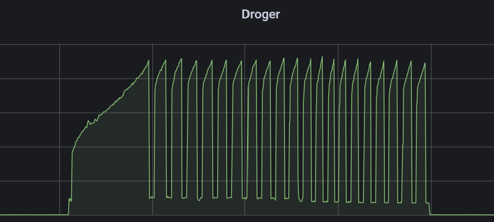

50
# Node-RED Cheat Sheet - Basic Nodes

Node-RED examples of basic actions to convert data from one to another format can be found here.

More advanced examples with the function node can be found [here](node-red_cheatsheet-function_node)

---

## Table of Contents
<!-- TOC -->
* [Extract value from json](#extract-value-from-json)
* [Round a comma value to an integer value](#round-a-comma-value-to-an-integer-value)
* [String to Integer](#string-to-integer)
* [Strip topic name](#strip-topic-name)
* [Only X messages per Y time unit](#only-x-messages-per-y-time-unit)
* [Trigger only on rise and fall](#trigger-only-on-rise-and-fall-)
* [Trigger only on passing a value on rise](#trigger-only-on-passing-a-value-on-rise)
* [Trigger only on passing a value on fall](#trigger-only-on-passing-a-value-on-fall)
<!-- TOC -->

---

## Extract value from json
Pass a single entity value, in this case the temperature, from a json message.
<div class="nodered">

|                                                                              |                                                                   |        |
|:-----------------------------------------------------------------------------|-------------------------------------------------------------------|-------:|
| {<br>"battery" : 100, <br>"temperature" : 24.53,<br>"linkquality" : 60<br>}  |  |  24.53 |

</div>

```
Set [msg].payload
    [msg].payload.temperature
```
---
## Round a comma value to an integer value
Round a comma value, like temperature, to a rounded integer value.

<div class="nodered">

|      |                                                                   |     |
|:-----|-------------------------------------------------------------------|----:|
| 25,3 |  |  25 |
| 25,6 |  |  26 |

</div>

```
Set [msg].payload
    $round(payload, 0)
```
---
## String to Integer
Convert a string value to an integer.
<div class="nodered">

|         |                                                                   |       |
|:--------|-------------------------------------------------------------------|------:|
| "24.01" |  | 24.01 |
</div>

```
Set [msg].payload
    $number(payload)
```
---
## Strip topic name
Get only the last part after the '/' from a topic.
<div class="nodered">

|                        |                                                                   |            |
|:-----------------------|-------------------------------------------------------------------|-----------:|
| "zigbee2mqtt/contact1" |  | "contact1" |
</div>

```
Set [msg.]measurement
    [expression]msg.topic.$split('/')[1]
```

---
## Only X messages per Y time unit

With the delay node, you can limit the number of messages which will be sent per time unit (seconds/minutes/hours/days). \
Intermediate message will be dropped.



```
Action   Rate Limit 
         All messages  
Rate     [1] msg(s) [10] [Minutes]
         Drop intermediate messages
```

You can also combine two delay node, one with 1 messages per 5 minutes and an extra with 10 messages per day to avoid a flood of messages.

---
## Trigger only on rise and fall 

The hysteresis node is a node that forwards its incoming message only if the numeric value of the message payload rises above one specified threshold, or falls below another.
This node is a combination of the [rising edge node](#trigger-only-on-passing-a-value-on-rise) and [falling edge node](#trigger-only-on-passing-a-value-on-fall)



This can be used, for example, to monitor a dryer if the energy consumption is like this.



When the node is defined like this:
```
Rising threshold   5
Falling threshold  6
```
A trigger is sent when the graph starts with the spike on the left. The input value changes from 0 to a new value higher than 5. 

When the dryer is finished, the value drops below 6 to 0 again the next trigger is sent, and you can notify that the dryer is finished.

---
## Trigger only on passing a value on rise

The rising edge node only passes a value through when an input payload value passes a defined threshold value.


When the node is defined like this:
```
Threshold  5
```
A trigger is only sent when the input value changes from a value below 5 to a new value higher than 5. 

---
## Trigger only on passing a value on fall

The rising edge node only pass a value through when an input payload value passes a defined threshold value.


When the node is defined like this:
```
Threshold  6
```
A trigger is sent only when the input value changes from a value above 6 to a new value lower than 6. 

---
[Table of Content ^](#table-of-contents)

[<< See also my other Node-RED pages](index)
