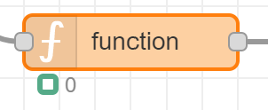

50
# Node-RED Cheat Sheet - Function Node


Examples of javascript code which you can use in Node-RED function nodes.


## Table of Contents
<!-- TOC -->
* [Log to debug panel](#log-to-debug-panel)
* [Use global variable](#use-global-variable)
* [Use flow variable](#use-flow-variable)
* [Send (multiple) output message](#send-multiple-output-message)
* [Show state icon](#show-state-icon)
* [New json message](#new-json-message)
* [Convert String to Integer](#convert-string-to-integer)
* [Send to a dynamic topic](#send-to-a-dynamic-topic)
* [Convert Boolean to OFF/ON](#convert-boolean-to-offon)
* [Compare two temperatures](#compare-two-temperatures)
<!-- TOC -->

---
## Log to debug panel
```
node.error("Log line");
```
---
## Use global variable
```
global.set('rain', true); 
```
```
global.get('rain'); 
```
---
## Use flow variable
```
flow.set('rain', true); 
```
```
flow.get('rain'); 
```
---
## Send (multiple) output message
```
node.send({ payload : true });
```
---
## Show state icon
It's possible add a status icon under the function node and show a internal value next to it.

In this case it shows a green round with value `0`.



```
var diff = 0;
node.status( { fill: "green", shape: "ring", text: diff } );
```
---
## New json message
Create a new json message based on the input json message.
```
var temp = msg.payload;
msg.payload = {
    "volt": temp.voltage,
	"power": temp.power,
	"state": temp.status,
	"device": "smartplug"
}
return msg;
```

---
## Convert String to Integer
"20" -> 20
```
var intValue = parseInt("20");
```

---
## Send to a dynamic topic
Define the MQTT topic name in code. 

If the incoming variable `action='aan'` is set, the payload will be set to `ON` and otherwise it will be `OFF`.
```
var deviceId = "bulb1";
msg = {}
msg.payload = (action === "aan") ? "ON" : "OFF";
msg.topic = "zigbee2mqtt/" + deviceId + "/set";
return msg;
```

---
## Convert Boolean to OFF/ON
If the input payload contains the field `contact` and the value is `true` it will be converted to the text `OFF`. 

This can be used to control a smartplug based on a contact sensor.
<div class="nodered">

|                            |                                                                          |       |
|:---------------------------|--------------------------------------------------------------------------|------:|
| {<br>"contact" : true<br>} |  <br> | "OFF" |

</div>

```
if (msg.payload.contact === true) { 
  msg.payload = "OFF" 
} else {
  msg.payload = "ON";
}
return msg;
```
You can also write the same functionality with less code:
```
msg.payload = (msg.payload.contact) ? "OFF" : "ON";
return msg;
```

---
## Compare two temperatures
Compare two temperature values and when the difference is less than 3 pass the message otherwise don't pass.

The first temperature is stored in the flow variable `flow.temp`, the next temperature comes in as the payload value.

<div class="nodered">

|      |                                                                          |              |
|:-----|--------------------------------------------------------------------------|-------------:|
| 24.1 |  <br> | 24.1<br>null |

</div>

```
var temp = flow.get('temp');
var diff = Math.round(temp - msg.payload);
if (diff < 3) {
    // temp diff is acceptable
    node.status({fill:"green",shape:"ring",text:diff})
    return msg;
} else {
    node.status({fill:"red",shape:"ring",text:diff})
    return null;
}

return msg;
```

---
[Table of Content ^](#table-of-contents)

[<< See also my other Node-RED pages](index)

