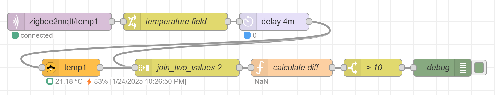

50

# Node-RED calculate diff in time
*Example: Detect if someone is taking a shower*

<a name="top"></a>
<a href="node-red_home-assistant">

</a>

Get a trigger when the temperature or humidity is changed in a certain time window.

Purposes where this flow can be used:
* Detect when someone taking a shower and activate you [ventilation system](/esphome/orcon_mechanic_ventilation)
* Check if somewhere a door or window is open/broken, because it becomes suddenly much colder/warmer
* Check if in a room a thermostate is on while there is nobody inside
* Check if someone is [cooking](/ideas/home_automation_ideas#stove)

---

## How it works

With this flow, you can compare the change of a value in time.


You can download this flow [here](flows/diff_in_time.json).

I used for this flow an additional Node which you need to have installed first in your Node-RED setup: [node-red-contrib-zigbee2mqtt](https://flows.nodered.org/node/node-red-contrib-zigbee2mqtt)

The steps of this flow are:
* Trigger by a sensor
* Wait for 4 minutes (play with this time to see which delay works the best for your situation)
* Save the original value
* And get the current value for the same sensor
* Compare the two values with each other
* If the diff is bigger or smaller than X, pass the value trough

---
## Flow explanation

This is the explanation for each node.

* **[mqtt in node]** A new trigger from sensorX
* **[change node]** Extract the temperature field
    ```
    Set           msg.temperature
    to the value  [msg] payload.temperature  
    ```
* **[delay node]** Wait for 4 minutes
     ```
      Action        Delay each message
                    Fixed delay
      For           4 Minutes
     ```
* **[zigbee2mqtt-get node]** Get the current temperature
     ```
     Server         {your set up MQTT server}
     Device         {the same sensorX as used in the first mqtt in node}
     Payload output temperature
     ```
* **[join node]** Combine the two different temperatures
     ```
     Mode           Manual
     Combine each   [msg.]payload
     to create      [a String]
     joined using   [AZ]|
     ```
     [v] Use existing msg.parts property\
     Send the message:
     * After a number of message parts `2`

* **[function node]** Calculate the difference between the two temperatures.
   ```javascript
    var temps = msg.payload.split('|');
    var diff = Math.round(temps[1] - temps[0]);
    node.status({text:diff})
    msg.payload = diff;
    return msg;
   ```
* **[switch node]** Only continue if the difference is bigger than X degrees.
   ```
    Property  msg.payload
    > [0-9] X
   ```
* **[debug node]** Check if the trigger works!

---
[Top ^](#top)

[<< See also my other Node-RED pages](index)
